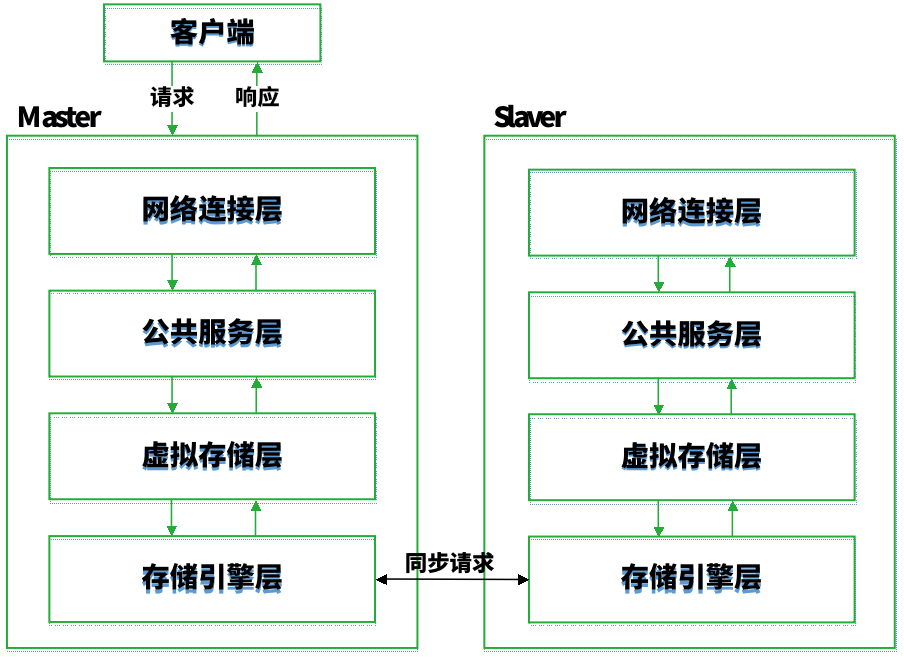

# 日志分析


# 第1章  日志基本知识

## 1.1 日志概述

### 日志基本知识

日志的概念：日志（log）是由各种不同的实体产生的“事件记录”的集合，通常是计算机系统、设备、软件等在某种情况下记录的信息，并将这些信息按照某种规范将这些行为表达出来。  
日志的功能：帮助系统排错、优化系统的性能、调整系统行为、查询安全攻击事件和审计跟踪信息安全行为。传统的日志能够反映出系统运行的状态变化，同时能够对端口扫描、口令破解等安全事件进行记录。现有的部分安全产品能够将多条日志进行关联分析从而得到安全事件。  
日志记录分类：安全日志记录、运营日志记录、依从性日志记录和应用程序调试日志记录。

### 日志设备产生的原因

（1）随着网络规模的不断扩大，网络中的设备数量和服务类型也越来越多，给系统的安全性和稳定性带来了各种挑战。  
（2）长期以来，各种安全事件呈几何级增长，来自外部的攻击入侵事件频发。  
（3）要及时发现这些异常并进行防范或者在发生网络入侵之后使损失最小化，对网络中各种事件信息的记录和分析必不可少。由此，对日志进行专门记录和管理的设备应运而生，称为日志管理设备。  
（4）日志管理设备是对全网范围内的主机、服务器、网络设备、数据库以及各种应用服务系统等产生的日志进行全面收集、实现日志的集中管理和存储并进行细致分析的设备，支持解析任意格式、任意来源的的日志。

### 日志设备

（1）日志设备是指产生“事件记录”的各种设备，包括网络设备、计算机系统、数据库或者应用程序等。  
（2）日志管理设备主要是管理这些日志设备产生的各种日志记录。  

网络设备： 计算机 、集线器、交换机、网桥、路由器、网关、网卡、无线接入点、网络打印机、光纤收发器和光缆等。  
网络安全设备：防火墙，入侵检测设备、入侵防御设备、WAF、VPN等。  
计算机系统：各种类型的服务器操作系统和服务器软件。  
数据库：各种数据库系统软件。  
应用程序：各种应用程序。  

### 日志设备记录的基本信息

（1）事件内容辅以适当的细节。  
（2）事件发生的开始时间和结束时间。  
（3）事件发生的位置（哪个主机、什么文件系统、哪个网络接口等等）。  
（4）参与者。  
（5）参与者来源。

### 日志的特点

（1）日志种类的多样性：目前尚未统一标准的日志格式，不同厂商根据自身需求制定相应的日志格式，故市场上出现了多种类型的日志。  
（2）日志数据量很大：由于日志对每一个事件均进行记录，因此，无论是操作系统还是网络设备都会产生大量的日志记录。  
（3）网络设备日志具有时空关联性 ：针对某个特定的网络攻击事件，不同的安全设备通常都会进行记录，结合多个设备日志，采用数据挖掘算法找出日志之间的时空关联性，有利于提取出网络安全事件。  
（4）日志信息容易被篡改：网络入侵者如果获得足够权限，可对日志信息进行篡改或直接删除，因此存在较大的安全隐患。  
（5）分析和获取日志数据困难：不同设备的日志格式差异很大，部分设备日志信息需要专用的工具才能查看，这给分析日志带来了很大困难。

### 日志的作用

（1）安全日志审计：网络溯源追踪  
网络管理人员可以采用网络溯源追踪技术，调取并分析事件发生前后的一段时间的日志，发现攻击者的一系列行为及其攻击手段。

（2）运维日志：安全运维  
管理者通过运维通道集中、网络运维日志详细记录，可合理安排网络运维工作，实现运维人员工作的量化管理，提高运维管理要求落地的自动化水平、强制化能力。

（3）合规类日志：调查取证  
日志有助于加强收集到的其他证据，基于来自各种来源的数据，重现事件。


## 1.2 日志审计

### 信息系统审计起步和发展阶段

（1）起步阶段：1960年至1970年，随着计算机的普及应用，会计操作从纸质凭证向电子化发展，审计人员意识到采用计算机开展审计业务的优势，信息系统开始起步。  
（2）快速发展阶段：1970年至1980年，随着计算机在各个行业各种业务中得到了更广泛的运用，计算机辅助审计的作用也日益突出，信息系统审计进入快速发展阶段。  
（3）成熟阶段：1980年至1990年，随着信息系统审计的快速发展，审计部门意识到信息系统防范体系还不够成熟，1981年，美国电子数据处理协会开始组织注册信息系统审计师执业考试，这一考试的出现标志着信息系统审计步入成熟阶段。  
（4）普及阶段：1990年后，随着信息系统审计的日趋成熟，信息系统审计在很多发达国家已经进入了普及阶段。

### 信息系统审计存在的必要性

（1）信息系统审计是公司治理的重要举措。  
- 确保被审计单位信息系统得到高效运转
- 帮助管理层提出相应的改进措施，促进企业不断提高其竞争力

（2）信息系统审计是保证企业信息化发展的必然选择。  
- 传统计算机审计不能满足大数据环境下的审计目标；
- 信息系统审计提高了审计的范围，增强的审计的安全性和可靠性；

### 信息系统审计的概念

信息系统审计是一个通过收集和评价审计证据，对信息系统是否能够保护资产的安全、维护数据的完整、使被审计单位的目标得以有效地实现、使组织的资源得到高效地使用等方面做出判断的过程。

国际通用的CC准则定义：信息系统安全审计主要是指对与安全有关的活动的相关信息进行识别、记录、存储和分析；审计记录的结果用于检查网络上发生了哪些与安全有关的活动以及这些活动的负责主体是什么。审计的主要功能包括：安全审计自动响应、安全审计数据生成、安全审计分析、安全审计浏览、安全审计事件选择、安全审计事件存储等。

### 信息系统审计过程

信息系统审计过程分为准备阶段、实施阶段、报告阶段。

准备阶段：准备阶段是整个审计过程的起点，包括了解被审计单位的基本情况、签订审计业务约定书、初步评价被审计单位的内部控制系统、分析审计风险和编制审计计划。  
实施阶段：实施阶段所涉及的技术方法具有信息技术的特色，针对被审计的信息系统，审计人员使用相关技术对审计对象开展了解、描述和测试三方面的工作。  
报告阶段：报告阶段是在上述阶段完成后进行的总结工作，包括整理、评价执行审计业务中收集到的审计证据；复核审计工作底稿；审计后期事项；汇总审计差异，提请被审计单位调整或做适当披露；形成审计意见，撰写审计报告。

### 信息系统审计方法

信息系统审计方法包括一般方法与应用计算机审计的方法。其中，应用应用计算机技术的审计方法主要是指计算机辅助审计技术与工具的运用。

一般方法：主要用于对信息系统的了解和描述。包括：面谈法、系统文档、审阅法、观察法、计算机系统文字描述法、表格描述法、图形描述法。  
应用计算机的方法：用于对信息系统的控制测试。包括：测试数据法、平行模拟法、在线连续审计技术（通过嵌入审计模块实现）、综合测试法、受控处理法和受控再处理法等。

### 信息系统审计的作用

（1）审计记录的结果用于检查网络上发生了哪些与安全有关的活动以及这些活动的负责主体是什么。  
（2）审计的主要功能包括：安全审计自动响应、安全审计数据生成、安全审计分析、安全审计浏览、安全审计事件选择、安全审计事件存储等。

### 日志审计的概念

（1）日志审计通过集中采集并监控信息系统中的系统日志、设备日志、应用日志、用户访问行为、系统运行状态等各类信息。  
（2）对收集的信息进行提炼，将信息进行过滤、归并和告警分析处理，建立起一套面向整个系统日志的安全监控管理体系。  
（3）将信息系统的安全状态以最直观的方式呈现给管理者，既能提高安全审计的效率与准确性，也有助于及时发现安全隐患、协助故障定位、追查事故责任，并能够满足各项标准、法规的合规性管理要求。

### 日志审计流程

日志审计四个流程：  
（1）日志获取  
（2）日志筛选  
（3）日志整合  
（4）日志分析


### 日志采集对象

（1）操作系统：支持采集各种主机操作系统记录的各种消息，这些操作系统包括Windows，Solaris，Linux，AIX，HP-UX，UNIX，AS400等。  
（2）网络设备：包括路由器、交换机和其他将电脑桌面和服务器连接起来组成网络的设备，通常指交换设备、防火墙、入侵检测集UPS系统等。  
（3）安全设备：包括防火墙、虚拟私人网络（Virtual Private Network，VPN）、IDS、IPS、防病毒网关、网闸、防分布式拒绝服务（Distributed Denial of Service，DDOS）攻击、WEB应用防火墙等在主机上运行的具备安全保护功能的应用程序或者设备。  
（4）应用系统：包括邮件、Web、FTP、Telnet等，它可以记录业务应用系统上的每个账户的活动信息。  
（5）数据库：包括各种数据库（如Oracle、Sqlserver、Mysql、DB2、Sybase、Informix等）记录的所有事务以及每个事务对数据库所做的修改操作。

### 日志筛选的目的

（1）找出恶意行为或可能是恶意行为的事件， 并作为日志组合的基础。  
（2）通过对比恶意行为特征及对应的日志属性，确认可能的恶意行为事件。


### 日志整合

将同一路径各种设备的同一事件关联表达出来，实现不同格式日志的多层解析和对解析结果作整合和初步统计，便于后续的日志分析工作，其方法包括：行为分析、行为方向分析、数据流分析。

### 日志分析的核心

（1）关联规则：关联规则分析技术将不同分析器上产生的报警进行融合与关联，即对一段时间内多个事件间及事件中的关系进行识别，找出事件的根源。目前基于日志事件的关联主要研究方法有：基于规则的推理、基于案例推理、基于模型的推理、基于事件产生的数据挖掘分析。  
（2）联动机制：日志审计系统通过分类、关联等数据处理办法，加速数据的处理速度，从而使系统能根据日志信息分析处理结果，及时发现并报告系统异常情况，联动机制帮助系统实现与其他设备联动或提醒网络管理人员快速作出响应，将故障的危害降到最低。 

### 日志分析的过程

通过关联分析技术将不同分析器上产生的报警进行融合与关联，即对一段时间内多个事件间及事件中的关系进行识别，找出事件的根源，最终形成审计分析报告。


### 日志审计的方法

（1）基于规则库：对已知攻击的特征进行分析，并从中提取规则，进而由巧得规则组合成为规则库，系统在运行过程中匹配这些规则库中的规则信息从而生成告警。

（2）数理统计方法：给网络流量、中央处理器（Central Processing Unit，CPU）占用率等相关数据设置一个阀值，当超过这个阀值就发出告警。

### 日志审计系统

（1）实时采集日志信息并对采集到的日志进行格式标准化处理，实现全面的日志分析，及时发现各类具有安全威胁和异常行为的事件并发出相应告警信息，形成相应的审计报告。  
（2）实时展现系统的整体运行情况以及各个设备的运行状况，并且能够及时发现系统中已发生或者正在发生的危险事件，实现快速定位故障位置和状况，甚至可以预测可能发生的风险。

### 日志审计法律法规
| 法律法规                                       | 相关条款                         | 与日志审计相关的主要内容                                                                                                                                                                                                                                                                                                                                                                                                                                                                                                       |
| ---------------------------------------------- | -------------------------------- | ------------------------------------------------------------------------------------------------------------------------------------------------------------------------------------------------------------------------------------------------------------------------------------------------------------------------------------------------------------------------------------------------------------------------------------------------------------------------------------------------------------------------------ |
| 网络安全法                                     | 第二十一条                       | 国家实行网络安全等级保护制度。网络运营者应当按照网络安全等级保护制度的要求，履行下列安全保护义务，保障网络免受干扰、破坏或者未经授权的访问，防止网络数据泄露或者被窃取、篡改：（一）制定内部安全管理制度和操作规程，确定网络安全负责人，落实网络安全保护责任；（二）采取防范计算机病毒和网络攻击、网络侵入等危害网络安全行为的技术措施；（三）采取监测、记录网络运行状态、网络安全事件的技术措施，并按照规定留存相关的网络日志不少于六个月；（四）采取数据分类、重要数据备份和加密等措施；（五）法律、行政法规规定的其他义务。 |
| 《信息系统安全等级化保护基本要求》             | 网络安全、主机安全和应用安全部分 | 从第二级开始，针对网络安全、主机安全、应用安全都有明确的安全审计控制点。在管理要求中，“安全事件处置”控制点从第二级开始要求对日志和告警事件进行存储；从第三级开始提出了“监控管理与安全管理中心”的控制点要求。                                                                                                                                                                                                                                                                                                                   |
| ISO27001:2005                                  | 4.3.3记录控制                    | 记录应建立并加以保持，以提供符合ISMS要求和有效运行的证据。                                                                                                                                                                                                                                                                                                                                                                                                                                                                     |
| 《企业内部控制基本规范》                       | 第四十一条                       | 企业应当加强对信息系统的开发与维护、访问与变更、数据输入与输出、文件存储与保管、网络安全等方面的控制，保证信息系统安全稳定运行。（注：间接要求安全审计）                                                                                                                                                                                                                                                                                                                                                                       |
| 《商业银行内部控制指引》                       | 第一百二十六条                   | 商业银行的网络设备、操作系统、数据库系统、应用程序等均当设置必要的日志。日志应当能够满足各类内部和外部审计的需要。                                                                                                                                                                                                                                                                                                                                                                                                             |
| 《银行业信息科技风险管理指引》                 | 第二十五条                       | 对于所有计算机操作系统和系统软件的安全，在系统日志中记录不成功的登录、重要系统文件的访问、对用户账户的修改等有关重要事项，手动或自动监控系统出现的任何异常事件，定期汇报监控情况。                                                                                                                                                                                                                                                                                                                                             |
|                                                | 第二十六条                       | 对于所有信息系统的安全，以书面或者电子格式保存审计痕迹；要求用户管理员监控和审查未成功的登录和用户账户的修改。                                                                                                                                                                                                                                                                                                                                                                                                                 |
|                                                | 第二十七条                       | 银行业应制定相关策略和流程，管理所有生产系统的日志，以支持有效的审核、安全取证分析和预防欺诈。                                                                                                                                                                                                                                                                                                                                                                                                                                 |
| 《证券公司内部控制指引》                       | 第一百一十七条                   | 证券公司应保证信息系统日志的完备性，确保所有重大修改被完整地记录，确保开启审计留痕功能。证券公司信息系统日志应至少保存15年。                                                                                                                                                                                                                                                                                                                                                                                                   |
| 《互联网安全保护技术措施规定》（公安部82号令） | 第八条                           | 记录、跟踪网络运行状态，监测、记录用户各种信息、网络安全事件等安全审计功能。                                                                                                                                                                                                                                                                                                                                                                                                                                                   |
| 萨班斯（SOX）法案                              | 第404款                          | 公司管理层建立和维护内部控制系统及相应控制程序充分有效的责任；发行人管理层最近财政年度末对内部控制体系及控制程序有效性的评价。（注：在SOX中，信息系统日志审计系统及其审计结果是评判内控评价有效性的一个重要工具和佐证）                                                                                                                                                                                                                                                                                                        |

### 日志审计面临的挑战

（1）网络规模不断扩大：随着网络规模的不断扩大，网络中的设备所产生的日志数据量大、日志输出方式多种多样、志格式复杂、可读性差、分析备份工作繁杂、日志数据易篡改或删除。  
（2）工作效率低：面对如上述特点的数量巨大、彼此割裂的安全日志信息，安全管理人员需操作各种产品自身的控制台界面和告警窗口，工作效率低。  
（3）局面复杂：当今互联网行业的发展，来自于企业和组织外部的层出不穷的入侵和攻击，以及企业和组织内部的违规和泄漏，导致当今的企业和组织在IT信息安全领域面临比以往更为复杂的局面。  
（4）安全系统多种多样：为应对新的安全挑战，企业和组织部署的安全系统都仅仅能抵御来自某个方面的安全威胁，这些系统不断产生大量的安全日志并且输出方式多种多样，这对安全管理人员及时、高效地发现安全隐患带来了极大的挑战。  
（5）需求迫切：企业和组织日益迫切的信息系统审计和内控、以及不断增强的业务持续性需求，也对当前日志审计提出了严峻的挑战。


## 1.3 日志收集与分析系统

### 日志收集与分析系统概述

（1）概念：日志收集与分析系统是一个全面的、智能的网络日志和事件管理、分析工具，可以提供丰富的日志和事件管理、分析功能。  
（2）目的：实现对多种设备以及多种采集方式的日志和事件的支持，并提供强大的日志和事件处理、统计、分析和查询功能，实现科学的企业管理网络，逐步增强企业的网络安全管理力度。  
（3）采集方式：基于SNMP TRAP的采集、基于Syslog的采集、基于Netflow、基于专有协议的采集等。

### 日志收集与分析系统组成结构

（1）日志收集与分析系统主要包含服务器和WEB客户端。  
（2）客户端的各项功能在服务正确启动后才能使用。  
（3）被管理设备需要进行集中管理配置和日志服务器配置，管理系统才能得到相关的设备信息，进行各项配置管理功能。  


### 管理服务器

（1）管理服务器能够通过多种方式全面采集网络中各种设备、应用和系统的日志信息，能够支持国内外大部分主流的设备、系统品牌和型号，可灵活扩展。  
（2）管理服务器通过归一化和智能日志关联分析引擎，协助用户准确、快速地识别安全事故，实现对企业和组织的IT资源中构成业务信息系统的各种网络设备、安全设备、安全系统、主机操作系统、数据库以及各种应用系统的日志、事件、告警等安全信息进行全面的审计，帮助企业及时作出响应。

### 管理客户端

（1）管理客户端与管理服务器相配合运行，为客户提供本地服务，可以为用户提供了一个从总体上把握企业和组织整体安全情况的界面，也可以成为仪表板。  
（2）用户可以通过管理客户端的主页从不同的角度了解系统中的实时信息，并通过各种统计图表（图形化显示）来获知当前的安全状况，并可以横向或者面向业务的模式，进行对比分析。  
（3）用户还可以通过客户端对资产进行管理，方便地进行设备的增加、修改、删除和查询，并可以对设备当前的日志、事件进行实时的等级统计。

### 系统功能

日志收集与分析系统可以告诉用户很多关于网络中所发生事件的信息，主要包含以下功能：

#### （1）资源管理

日志可以按照设备资产重要程度和管理域的方式组织设备资产，提供便捷的添加、修改、删除、查询与统计功能，支持资产信息的批量导入和导出，便于安全管理和系统管理人员能方便地查找所需设备资产的信息，并对资产进行关键度赋值。

#### （2）入侵检测

主机日志不同于网络入侵侦测系统（Network Intrusion Detection Systems，NIDS），是对入侵检测非常有用的一类日志记录。  
此外，用户行为也包含在系统日志中，当一个用户登录、注销或者从某处进入等情况发生时，有些日志（如进程账户日志）会告诉你一些关于用户行为的信息。

#### （3）故障排除

系统日志消息中有标准格式的消息（称为系统日志消息、系统错误消息或简单系统消息），也有从调试命令输出的消息。  
这些消息是在网络运作过程中生成的，旨在指明网络问题的类型和严重程度，或者帮助读者用户检测路由器的活动。

##### 网络故障预测

网络故障预测是指在历史日志数据的基础上，通过网络的实时状态，选择合理的模型或算法实时监控网络的健康状况，在用户感知到故障发生之前，做到对未来的网络状态进行故障的预测，判定故障是否会发生，从而为网络操作者提供帮助，使其及时运用操作策略对网络的健康进行维护。

##### 故障预测的基本步骤

（1）确定预测目标：目标可以是设备路由器、交换机、系统日志等。  
（2）选择预测技术：采用机器学习的分类器思想，判断预测目标所属类型。  
（3）评价预测模型：通过计算预测的精确度来衡量预测模型的准确性，通过验证方法对其进行验证。


##### 常见的故障预测技术

常见的故障预测技术有基于统计的方法、基于数学的方法和基于人工智能的方法。

###### （1）基于统计的方法

是指有关收集、整理、分析和解释统计数据，并对其所反映的问题作出一定结论的方法。  

（1）回归分析法：是通过历史数据分析出其变化规律，研究出相应的变量及变量之间的关系，构建关联方程，从而预测未来故障。该方法实现较为容易，但误差较大。  
（2）时间序列分析法：是建立一个能够反映故障时间序列变化的模型，其对历史数据的需求较弱，该方法对变化因素敏感，故只适用于短时间预测。  
（3）主成分析法：用较少的分量对预测目标进行分析，故该方法适用于维度较高的目标，从而抓住主要的问题，提高了分析销量，但该方法依赖于对维度的选择。 

###### （2）基于数学的方法

是指使用数学语言表述事物的状态、关系和过程，并加以推导、演算和分析，以形成对问题的解释、判断和预言的方法。

（1）灰色理论法：是通过对不规律的数据转化为有规律的序列加以研究，从而显示出其规律性，由于其模型为指数函数，故该方法适合于呈指数级上升的系统。  
（2）模糊理论法：使用模糊理论对预测目标进行预测。其好处在于可以处理复杂的变化、非线性的问题方面。 

###### （3）基于人工智能的方法

是指通过对样本数据进行训练得到数据对应的模型，从而实现对位置目标的预测方法。

（1）基于分类的方法：:通过对样本数据进行分类器训练，对其分类到不同的故障类型中，通过训练模型对未来数据进行分类的过程。常用的方法有决策树、随机森林、支持向量机（Support Vector Machine，SVM）等。  
（2）基于遗传算法的方法：利用遗传算法的特性，寻找最优解，从而建立优化模型对故障进行预测；基于专家系统的方法含有大量的专家经验，利用人工智能所创建的知识库模拟领域专家的经验和判断，从而建立预测模型。

#### （4）取证

在事件发生后重建“发生了什么”情景的过程，这种描述往往基于不完整的信息，而信息可信度是至关重要的。

日志是取证过程中不可或缺的组成部分：  
不易修改：日志一经记录，就不会因为系统的正常使用而被修改，这意味着这是一种“永久性”的记录。因此，日志可以为系统中其他可能更容易被更改或破坏的数据提供准确的补充。  
有助于加强其他证据的收集：重现事件往往不是基于一部分信息或者单个信息源，而是基于来自各种来源的数据，包括文件和各子系统上的时间戳、用户的命令历史记录、网络数据和日志。

#### （5）审计

（1）审计是验证系统或者过程是否如预期般运行的过程，审计往往是为了政策或者监管依从性而进行的。  
（2）日志是审计过程的一部分，形成审计跟踪的一部分，日志也可以被用于遵从技术策略（如安全策略）的依从性。   
（3）通过审计用户活动可以发现一些潜在的问题。

### 日志旁路部署

旁路部署模式通过将物理接口绑定到旁路模式功能域的方式实现。绑定后，该物理接口就成为旁路接口，此时，设备对从旁路接口收到的流量进行统计、扫描或者记录，即可实现旁路模式。

优点：  
（1）不需改变原来的网络结构也能分析流量，同时也能配合日志服务器记录分析；  
（2）日志服务器即使在运行过程中出现问题，也不会对现有网络造成任何影响。

### 日志全生命周期管理

日志全生命周期管理是一种信息管理模式，包含对日志的产生、使用、迁移、清理、销毁的全生命周期管理。  
开发合理的日志生命周期管理可以有效控制生产系统日志数据规模，提高访问效率，从而提高系统运行的整体效率，帮助企业在日志数据生命的各个阶段以最低的成本获得最大的价值。

### 日志留存计划

（1）评估使用的依从性需求：评估相关日志的最短留存周期。  
（2）评估组织的态势风险：对组织来说，每个风险领域的时间长度以及日志的重要性可能有很大的不同。  
（3）关注各种日志来源和生成日志的大小：各种设备或应用程序生成的日志体积有很大的不同，根据具体决定采用具体的留存周期。  
（4）评估可用的存储选项：日志存储选项主要取决于价格、容量、访问速度，以及能否以合理的周期得到正确的日志生命周期管理。

### 生命全周期管理技术

（1）整体记录信息：系统将日志记录分为运行记录、交接班记录、历史遗留记录。  
（2）其他记录信息：在调控值班过程中，除了记录运行日志，同时还要记录一些状态或事件信息，这些信息通常会有一个从开始到结束的状态演变过程。  
（3）交接班过程：这些状态或事件信息通常记录在交接班记录中，若状态或事件未结束，则对应的记录不终结，交班后将移交给下一值，将上一值移交下来的所有未闭环的记录称为历史遗留记录。


### 合规性审计

（1）概念：合规性审计是指注册会计师确定被审计单位是否遵循了特定的法律、法规、程序或规则，或者是否遵守将影响经营或报告的合同的要求。合规性审计是内部审计实施的审计类型之一，可以作为单独的审计过程，也可能是财务审计或运营审计的一部分。  
（2）目的：在于揭露和查处被审计单位的违法、违规行为，促使其经济活动符合国家法律、法规、方针政策及内部控制制度等要求的审计。


# 第2章  日志收集

## 2.1 概述

### 日志收集系统

（1）日志收集系统能够通过多种方式全面收集网络中各种设备、应用和系统的日志信息，确保用户能够收集并审计所有必需的日志信息，避免出现审计漏洞。  
（2）日志收集系统支持通过多种网络协议进行日志收集。  
（3）日志收集系统支持为用户提供一个软通用日志收集器（事件传感器）对无法通过网络协议发送给日志收集系统的用户日志进行收集。

## 2.2 收集对象

### 操作系统生成的日志

日志收集与分析系统需要支持采集各种主机操作系统记录的各种消息，这些操作系统包括Windows，Solaris，Linux，AIX，HP-UX，UNIX，AS400等，这些日志包括：  
（1）认证  
（2）系统启动、关闭和重启。  
（3）服务启动、关闭和状态变化。  
（4）服务崩溃。  
（5）杂项状态消息。

### 操作系统消息被视为安全相关日志的原因

（1）可用于入侵检测，因为成功和失败的攻击通常在操作系统日志中留下独特的痕迹。通过收集这类消息，可以做出过去和将要出现的威胁的判断。  
（2）可用于事故响应，因为尽管有各种安全防护措施，成功的攻击仍然可能发生。

### UNIX/Linux的系统日志分类

（1）登录时间日志子系统：登录时间日志通常会与多个程序的执行产生关联，一旦触发login等程序，就会对wtmp和utmp文件进行相应的更新，保证系统管理员能够有效地跟踪谁在何时登录过系统。  
（2）进程统计日志子系统：该类日志能够记录系统中各个基本的服务，可以有效地记录与提供相应命令在某一系统中使用的详细统计情况。  
（3）错误日志子系统：其主要由系统进程syslogd（新版Linux发行版采用rsyslogd服务）实现操作。它由各个应用系统的守护进程、系统内核来自动利用syslog向日志文件中进行添加，用来向用户报告不同级别的事件。

### UNIX/Linux系统的主要日志文件格式

（1）基于syslogd的日志文件：该类型主要采用syslog协议和POSIX标准进行定义，通常以ASCII文本形式存在，一般由日期、时间、主机名、IP地址和优先级等部分组成。  
（2）应用程序产生的日志文件：该类型的日志文件通常是ASCII码的文本文件格式。  
（3）操作记录日志文件：  
- 对各个终端的登录人员进行记录的日志信息lastlog，记录内容主要有：用户名、终端号、登入IP、登入使用时间等。
- 对系统中的邮件服务器进行记录的日志maillog，记录内容主要有进程名、邮件代号、日期、时间、操作过程等。

### Windows日志分类

（1）系统日志：主要是指Windows 2003/Windows 7等各种操作系统中的各个组件在运行中产生的各种事件。  
（2）安全日志：主要记录各种与安全相关的事件。构成该日志的内容主要包括：各种对系统进行登录与退出的成功或者不成功信息、对系统中的各种重要资源进行的各种操作。  
（3）应用程序日志：主要记录各种应用程序所产生的各类事件

### 网络设备

（1）网络设备包括路由器、交换机和其他将电脑桌面和服务器连接起来组成网络的设备。  
（2）网络设备的日志在安全中起到关键的作用。

### 常见网络设备消息类别

（1）登录和注销：登录是进入操作系统或应用程序的过程；注销是向系统发出清除现在登录的用户的请求，清除后即可使用其他用户来登录你的系统。  
（2）建立服务连接：建立服务连接是指通信双方在建立通信时事先建立的一条通信线路。  
（3）出站和入站传输字节数：记录网络设备的传输字节数。  
（4）重新启动：主要作用是保存对系统的设置和修改以及立即启动相关服务等。  
（5）配置更改：对设备的配置进行更改的记录。
       
### 常见网络设备的种类

（1）路由交换设备：是网络互连的核心设备，主要由路由处理器、交换结构、输入端口和输出端口组成，其基本功能可分为路由处理、数据包转发和其他处理。  
（2）防火墙：是一种位于内部网络与外部网络之间的网络安全系统，由服务访问规则、验证工具、包过滤和应用网关四部分组成，用于保护内部网免受非法用户的侵入。  
（3）入侵检测集系统：是一种对网络传输进行即时监视，在发现可疑传输时发出警报或者采取主动反应措施的网络安全设备。

### 安全设备

（1）安全设备包括防火墙、虚拟私人网络（Virtual Private Network，VPN）、IDS、IPS、防病毒网关、网闸、防分布式拒绝服务（Distributed Denial of Service，DDOS）攻击、WEB应用防火墙等在主机上运行的具备安全保护功能的应用程序或者设备。  
（2）安全设备所产生的日志与攻击、入侵、感染等相关。

### 安全设备主要记录的事件类型

（1）检测到的侦察或者探查行为  
（2）对可执行文件的修改  
（3）检测到攻击  
（4）检测并拦截攻击  
（5）检测到成功入侵  
（6）不安全的系统重新配置或损坏  
（7）身份认证或者授权失败

### 应用系统

（1）应用系统包括邮件、Web、FTP、Telnet等。  
（2）应用系统可以记录业务应用系统上的每个账户的活动信息。  
（3）应用系统的日志经过有分析和深入挖掘之后能够最大限度地在系统管理人员及安全取证人员的工作中发挥重要作用。

### 应用系统日志分类

（1）权限管理日志：记录业务应用系统的用户权限分配的每一个更改活动，如用户/用户组权限的指派和移除。  
（2）账户管理日志：记录应用系统上的每个账户的管理活动，包括用户/用户组的帐户管理，如创建、删除、修改、禁用等，以及用户的帐户密码管理。  
（3）登录认证管理日志：记录业务应用系统的用户登录认证活动，包括成功的用户登录认证、失败的用户登录认证、用户注销、用户超时退出。  
（4）系统自身日志：记录业务应用系统在启动或关闭服务时或者在发生影响业务应用系统故障的活动，包括服务启动、服务停止、系统故障等。  
（5）业务访问日志：记录业务应用系统的业务资源访问活动。

### Apache日志分类

（1）访问日志：记录所有对apache服务器进行请求的访问，它的位置和内容由CustomLog指令控制，LogFormat指令可以用来简化该日志的内容和格式。  
（2）错误日志：记录下任何错误的处理请求，它的位置和内容由ErrorLog指令控制，通常服务器出现什么错误，首先对它进行查阅，是一个最重要的日志文件。

### Apache日志记录过程

（1）客户端向Web服务器发出请求，根据HTTP协议，这个请求中包含了客户端的IP地址、浏览器的类型、请求的URL等一系列信息。  
（2）Web服务器收到请求后，根据请求将客户要求的信息内容直接（或通过代理）返回到客户端。  
（3）Web服务器同时将访问信息和状态信息等记录到日志文件里。


### 数据库

（1）数据库是按照数据结构来组织、存储和管理数据的仓库。  
（2）数据库都具有事务日志，用于记录所有事务以及每个事务对数据库所做的修改。

### 数据库事务系统工作模式

（1）事务管理器控制查询处理器、日志系统以及缓冲区  
（2）日志在缓冲区生成，日志管理器在一定的时候控制缓冲区的刷盘操作。  
（3）当系统崩溃的时候，恢复管理器就被激活，检查日志并在必要时利用日志恢复数据。


### 事务日志

（1）事务日志是数据库的重要组件，如果系统出现故障，则可能需要使用事务日志将数据库恢复到一致状态。  
（2）在恢复日志时，事务工作分为两种：
- 重做，这些事务写到数据库的新值会重写一次。
- 撤销，就跟从来没有被执行过一样，数据库被恢复。

### 事务日志支持的操作

（1）恢复个别的事务；  
（2）在数据库启动时恢复所有未完成的事务；  
（3）将还原的数据库、文件、文件组或页前滚至故障点；  
（4）支持事务复制支持备份服务器解决方案。  


## 2.3 收集方式

### Syslog

（1）Syslog是一个在IP网络中转发系统日志信息的标准，目前已成为工业标准协议，可用它记录设备的日志。  
（2）Syslog属于一种主从式协议。  
（3）Syslog可以记录系统中的任何事件，管理者可以通过查看系统记录随时掌握系统状况。  
（4）通过适当配置，还可以实现运行Syslog协议的机器之间的通信。  

### Syslog消息格式

```
%FACILITY-SUBFACILITY-SEVERITY-MNEMONIC：Message-text
```

（1）FACILITY(特性)：由2个或2个以上大写字母组成的代码，用来表示硬件设备、协议或系统软件的型号。  
（2）SEVERITY（严重性）：范围为0~7的数字编码，表示了事件的严重程度。  
（3）MNEMONIC（助记码）：唯一标识出错误消息的代码。  
（4）Message-text（消息文本）：用于描述事件的文本串。消息中的这一部分有时会包含事件的细节信息，其中包括目的端口号、网络地址或系统内存地址空间中所对应的的地址。

### 标准Syslog介绍

标准化的Syslog使用用户数据报（UDP）作为底层传输层协议。Syslog的UDP端口为514。其完整格式由三个可识别的部分组成。第一部分是PRI，第二部分是HEADER，第三部分是MSG。报文的总长度必须是1024字节之内。

（1）PRI必须是三个，四个或五个字符，并且第一个和最后一个字符是尖括号。PRI部分以“<”开始，接着是数字，最后是“>”。数字的编码必须是7位ASCII格式。    
（2）HEADER部分包含时间戳以及设备的主机名或IP地址。Syslog的HEADER部分必须使用可见（可打印）的字符。字符集必须使用PRI中的ASCII字符集。  
（3）MSG部分是syslog报文的剩余部分。通常它包含生成这个消息进程的其他信息，以及消息的文本内容。

### SNMP

（1）SNMP是用来管理设备的协议，目前SNMP已成为网络管理领域中事实上的工业标准，并被广泛支持和应用。  
（2）SNMP是查询和配置设备的一种协议，SNMP陷阱和通知是设备在特定事件发生时生成的特殊的SNMP消息。  
（3）SNMP协议整体来说不是一个日志记录系统，SNMP陷阱和通知可以看作日志消息的类型。
       
### SNMP版本

（1）SNMPv1：SNMP v1 是最初实施SNMP协议。SNMPv1 运行在像UDP，IP，OSI无连接网络服务（CLNS），DDP（AppTalk Datagram-Delivery）,IPX(Novell Internet Packet Exchange)之上.SNMPv1 广泛使用成为因特网上实际的网络管理协议。  
（2）SNMPv2：SNMP v2是1993年设计的，是v1版的演进版。Get，GetNext和Set操作相同于SNMPv1。然而，SNMPv2 增加和加强了一些协议操作。  
（3）SNMPv3：SNMP v3 在前面的版本上增加了安全能力和远程配置能力，SNMPv3结构为消息安全和VACM（View-based Access Control Model）引入了USM（User-based Security Model）。这个结构支持同时使用不同的安全机制，接入控制，消息处理模型。

### SNMP陷阱和通知

（1） SNMP陷阱是SNMPv1协议的一部分。  
（2） SNMP通知是SNMPv2和SNMPv3协议的一部分。  
（3） 陷阱和通知之间的关键区别是通知包含了接收者向发送者发回确认的功能。    
（4） 设备必须经过配置才能产生消息，包括什么事件生成消息，向哪里发送消息。

### SNMP get

（1）SNMP协议允许“get”（获取）操作，可以用它从一个设备或者系统上读取信息，但是能得到什么信息这很大程度上取决于设备的实现。  
（2）当接收到某种SNMP陷阱，使用SNMP get 轮询设备以读取附加信息，进一步关联或者验证刚刚收到的陷阱。

### SNMP set

（1）功能：SNMP set允许用户更改远程系统上的某个数值。  
（2）示例：网桥实现某种规范，允许使用SNMP set 开关交换机端口。

### SNMP Trap

（1）SNMP Trap是某种入口，到达该入口会使SNMP被管设备主动通知SNMP管理器，而不是等待SNMP管理器的再次轮询。  
（2）SNMP Trap是SNMP的一部分，当被监控段出现特定事件，如性能问题或者网络设备接口宕掉等，代理端会给管理站发告警事件。

### SNMP Trap功能的特点

（1）事件驱动，第一时间收到设备故障告警。  
（2）提供SNMP Trap的接收，并通过对Trap信息翻译，展现事件。  
（3）定制SNMP Trap告警规则触发告警，提供多种方式发送告警信息。  
（4）支持事件导出。  
（5）支持各类设备厂家信息管理库（Management Information Base，MIB）的导入。

### JDBC

（1）JDBC（Java DataBase Connectivity， JAVA数据库连接），是JAVA平台的一个标准组成部分。  
（2）JDBC是 JAVA 程序连接和访问各种数据库的应用程序接口（Application Programming Interface，API），它由一组类和接口构成  
（3）通过调用JDBC所提供的方法，可以实现 JAVA程序与各种数据库服务器之间的连接，用户可以使用完全相同的 JAVA 语法访问大量各种各样的 SQL 数据库。

### JDBC基本层次结构

（1）JAVA程序：包括JAVA应用程序和JAVA小应用程序，主要是根据JDBC方法实现对数据库的访问和操作。  
（2）JDBC驱动程序管理器：能够动态地管理和维护数据库查询所需要的所有驱动程序对象，实现JAVA程序与特定驱动程序的连接，从而体现JDBC的“与平台无关”这一特点。  
（3）驱动程序：用于处理JDBC方法，向特定数据库发送SQL请求，并为JAVA程序获取结果。在必要的时候，驱动程序可以翻译或优化请求，使SQL请求符合DBMS支持的语言。


### JDBC驱动程序分类

（1）JDBC-ODBC Bridge Driver：这类驱动程序将JDBC的调用转换为对ODBC驱动程序的调用，再由ODBC驱动程序来操作数据库。  
（2）Native API Driver：这个类型的驱动程序会以原生（Native）方式，调用数据库提供的原生程序库。  
（3）JDBC-Net Driver：这类驱动程序会将JDBC的方法调用，转换为特定的网络协议（Protocol）调用。  
（4）Native Protocol Driver：这类驱动程序实现通常由数据库厂商直接提供。

### JDBC-ODBC Bridge Driver

（1）此类驱动程序也称为JDBC-ODBC桥。     
（2）这类驱动程序将JDBC的调用转换为对ODBC驱动程序的调用，再由ODBC驱动程序来操作数据库；  
（3）由于利用现成的ODBC架构，只需要将JDBC 调用转换为ODBC调用，所以要实现这种驱动程序非常简单。


### Native API  Driver

（1）这个类型的驱动程序以原生（Native）方式，调用数据库提供的原生程序库（通常由C++实现）。  
（2）JDBC的方法调用都会转换成以原生程序库中的相关API调用。


### JDBC-Net Driver

（1）这个类型的驱动程序是个纯粹的JAVA客户程序。  
（2）该类驱动程序会将JDBC的方法调用，转换为特定的网络协议（Protocol）调用，目的是与远程数据库特定的中介服务器或组件进行协议操作，而中介服务器或组件再真正与数据库进行操作。


### Native Protocol Driver

（1）这个类型的驱动程序实现通常由数据库厂商直接提供。  
（2）驱动程序实现会将JDBC的调用转换为与数据库特定的网络协议，以与数据库进行沟通操作。


### ODBC

（1）ODBC与JDBC一样，也是一种重要的数据库访问技术。  
（2）ODBC（Open DataBase Connectivity，开放式数据库连接）最初是Microsoft公司为实现MS Windows平台上的数据库透明访问而开发的。它以SQL Access Group（SAG，现属X/Open）的Call-Level Interface（CLI，调用级接口）为标准应用编程接口。  
（3）ODBC是一个可以实现本地或远程数据库连接的函数集，提供一些通用的接口（API），以便访问各种后台数据库。

### ODBC的组成

（1）API：是应用程序与ODBC的接口，完成对应用程序所提出的SQL语法以及数据库类型的检查，并将检查后的结果移交驱动程序管理器。  
（2）驱动序管理器：根据前端客户的设置来确定目标数据库的驱动程序，并加载到Windows中执行初始化。  
（3）驱动程序：处理API调用、实现SQL请求的传送，也接收数据库的响应、送回前端客户。


### JDBC与ODBC不同点

（1）ODBC 提供C接口，因而JAVA不能直接引用。如用JAVA来调用C代码，则有损于网上运行的安全性和可靠性；  
（2）ODBC的CAPI运用了大量的指针，而JAVA消除了指针等认为网上运行不安全的因素且面向对象，因此JDBC成为面向对象的接口，并适用于JAVA编程；  
（3）JDBC是“纯JAVA”的ODBC解决方案，取代了ODBC发布必须在每台客户机上手工安装，而JDBC代码在所有JAVA平台上随运行环境自动安装，具有可移植性和安全性；  
（4）ODBC难以学习，而JDBC仅是JAVA 开发环境的一部分。  
（5）JDBC具有平台无关性，适用性强，可以跨平台与各种数据库连接进行访问，程序运行效率高。

### FTP

（1）文件传输协议（File Transfer Protocol，FTP），是用于在网络上进行文件传输的一套标准协议，使用客户/服务器模式。  
（2）属于网络传输协议的应用层，用于Internet上的控制文件的双向传输。  
（3）属于一个应用程序（Application），基于不同的操作系统有不同的FTP应用程序，而所有这些应用程序都遵守同一种协议以传输文件。

### ASCII 传输方式

（1）假定用户正在拷贝的文件包含的简单ASCII码文本，如果在远程机器上运行的不是UNIX，当文件传输时，FTP通常会自动地调整文件的内容以便于把文件解释成另外那台计算机存储文本文件的格式。  
（2）如果在ASCII方式下传输二进制文件，系统会自动转译，从而造成数据损坏。

### 二进制传输模式

（1）在二进制传输中，需要保存文件的位序，以便原始和拷贝的是逐位一一对应的。  
（2）如果在ASCII方式下传输二进制文件，系统会自动转译，从而造成数据损坏。

### Standard模式

（1）FTP 客户端首先和服务器的TCP 21端口建立连接，用来发送命令，客户端需要接收数据的时候在这个通道上发送PORT命令。  
（2）PORT命令包含了客户端用什么端口接收数据。  
（3）在传送数据的时候，服务器端通过自己的TCP 20端口连接至客户端的指定端口发送数据。

### Passive模式

（1）建立控制通道，和Standard模式类似，但是在建立连接后发送Pasv命令。  
（2）服务器收到Pasv命令后，打开一个临时端口（端口号大于1023小于65535）并且通知客户端在这个端口上传送数据的请求，客户端连接FTP服务器此端口，FTP服务器将通过这个端口传送数据。

### 文本日志

（1）生成文本日志的系统成本较低，现有的许多计算机语言中包含了可以很轻松地生成基于文本日志的框架。  
（2）记录类型丰富，许多流行的系统都采用了基于文本的日志文件格式。

### 文本日志格式的优点

（1）代价低：应用程序写入基于文本的日志文件，从CPU以及I/O资源来说代价很低。  
（2）典型人类可读格式：可用常规文本工具（如grep和awk）处理和查阅。  
（3）易于管理和解析：许多常见的基于文本的日志格式已经存在，使得运营和安全团队易于使用一种通用法法来集中化以及解析日志，创造一个更完善的日志管理系统。

### 扁平文本文件

（1）扁平文本文件在许多方面上是一个扁平的无模式文件，可以遵循某种常见模式或自由格式。  
（2）系统通常会创建一个新日志文件，并持续向其追加写入，直到磁盘空间不足或某个系统进程指示系统开始一个新日志文件并将当前文件存储。  
（3）这种格式倾向于以时间先后排序，最早发生的时间位于文件开始处，最近发生的时间位于文件末尾。

### 索引扁平文本文件

（1）索引文本文件是一种从日志文件中组织数据的方式，它使日志的关键元素能被快速查询。  
（2）索引扁平文本文件具备扁平文本文件的许多优点，具备快速数据插入能力，并保持人类可读的数据格式。

### 文本方式采集系统日志的方式

（1）邮件：被动日志采集方式，通过事先在设备内设定好通告触发规则，当符合规则事件发生时，记录下发生事件的具体信息，在某一时间内主动将日志信息以邮件的方式发送给日志接收服务器。  
（2）FTP：主动日志采集方式事先开发出客户端采集系统，每次抓取日志文本，并以的方式传回日志接收服务器。

### Web Service

（1）Web Service是一个平台独立的、低耦合的、自包含的、基于可编程的Web应用程序  
（2）Web Service可使用开放的XML（标准通用标记语言下的一个子集）标准来描述、发布、发现、协调和配置这些应用程序，是用于开发分布式的互操作的应用程序。  
（3）Web Service技术能使得运行在不同机器上的不同应用无须借助附加的、专门的第三方软件或硬件，就可相互交换数据或集成。

### 第三方系统

（1）第三方系统是指系统所接入的其他外部设备，日志收集与分析系统能够实现与外部系统的接口，实现与第三方系统的统一门户的集成。  
（2）接口支持标准的Portal标准，同时还支持基于Web2.0的meshup技术，实现与第三方系统统一门户基于URL的集成  
（3）这些接口服务都内置安全机制，包括信息认证、信息加密等。


## 2.4 日志收集器

### 日志收集器

（1）日志收集器支持注册为服务，其状态支持同步到系统服务器，监控日志收集器的状态并能告警。  
（2）收集器支持自保护能力，防止非授权用户强行终止收集器的运行，防止非授权用户强制取消采集器在系统启动时自动加载，防止非授权用户强行卸载、删除或修改采集器。  
（3）系统能监视收集器的状态，并在审计日志中记录收集器的状态变更，如启动、终止。

### 日志收集流程

（1）主要对象为服务器日志  
（2）对不同类型的服务器日志，执行不同的收集脚本  
（3）将收集的统一格式日志信息存储到索引中，统一存储、使用。


# 第3章   事件归一化


## 3.1 事件过滤

### 日志事件处理过程

在日志记录和日志管理的过程中，为减轻管理员审核日志、寻找潜在问题的工作负担，当今的日志分析系统提供自动化机制来对原始日志事件进行过滤、规范化和关联。


### 事件过滤概述

（1）概念：  
事件过滤是对从不同远程机器上收集的原始日志数据进行分析，保留对管理员有用的日志消息，而将无关的日志消息抛弃，以减少整个系统的负载。
（2）事件过滤的必要性：  
大规模网络通常具有复杂性，再加上各种日志记录的事件具有不确定性，导致各种日志设备产生的日志信息可能不完善甚至存在某些错误。因此，为了保证日志归一化的准确度和效率，必须对原始日志数据进行过滤操作。
（3）事件过滤的主旨  
旨在按照需求对不完整、错误的或者无关紧要的数据从日志中删除。

### 原始日志存在错误信息

（1）信息不全面：日志收集与分析系统所收集的各种设备日志的某些重要属性值可能缺失，直接处理这些信息毫无意义，应将其过滤掉。  
（2）IP地址错误：很多网络攻击者为了逃避追踪常常会使用虚假的源IP地址，因此需要过滤这类日志信息。当目的IP不在检测网络范围内时，应将其过滤掉。  
（3）重复记录：对于同一个事件，可能短期内会产生多条日志记录。据有关统计，DDOS攻击可以诱发IDS在92秒内产生92832条相同的日志警告信息。

### 人为忽略

（1）Marcus Ranum 在1997年创造的概念。  
（2）核心机制：通过寻找管理员熟悉的日志数据，从而发现管理员尚不知道的事件。

### 事件过滤使用的方法

（1）状态级别识别：通常运行日志中，主要分为medium、info、error三个级别表示程序运行情况，medium代表正常，info代表警告、error代表错误，所以在数据筛选时主要取error的日志。  
（2）服务进程识别：在监控的服务进程中，日志存在processname字段，可以看到所有的进程日志，需要筛选用户启动的服务进程，如浏览器进程或者ＱＱ进程等具体流程。  
（3）日志去重：在实际进行取值的过程中，需要对事件日志进行去重操作，在数万条的记录中，筛选出最新的，最有价值的日志信息，进行后续操作，从而缩小日志范围。

### 事件过滤流程

（1）读入一条日志数据；  
（2）判断该日志是否是错误日志，如果包含错误信息则将其删除；  
（3）判断该日志是否是用户所关心的日志，如果不是则将其删除；  
（4）最后按时间顺序对日志记录进行去重。


### 事件过滤分类

（1）根据日志的标志字段进行事件过滤：  
对从不同远程机器上收集的日志汇总到中央日志处理服务器上，分析日志中不同字段，通常日志中包含错误代码、传输协议、IP地址、进程名、远程地址、用户名、URL、时间等字段。       
（2）根据存储格式或内容规范进行过滤：  
通过检查日志记录中每个属性的存储格式以及检查其实际内容是否符合规范对事件进行过滤，如空缺值，识别、删除孤立点，删除某些重复记录，对属性值的有效性进行检验等等。

### 空缺值处理方法

（1）忽略元组：除非元组有多个属性缺少值，否则该方法不是很有效。  
（2）人工填写空缺值：一般来说，该方法很费时，并且当数据集很大、空缺值很多时，该方法行不通。  
（3）使用一个全局变量填补空缺值：将空缺的属性值用同一个常数（如“Unknown”或-∞）替换。如果空缺值都用“Unknown”替换，程序可能误以为它们形成了一个有趣的概念，因为它们都具有相同的值“Unknown”。因此虽然该方法简单，但一般不使用。  
（4）使用属性的平均值填充空缺值。  
（5）使用与给定元组属同一类的所有样本的平均值。  
（6）使用最可能的值填充空缺值：可以用回归、贝叶斯形式化方法工具或判定树归纳等确定空缺值。

### 空缺值处理方法比较

（1）方法1针对元组数据，除非元组有多个属性缺少值，否则该方法不是很有效。  
（2）方法2的时间成本比较高，而且在数据量很大时可行性较低。  
（3）方法3~6使数据倾斜，填入的值可能不正确。  
（4）方法F是最常用的方法，与其他方法相比，它使用现存数据的多数信息来推测空缺值。在估计某个属性的空缺值时，通过考虑其他属性的值，有更大的机会保持收入和其他属性之间的联系。

### 重复数据

（1）重复数据会导致错误的归并模式，因此有必要去除数据集中的重复数据，以提高其后归并的精度和速度。  
（2）每种重复记录检测方法都需要确定是否有两个及以上的实例表示的是同一实体。  
（3）有效的检测方法是对每一个实例都与其他实例进行对比，从而发现重复实例。
       
### 检测重复数据的方法

（1）排序一合并方法，该方法是检测数据库中完全重复记录的标准方法。基本思想是：  
Step1.  对数据集排序；  
Step2.  比较相邻一记录是否相等。  
（2）基本近邻排序算法（Basic Sorted Neighborhood Method， SNM）。该方法的思想是：  
Step1.  将数据集中的记录按指定的关键字（key）排序；  
Step2.  在排序后的数据集上移动一个固定大小的窗口，只检测窗口内的记录，并判定它们是否匹配，以此来减少记录的比较次数。

### 噪声数据

（1）噪声数据的出现可能有多种原因，由于噪声数据的存在使得数据不在规定的数据域内，从而会影响后面的挖掘效果和结果。  
（2）噪声是一个测量变量中的随机错误或偏差。

### 去噪声方法

（1）分箱（binning）：分箱法是通过考察“邻居”（即周围的值）来平滑存贮数据的值，即，存储的值被分布到一些“桶”或箱中。分箱法参考的是邻居数据，进行的是局部平滑。  
（2）聚类（clustering）：孤立点可以被聚类检测。聚类将类似的值组织成群或“聚类”。落在聚类集合之外的值则被视为孤立点。  
（3）计算机与人工检查结合：通过计算机和人工检查结合的方法来识别孤立点。  
（4）回归（regression）：使用回归，找出适合数据的数学方程式，能够帮助消除数据中的噪声。通过让数据适合一个函数如回归函数来平滑数据。  
线性回归涉及找出适合两个变量的“最佳”直线，使得一个变量能够预测另一个。  
多线性回归是线性回归的扩展，它涉及多于两个变量，数据要适合一个多维面。

### 不一致数据产生的原因

（1）由于系统和应用造成的数据类型、格式、制式、粒度和编码方式等。  
（2）由于错误的输入，硬件或软件故障，不及时更新造成的数据库状态改变等。

### 不一致数据过滤的方法

（1）分析不一致性数据产生原因。  
（2）应用多种变换函数、格式函数、汇总分解函数库去实现清理。


## 3.2 归一化的原因

（1）从数据库中提取数据是复杂的。需要提取的数据是多表融合的数据，需将不同表字段值合并为一个字段值（或重命名字段）；或取某字符字段值的子字符串；或需对某些数据进行较高层次的聚集，如对某数值字段的平均。  
（2）存在多个输入数据源。待转换的数据一般来自不同数据源中的不同表，这就要求数据与数据源的对应关系逻辑上很清楚，以便从正确的数据源提取正确的数据。  
（3）源数据库的键及其它约束在目标数据库中可能改变。将多表数据融合后，原来的约束常常改变，目标数据库中的新约束与待转换数据是否矛盾，需要仔细考察和妥善解决。  
（4）源数据与目标数据类型的转换问题。不同的数据库系统的数据类型不同，在将数据存入目标数据库时需要做类型的转换。

### 归一化

（1）日志归一化实现将不同格式的原始日志归一化为一种具有统一格式的日志。  
（2）日志归一化为其他模块集中处理日志奠定基础。


## 3.3 归一化的方法及效果

### 归一化的基本步骤

（1）获取过滤后的原始日志消息。  
（2）阅读原始日志数据形式及每个字段的说明。  
（3）数据转换和数据归并，提出格式化数据所用的对应的解析表达式，大部分日志分析系统利用正则表达式来解析数据。  
（4）在样本原始日志数据上测试解析逻辑。  
（5）部署解析逻辑。  
（6）存储。

### 通用字段

不管归一化事件所使用的最终存储机制是什么，最终都需要保留一些通用的字段，这些字段包括：  
（1）源和目标IP地址：在后续关联分析过程中非常有用。  
（2）源和目标端口：用于理解哪些服务试图访问或者被访问。  
（3）分类学：分类学是分类和编码日志消息含义的一种手段。  
（4）时间戳：最关心的两类时间戳是日志消息在设备上生成的时间，日志记录系统接收日志消息的时间。  
（5）用户信息：用户名、命令、目录位置等用户信息。  
（6）优先级：有些日志消息自身包含了某种优先级。  
（7）原始日志：作为归一化过程的一部分，应该保留原始日志数据。这用于确保归一化事件的有效性。另一个用例是日志留存，可以将保存原始日志作为事件归一化的一部分，或者将其保存在磁盘上，提供一种从归一化事件中“取回”原始日志消息的手段。

### 异构数据源间数据转换的方法

（1）基于软件工具的转换方法  
数据库管理系统一般都提供将外部文件数据转移到本身数据库表中的数据装入工具，利用这些软件工具可简单、快速地实现数据转换。  
（2）基于中间数据库的转换方法  
在两个具体的数据库之间转换时，依据关系定义，从源数据库中读出数据通过中间数据库写入目的数据库中。这种方法，所需转换模块少，且扩展性较强，但实现过程复杂，转换时需要大量的空间。  
（3）基于数据库组件的转换方法  
利用Delphi等数据库应用程序开发技术，通过源数据库与目的数据库组件来存取数据信息，实现直接转换。但若源数据库与目的数据库对应的数据类型不相同，必须先进行类型的转化，然后双方才能实施赋值。

### 数据转换的主要内容

（1）简单变换  
即数据类型转换，转换源数据库表中的某些字段类型、长度以及NULL约束。  
（2）日期、时间格式的转换  
几乎所有数据转换的实现都必须将日期和时间变换成数据定义的规范格式。  
（3）由编码到名称的转换  
为使数据转换后的数据被大多数用户所理解，在数据转换之前，根据编码从代码表中查到对应的文字描述（名称），使用该文字描述代编码。  
（4）字段值合并  
将数据库中的多个字段值合并成一个字段的值加载到数据库，主要针对文本类型字段。  
（5）字段值拆分  
合并字段的逆过程。将元数据库中的一个字段值拆分成多个字段的值进行转换。

### 数据归并考虑的问题

（1）模式归并：来自多个信息源的现实世界的实体如何才能“匹配”，这涉及实体识别问题。数据库有元数据(关于数据的数据) 可以避免模式集成中的错误。  
（2）冗余：如果一个属性能由另一个表导出，那么它是冗余的。属性或维命名的不一致可能导致数据集中的冗余，可以用相关分析来检测。  
（3）数据值冲突的检测与处理：由于各自表示、比例或编码不同，导致这些来自不同数据源的属性值也可能不同。将多个数据源中的数据集成起来，能够减少或避免结果数据集中数据的冗余和不一致性。

### 归一化流程

日志归一化从原始日志池或者磁盘缓存文件中读取原始日志。  
（1）进行数据转换和数据归并。  
（2）解析原始日志的特殊字段，得到不同的原始日志来源，选择相应的的规则文件，对原始日志进行归一化的任务。


### 日志归一化处理技术

（1）技术：  
针对日志的归一化预处理，当前主要采用可扩展标识语言（Extensive Markup Language，XML）规则对原始日志进行重新构造，产生新的XML格式日志，进一步转化为二进制的XML格式日志。  
（2）优点：  
- 提高审计效率
- 减少日志的存储容量
- 表达方式简单、易读

### XML

（1）概念：  
XML是一种新的Internet异构环境中的数据交换标准，与使用HTML标签来描述外观和数据不同。  
XML严格的定义可移植的结构化数据，其应用范围从最早的WEB信息描述，到现在成为开放环境下描述数据的开放标准，具有自描述性、可扩展性、层次性、异构系统间的信息互通性等特征。  
（2）XML三要素：DTD(XMLSehema)，XSL和Xlink。

### XML 基本格式

XML的基本格式如下：  
```XML
    <record>  
       <field…/> […n]  
    </record>  
```
（1）每个<field>元素说明特定数据字段的内容。一个字段只能映射到表中的一列，并不是所有字段都需要映射到列。  
（2）数据文件中字段的长度可以是固定或可变的，也可以由字符结尾。  
（3）“字段值”可以表示为字符（使用单字节表示形式）、宽字符（使用Unicode双字节表示形式）、本机数据库格式或文件名。

### XML的重要术语

（1）样式表（eXtensible Stylesheet Languge ，XSL）：描述XML的元数据文件格式的语言。  
（2） 样式表转换（eXtensible Stylesheet Languge Tramsformation ，XSLT）：负责将XML的源代码转换为另一种格式。  
（3） 文档类型定义（Document Type Definition，DTD）：对XML文件进行格式上的定义和规范，用DTD来确定为正确的XML文档称为有效XML。  
（4）XML组织结构（XMLSchema）：也是一种用来规范XML文档的一种组织结构，与DTD具有异曲同工的作用，由于有其自身的优越性，有取代DTD的趋势。  
（5）Xlink：XML中的链接语言。  
（6）文档对象模型（Document object Model，DOM）：在应用程序中，基于DOM的XML分析器将一个XML文档转换成一个对象模型的集合（通常称DOM树）。  
（7）SAX（Simple APIs for XML）： XML简单应用程序接口。

### XML的文档规范

（1）符合XML语法限制（well-formed XML）：容易验证。  
（2）根据应用为其定义语义上的限制（validating XML）：需要另一个关联的文档来定义XML标记规范。

### XML DTD

XML DTD是近几年来XML技术领域所使用的最广泛的一种模式，但是由于XML DTD并不能完全满足XML自动化处理的要求。具体：  
（1）不能很好实现应用程序不同模块间的相互协调。  
（2）缺乏对文档结构、属性、数据类型等约束的足够描述。

### Schema文档优点

（1）XML用户在使用XML Schema的时候，不需要为了理解XML Schema而重新学习，节省了时间。  
（2）由于XML Schema本身也是一种XML，所以许多的XML编辑工具、API开发包、XML语法分析器可以直接的应用到XML Schema，而不需要修改。  
（3）作为XML的一个应用，XML Schema理所当然的继承了XML的自描述性和可扩展性，这使得XML Schema更具有可读性和灵活性。  
（4）由于格式完全与XML一样，XML Schema除了可以像XML一样处理外，也可以同它所描述的XML文档以同样的方式存储在一起，方便管理。  
（5）XML Schema与XML格式的一致性，使得以XML为数据交换的应用系统之间，也可以方便的进行模式交换。  
（6）XML有非常高的合法性要求，XML DTD对XML的描述，往往也被用作验证XML合法性的一个基础，但是XML DTD本身的合法性却缺少较好的验证机制，必须独立处理。XML Schema则不同，它与XML有着同样的合法性验证机制。

### 多源异构日志数据转换流程

对多源异构日志数据转换分为设计模块和实现模块两部分：  
设计模块实现对XML的设计；实现模块主要为数据转换具体的使用方法。


### 多源异构日志数据转换模块说明

（1）数据转换设计模块  
数据转换设计模块包括设计XML文档格式、生成schema文件、利用XMLBean将schema中的元素生成java类三个部分。  
（2）数据转换实现模块  
数据转换实现模块将XMLBean转换出的java类库文件导入Java中,在java环境下编程操作schema中的数据。

### 设计XML文档格式

（1）多源异构日志具有数据种类不一致、数据类型不统一的特点。     
（2）对多源异构日志进行数据归并,首先需要进行数据转换,将多源异构日志数据转换成数据种类一致、数据类型统一的XML文档。  
（3）在设计XML文档格式时,需要按照各个日志数据之间的逻辑关系分层次、按结构设计。

### 生成schema文件

（1）根据XML文档格式,利用XML Schema设计工具生成schema文件。  
（2）Schema文件是按照SAIM-Message中元素层次结构来组织的。  
对顶级元素SAIM-Message进行描述,包括该元素功能性描述、元素属性描述、子元素概要描述。  
对SAIM-Message的子元素Alert、Heartbeat、Monitor、RespQuery按类似方法分别逐层展开描述。其中,Alert、Heartbeat元素基本与IDMEF中对应元素相同,只是根据多源日志模型的自身需要在某些地方略作改动。

### XMLBean转换schema

（1）XMLBean是一种可以将schema文件映射成Java类库的工具。XMLBean拥有可执行规范的能力。它提供在架构和Java类型间的自动映射。  
（2）XMLBean用面向对象的观点来对待和处理XML数据。同时又忠实于该XML数据对应的XML结构和schema。

### 数据转化实现模块

（1）用XMLBean读取XML文件：  
要读取某一个符合transfer.xsd的XML文件,可使用如下的语句：MyFriendsDocument fldoc：MyFriendsDocument. Factory.parse(xmlFile),其中, MyFriendsDocument是XMLBean自动生成的类,它代表这个XML文档。  
（2）用XMLBean生成XML文件  
用XMLBean生成的XML文档都是符合特定的schema的,可以使用下面的语句来生成某一个文档。首先要利用工厂类生成一个新的XML文档对象：MyFriendsDocument mfdoc：MyFriendsDocument.Factory.newInstance()；这个mfdoc对象代表了一个空白的XML文档，然后需要增加新的根元素,之后增加节点,设置节点的值和属性。

### 事件归一化的效果

（1）IP地址验证：日志解析过程发现IP地址很重要，由于IP地址的固有形式可以通过形如‘\d+\d.\d+\.\d+\.\d+’的正则表达式进行解析。  
（2）正则表达式：设计正则表达式时除了需要针对不同的消息设计不同的正则表达式进行解析之外，在设计正则表达式的时候还需要考虑正则表达式的性能因素。


# 第4章  日志存储


## 4.1 概述

### 日志存储的必要性

（1）日志存储是进行日志审计分析的基础，目前一些中小型企业留存的日志记录已经增长到TB甚至是PB级别。  
（2）面对大数量级的日志数据，日志的存储策略和存储方式对后续日志的分析有着重要的影响。

## 4.2 日志存储策略

### 基于文本的日志记录特点

（1）基于文本日志目前最为丰富的日志类型。  
（2）基于文本日志记录的丰富主要归功于生成该类型日志时较低的成本，以及现有的许多计算机语言中包含了可以轻松生成基于文本日志的框架。

### 基于文本的日志记录的优点

（1）应用程序写入基于文本的日志文件，从CPU以及I/O资源来说代价很低。  
（2）文本格式是典型的便于人们理解、可读的格式，可用常规文本工具（如grep和awk，都是各种Unix/Linux操作系统变种的固有工具）处理和查阅。  
（3）许多常见的基于文本的日志格式已经存在，例如syslog。使得运营和安全团队易于使用一种通用方法来解析日志，构造一个更完善的日志管理系统。

### 基于二进制文件定义

(1)定义：基于二进制日志文件是应用程序生成的机器可读的日志文件，需要专有的工具或者程序去阅读处理它们。  
(2)应用案例：Windows事件日志和Microsoft Internet信息服务日志等。

### 存二进制日志文件原生格式的问题

（1）未来5年甚至10年后阅读二进制日志所使用工具的可用性。保留一台专用读取二进制日志的服务器很多年，并进行取证分析，几乎是不可能的。  
（2）二进制日志文件在磁盘空间利用上非常高效，但是无法进行很大的压缩。与文本文件日志记录相比，二进制文件所需的存储空间会比较大。

### 基于压缩文件的存储含义和作用

（1）含义：基于压缩文件的日志存储主要将每个周期的日志文件进行压缩，压缩成一个新的日志文件。  
（2）作用：这样可以使得日志所占的磁盘空间越来越小，从而节约宝贵的存储空间。

### 日志数据定义和作用

（1）定义：由网络系统内部的运行程序产生的，记录着系统运行的状况是否正常。  
（2）作用：日志数据可以用来检查系统发生错误的原因；查找受到入侵留下的线索。

### 关系数据库定义及其主要内容

（1）定义：关系数据库建立在关系数据库模型基础上的数据库，借助于集合代数等概念和方法来处理数据库中的数据。  
（2）主要内容：关系数据库内容主要包含关系的数据结构、关系操作集合和关系完整性约束。

### 关系的数据结构

（1）单一的数据结构——关系，也就是说现实世界的实体以及实体间的各种联系均用关系来表示。  
（2）数据的逻辑结构二维表，从用户的角度关系模型数据逻辑结构为一张二维表。

### 关系操作集合主要内容

（1）关系操作集合是关系数据库的主要内容之一。  
（2）查询包括选择，投影，除，并，交，差和连接。  
（3）数据的更新包括插入，删除和修改。而其中的查询是最主要的部分。

### 关系完整性约束

（1）实体完整性：由关系系统自动支持，参照完整性，早期的系统不支持，目前大型的系统都能自动支持。  
（2） 用户定义的完整性：反应应用领域要遵守的约束条件，体现了具体领域中的语义约束，用户定义后由系统支持。

### 通常被存入关系数据库信息

（1）头信息：通常包括某事件发生的时间戳以及事件涉及的IP地址。  
（2）消息体：通常就是事件的消息，在数据库中存储这些消息主要是用来构建实时报警系统。  
（3）分析和总结。

### 被用到的数据项

（1）优先级——消息的重要性或相对重要性。  
（2）日期和时间——表明事件什么时候发生。  
（3）主机——生成这个事件的系统。  
（4）消息——事件发生的详细信息。

### 关系数据库日志存储的特点

（1）数据库的易用性和较低的成本，企业可以使用标准的SQL 语句快速搜索和检索日志记录。  
（2）数据库系统具有健全的用户访问和权限系统，这些工具可以使用编程语言作为查询日志数据的工具，并不需要使用需要特定的知识和权限的平台。  
（3）许多编程语言内建立了数据库处理的支持，可以开发用于日志数据实时查看与分析。

### 关系数据库日志存储的缺点

（1）数据量太庞大、臃肿。  
（2）从数据库读取或者写入日志消息都会有显著的开销，向数据库中写数据在速度上明显比写入本地磁盘文本文件慢，主要是因为网络延迟、SQL解析、索引更新以及向磁盘提交信息时造成网络的拥堵。  
（3）使用数据库存储日志对磁盘空间需求也较高，主要是因为实现快速搜索和检索需要大量索引文件，压缩数据的选项也较为有限。

### 键值数据库定义

（1）定义：键值数据库是一种轻量级的数据库，引领下一代数据库的发展方向即非关系、分布式、开源和易扩展。


### 键值数据库的特点

（1）无数据模式，键值数据库没有关系数据库中的内模式、逻辑模式、外模式等的概念，其只由Key、Value决定，是在程序内实现。  
（2）复制相对简单，由于其容易支持分布式所以在网络上的数据库间能轻松地实现复制备份。  
（3）接口简单，键值数据库提供简单的接口，包括基本的读、写等接口函数用户只需要调用读写接口就可以操纵数据库。  
（4）数据最终一致性，键值数据库并不一定遵循ACID特性，但能保证数据库最终是一致的。

### 键值数据库系统总体架构

（1）网络连接层：网络连接  
（2）公共服务层：提供服务  
（3）虚拟存储层：负责存储  
（4）存储引擎层：存储检索



### 关系数据库与键值数据库对比

| 关系数据库                                                                                                             | Key-value数据库                                                                                       |
| ---------------------------------------------------------------------------------------------------------------------- | ----------------------------------------------------------------------------------------------------- |
| **数据库定义**                                                                                                         |                                                                                                       |
| 数据库由表组成，表里面包含行和列，列是由行里的元素组成，表格里的所有行有相同的组成形式既每行包含列数和列的名称都一样。 | 可以将任意的数据放入该数据库中，对放入的数据格式要求很低。                                            |
| 数据的组成形式是提前定义好的，它要求输入的数据                                                                         | 数据的索引由key值来决定，数据中具体的value可以是任意形式。                                            |
| 数据的组成形式只是建立在它所包含的内容的自然表现上，而不是面向应用。                                                   | Key-value是面向项目的，这意味着所有与项目有关的数据都被存储进该项目中，一个域可以包含大量不同的项目。 |
| 规范化是关系数据库使用到的一种数据结构模型，能保证数据一致性并消除数据冗余。关系使数据和表联系在一起。                 | 域和域之间，还有域内的各元素没有强制的关系。                                                          |
| **数据的存取**                                                                                                         |
| 数据的创建、更新，和删除都是由SQL来完成                                                                                | API方法调用                                                                                           |
| SQL可以通过表单或者连接连接来获取数据                                                                                  | 不支持复杂的数据库操纵                                                                                |
| SQL提供了聚合和复杂的过滤函数                                                                                          | 只提供些简单的过滤 像= ！=  < >                                                                       |
| 方法和具体的实现是分离的                                                                                               | 所有的应用和数据的逻辑都定义在应用的代码里                                                            |

### NoSQL数据库应该满足的特点

（1）能够高效地进行海量数据的存储和访问。  
（2）能够满足高并发地读写请求。  
（3）具有高扩展性和高可用性。

### 分布式存储的系统定义以及优势

（1）定义：分布式存储系统利用系统的可拓展性将将数据分散存储在多台独立的设备上。  
（2）优势：
- 提供可靠性和安全性。
- 满足大规模存储应用且可拓展。

### 基于Hadoop生态圈的日志存储

（1）基于Hadoop生态圈的日志存储是分布式存储策略系统的代表。  
（2）与传统数据库系统相比，分布式存储策略利用分布式技术将较大日志文件存储到多个非本地节点中。

### HDFS定义及作用

（1）定义：HDFS为海量数据提供存储模型。HDFS（Hadoop Distributed File System）全称为分布式文件系统。  
（2）作用：专门负责对存储在Hadoop集群上的数据的存储、管理、冗余备份以及出错恢复处理。

### HDFS文件系统特点

（1）满足超大规模的数据集需求。  
（2）支持流式的数据访问。  
（3）可容忍节点失效的发生。  
（4）有很强的扩展性。  
（5）存储文件时会将文件分割为多个数据块。

### HDFS中Namenode的作用

（1）Namenode是管理节点，主要存储和管理整个文件系统的namespace和元数据。  
（2）Namenode还负责文件的读取写入过程。  
（3）一个文件被分割为一个或多个数据块，这些数据块分别存储在不同Datanode上。


### HDFS中Datanode的作用

集群开始正常运行后  
（1）Datanode和Namenode会建立连接并不断地保持心跳，心跳信息中包含Datanode的状态和Namenode对Datanode的命令等。  
（2）Datanode接受对数据的访问，响应数据的读写请求。  
（3）Datanode之间也会通过心跳保持联系以达到相互协调地工作。


## 4.3 存储方式

### 数据存储的方式概述

（1）在线存储：在线存储又称线上存储，典型应用为云存储。  
（2）近线存储：近线存储介于在线存储和离线存储之间的选择。  
（3）离线存储：离线存储又称为线下存储。

### 在线存储定义

（1）在线存储是指将信息实时存储，存储设备和所存储的数据时刻保持“在线”状态。  
（2）在线存储可以使得在线日志信息可以立即访问和检索并且可供用户随时读取。

### 在线存储的特点

（1）一次存储（或备份）、随时随地访问。  
（2）数据共享。  
（3）在线同步。  
（4）存储空间大、容易扩展。

### 云存储

（1）云存储是一种新兴的在线存储方式，它是在云计算概念上延伸和发展出来的一个新的概念。  
（2）云存储通过集群应用、网络技术或分布式文件系统等功能，将网络中大量各种不同类型的存储设备通过应用软件集合起来协同工作，共同对外提供数据存储和业务访问功能的一个系统。

### 云存储平台整体结构划分

（1）数据存储层：数据存储  
（2）基础管理层：设备协同  
（3）应用接口层：提供接口  
（4）用户访问层：提供接口


### 云存储优势

（1）成本低。  
（2）便捷访问。  
（3）具备海量扩展能力。  
（4）实现负载均衡。  
（5）可实现量身定制。

### 云存储服务面临的挑战

（1）数据安全与可用性之间的权衡。  
（2）性能和数据传输速率的限制。  
（3）可管理性的缺乏。  
（4）互操作性与协议转换的困境。

### 近线存储定义和应用

（1）定义：近线存储是介于在线存储和离线存储之间的存储选择，即所谓的分级存储。  
（2）作用：经常应用于数字电视中的播出控制系统和存储一些客户长期保存但是不常用的文档。

### 近线存储特点

（1）存储数据分类：用户经常需要访问的数据与不需要访问的数据。  
（2）主要特征：近线存储将那些不是经常用到，或者说数据的访问量并不大的数据存放在性能较低的存储设备上。

### 近线存储介质概述

（1）近线存储采用硬盘、磁带或光盘作为存储介质，并使用相应的近线存储管理软件对存储文件进行管理。  
（2）近线存储大容量的数据时，硬盘相比于磁带和光盘更具有优势。

### 近线存储系统的优点

（1）近线系统的数据检索部分位于硬盘，其读写速度。  
（2）近线系统将大量使用频率较低的数据迁移到磁带库或光盘库中，既有离线存储系统数据容量近于无限的优点，又节省在线部分的硬盘空间。

### 近线存储的主要优势

（1）响应速度快。  
（2）节省空间。  
（3）可为网络中心存储设备提供安全备份。


### 近线存储的缺点

（1）要求近线存储设备所需的容量相对较大。  
（2）需要采用数据吞吐能力较大的介质存取设备，介质成本较高。

### 近线存储再播出系统中的优势

（1）存储再利用：存储时间长达几个月，满足素材的大容量存储和再利用。  
（2）上载速度：迁移的速度要远远大于1:1的上载速度。  
（3）资源的利用：迁移过程在系统空闲时执行，不会占用播出系统的网络资源，以保证网络的安全和稳定。  
（4）系统安全性：将服务器和其他网络分离，不会对硬盘播出造成任何威胁。  
（5）设备位置要求：可以在任何地方进行节目素材的上载和传送。  
（6）成本因素：降低了成本，相对服务器的本地存储有较低的成本。

### 近线存储的硬件架构

近线存储可以提供冗余存储从而保证数据的完整性和灾难保护，但是在大多数情况下由于不常用的数据要占总数量的比较大的比重，这也就要求近线存储设备所需的容量相对较大。


### 离线存储概述

（1）存储介质： 目前主要使用的是光盘或磁带存储。  
（2）用途：大多数情况下用于对在线存储的数据进行备份，以防范可能发生的数据灾难，因此又称备份级的存储。

### 离线存储的介质

（1）磁带：磁带属于传统的离线存储介质，具有存储量大，保存时间长的优点；但是读取数据流程较繁琐。  
（2）光盘：主要以光盘塔和光盘库两种存储方式进行存储，具有较高抗震、抗冲击性，但是重复读写次数较少，速度较低。  
（3）硬盘：以磁盘为存储介质，具有存储容量大、数据传输率高等特点，是目前离线存储中非常流行的存储介质。

### 介质海量数据离线管理系统的对比

| 介质         | 磁带                                       | 光盘                                               | 硬盘                                         |
| ------------ | ------------------------------------------ | -------------------------------------------------- | -------------------------------------------- |
| 物理优点     | 易生产使用广泛                             | 数据不可修改                                       | 存储容量大可以长期保存                       |
| 物理缺点     | 数据易受外界环境影响保存时磁塑介质易粘连   | 片基易老化盘片易划损                               | 抗冲击力较弱                                 |
| 使用管理优点 | 系统成熟存储容量大                         | 通用性较高                                         | 信息易定位且定期备份                         |
| 使用管理缺点 | 速度慢、定位信息困难、需专门设备读取       | 使用中光盘数量大、读写速度较低                     | 需定期启动保证正常工作                       |
| 后期管理     | 需要短周期对介质检验，读取，重新拷贝       | 需要对大量同类介质进行分类检验，并重新备份         | 通过技术对数据进行自检，重新拷贝数据速度也快 |
| 保存         | 为保证数据的安全完整，需要保存环境比较苛刻 | 对保存环境要求较弱，但是长时间保存光盘基片易老化。 | 较易保存且保存时占用空间较少                 |
| 价格         | 需专门磁带设备，读取设备较贵               | 价格很便宜                                         | 价格适中                                     |

### 网神SecFox日志收集与分析特点

（1）具有海量日志接收和存储能力。  
接收日志数据的速率峰值能够达到30000条每秒，并以每秒6000条处理和关联分析数据。  
检索时，百万条数据检索大约5秒，上亿条数据检索小于60秒。  
（2）具有分布式和本地部署两种部署方式。  
（3）系统所采用的存储算法可以使小数据库也能达到上述性能，降低成本。

### 网神SecFox日志收集与分析系统存储方式

（1）在线存储：存储容量约千万级别的日志记录，可供实时查询、分析这些数据。  
（2）近线存储：存储一些不经常使用的日志数据可供使用者随时调出。  
（3）离线存储：存储历史日志数据，供用户备份使用。

### 网神SecFox日志收集与分析系统优势

（1）该系统可以提供多种日志存储策略，能够方便地进行日志备份和恢复。  
（2）该系统部署方式多样，支持多种方式部署，包括分布式部署和本地部署两种方式。  
（3）系统实时性较强，可以快速分析数据。


# 第5章  关联分析


## 5.1 概述

### 关联分析在安全事件中产生的背景

（1）网络用户快速增长和网络规模的增大导致针对网络进行的恶意活动越来越多。  
（2）为了防止网络恶意入侵造成的资源丢失，网络管理人员需要能够准确、及时地了解整个网络的当前状态及未来安全趋势，及时发现攻击和危害行为，并进行应急响应，以便对网络的安全设置和资源配置做出合理的应急策略。  
（3）网络安全态势评估和预测受到人们的关注，成为网络安全管理领域研究中的热点问题，而关联分析则是快速定位故障和入侵的一种有效手段。

### 关联分析基本知识

（1）关联的含义：关联是指将所有系统中的事件以统一格式综合到一起进行观察。  
（2）关联分析的定义：关联分析是在关系数据或其他信息载体中，查找存在于对象集合之间的关联、相关性或因果结构，是一种在大型数据库中发现变量之间关系的方法。  
（3）关联分析在网络安全中的作用：提高安全操作的可靠性、分析的实时性，减少漏报警、误报警现象，为安全管理和应急响应提供技术手段。

### 安全事件的关联分析研究工作分类

（1）聚合分析：采用相似度关联算法以及聚类、分类算法对原始告警进行处理，减少告警数量，去除冗余信息。  
（2）交叉关联：分析安全事件和其它背景知识、漏洞信息之间的关联关系；结合网络拓扑信息、漏洞信息和主机配置等背景信息来提高告警的质量。  
（3）多步攻击关联：多步攻击关联又可称之为攻击场景构建，主要研究攻击步骤之间的关联关系。  
（4）其它：安全事件关联分析的研究中存在的其他问题，例如体系结构、总体构架。时间一致性等问题。


## 5.2 实时关联分析

### 实时关联分析产生的背景

（1）网络应用和设备产生安全事件数量巨大，漏报警、误报警现象严重。  
（2）安全事件之间存在的横向和纵向方面（如不同空间来源、时间序列等）的关系未能得到综合分析，因此漏报严重。  
（3）安全管理者缺乏对整个网络安全态势的全局实时感知能力。  
（4）传统的日志的安全防护策略已无法实时解决新兴的实时威胁，如何准确而又快速的找到系统所遭受的安全问题显得格外的重要。  
（5）对于有危害性的网络行为，需及时主动采取相应的措施，以减少进一步的网络安全事件，避免网络系统遭受到进一步的威胁。

### 实时关联性分析优缺点

（1）优点：  
相比于传统的关联性分析，实时关联性分析可以在存储已处理日志的同时进行关联性分析。  
关联分析的实时性确保了日志被及时审计，同时能够快速发现并定位安全隐患。  
（2）缺点：  
从实时性上看，关联分析的整个过程不能间断，这对系统的实时性要求较高。  
关联引擎实时将报警存入数据库中则比较复杂。


## 5.3 事件关联方式

### 事件关联方式

（1）递归关联：递归关联是同一类实体之间的一种关联。  
（2）统计关联：统计关联是基于统计学的关联规则。  
（3）时序关联：时序关联是按照时间先后进行关联分析的规则。  
（4）跨设备事件关联：跨设备事件关联是指不同设备间的告警信息做关联。  

### 递归关联相关知识

（1）递归的定义：递归较常用于描述以自相似方法重复事物的过程。另有定义为是指在函数定义中使用函数自身的方法。  
（2）在网络安全中的应用：深度挖掘不同时间段自身告警之间的关联度，从而快速、准确定位设备或者网络中的故障所在。

### 递归关联的形式

（1）一对一递归关联：递归对象是一对一的关系。  
（2）一对多递归关联：递归对象是一对多的关系。  
（3）多对多递归关联：递归对象是多对多的关系。

### 一对一递归关联定义和实例

概念：是指对象之间是一对一的关系。  
举例：两个人是一对一赞助的关联关系，但是对象都出自于人类这一个大的集合当中，相同对象之间产生了递归的关联，这个案例就是最简单的一对一关联关系。


### 一对多递归关联定义和实例

概念：同一个类对象中存在着一个实体对应关联多个实体。  
举例：一个消费者购买某件商品，如果该商品给消费者带来良好的用户体验，此消费者会将该商品推荐给身边同为消费者的其他人，这就是一个典型的一对多的递归关联案例。


### 多对多递归关联定义和实例

概念：是实体中关联的关系是多对多。  
举例：在医院中，同一科室的医生面对不同的病人是多对多的关联关系，有时医生本人也因为自身身体的不适去就医，这就产生医生这一类中的递归关联关系。


### 统计关联规则挖掘的过程

（1）产生大的项目集:项目集是数据挖掘的基础。  
（2）产生强关联规则：关联规则是关联性分析的必要过程。  
（3）统计关联实质：两个事件在统计学概念上的相互关联，是一种基于某种分布可以通过统计的方法显示不同数据子集之间关系的规则，它为其他关联规则的生成提供统计来确认其有效性。

### 统计学与数据的关联挖掘的联系

（1）数据关联挖掘不同于统计分析，但大部分挖掘技术又来源于统计分析。  
（2）数据关联挖掘不是为了替代传统的统计分析技术，而是统计分析方法的扩展和延伸。  
（3）数据关联挖掘的出现为统计学提供了一个崭新的应用领域，也对统计学的理论研究提出了挑战。  
（4）统计学与数据关联挖掘的结合日益紧密

### 统计关联的应用

（1）统计关联最常用于一些统计数值上存在关联的案例中，例如在自然语言处理领域中。  
（2）在网络安全方面，统计关联性分析是指将出现的安全事件先归类，然后根据各大类在一段时间内出现的事件安全级别和数量用权值来评估攻击和关联性。

### 时间序列定义及应用

（1）时间序列定义：时间序列按时间顺序排列的随时间变化的数据集合。  
（2）时间序列应用领域：时间序列主要应用于股票波动、科学实验、医疗等领域。

### 时间序列时序关联规则挖掘

（1） 挖掘算法最初的应用是商品关联性分析，输入数据是一系列的数据序列。  
（2）每个数据序列都由一系列交易记录构成，每个交易记录由一系列的商品构成，并且每个交易记录都会有一个交易时间。  
（3）时序规则由一系列商品构成，时序关联规则挖掘的目的就是去发现满足最小支持度的时序规则。


### 时序关联步骤

（1）先将某一长度固定的序列进行分段处理。  
（2）随后将每个分段内各个序列项对应的顺序时间未知作为不同的属性集合，并给出每个属性划分的阈值区间。  
（3）最后将每个分段的时序进行关联性分析。

### 跨设备事件关联特点

（1）跨设备事件关联将不同设备间的告警信息做关联。  
（2）跨设备事件关联利用告警在设备之间具有传递的功能，从而发现不同设备之间的关联规则，便于快速定位故障所在。


## 5.4 告警响应

### 告警方式综述

（1）网络告警：该方式通过网络进行告警。  
（2）电话告警：电话告警的方式主要通过电话拨打给网络管理人员。  
（3）SNMP Trap：该方式通过协议进行告警。  
（4）文本日志告警：日志告警方式以文本方式导出。

### 网络告警定义及特点

（1）定义：网络告警是通信设备运行异常时所出发的消息（例如：设备板件故障、设备壳体通风散热不畅导致温度过高、网络被入侵产生告警等等），每条告警消息均表征其唯一的运行状态。  
（2）特点：  
- 告警的实时性受限于网络的状态。
- 较为常用的告警方式。

### 电话告警定义及特点

（1）定义：在系统发生告警信息时，通过网络IP电话拨号拨打给工作管理人员手机号码。  
（2）特点：
- 适合远距离告警播报。
- 会产生拨号失败的状态，影响告警通知的实时性。

### 简单网络管理协议介绍

（1）简单网络管理协议（Simple Network Management Protocol）是一种应用层协议，是TCP/IP协议族的一部分。  
（2）该协议使网络设备之间能够方便地交换管理信息，能够让网络管理员管理网络的性能，发现和解决网络问题及进行网络的扩充。

### SNMP Trap功能特点

（1）事件驱动，第一时间收到设备告警故障。  
（2）提供SNMP Trap的接收，并通过对Trap信息翻译，展现事件，帮助管理员第一时间得到告警信息。  
（3）定制SNMP Trap告警规则触发告警，提供多种方式发送告警信息。  
（4）支持事件导出，便于管理人员对故障信息进行统计和分析。

### 文本日志告警方式

（1）日志的方式存储在设备内部。  
（2）网络安全管理人员通过设备导出或者网络传输方式传输网络安全日志进行分析从而定位故障和进行公斤的分析。

### 日志告警的种类

（1）简单告警：该告警由一个七元组构成并唯一确定。  
（2）复杂告警：该告警由一个九元组构成并唯一确定。

### 响应方式

（1）执行命令脚本：利用shell脚本语言的灵活性，使得网络响应告警的发生。  
（2）系统联动：安全产品之间信息的互通机制使得多个安全产品同时响应告警的出现。  
（3）发送syslog运维日志消息：管理者通过查看syslog运维日志响应告警信息的出现。

### 告警查询步骤

（1）首先对全网告警进行核对，确保网管上显示内容与设备上产生的告警相一致，保证告警的全面性，防止遗漏某些重要的告警信息。  
（2）随后查询紧急告警，一旦发现，需要其他维护人员配合处理的，立即调动人员前去处理，直至消除当前出现的紧急告警。  
（3）接着查询网管系统中的重要告警，通过系统中已有的关于该类告警的信息来处理这些告警，消除所有的重要告警。  
（4）最后不能忽略次要告警。次要告警虽然不影响业务，该告警往往预示着网络已经产生故障，并可能随时中断业务的故障，需要定时巡视、及时处理这些告警。

### 告警查询注意事项

（1）告警时间要保证准确。  
（2）告警确认、删除需慎重。  
（3）查询告警后，对网管数据进行数据备份。


## 5.5 实时统计分析

### GPS

（1）GPS 即全球定位系统（Global Positioning System）。简单地说，这是一个由覆盖全球的24颗卫星组成的卫星系统。  
（2）GPS定位作用：GPS定位可以结合地图的可视化清晰、准确地定位出事件发生的地点以及与该事件相关事件发生的位置。

### 事件全球定位系统定义及应用

（1）定义：iGPS（incident Global Positioning System）全称为“事件全球定位系统”。  
（2）应用：主要应用于网络安全方面的事件定位。


### 雷达图定义及应用

（1）定义：雷达图又称蜘蛛图、蛛网图、星状图、极区图，是一种以二维形式展示多维数据的图形。  
（2）应用：目前主要应用在财务分析报表上。

### 雷达图案例和特征

（1）从中心点出发辐射出多条坐标轴（至少大于三条）  
（2）每一份多维数据在每一维度上的数值都占用一条坐标轴，并和相邻坐标轴上的数据点连接起来，形成一个不规则多边形。  
（3）整个图形形似蜘蛛网，或雷达仪表盘，因此被称作雷达图。


### 动态雷达图定义及特点

（1）定义：指实时的将当前系统接受到的事件按照严重性和数量动态以时间切片的方式展现在雷达窗口中。  
（2）特点：管理员可以了解当前阶段的安全态势，以便做好相应的应对措施。

### 事件分析法作用及应用

（1）作用：主要来研究某行为事件的发生对其他事件产生的影响以及影响程度。  
（2）应用：用户注册、浏览产品详情页等，通过研究与事件发生关联的所有因素来挖掘行为事件背后的原因、交互影响等。

### 行为分析法的包含环节

（1）事件定义与选择：定义或选择某种事件分析。  
（2）多维度下钻分析：从多个角度分析、筛选事件。  
（3）解释与结论：对分析结果进行理论解释。

### 事件行为分析

事件行为分析（Event Behavior Analysis）在网络安全方面的应用就是将一段时间内的事件按照不同的属性进行排列和连接，形象地展示在坐标轴上，让管理员一目了然的看到事件所代表的用户（IP）行为。


### 事件的定义

（1）人类社会的核心概念之一，人们的社会活动往往是事件驱动的。  
（2）事件之间所相继发生的规律和模式都是一种十分有价值的知识。

### 事件图定义及包含因素

（1）定义：一个描述事件之间顺承、因果关系的事理演化逻辑有向图。  
（2）因素：事件图的组成成分主要包含事件、事件间顺承和因果关系。

### 主动事件图

主动事件图（Active Incident Diagram）可以将事件之间的关联关系可视化一幅事件图，形象地展现出当前事件网络的关系和状态。


# 第6章 查询与报表


## 6.1 概述

### 日志查询和报表的必要性

（1）日志查询：实时查看所需信息以及分析统计数据。  
（2）审计报表：将事件分析的结果可视化生成报表，作为工作内容汇报的一部分提交给相关部门。

### 报表的组成

（1）系统预定义报表：系统所默认的报表规格。  
（2）自定义审计报表：根据不同需求制定的审计报表类型。


## 6.2 事件查询

### SQL历史和特点

（1）历史：SQL全称是“结构化查询语言”，最早是IBM公司的圣约瑟研究实验室为其关系数据库管理系统SYSTEMR 开发的一种查询语言。  
（2）特点：SQL作为查询语言，具有语言结构间接，功能强大以及简单易学等特点。

### 查询的定义及作用
（1）查询属于SQL语言对数据的查询模块，又被称作Data Query Language (DQL)，其主要SQL关键字为SELECT，而查询满足条件的数据记录是通过WHERE子句实现。  
（2）查询（SELECT）语句是SQL的核心，可以按照复杂性进行查询的划分。

### 网神SecFox普通查询案例

（1）奇安信网神SecFox日志收集与分析系统主要通过普通查询对日志事件进行审计。  
（2）普通查询界面中的菜单列表主要有：系统类型、安全事件接收的时间、安全事件等级、源地址IP、源端口、目的IP地址、目的端口、设备类型和设备地址。

### 模糊检索来源的原因

（1）是人们在进行信息检索时，使用自然语言表达的时候，由于自然语言本身具有模糊性或不确定性造成查询表述时的模糊。  
（2）查询的数据对象本身是包含模糊信息的。

### 模糊查询方法

（1）关系数据库  
（2）异构或半结构化数据  
（3）分布式数据库  
（4）图数据等的模糊查询

### 模糊基本查询条件

（1）模糊基本查询条件是由模糊词与规则关系“=”的结合或模糊关系（如(not) at most, (not)at least，（not）close to）与精确数值的结合而形成的。  
（2）模糊基本查询条件可由具有隶属函数的模糊集表示。

### 模糊基本查询操作

（1）模糊词作为操作数：规则关系与模糊次作为操作符的模糊查询。  
（2）模糊关系作为操作符：模糊关系与精确数值作为操作符的模糊查询。  
（3）数值区间作为操作数：规则关系作为操作符与数值区间作为操作数构成基本查询条件。

### 网神SecFox模糊查询案例

（1）奇安信的网神SecFox日志收集与分析系统提供大量模糊查询，意在最大限度查询到自己感兴趣的安全事件。  
（2）通过“不大于”，“至少”这些模糊词查询到和该安全事件相关的部分事件。

### 事件查询场景

（1）事件查询场景是管理员根据不同的需要设置的事件查询条件，不同的查询场景所要求的查询方式也不相同。  
（2）查询场景主要分为简单的查询、复杂的搜索条件查询和多表查询。

### 查询场景的分类

（1）简单的查询：查询条件已经明确确定的查询方案。  
（2）复杂的搜索条件查询：主要涉及到模糊查询，搜寻条件不明确。  
（3）多表查询：利用SQL实现多表连接，使用户在更多表中进行数据检索、查询。

### 简单的条件查询

（1）查询条件已经明确确定，根据确定的查询条件进行SQL语句查询。  
（2）简单查询耗费时间较少，查询范围受限。

### 复杂的搜索查询

（1）主要涉及到模糊查询的概念，当搜寻条件不明确时，可以通过关键词的索引，利用通配符进行语句查询。  
（2）复杂查询搜索出的信息更加全面，但相比简单查询好费时间。

### 查询任务定义和作用

（1）定义：查询任务是指将用户所关注的事件而且可能比较耗时的查询，做成一个查询的调度任务，让系统在后台闲暇时定时的执行查询任务。  
（2）作用：用户可以在查询任务执行完成后，直接下载查询结果，避免了用户查询等待的时间，大大提高查询的效率和节省用户操作时间。


## 6.3 日志报表的分类

### 报表的定义及作用

（1）报表的定义：报表就是用表格、图标等格式可视化数据分析的结果，可以用公式表示为：“报表=多样的格式+动态的数据”。  
（2）报表的作用：报表是企业管理的基本措施和途径，是企业的基本要求，也是实施Business Intelligence战略的基础。报表可以帮助企业访问、格式化数据，并把数据信息以可靠和安全的方式呈现给使用者。

### 财务报表

（1）定义：财务报表是其获取财务信息的有效手段。  
（2）作用： 通过财务报表了解经营成果和业绩的同时，投资者也可以通过财务报表发现企业内部存在的问题，以便投资者来改进对企业的管理，使得企业的经营成果增加，财务状况好转。

### 对财务报表外部使用者所需要的信息

（1）关于企业过去经营成果的信息。  
（2）有关企业现行财务状况的信息。  
（3）有关预测企业经营成果和现金流量的信息。

### 财务报表需要达到的目的

（1）帮助投资者/使用者了解报表对象基本情况  
（2）帮助投资者/使用者进行决策建议  
（3）对未来报表对象的发展提出合理的规划  
（4）总结上一年的公司财务情况  
（5）展望明年的发展方向

### 日志报表作用

（1）日志报表和财务报表相似，网管人员是将日志的分析以及相关事件分析结果以报表的形式上报给运维管理者。  
（2）通过日志收集与分析设备的报表功能完成，方便管理者清晰地了解到事件统计情况。

### 日志报表的目的

（1）日志报表是将企业日志收集与分析设备近期所收集和分析的结果以报表的形式呈现给公司内部运维的高层管理人员。  
（2）同时，使得其了解网络安全系统的基本情况，对未来的发展有一定的规划和建议。

### 报表的分类

（1）系统预定义报表：系统中预设的报表格式。  
（2）自定义报表：根据具体需求设置不同的报表。  
（3）中间表：提供一种过渡性质的报表类型。

### 预定义报表

（1）预定义报表是系统出厂设置时定义的一些通用条件下的报表，这些报表所提供的图表预定义样式保存在服务器端，对整个工程模板起作用，供用户直接使用以查看一些通用条件下的报表数据。  
（2）预定义报表不允许进行添加、修改和删除操作。如必须要对预定义报表格式进行修改的话，可以将预定义的报表内容复制到自定义报表中，在自定义报表中进行修改。

### 自定义审计报表与预定义报表的区别

（1）自定义审计报表区别于预定义报表之处在于前者可以对报表结构进行添加、修改和删除的操作，管理员或者用户可以根据自己的风格喜好和企业内部独特的需求制作相应的报表。  
（2）自定义报表的修改即对所添加的报表进行相应的修改，删除即为对已经添加好的报表进行删除操作。

### 自定义报表的添加报表功能

（1）添加报表的属性信息：添加内容主要有基本属性和高级属性。  
（2）报表类型选择：根据所需日志信息的详细程度，选择报表类型。  
（3）设计统计图类型：主要分成堆积图和饼状图两种。  
（4）设置条件字段：通过选择合适操作符完成字段的设置。  
（5）设置统计图配置：提供可视化的细节方面设置。

### 自定义报表中的典型统计图类型

（1）二维柱状堆积图  
（2）三维柱状堆积图  
（3）二维横向柱状堆积图  
（4）三维横向柱状堆积图  
（5）二维饼图  
（6）三维饼图

### 中间表定义及作用

（1）定义：中间表是业务逻辑中不可或缺的一种报表，是数据库中专门存放中间计算结果的数据表。  
（2）作用：  
- 减少程序复杂度，方便操作。
- 中间表还起到关联、承接的作用。

### 中间表出现的典型场景

（1）通过一步计算无法算出。  
（2）实时计算等待时间过长。  
（3）多样性数据源参加计算。

### 审计中间表

（1）审计中间表是中间表典型案例中的一种。  
（2）审计中间表是面向审计分析的数据存储模式（或称目标模式），它是将转换、清理、验证后的源数据按照提高审计分析效率、实现审计目的的要求进一步选择、整合而成的数据集合。

### 审计中间表的类型

（1）基础性审计中间表：面向审计项目组全体审计人员的一种基础性结构的中间表。  
（2）分析性审计中间表：审计人员在数据分析过程中，在基础性中间表基础上的一种审计工作。

### 基础中间表概述

（1）基础性中间表是审计人员结合被审计单位的业务性质和数据结构，根据不同的分析主题生成的，它是面向审计项目组全体审计人员的。  
（2）所有基础性中间表的集合就构成了该审计项目的审计数据库，它包括了所有与审计目的相关且为审计人员进行分析所必需的电子数据。  
（3）基础性中间表，既涵盖了被审计单位本身的数据，也涵盖了与该被审计单位相关联的数据。

### 分析性中间表概述

（1）分析中间表是审计人员在数据分析过程中，在基础性中间表的基础上根据具体的审计目标和分析需求生成的。  
（2）分析中间表是面向审计项目组中特定审计人员的。

### 基础性中间表与分析性中间表关系

（1）联系：分析性中间表是在基础性中间表的基础上生成的。  
（2）区别：分析性中间表与基础性中间表的本质区别在于：基础性中间表是面向审计项目组全体审计人员的，而分析性中间表是面向具有不同分析目的的不同审计人员的。

### 中间表的优缺点

（1）优点：加快了系统数据库拉取数据的速度，方便网管人员或运维人员加快报表的制作。  
（2）缺点：大量的中间表带来的直接困扰就是存储空间不够用，面临频繁的扩容需求。中间表对应的存储过程、触发器等等需要占用数据库的计算资源，也会造成数据库的扩容压力。

### 日志报表应用场景

（1）预定义报表：日志系统中最简单、基础的报表。  
（2）自定义审计报表：根据用户的不同需求制定的报表。  
（3）中间表：存放日志系统中中间计算结果的数据表。


# 第7章 典型案例


## 7.1 高校日志审计解决方案

### 需求分析

（1）海量日志数据的集中审计管理：采集信息系统IT基础设施日志信息，规范日志信息格式，实现海量日志数据的标准化集中存储，加强海量日志数据集中管理。  
（2）系统运行风险及时报警与报表管理：基于标准化的日志数据进行关联分析，及时发现安全隐患，及时报警并实现安全隐患的报表管理。  
（3）为落实有关法律法规提供技术支撑：利用安全审计结果评估国家法规和行业监管中有关安全管理和审计规定的落实情况，进一步提高安全管理和审计水平。  
（4）落实业务数据审计：利用审计系统，及时发现业务数据访问中的违规行为，进行有效的监控，从而对违规行为进行追查。

### 解决方案

（1）网神SecFox-LAS日志审计系统具有成熟和完整的体系架构，在日志收集、日志分析、数据挖掘和符合性管理等关键技术领域处于业界领先的位置。  
（2）该日志审计系统提供了对大多数主流设备、操作系统和应用系统日志格式的支持，不支持的设备可通过系统提供的功能定制开发。

### 解决方案分析

（1）系统自身安全性设计：安全审计类产品，日志审计系统自身具备完善的安全性保证。  
（2）性能与存储空间：系统设计支持在线存储和离线存储两种方式对数据进行存储。  
（3）部署方案：日志审计系统采用B/S架构。


### 系统自身安全性设计

（1）系统内部的各个组件之间通信都支持加密传输，保证网络通讯的机密性。例如浏览器访问管理中心支持HTTPS、通用日志采集器（GLC）与管理中心之间采用加密压缩协议进行传输、多级管理中心之间采用加密协议进行传输，等等，  
（2）系统对采集到的日志都进行了加密存储，保证数据的完整性和机密性。  
（3）系统具备自身运行健康状态监视功能，存储的数据支持自动备份和恢复，保证系统的可用性。  
（4）硬件型产品，底层的操作系统是安全操作系统。

### 性能与存储空间

系统设计支持在线存储和离线存储两种方式对数据进行存储。  
在线存储按一个月计算，需要大约1T的空间，加上索引和系统自身的空间，大约需1.5T的存储空间。  
离线存储是压缩存储，压缩比为10：1，根据审计要求，原始信息及审计结果需保留6个月--1年，按最长1年计算大约也需要1.5T的空间。  
所以日志审计系统的有效存储容量最少在线存储空间加上离线存储空间，是3T。  
事件存储解决方案，事件在做存储时使用的解决方案是将每天所有的事件原始消息和事件解析后的结果存放在一个事件表中，这个表每天会自动产生一个，也是时间备份归档的对象，该表可供普通查询和高级查询使用；另外同时会将事件的原始消息保存在一个nosql的文件中，以便查询任务使用，查询任务会从nosql中进行查询，同时在返回结果时会重新加载解析文件以便用户得到解析后的结果。

### 部署方案

日志审计系统采用B/S架构，管理员无需安装任何客户端软件，通过IE浏览器登录管理中心即可进行各种操作。  
一般来说，可将系统的管理中心服务器放置在网管中心或者安全中心区域，然后对被审计对象进行必要的配置，使得他们的日志信息能够发送到管理中心。管理员通过浏览器可以从任何位置登录管理中心服务器，进行各项操作。


### B/S架构

B/S结构即浏览器和服务器结构。  
（1）B/S结构是WEB兴起后的一种网络结构模式  
（2）用户工作界面是通过WWW浏览器来实现，极少部分事务逻辑在前端(Browser)实现，但是主要事务逻辑在服务器端(Server)实现，形成所谓三层3-tier结构。  
（3）这种模式统一了客户端，将系统功能实现的核心部分集中到服务器上，简化了系统的开发、维护和使用。

### 方案优势

（1）统一日志监控：通过单一的管理控制台对IT环境的安全信息（日志）进行统一监控，全面掌控环境的安全状况。  
（2）全面的日志采集手段：多种日志采集方式，支持通过Syslog、SNMP、NetFlow、ODBC/JDBC等进行日志采集。  
（3）丰富的日志类型支持：支持国内外主流设备、系统的日志类型。  
（4）灵活的部署模式：部署方式灵活，适应性强。  
（5）日志归一化和实时关联分析：通过归一化和智能日志关联分析引擎，协助用户准确、快速地识别安全事故，从而及时做出响应。

### 统一日志监控

（1）该方案将企业和组织的IT资源环境中部署的各类网络或安全设备、安全系统、主机操作系统、数据库以及各种应用系统的日志、事件、告警全部汇集起来，使得用户通过单一的管理控制台对IT环境的安全信息（日志）进行统一监控。  
（2）统一安全监控给客户带来的直接收益就是态势感知（Situation Awareness）。通过态势感知，客户实现对全网综合安全的总体把控。  
（3） 该方案通过统一日志监控使用户不必时常在多个控制台软件之间来回切换、浪费宝贵的时间。与此同时，由于企业和组织的所有安全信息都汇聚到一起，使得用户可以全面掌控IT环境的安全状况，对安全威胁做出更加全面、准确的判断。

### 全面的日志采集手段

（1）通过多种方式全面采集网络中各种设备、应用和系统的日志信息，确保用户能够收集并审计所有必需的日志信息，避免出现审计漏洞。  
（2）支持通过Syslog、SNMP、NetFlow、ODBC/JDBC、OPSEC LEA、内部私有TCP/ UDP等网络协议进行日志采集。

### 丰富的日志类型支持

支持国内外大部分主流的设备、系统品牌和型号，能够审计的日志类型如：  
（1）Windows操作系统；  
（2）*NIX操作系统（Solaris、 HP-UX、Linux、 AIX等）；  
（3）防火墙、VPN；  
（4）交换机/路由器；  
（5）应用系统安全；  
（6）入侵检测系统、入侵防御系统等。

### 灵活的部署方式

部署方式十分灵活；  
网络环境的适应性极强；  
支持单一的中小型网络；  
支持跨区域、分级分层、物理/逻辑隔离的大规模网络

### 日志归一化和实时关联分析

（1）收集企业和组织中的所有安全日志和告警信息，通过归一化和智能日志关联分析引擎，协助用户准确、快速地识别安全事故，及时做出响应。  
（2）将异构的日志变成系统可识别的统一的日志，屏蔽不同厂商以及不同类型的产品之间的日志差异，使得日志关联分析成为可能。  
（3）通过关联分析，将来自不同信息源的日志融合到一起，发掘日志之间的关系，找到真正的外部入侵和内部违规。  
（4）在采集和归一化日志后，一方面将日志存入数据库，另一方面同步地在内存中（In-Memory）进行实时关联分析。实时性确保了日志被及时审计，同时能够快速发现安全隐患。


## 7.2 金融行业日志审计解决方案

### 需求分析

（1）实现日志信息的集中采集与存储：银行每天产生大量日志信息，缺乏有效的管理工具实现日志信息的集中采集与存储。  
（2）统一日志格式，提高日志可读性差：不同系统产生不同的日志格式，且原始日志可读性较差，需提高日志可读性。  
（3）实现全面、准确、及时地分析日志，并发现运行安全风险。  
（4）实现系统审计，满足系统安全管理的监管要求。  
（5）实现报表自动选取，定时发送：支持邮件每日、每周、每月、每年报表，且客户可以自己选择所有报表的TOPX。

### 解决方案

网神SecFox-LAS日志审计系统，在网络环境中旁路部署到交换机旁，不改变网络拓扑，不影响正常业务流通，只需网络设备与日志设计设备网络层可达即可，能接收到设备发过来的日志。  
（1）实现高性能日志采集与海量存储。  
（2）解析日志消息生成日志报表。  
（3）实现日志归一化和关联分析。

### 实现高性能日志采集与海量存储

（1）日志审计系统统一存储采集得到的所有日志、事件和告警信息，建立集中日志存储系统；  
（2）实现国家标准和法律法规中对于日志存储的强制性要求；  
（3）日志集中存储降低日志分散存储的管理成本，提高日志管理的可靠性，消除本地日志存储情况下可能被抹掉的危险；  
（4）日志集中存储可以在发生安全事故的时候增加一个追查取证的信息来源和依据。  
（5）系统具有海量日志接收和存储的能力，提供多种日志存储策略，能够方便地进行日志备份和恢复。

### 解析日志消息生成日志表表

（1）日志审计系统可以对每日收到的日志消息解析后生成需要的报表，并通过邮件发送发送给用户；  
（2）客户可通过每日或每周生成日志统计报表来查看分析网络设备的故障等问题。

### 实现日志归一化和关联分析

（1）网神SecFox-LAS日志审计系统将异构的日志变成系统可识别的统一的日志，屏蔽不同厂商以及不同类型的产品之间的日志差异，使得日志关联分析成为可能；而传统的日志审计系统仅针对原始日志的时间、源/目的IP地址等信息进行简单分解，其他主要内容则原封不动，全部存储在数据库中，仅仅提供普通的日志查询功能。  
（2）在进行日志归一化的同时，还保留了原始日志记录，便于将来进行具有司法证据效力的调查取证分析。  
（3）实时关联分析是该日志审计系统的核心，也是该系统区别于传统安全日志审计系统的最关键特征。正是通过关联分析，将来自不同信息源的日志融合到一起，发掘出日志之间的关系，找到真正的外部入侵和内部违规。

### 方案优势
事件分析-->日志采集-->日志存储-->事件归一化-->告警关联性分析-->可视化分析  
（1）保障日志的完整性和安全性  
（2）高效地采集日志，丰富的日志采集方式  
（3）高效的实时分析统计与报表分析统计  
（4）定制事件警告规则  
（5）统一的安全管理平台，提高工作效率  
（6）定制安全统计报表


### 保障日志的完整性和安全性

实现对用户业务数据网络中的网络设备、安全设备日志的集中采集与存储，使得日志的完整性、安全性得到保障。

### 高效地采集日志，丰富的日志采集方式

（1）通过多种方式全面采集网络中各种设备、应用和系统的日志信息，确保用户能够收集并审计所有必需的日志信息，避免出现审计漏洞。  
（2）系统为用户提供一个软件的通用日志采集器（Generic Log Collector，简称GLC，也称为事件传感器）。该日志采集器能够自动将指定的日志（文件或者数据库记录）发送到审计中心。

### 高效的实时分析统计与报表分析统计

（1）实现高效的采集与高效的实时分析统计与报表分析统计，让用户更清楚的了解、感知、掌握网络的运行状况；  
（2）满足了用户对日志审计的要求，让用户更全面及时详细的掌握全网的状态，提高工作效率，更便于其它工作的展开。  
（3）实时性确保日志被及时审计，同时能够快速发现安全隐患。

### 定制事件警告规则

（1）日志审计系统定制了事件告警规则，使得管理员第一时间知道系统所发生的高风险事件，并做出相应的事件处理，最大程度的降低安全风险。  
（2）通过安全事件告警的方式，在运维人员有限的条件下，有效地把握运维工作的重点，进一步增强系统安全运维工作的主动性，更好地保障系统的正常运行，有效规避日志信息分散存储存在的非法删除风险。

### 统一的安全管理平台，提高工作效率

（1）日志审计系统对采集到的不同类型的信息进行归一化和关联分析，最大程度地消除误报和错报，找出漏报，  
（2）通过统一的安全管理平台控制台界面进行实时、可视化的呈现，协助安全管理人员迅速准确地识别安全事故，消除了管理员在多个控制台来回切换的烦恼，提高工作效率。

### 定制安全统计报表

（1）根据收集到的各类日志，制作各种统计报表，实现各个图表的趋势分析  
（2）通过图表的趋势图分析，信息部门可清晰掌控现有网络的安全状况，从而进一步提高管理水平


## 7.3 航空公司日志审计解决方案

### 需求分析

（1）全面提升安全管理：航空公司部署的大量入侵防御检测系统，仅能防堵某个方面的安全威胁，需全面提升安全管理。  
（2）全方面对海量数据进行采集：航空公司的防御设施产生的大量安全日志数据，需进行全方面的数据采集。  
（3）实现信息系统一体化：标准化处理海量数据，进行集中化管理，实现安全一体化管控。  
（4）掌控全网安全态势：借助安全一体化管控，实现对全网安全态势的实时掌控。

### 解决方案

网神SecFox-LAS日志审计系统，是一款具有成熟和完整的体系架构的产品，在日志收集、日志分析、数据挖掘和符合性管理等关键技术领域处于业界领先的位置。其提供了对大多数主流设备、操作系统和应用系统日志格式的支持，不支持的设备可通过系统提供的功能定制开发，可为航空公司提供一体化的安全管理平台。

### 解决方案分析

通过四大层次功能，集可视化统一管理界面、管理及监控中心、数据采集层、监控对象这四大层次实现对航空公司的信息安全管理与审计，构建面向业务及服务的信息系统一体化安全集中管控平台，全面提升安全管理的水平。同时，借助安全一体化管控平台，实现度全网安全态势的实时掌控。  
（1）数据采集层  
（2）管理监控中心  
（3）可视化的统一展现界面  
（4）对外接口层


### 数据采集层

（1）数据采集层相当于安全管理系统的核心处理单元与外界IT资源之间的信息中介装置。  
（2）数据采集层负责采集被保护对象（安全域）的资产信息、漏洞信息、由安全事件和网络行为构成的威胁信息，并将所有信息归一化为安全管理系统内部统一的数据格式，送往安全管理中心。

### 管理监控中心

管理监控中心是整个系统的核心。包括：  
（1）安全风险管理子系统  
（2）系统自身配置与管理子系统  
（3）安全知识管理子系统  
（4）安全预警管理子系统  
（5）安全响应管理子系统  
（6）安全审计子系统  
（7）系统数据库

### 可视化的统一展现界面

（1）管理员通过统一的管理界面实现对IT资源的全面安全管理。  
（2）统一管理系统的交互界面最为突出的优势是信息可视化技术。  
（3）通过信息可视化，将大量的安全信息以图表、事件图的方式呈现出来，实现了管理员从认知到感知的转变，提升了全网安全态势监控的效率。

### 对外接口层

（1）对外接口层是指安全管理系统与外部系统的接口模块。  
（2）统一管理系统具有良好的对外接口，可以实现三个层次的对外接口服务。所有接口服务都内置安全机制，包括信息认证、信息加密等。  
（3）安全管理界面层的对外接口服务。通过安全管理系统的界面层接口，实现与第三方系统的统一门户的集成。  
（4）安全管理系统的界面层接口支持标准的Portal标准，同时还支持基于Web2.0的meshup技术，实现与第三方系统统一门户基于URL的集成。

### 方案优势

通过航空公司安全一体化管控平台的建设与运营，构建了一套针对航空公司整体IT计算环境的统一安全管理架构，对包括网络、安全、主机和应用在内的各类 IT资源从业务系统的角度进行统一监控（包括运行监控与安全监控）、统一安全事件审计与分析、统一预警与响应，提升航空公司现有信息与网络整体安全保障水平，并符合国家等级保护、企业内部控制的相关管理、审计和内控的要求。  
（1）海量安全事件的标准化集中管理  
（2）系统运行风险及时报警与报表管理  
（3）为落实有关信息安全管理规定提供技术支撑  
（4）规范信息系统日志信息管理  

### 海量安全事件的标准化集中管理

（1）根据预定采集策略，采集信息系统IT基础设施和应用日志及事件信息，规范事件信息格式， 实现海量安全事件的标准化集中存储，  
（2）保存安全事件的原始数据，规避日志信息被非法删除而带来的安全事故处置工作无法追查取证的风险；加强海量安全事件数据集中管理，特别历史安全事件数据的管理。

### 及时报警与报表管理

（1）基于标准化的安全事件进行关联分析，及时发现信息系统IT基础设施及其核心业务系统运行过程中存在的安全隐患，  
（2）根据策略进行及时报警，为运维人员主动保障系统安全运行工作提供有效的技术支撑；  
（3）实现安全隐患的报表管理，更好地支持系统运行安全管理工作。

### 落实规定提供技术支持

利用安全事件分析结果可以评估信息安全管理规定的落实情况，发现信息安全管理办法存在的问题，为完善信息安全管理办法提供依据，持续改进，进一步提高安全管理水平。

### 规范信息系统日志信息管理

根据安全管理工作现状，提出信息系统日志信息管理规范，明确信息系统IT基础设施及其核心业务系统日志配置基本要求、日志内容基本要求等。  
（1）一方面确保安全管控系统建设实现即定目标；  
（2）另一方面指导今后信息化项目建设，完善信息安全管理制度体系，进一步提高安全管理水平。


## 7.4 政府日志审计解决方案

### 需求分析

通过日志分析自动发现业务系统的故障风险、非授权访问、违规操作、信息非法复制等，为信息系统的可持续合规运行和良性发展提供安全保障。  
（1）基于海量据技术的综合日志管理系统，以大数据平台为基础，提供全面覆盖网络、安全、服务器、存贮设备、数据库、应用系统，成熟、可靠、便捷、高效和智能的日志分析管理功能。  
（2）数据定制分析服务。  
以综合日志管理平台内容为基础，根据用户性能和安全管理需求，提供平台基础功能以外的综合分析服务，包括可视化分析图示或报告或建模，总数不少于10项。

### 解决方案

网神SecFox-LAS日志审计系统作为一个统一日志监控与审计平台，能够实时不间断地将企业和组织中来自不同厂商的安全设备、网络设备、主机、操作系统、数据库系统、用户业务系统的日志、警报等信息汇集到审计中心，实现全网综合安全审计，为政府提供符合国家等保、分保以及各种法律法规要求的合规性审计产品。

### 方案优势

（1）日志全生命周期的管理  
（2）满足合规性要求  
（3）提升运维能力


### 日志全生命周期的管理

（1）本方案将采集来的所有日志、事件和告警信息统一存储起来，建立一个企业和组织的集中日志存储系统。  
（2）本方案实现了国家标准和法律法规中对于日志存储的强制性要求。  
（3）本方案降低了日志分散存储的管理成本，提高了日志管理的可靠性，消除了本地日志存储情况下可能被抹掉的危险。

### 满足合规性要求

（1）系统内置基于等保、分保等合规性要求的分析场景，为用户开展合规性建设工作提供技术支撑。  
（2）用户可以通过丰富的合规分析策略对全网的安全事件进行全方位、多视角、大跨度、细粒度的实时监测、分析、查询、调查、追溯，动态了解系统的合规情况。  
（3）通过系统对海量日志的采集、存储、分析能力，完全满足合规性要求。

### 提升运维能力

（1）通过系统自动化的对海量数据的采集、存储、分析、统计，可以及时发现IT系统中的安全事件。  
（2）本方案解决了人工效率低下以及面对海量数据人工无法进行管理的难题，是运维人员日常运维中不可或缺的技术支撑。


## 7.5 日志高级应用：如何通过日志溯源

### 事件概述

事件1：  
某企业的客服收到用户的反馈说自己的账户存在异常登陆的行为并且成功登陆，客服部门第一时间把这个情况反馈给了企业的安全运营中心（Security Operations Center，SOC），SOC通过相关事件的调查取证认定这是一起撞库事件。

### 事件分析：SOC钻石模型

安全运营中心SOC：  
分析模型：钻石模型  
（1）调取了事件发生前后的一段时间的日志  
（2）统计分析发现：被攻击的服务器确实遭受撞库的行为且统计得出撞库成功率在30%，同时发现了一些存在可疑行为的IP地址并对其进行了封禁。


### 事件分析：安全分析师溯源

我方安全分析师对该攻击者更进一步的溯源发现：攻击者的挑选目标和攻击手段的步骤为：  
（1）通过小流量短时间DDoS攻击测试目标系统的安全响应时间和反应速度，评估其SOC的素质  
（2）制作针对性的钓鱼网站骗取这些SOC能力较弱企业的用户认证信息  
（3）对该企业进行撞库，获取利润


### 事件概述

事件2：  
某企业的客服收到用户的反馈说自己的手机收到了该企业发来的验证码短信，但是客户并没有办理任何需要验证码相关的业务，客服部门第一时间把这个情况反馈给了企业的SOC，SOC通过调查和分析后发现是攻击的接口没有进行人机验证，遂督促产品部门进行修复。修复完成后一段时间，运维部门发现服务器占用率较大，并且请求URL类似，通过与SOC部门的配合，认为遭受到了CC/DDoS攻击。

### 事件分析：SOC工程师

SOC的工程师：  
分析模型：钻石模型  
（1）对出现严重资源占用的服务器和与之相关的服务器进行了Web日志分析和审计，并且通过对IDS/WAF的日志进行分析  
（2）统计分析发现：  
同一个IP地址发起了多次请求，并且这样的IP数量有2000左右；  
有20% 的IP地址被标记为恶意的IP，同时被标记为DDoS源  
结论：该事件为对服务器的CC/DDoS事件


### 事件分析：安全分析师溯源

我方安全分析师对该事件产生的攻击向量和IP地址进行了分析发现：  
（1）IP的数据确实为20% 是被标记肉鸡数据，80% 为正常的ADSL接入数据和动态IP配置，也就是剩下的80%均为终端用户，而非IDC。  
（2）安全分析师通过使用商业化的威胁情报数据对这些IP地址和请求进行了分析，发现这些IP地址里面有75% 的IP地址使用一种名为轰炸机的Android应用程序。


### 事件分析：Android应用程序

工具的原理是：  
（1）通过对网络上使用验证码的系统的分析，会找到一些不用验证码只需要对特定URL请求的服务器；  
（2）直接大批量请求这些URL即可获取验证码；  
（3）如果把这些验证码的手机目标替换为想要整蛊的对象的手机号码，即可让该对象收到大量的短信验证码，从而达到整人的目的。

### 高级威胁分析搭配威胁情报的优势

（1）可以更有效和准确的检测和对抗来自于互联网的攻击；  
（2）同时也能更好地去识别类似于案例一中真实的高级威胁和类似于案例二中具备攻击假象的产品漏洞利用。

