# 可信计算

## 1. 可信计算概论

### 可信计算的概念

#### 什么是可信？
在可信计算中，**可信被定义为**：如果一个实体的行为总是以预期的方式朝着预期的目标执行，那么它就是可信的。可信计算的理念是以硬件安全芯片为基础，建立可信的计算环境，确保系统实体按照预期的行为执行。

#### 什么是可信计算
可信计算是一种旨在增强计算机系统可信性的综合性信息安全技术。
其基本思想是：在计算机系统中，建立一个信任根，从信任根开始到硬件平台、操作系统、应用。一级度量认证一级，一级信任一级，努力把这种信任扩展到整个计算机系统，并采取防护措施，确保计算资源的数据完整性和行为的预期性，从而**提高计算机系统的可信性**。  
可信≈可靠+安全

### 可信计算的发展
#### 国外可信计算的发展
1985年，美国国防部制定了世界上第一个《可信计算机系统评价准则》，第一次提出了可信计算机（Trusted Computer）和可信计算基（Trusted Computing Base，TCB）的概念。

#### TCG可信计算
1999年，TCPA成立。2003年TCPA改组为可信计算组织TCG。在TCG技术规范的指导下，国外企业已经推出了一系列可信计算产品并走向了实际应用，对信息安全有着重要的意义：  
- 首次提出了可信计算平台的概念，而且给出了相应的体系结构和技术路线。  
- 不仅考虑了信息的保密性，更强调了完整性，特别是可执行代码的完整性。  
- 更加产业化和更具广泛性。

#### 可信计算中的容错流派
容错计算(Dependable Computing)是计算机的一个重要领域。
容错流派更强调计算机系统的**可靠性、可用性和可维护性**，而且强调**可信性的可论证性**。 

#### 中国可信计算的发展
2006年，我国制定出第一个可信计算技术规范《可信计算平台密码方案》，将可信平台模块TPM称为可信密码模块TCM，并规定了应使用的中国密码算法。

### 可信计算的关键技术

#### 什么是信任根
信任根是可信计算机的可信基点，也是实施安全控制的基点。它在功能上包含三个信任根，分别是：
- **可信度量根**（Root of Trust for Measurement, **RTM**）  
RTM是对平台进行可信度量的基点。它是平台启动时首先被执行的一段软件，用以对计算机进行可信度量。它又被称为可信度量根核，在可信PC机中，它是BIOS中最开始的部分代码，开机时对PC进行可信度量。
- **可信存储根**（Root of Trust for Storage, **RTS**）  
RTS是对可信度量值进行安全存储的基点，由TPM芯片中的一组被称为平台配置寄存器（PCR）和存储根密钥（SRK）共同组成。  
- **可信报告根**（Root of Trust for Report, **RTR**）  
RTR是平台向访问客体提供平台可信性状态报告的基点，它由TPM芯片中的平台配置寄存器和背书密钥（EK）的派生密钥（AIK）共同组成。

#### 什么是可信云计算技术

所谓可信云计算是指将可信计算技术融入云计算环境中，构建一个可信云安全体系架构，为用户提供可信的云服务。可信计算界推出了虚拟可信平台模块（vTPM）技术，并**以物理TPM芯片和vTPM共同作为云计算虚拟机的信任根**，结合密码技术以支持虚拟机的安全可信和可信迁移，进而实现可信云计算。 

#### 度量存储报告机制
基于信任根对计算平台的可信性进行度量，并对度量的可信值进行存储，在客体访问资源时提供报告，这一机制称作度量存储报告机制，是可信计算机确保自身可信，并向外提供可信服务的一项重要机制。 

#### 常用可信值度量方法
TCG可信计算采用**密码学哈希函数**，对系统重要资源进行哈希计算，对哈希值进行完整性度量。事先对认定为处于正常状态的系统资源计算哈希值，然后进行安全的存储，当需要判断系统重要资源的完整性时，把资源当前的哈希值和存储的标准值进行比对，如果不相等，就认为系统的完整性受到破坏，可采取相应的措施。  
由于常见的计算系统的启动过程都是按照从系统引导程序到应用软件这样的顺序，和这样的启动方式相兼容的度量方法是：从最早获得启动权的部分开始进行完整性度量，直到最后一个应用软件，这就形成了可信计算中的信任链模型。 

#### 常用可信值存储方法
TCG采用了一种扩展方法计算哈希值，将一个资源的当前哈希值和下一个时刻的资源具体内容连接在一起，再对这个连接值进行哈希，这样就可以把每个时刻资源的情况都汇聚到一个固定长度的哈希值中，存储空间固定，不随度量次数增加。常用的**PCR**就是采用这种方法进行哈希值的高效计算和安全存储。 

#### 常用可信值报告方法
当把资源哈希值进行了计算并安全存储后，当访问客体询问资源的可信性时，就可以以这些资源的哈希值给客体提供报告，由客体判断资源的可信状态，这一过程称为可信报告，可信报告的内容通常包括配置寄存器PCR值和日志等资源完整性信息。  
如果仅仅向客体提供资源的哈希值，无法确保哈希值的真实性，即客体无法判断这个哈希值是否真正属于指定资源，所以必须利用密码学中的加密、数字签名和认证等技术，来保证报告内容的真实性，这被称作平台远程证明。在此基础上，又提出了直接匿名证明(Direct Anonymous Attestation, DAA)，可以在报告过程中保护平台的隐私。

#### 可信平台模块
可信平台模块是一种SoC芯片，它是可信计算平台的信任根，包括RTS和RTR，是可信计算平台实施安全控制的基点，由执行引擎、存储器、I/O部件、密码协处理器、随机数产生部件等组成。   
除了TCG提出的TPM之外，中国提出了可信密码模块TCM，TCM强调采用中国商用密码，其密码配置比TPM更加合理。

#### 可信计算平台
任何一个计算平台如服务器、PC和手机，只要其具有可信平台模块和可信计算主要技术机制，就可以称为可信计算平台，主要包括信任根、度量存储报告机制、可信软件栈、可信度量与存储、可信报告等关键部分。

#### 可信软件栈TSS
当计算平台具有了可信平台模块和可信机制后，就具备了成为可信计算平台的资格，需要可信软件栈TSS来把TPM与上层应用联系起来。  
TSS是可信计算平台上TPM的支撑软件，它的主要作用是为操作系统和应用软件提供使用TPM的接口，在结构上主要由底层的**TPM设备驱动库**(TDDL)、**TSS核心服务**(TCS)和**TSS服务提供者**(TSP)三部分组成。

       
#### 可信远程证明
判断通过计算机网络与自己进行交互的远程平台的可信性的过程称为远程证明。要实现远程证明，需要建立在可信计算的度量存储报告机制和密码技术的基础之上。当可信计算平台需要进行远程证明时，**由可信报告根向用户提供平台可信性报告（PCR值），同时需要配合密码技术，以实现安全的平台可信性的远程证明**。 

#### 可信网络连接
TCG通过可信网络连接（TNC）技术实现可信从平台到网络的扩展，以确保网络的可信。其主要思想是验证网络访问请求者的完整性，依据一定的安全策略对其进行评估，以决定是否允许请求者与网络连接，从而确保网络连接的可信性。TNC架构包括三个实体、三个层次和若干个接口组件，****在传统的网络访问层上增加了完整性评估层与完整性度量层，以实现对接入平台的身份验证和完整性验证**。 

TCG提出的TNC是一个开放的、支持异构环境的网络访问控制架构，既要考虑架构的安全性，更重要的一点是要考虑与现有标准和技术的兼容性，并在一定程度上折衷。**存在一些不足如只有服务器对终端的认证，而没有终端对服务器的认证。**  
中国在TNC的基础上提出了可信连接架构TCA，对TNC中存在的不足之处进行了改进。  
不论是TNC还是TCA，在实际应用中都存在类似的局限性：
- 可信性验证只限于完整性验证，缺乏接入之后的网络安全保护和安全交互协议支持
- 缺少应用支持
- 规范本身过于复杂，难以在实际中推广应用。 

#### 密码技术
可信计算的主要特征技术---度量存储报告机制，是建立在密码技术基础之上的。可信平台模块（TPM,TCM,TPCM）是一个以密码功能为主的芯片。  

#### TPM2.0密码技术的变化
1.  密码配置更加合理。支持多种类型密码算法，支持中国商用密码。
2.  混合使用公钥密码算法和对称密码算法，提高了整体效率。
3.  密钥管理更加合理：密钥层次和类型更合理，减少了密钥和证书种类，密钥产生方案更合理。
4.  支持虚拟化。
5.  提高了密钥使用的安全性。  

但是TPM2.0的密码技术仍存在以下问题：
- 实际应用尚少
- 安全性、兼容性和易用性还需要经过大量实际应用的检验。

### 对可信计算的思考
#### 可信计算是提高计算机系统安全性的有效技术 
1.  可信计算是旨在增强计算机系统可信性的综合性信息安全技术。
2.  可信计算的总目标是提高计算机系统的可信性，现阶段可信计算只实现了确保系统重要资源的数据完整性、数据安全存储和平台远程证明等安全功能。
3.  可信计算综合采用密码、访问控制、硬件安全、软件安全、网络安全等技术来提高计算机系统的安全性，其核心是**基于密码技术确保系统重要资源的数据完整性、进而提高计算机系统的可信性**。

#### 可信计算发展和提升的重要方向
1.  可信计算产品的实际应用尚不广泛   
（1）TCP**芯片的应用是广泛的**。  
（2）可信计算**平台的应用不够广泛**。有很多计算平台装备了可信密码模块，但是只是把它当作密码支持部件使用，不具备可信计算的重要机制，不能称为可信计算平台。
1.  **可信度量技术需要进一步完善和提升**。当前的可信度量技术是静态的，难以对不断更新与升级的软件进行有效度量。其更适用于服务器平台和工业控制计算机等业务相对固定的计算系统。
2.  **基于资源数据完整性来确保系统安全性的方法具有一定的局限性**。软件的数据完整性只能说明软件没有被篡改，并不能说明软件不存在漏洞和缺陷。软件的完整性具有静态完整性和动态完整性，当前的完整性度量方法只能度量静态完整性。
3.  动态度量技术是可信服务器和可信工控机成败的关键。对于一直处于开机状态的服务器和工控机，需要研究多次度量技术。
4.  可信计算**需要与其他信息安全技术相结合**。任何一种信息安全技术可能在解决某些信息安全问题方面具有优势，但是都不能解决所有的信息安全问题。
5.  可信计算的发展要注意遵循信息安全领域的共同性规律、普遍性规律、折中性规律和就低性规律。
6.  一般计算机系统的安全问题是一个不可判定问题，一般计算机系统的病毒检测问题是不可判定问题，我们没有必要也没有可能追求绝对的安全。
7.  软件定义一切，一切软件运行在硬件之上，硬件系统安全和操作系统安全是信息系统安全的基础，一定要注意硬件的安全性！

### 可信计算相关名词
#### 机密计算
在计算的过程中，数据存在三种状态：传输中、静止和使用中。数据于网络中传输属于“传输中”状态，存储的数据属于“静止”状态，正在处理的数据属于“使用中”状态。如今被广泛使用的加密技术可以用来提供数据机密性和完整性，但目前这些技术主要被用于保护传输中和静止状态的数据，目前对数据的第三个状态“使用中”提供安全防护的技术仍旧属于新的前沿领域。  
当前，攻击者已转向对使用中的数据进行攻击。传统的保护数据在传输和静止状态的安全防护措施仍然是实施良好纵深防御策略的重要组成部分，但它们无法处理云场景下敏感数据在使用中的数据安全。  
机密计算指使用基于硬件的可信执行环境对使用中的数据提供保护。
##### 可信执行环境
可信执行环境（TEE）是能够提供一定程度的数据完整性、数据机密性和代码完整性保证的环境。基于硬件的TEE使用硬件支持的技术为代码的执行和环境中数据的保护提供了更好的安全性保证。

机密计算中的**数据机密性**指的是这些未经授权的实体无法查看在TEE中使用的数据；  
机密计算中的**数据完整性**指的是防止未经授权的实体篡改正在处理中的数据；  
机密计算中的**代码完整性**意味着TEE中的代码不能被未经授权的实体替换或修改。

#### 机密计算与可信计算的区别
**可信计算是机密计算的平台基础**，**可信计算与机密计算都包括TEE**，但可信计算实现静态TEE，而机密计算可以动态创建、调整、销毁TEE。

#### 隐私计算
隐私计算包含了安全多方计算、同态加密、差分隐私、零知识证明、联邦学习以及可信执行环境等主流技术。隐私计算在保证数据本身不对外泄露的前提下，实现“数据可用不可见”的目的，以及数据价值的转化和释放。

## 2. 可信计算规范与标准

### 可信计算标准的产生

#### 可信计算国际标准---TPM

符合TPM标准的芯片首先必须具有产生加解密密钥的功能，此外还必须能够进行高速的数据加密和解密，以及充当保护BIOS和操作系统不被修改的辅助处理器。

#### 中国可信计算标准---TCM
部署可信计算体系中，密码技术是最重要的核心技术。以密码算法为突破口，依据嵌入芯片技术，完全采用我国自主研发的密码算法和引擎，来构建一个安全芯片，我们称之为可信密码模块（Trusted Cryptography Module，TCM）。TCM是借鉴了TPM1.2的架构，替换了其核心算法后的产品。

### 可信计算标准的发展

- TCM与TPM1.2有很多的相同点,TCM是借鉴了TPM1.2的架构，替换了其核心算法后的产品。
- 同时TCM中也按照我国的相关证书、密码等政策提供了符合我国管理政策的安全接口。

#### 国际可信计算标准TPM的变化
**TPM2.0与TPM1.2芯片不兼容**，在上层软件链成熟前，TPM1.2还会持续一段时间。但由于TPM2.0的灵活性，解决了TPM1.2的很多安全问题，且满足更多场景的应用，其**代替TPM1.2芯片是一个必然趋势**。  

TPM2.0规范主要是提供一个参考，以及可能实现的方式，但是**并没有限制必须以安全芯片的形式存在**，如可以基于虚拟技术或者ARM TrustZone、Intel TXT等进行构建，只要能提供一个可信执行环境（TEE），就可以进行构建。

|                  | TPM1.2                                                                                                                         | TPM2.0                                                                                                                                                            |
| ---------------- | ------------------------------------------------------------------------------------------------------------------------------ | ----------------------------------------------------------------------------------------------------------------------------------------------------------------- |
| 密码算法         | RSA加密、RSA签名、RSA-DAA、SHA1、HMAC，并**没有要求支持对称算法**                                                              | RSA加密和签名、ECC加密和签名、ECC-DAA、ECDH、SHA1、SHA256、HMAC、AES，而且**厂商可以随意**使用TCG IDs来**增加新的算法**，如在国内增加SM2、SM3和SM4算法            |
| 控制域和授权     | 支持单个“所有者”授权，即单个用户或实体控制TPM的签名/认证及加密功能。                                                           | 将控制功能进行了隔离，分为签注层次(EH)、存储层次(SH)、平台层次(PH)和空层次。每个层次都有其自己唯一的用于授权的owner。                                             |
| 背书密钥         | 只有EK，出厂时厂商就预置在芯片内，更换非常困难                                                                                 | EK属于隐私域，可以有多个，而且可以支持不同的非对称算法                                                                                                            |
| 应用场景和兼容性 | 主要面向PC平台设计                                                                                                             | 可以应用于网络、服务器、云环境、移动设备和嵌入式产品等更广泛的平台。                                                                                              |
| 授权             | 比较受限制，唯一的授权访问方式是基于passwords和PCR值                                                                           | TPM2.0规范运行其有多个PCRsbanks，一个bank内所有PCR使用相同的算法进行扩展操作。而且不同的banks可以分配不同的PCRs。对于不同的bank，扩展操作是相互独立的，互不干扰。 |
| 授权             | 软件通过授权会话证明其拥有password（消息验证码），在命令需要授权前通常通过一个独立的命令来开启会话                             | 提出了增强的授权机制（Enhanced Authorization，EA）                                                                                                                |
| 应用             | 固件（BIOS）无法验证启动状态（boot state），固件可以哈希代码并扩展PCRs，但是检查具体的度量值只能靠更上层的操作系统或者应用程序 | 默认状态应该是开启的，并增加了平台域，保证平台固件也可以操作完整的TPM资源，即固件可以创建密钥、加密数据、验证PCR值等。                                            |
| 规范             | 采用伪代码的形式，虽然更加正式，但是厂商实现时在细节上还是会存在一定的误解                                                     | 采用C语言的形式进行了描述，为不同厂商实现时提供了标准的指导                                                                                                       |

TPM2.0对密钥和数据的授权使用方式进行了扩展，授权会话变成了策略会话，多个授权方式可以通过布尔逻辑的形式进行组合。

1. 信任根（Root of Trust）由RTS, RTM和RTR组成，是可信计算的基础和出发点。
2. 可信构建块（Trusted Building Block，TBB）是指用于实例化信任根所需的一个或一组元件。
3. 可信计算基（Trusted Computing Base，TCB）是负责系统安全策略的系统资源（硬件和软件）的集合。
4. 信任边界（Trusted Boundaries）由TBB与根信任的组合构建而成，可针对最小配置完成测量、存储和报告。
5. 传递信任（Transitive Trust）是一个过程，基于信任根建立可执行函数的信任关系，然后基于该函数建立下一个可执行函数的信任关系，从而构建计算环境的信任链。
6. 信任机构（Trust Authority），是指创建和发布TBB的制造厂商。
7. 可信平台模块（Trusted Platform Module, TPM），是提供系统TCB的与主机系统隔离的系统组件，基于标准的规范接口与主机交互。具体实现方式包括：
   - 直接或者间接的基于物理资源的实现
   - 单一独立的TPM芯片单元
   - 在主机处理器特定工作模式下运行的代码等 

TPM规范中对加密算法以及引擎、随机生成器、管理以及授权、远程证明等内容做出规范，并定义了软件接口规范。其典型架构如右图所示：
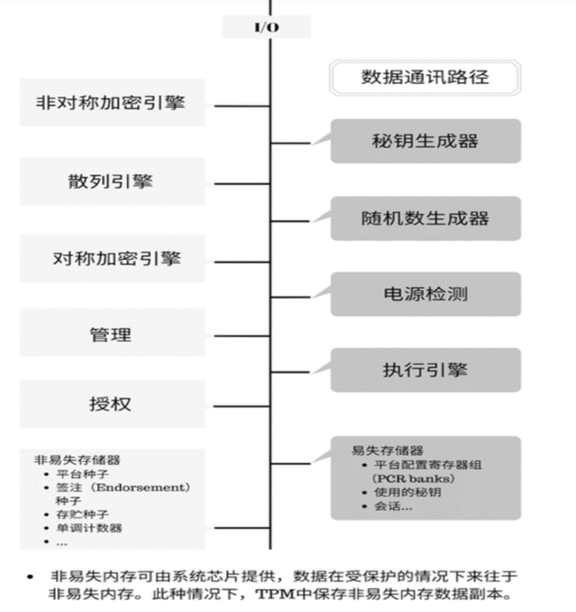
为推进TPM应用，打造可信计算生态，TCG定义了软件栈规范，将TPM底层细节接口与TPM应用程序隔离起来，为高端系统和资源受限的低端系统设计和定义了可信计算组织软件栈（TSS），采用多层设计从而允许扩展。如右图所示，TSS分别用于本地应用场景和远程应用场景。
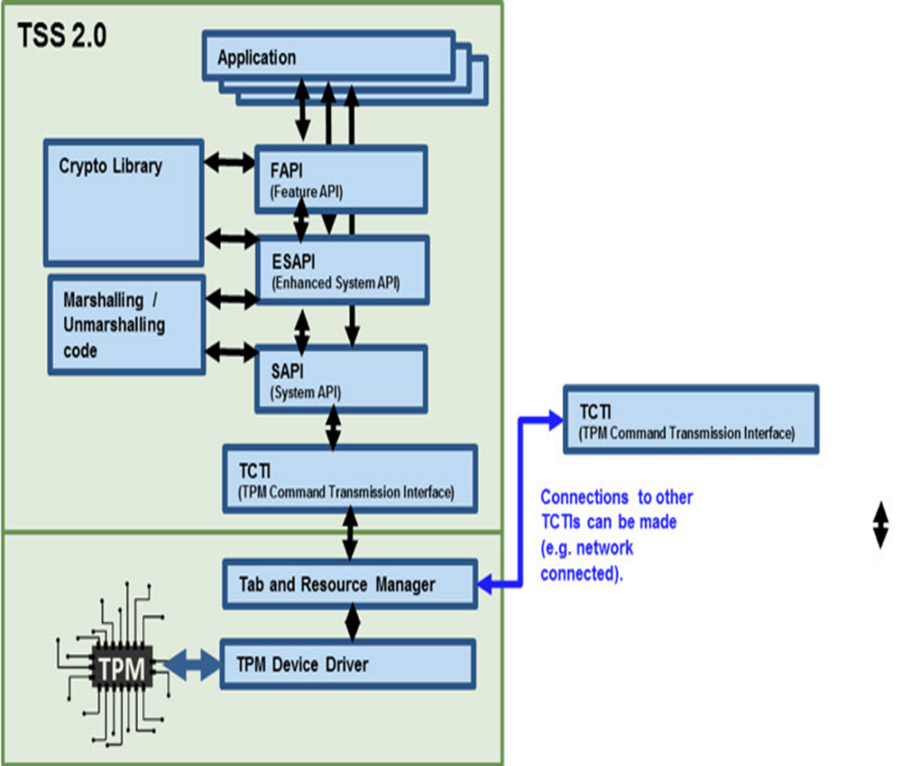
TSS通过TPM命令转发接口（TPM Command Transmission Interface，TCTI）实现应用层到底层各个组件的连接与通信。  
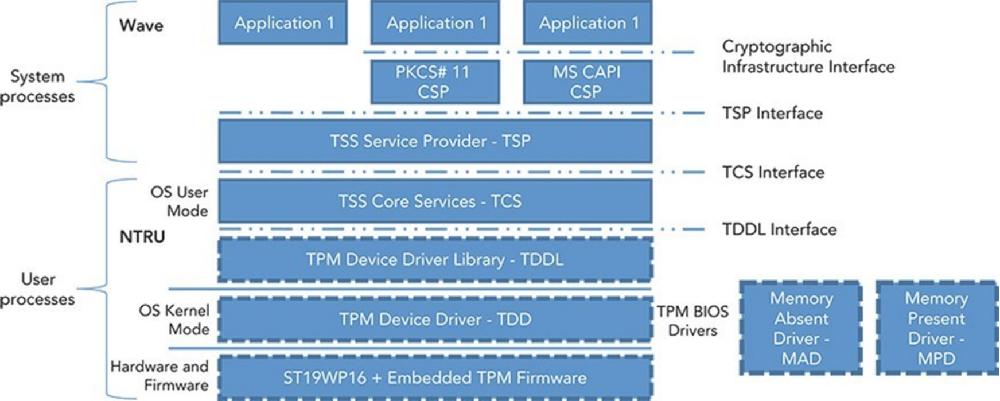

#### 中国可信计算标准TCM的发展思路

中国可信计算工作组(TCMU)  ：31家单位，覆盖IT各领域

- 使用自主密码算法：SM2/SM3/SMS4/RNG
- 构建3个维度安全功能体系
  - 构建信任链确保平台完整性
  - 通过身份密钥和数字签名实现平台身份可信
  - 通过“密封”和“绑定”确保平台数据安全

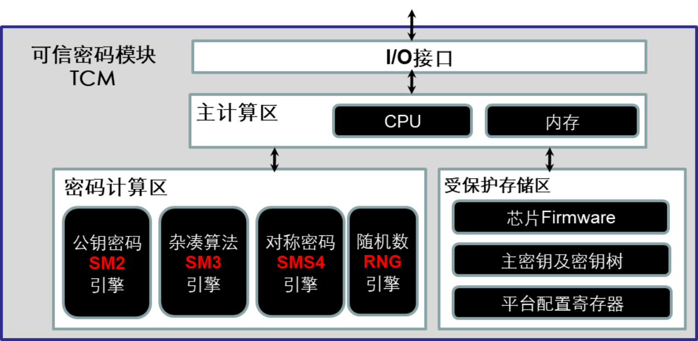

#### 中国可信计算平台架构
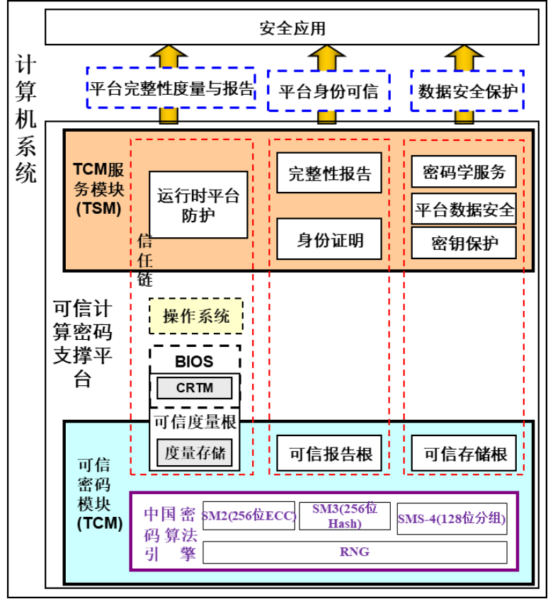
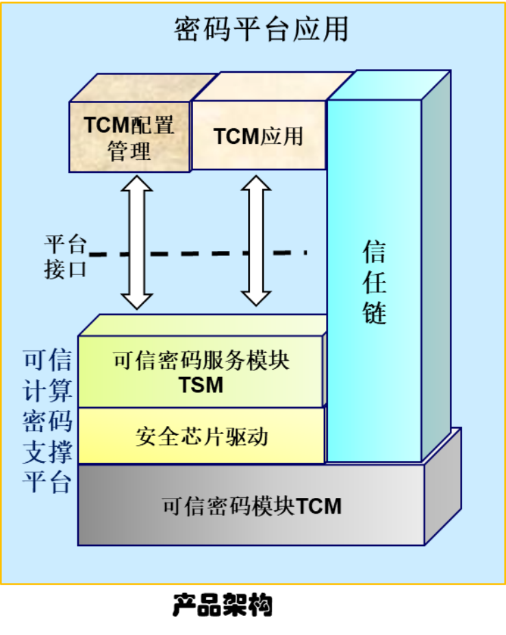

#### 中国可信计算技术规范体系
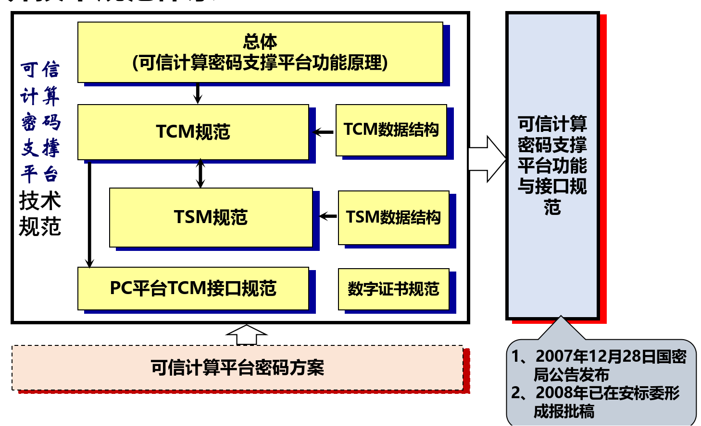

#### TCM可信计算体系结构
1.  可信计算节点(trusted computing node)  
由可信部件和计算部件共同构成、具备计算和防护并行特征的计算节点。
2.  可信密码模块(TCM)  
可信计算平台的硬件模块,为可信计算平台提供密码运算功能,具有受保护的存储空间 
3.  可信平台控制模块(trusted platform control module, TPCM)  
一种集成在可信计算中,用于建立和保障信任源点的硬件核心模块,为可信计算提供完整性度量存储、可信报告及密码服务等功能  
4.  可信平台主板(trusted main board)  
由TPCM和其他通用部件组成，可实现从开机到操作系统内核加载前的平台可信。
5.  可信软件基(trusted software base)  
为可信计算平台的可信性提供支持的软件元素的集合 
6.  信任链(trusted chain)  
在计算节点启动和运行过程中,使用完整性度量方法在部件之间所建立的信任传递关系  

可信计算的体系由可信计算节点及其间的可信连接构成，为其所在的网络环境提供相应等级的安全保障。可信计算节点可根据其所处业务环境部署不同功能的应用程序，可信计算节点包括可信计算节点（服务）和可信计算节点（终端），不同类型的可信节点可独立或相互间通过可信连接构成可信计算体系。
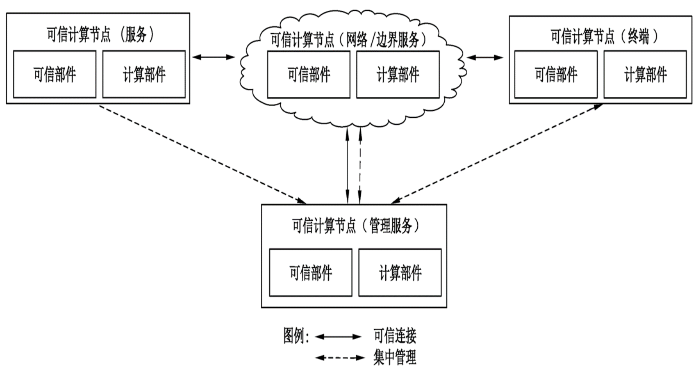

可信计算节点由**可信部件**和**计算部件**组成。逻辑相互独立，形成具备计算功能和防护功能并存的双体系结构。

#### TCM可信计算节点组成
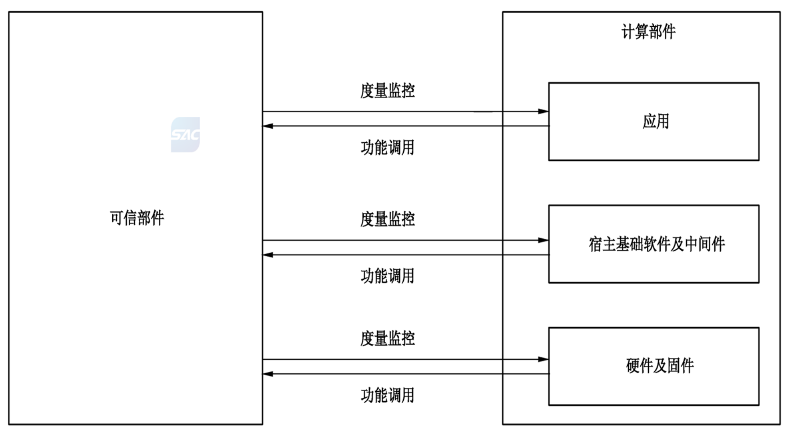

- 可信部件主要对计算部件进行度量和监控，其中监控功能依据不同的完整性度量模式为可选功能，可信部件同时提供密码算法、平台身份可信、平台数据安全保护等可信计算功能调用的支撑。
- 计算部件为程序提供计算、存储和网络资源，主要包括通用硬件和固件、操作系统及中间件、应用程序和网络等部分构成。

可信部件主要包括：可信密码模块（TCM）或可信平台模块（TPM）、可信平台控制模块（TPCM）、可信平台主板、可信软件基（TSB）和可信连接。  
TCM/TPM：应提供密码算法支撑，具有完整性度量、可信存储及可信报告等功能。  
TPCM：在TCM/TPM的支撑下应具备主动度量和控制功能。TPCM应是一个逻辑独立或者物理独立的实体，可采用独立的模块或物理封装、通过TP核或固件方式与TCM/TPM集成、虚拟化实现实体等形式。  

#### 完整性度量模式

可信部件具有三种工作模式，三种工作模式依赖不同的可信部件。  

1.  裁决度量模式  
在硬件及固件层，TPCM应为可信计算节点中第一个运行的部件，作为可信计算节点的信任根，应用TCM/TPM或其他的密码算法和完整性度量功能对BIOS、宿主基础软件等计算部件主动发起完整性度量操作，并依据度量结果进行主动裁决和控制。  
在宿主基础软件及中间件层，TPCM向上层提供使用TPCM基础资源的支撑，**TSB**通过调用TPCM的相关接口对应用软件进行主动监控和主动度量，对应用软件完全透明，保证应用软件启动时和运行中的可信。
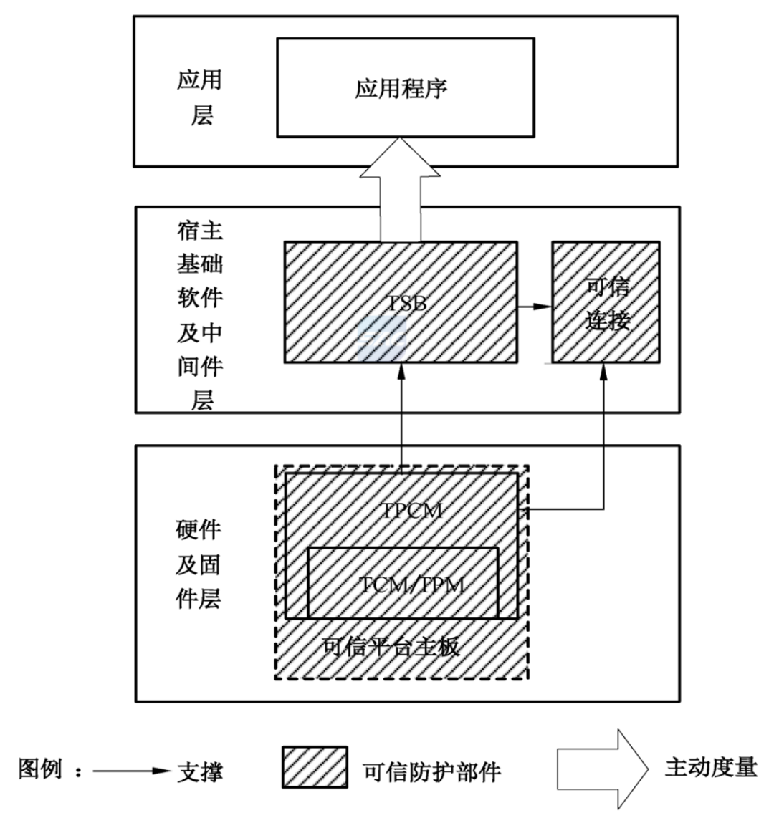

1.  报告度量模式  
在硬件及固件层，BIOS中的CRTM构成可信计算节点的信任根，并通过TSM/TSS等向上层提供使用TCM/TPM等基础资源的支撑。  
在宿主软件及中间件层，由应用层的应用程序调用**TSM/TSS**等相关接口进行完整性度量，并给出完整性报告，由应用程序使用者进行裁决。对于支持可信连接的网络部署，可信连接调用TSM/TSS等提供的接口进行完整性度量，并根据度量结果进行相应操作。
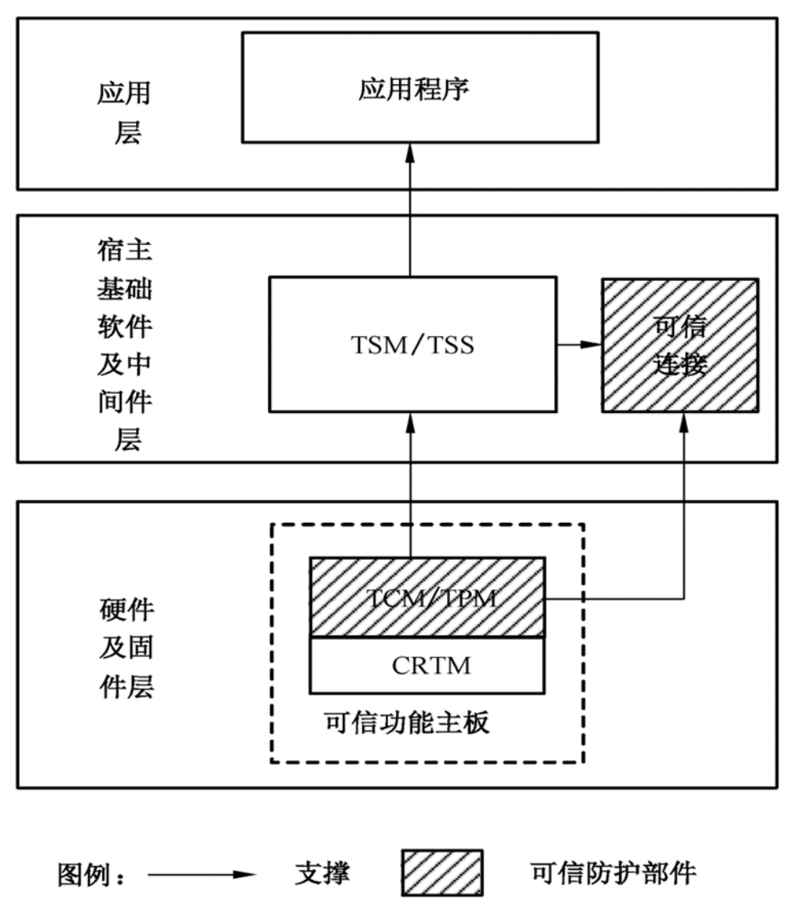

1.  混合度量模式  
参与部件应为TCM/TPM和TSB。信任链建立过程中，在硬件及固件层的TCM/TPM工作于报告度量模式，在宿主基础软件及中间件层，TSB通过调用TCM/TPM相关接口工作于裁决度量模式。
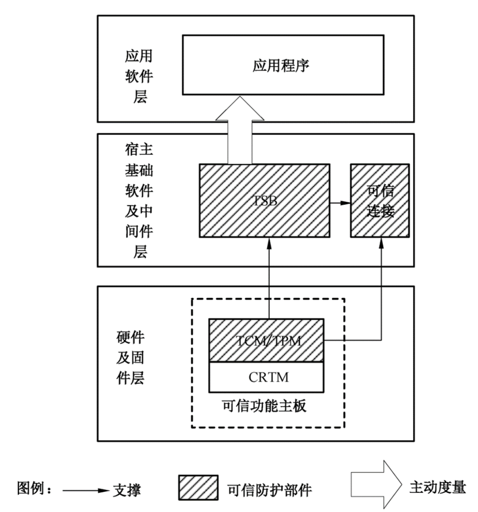

## 3. TCM可信计算基础架构

### 可信计算底层架构

#### 可信计算节点架构
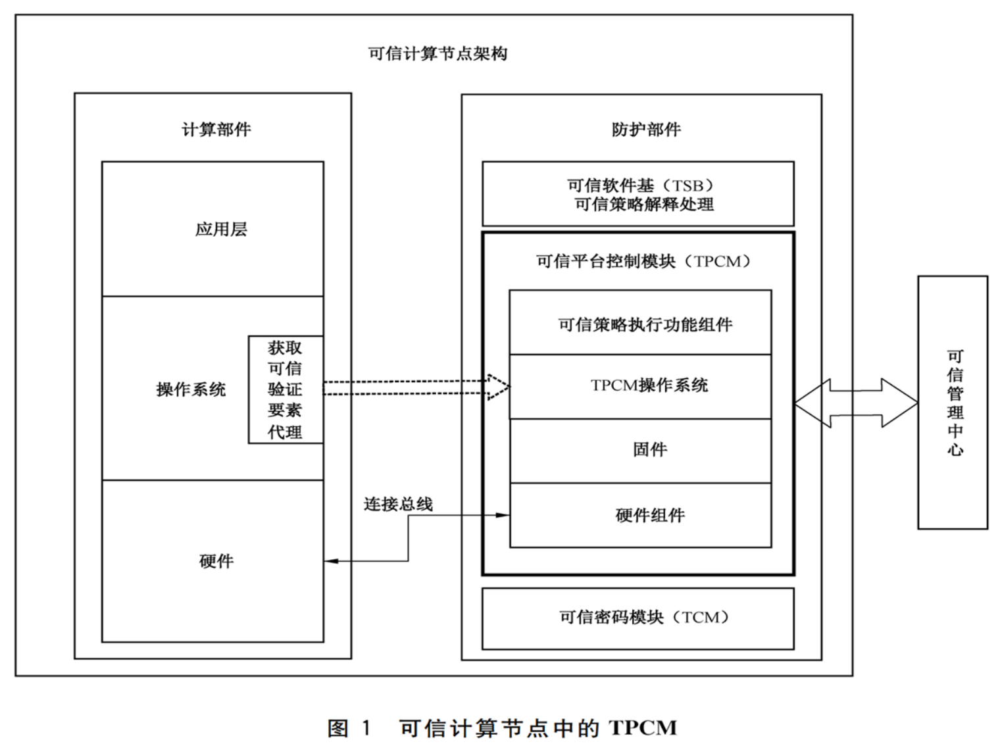

#### TPCM与外部的交互
TPCM 需与 TSB、TCM、可信管理中心和TPN的计算部件交互：
- TPCM 的硬件、固件与软件为 TSB 提供运行环境,设置的可信功能组件为 TSB 按策略库解释要求实现度量、控制、支撑与决策等功能提供支持；
- TPCM 通过访问 TCM 获取可信密码功能,完成对防护对象可信验证、度量和保密存储等计算任务,并提供 TCM 服务部件以支持对 TCM 的访问；
- TPCM 通过管理接口连接可信管理中心,实现防护策略管理、可信报告处理等功能；
- TPCM 通过内置的控制器和 I/O 端口,经由总线与计算部件的控制器交互,实现对计算部件的主动监控；
- 计算部件操作系统中内置的防护代理获取预设的防护对象有关代码和数据提供给 TPCM,TPCM 将监控信息转发给 TSB,由 TSB 依据策略库进行分析处理。

#### TPCM功能组成
TPCM模块是一个逻辑概念，由功能组件、基础软件和硬件组成。
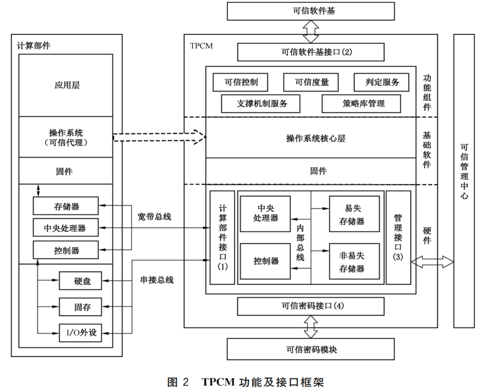

硬件层应包括中央处理器、易失存储器、非易失存储器、计算部件接口、管理接口、可信密码接口，为TPCM 的功能实现提供基础运行环境。硬件组件之间通过内部总线实现相互连接。  
基础软件层应包括固件、操作系统核心,实现对 TPCM 内部的资源调度、任务管理,以及提供 I/0接口驱动及控制。
功能组件层包括可信控制、可信度量、判定服务、支撑机制服务及策略库管理,以及可信软件基接口，各部分功能如下：
- 可信控制是指 TPCM 依据防护策略和度量结果,进行基于节点控制部件的总线、电源信号等方式的控制;
- 可信度量是依据防护策略,获取预设的计算部件中防护对象有关内存、I/O、固件中的关键数据信息，并进行密码运算;
- 判定服务为可信软件基判定机制的实现提供支持;
- 支撑机制服务为可信软件基提供有关系统处理的运算;
- 策略库管理对节点的可信度量、可信控制等规则进行管理；
- 可信软件基接口为可信软件基提供功能访问。

#### TPCM接口
TPCM通过互联接口实现访问计算部件资源、连接可信密码模块和提供面向外部的功能访问,接口应包括计算部件接口、可信密码模块接口、可信软件基接口和管理接口。
- 计算部件接口主要为总线接口,与节点计算部件中不同类型的总线相连接,用于访问内存、I/0、系统固件等系统资源,并通过控制器对系统资源进行控制。TPCM 可通过计算部件总线接口连接计算部件硬件层的控制器,实现对可信计算节点的主动监控,监控对象可包括内存、硬盘、USB、并口、串口和网络等。
- 可信密码模块接口提供 TPCM 对可信密码模块访问的 I/O 通道。
- 可信软件基接口为软接口,为可信软件基提供 TPCM 功能的调用。TPCM 在提供接口服务前,应先与调用者进行相互认证并建立可信的数据通道。可信软件基可通过该接口调用 TPCM 中的度量、控制、判定和支撑等服务功能,并返回处理数据。
- 管理接口为物理接口,应为网络或总线接口模式,由可信管理中心访问，TPCM 的管理接口应包括 TPCM 自身管理、可信密码模块管理、基本信任基管理及日志管理等各接口功能要求如下:
  a)TPCM 自身管理接口应包括 TPCM 配置管理和安全管理;  
  b)可信密码模块管理接口应提供 TPCM 所使用的可信密码模块的授权管理、密钥管理;  
  c)基本信任基管理接口应提供基本信任基的度量值管理与度量策略管理;  
  d) 日志管理接口应提供 TPCM 管理行为日志的导出机制。

#### TPCM模块安全性要求

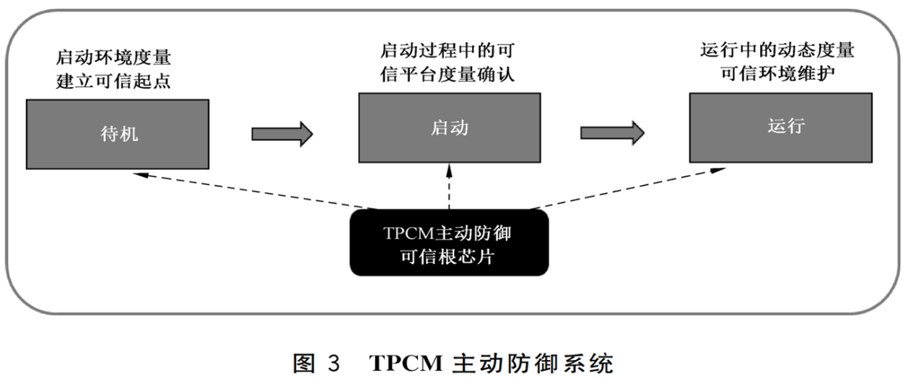

#### 可信平台主板功能

可信平台主板是由可信平台控制模块和其他通用部件组成, 实现从开机到操作系统内核加载前的平台可信引导功能。通用部件主要包括: 中央处理器、RAM、输入输出接口、Boot ROM固件等。

#### 可信平台主板组成结构

**可信平台控制模块(TPCM)**
- TPCM 由物理硬件、嵌入式系统、对外的接口等实体组成
- TPCM 是可信平台的唯一可信根，其包括可信度量根(RTM)、可信存储根(RTS)和可信报告根(RTR)。
- TPCM 通过系统总线连接到可信平台主板的控制器。

**可信平台主板:**
- 嵌入 TPCM,支持 TPCM 功能，实现信任链传递的计算机主板。
- 包括中央处理器、控制器、随机存取存储器、TPCM 硬件设备、Boot ROM 固件层支撑模块及其设备驱动程序和 TPCM 嵌入式系统等实体。
- 支持 TPCM 对输入输出接口的控制,TPCM 最少但不限于控制以下输入输出接口的开启或关闭:USB、PS/2、PCIE、PCI、SATA、串口、并口、网络接口。 

#### 可信平台主板与TPCM一对一绑定
必须确保可信平台主板和 TPCM 一对一的绑定关系。TPCM 与可信平台主板其他部件的协作关系应满足如下要求：在 CPU 执行 Boot ROM 代码前，TPCM 先启动。TPCM 中的 **RTM** 对 Boot ROM 中的 Boot Block **进行完整性度量和度量结果的存储**。

### 计算机常规启动

#### 计算机启动流程
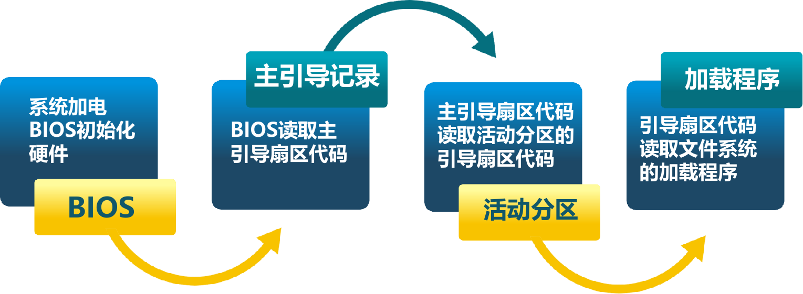

#### 加载程序(bootloader)
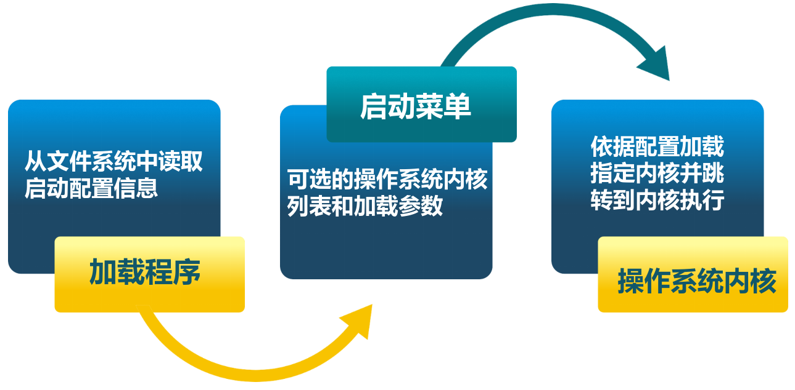

##### UEFI相比BIOS的优势
1.  通过保护预启动或预引导进程，抵御rootkit攻击，从而提高安全。
2.  缩短了启动时间和从休眠状态恢复的时间。
3.  支持容量超过2.2TB的驱动器。
4.  支持64位的现代固件设备驱动程序，系统在启动过程中可以对超过172亿GB的内存进行寻址。
5.  UEFI硬件可与BIOS结合使用。

### 计算机可信启动

#### 扩展度量模块（EMM）
EMM 作为 RTM 度量根的扩展度量模块,实现对执行部件的完整性度量,实现信任链传递。
EMM1:存储于 Boot ROM 的初始引导模块(Boot Block)中,被 RTM 度量；EMM1 对Boot ROM 的版本信息和 EMM2 进行完整性度量。
EMM2:存储于 Boot ROM 的主引导模块(Main Block)中,被 EMM1 度量；EMM2 对平台启动部件,以及 OS Loader 进行完整性度量。
EMM3:存储于外部存储器中的 OS Loader 中,被 EMM2 度量；EMM3 对操作系统内核进行度量。
扩展度量模块 EMM 通过 TPCM 提供的接口,访问 TPCM,存储度量结果和日志。

#### 信任链传递
1) TPCM先于Boot ROM被执行前启动, 由TPCM中的RTM度量Boot ROM中的初始引导模块(Boot Block), 生成度量结果和日志, 并存储于TPCM中;  
2) 如果度量通过，TPCM发送控制信号, 使CPU、控制器和动态存储器等复位; 平台加载并执行Boot ROM中的Boot Block代码;  
3) Boot Block中的EMM1获得系统执行控制权, 信任从RTM传递到EMM1;  
4) EMM1度量Boot ROM版本信息和主引导模块（Main Block）中的EMM2代码;EMM1存储度量结果到TPCM中的PCR并存储度量日志;  
5) 如果度量通过，平台加载并执行Main Block中EMM2的代码;  
6) Main Block中的EMM2获得系统执行控制权, 信任从EMM1传递到EMM2;  
7) 平台加载并执行OS Loader的代码;  
8) OS Loader中的EMM3获得系统执行控制权, 信任从EMM2传递到EMM3;  
9) EMM3度量操作系统内核, 生成度量结果和日志, 度量结果存储到TPCM的PCR中, 度量事件日志保存到LSA中;  
10) 平台加载并执行OS Kernel的代码;  
11) OS Kernel中的EMM4获得系统执行控制权, 信任从EMM3传递到EMM4。

#### 信任链建立流程
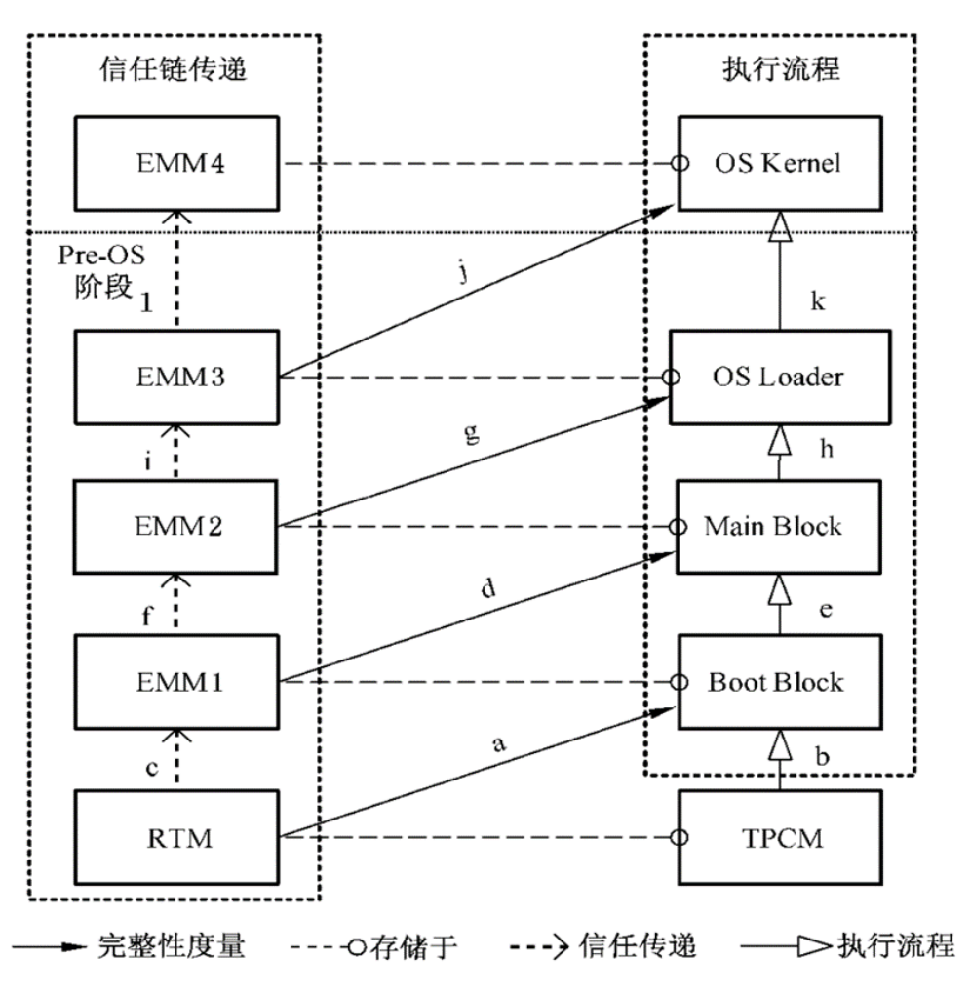

#### 信任链建立要求
1) 信任链的建立过程必须以可信度量根 RTM 为起点;  
2) 当需要装载并运行一个部件前, 应由 RTM 或者EMM对该部件进行完整性度量, 然后再将其加载和运行;  
3) TPCM中PCR存储的杂凑值应与系统引导过程中的度量事件和度量顺序相对应;  
4) TPCM中PCR存储的杂凑值应与系统引导过程中生成的度量日志相对应;  
5) 在每次开机时应重新生成LSA中的度量日志和TPCM中PCR存储的杂凑值。

#### 完整性度量方法
信任链基于RTM建立, 通过扩展度量模块EMM实现信任传递。 RTM和EMM**采用杂凑算法**对部件代码进行完整性计算, 并存储度量结果, 实现完整性度量。

#### 完整性度量存储
完整性度量事件日志应存放于系统的LSA(Log Storage Area)中。

#### 可信平台主板功能接口
可信平台主板功能接口包括与底层TPCM的接口和与上层应用之间的接口。在TPCM上建立设备驱动层(TPCM Device Driver: TDD)实现主板可信应用功能对底层TPCM的调用。在TDD之上, 可建立服务提供层(TPCM Service Provider)对TDD进行再封装, 为上层应用提供更高层次的接口, 简化上层编程实现。
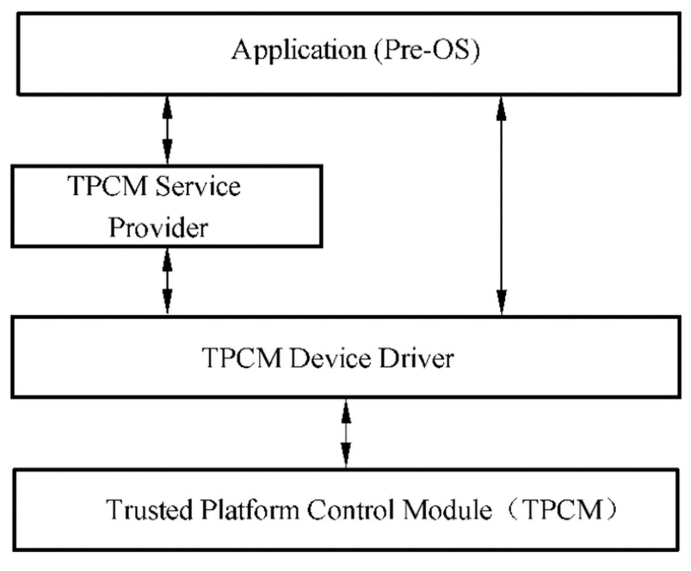

#### TPCM与TPM的区别

- TPM作为可信计算平台的核心，实际上是一块安装在主板上，含有密码运算部件和存储部件的系统级芯片。TPM技术最核心的功能在为平台提供安全可信的密钥存储、完整性报告和基础的密码运算等功能。  
- TPM的主要功能包括平台的密码计算、完整性报告和可信存储，而 TPCM 从应用角度出发，对芯片功能进行了改进，可以为可信计算平台提供控制机制、主动的完整性度量、主动的可信报告、可信存储和可信通信等功能。  
- TPM的平台完整性度量属于一种被动的度量方式。系统启动时，必须先启动了BIOS，对硬件和系统检测完毕后，BIOS加载TPM芯片才能发挥度量作用，这给黑客入侵、攻击BIOS提供了机会。
- TPCM作为系统的可信根，在TCM基础上加以信任根控制功能，实现了以密码为基础的主动控制和度量；TPCM要优先于CPU启动，并主动对BIOS进行验证。在验证通过后，在通过电源和总线控制机制允许CPU启动运行。先于CPU启动是为了保证对系统的控制，防止可信机制被系统旁路。由此改变了TPM作为被动设备的传统思路，将TPCM设计为主动控制节点，实现了TPCM对整个平台的主动控制。这样，即使CPU或操作系统存在后门，攻击者也难以利用这些漏洞篡改访问控制策略。
- TPCM在平台完整性度量结束后，对度量结果进行比较，同时还将错误的度量结果通过触发中断方式主动报告给平台；而TPM的完整性报告方案不对度量结果进行比较，只将度量结果存储在PCR寄存器中。
- TPCM可以通过检查硬件设备的可执行程序、控制策略配置信息、工作模式配置信息和Option ROM的完整性，以及当前硬件电路的工作状态，判断硬件设备的可信性；同时，TPCM还可以通过配置、切换控制策略和工作模式配置信息，实现对硬件设备的控制功能。而TPM储存当前硬件设备的度量信息，无法像TPCM一样实现根据度量结果的主控控制；此外，由于平台借助操作系统实现对硬件系统的控制，会导致平台控制系统的安全隐患。  

我国的可信计算密码标准主要在3个方面体现了自主创新：  
- 在密码算法上，全部采用国有自主设计的算法，定义了TCM；
- 在密码机制上，采用对称和非对称密码相结合体制，提高了安全性和效率；
- 在证书结构上，采用双证书体系（平台证书和用户证书），简化证书管理，提高了可用性和客观性。

## 4. TCM可信密码支撑平台

### 可信计算密码支撑平台的作用

#### 可信计算密码支撑平台定义
可信计算密码支撑平台是可信计算平台的重要组成部分, 包括密码算法、密钥管理、证书管理、密码协议、密码服务等内容, 为可信计算平台自身的完整性、身份可信性和数据安全性提供密码支持。可信计算密码支撑平台的产品形态主要表现为可信密码模块和可信密码服务模块。

#### 可信计算密码支撑平台功能
a) 平台完整性  
利用密码机制, 通过对系统平台组件的完整性度量, 确保系统平台完整性, 并向外部实体可信地报告平台完整性。  
b) 平台身份可信  
利用密码机制, 标识系统平台身份, 实现系统平台身份管理功能, 并向外部实体提供系统平台身份证明。  
c) 平台数据安全保护  
利用密码机制, 保护系统平台敏感数据。 其中数据安全保护包括平台自身敏感数据的保护和用户敏感数据的保护。 另外也可为用户数据保护提供服务接口。

密码模块与功能的对应关系
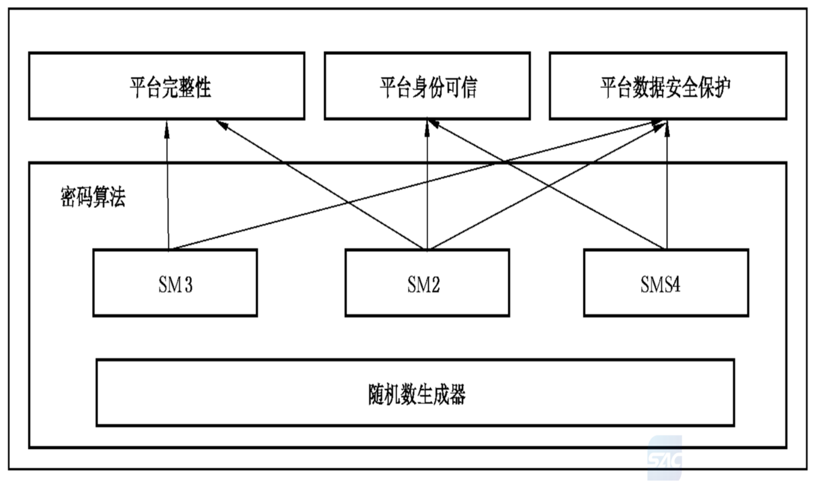

#### 可信计算密码支撑平台组成

可信计算密码支撑平台主要由TCM和TCM服务模块(TSM)两大部分组成。可信计算密码支撑平台以可信密码模块为可信根, 通过如下三类机制及平台自身安全管理功能, 实现平台安全功能:  
a) 以可信度量根为起点，计算系统平台完整性度量值，建立计算机系统平台信任链，确保系统平台可信。  
b) 可信报告根标识平台身份的可信性，具有唯一性，以可信报告根为基础，实现平台身份证明和完整性报告。  
c) 基于可信存储根，实现密钥管理，平台数据安全保护功能，提供相应的密码服务。

可信计算密码支撑平台组成
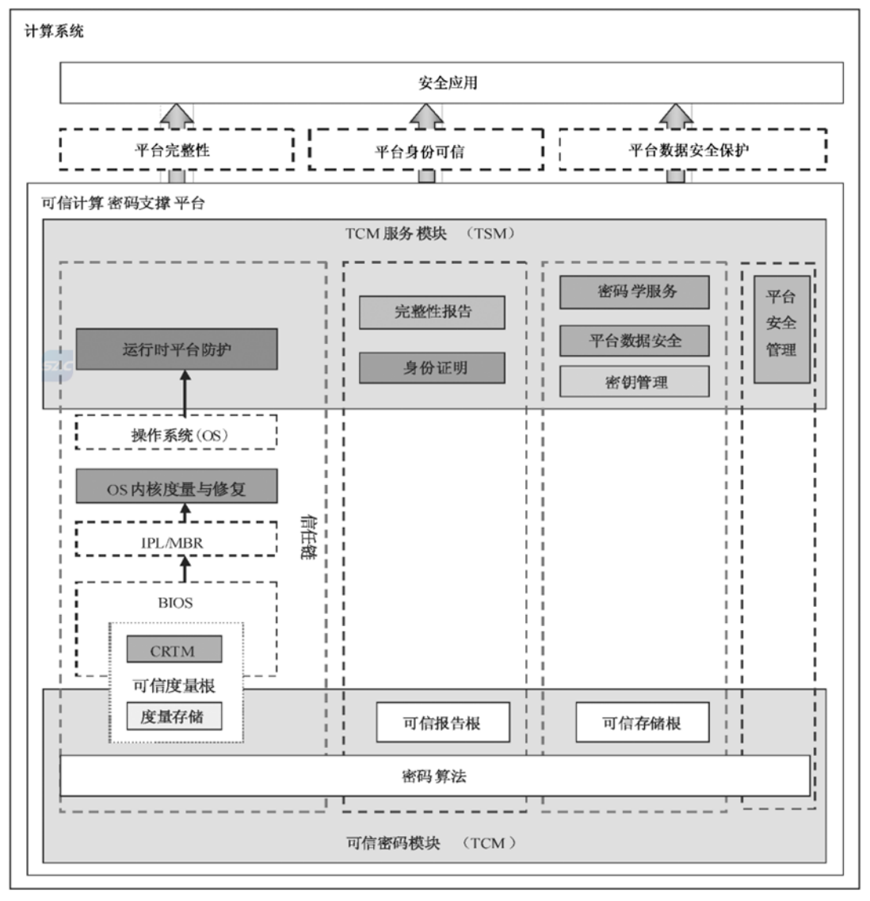

### 可信密码模块

#### 可信密码模块部件功能
I/O:TCM 的输入输出硬件接口;  
SM4 引擎: 执行SM4 对称密码运算的单元;  
SM2 引擎: 产生SM2 密钥对和执行SM2 加/解密、 签名运算的单元;  
SM3 引擎: 执行杂凑运算的单元;  
随机数发生器: 生成随机数的单元;  
HMAC 引擎: 基于SM3 引擎的计算消息认证码单元;  
执行引擎:TCM 的运算执行单元;  
非易失性存储器: 存储永久数据的存储单元[1-5] ;  
易失性存储器:TCM 运行时临时数据的存储单元。
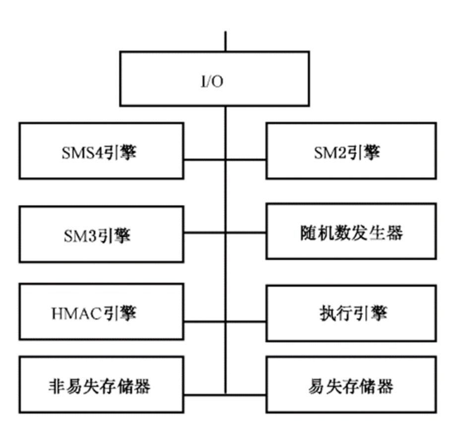

#### TCM服务模块（TSM）
为防止TCM成为计算平台的性能瓶颈，将子系统中需执行保护的函数与无需执行保护的函数划分开, 将无需执行保护的功能函数由计算平台主处理器执行, 而这些支持函数构成了TCM服务模块, 简记为TSM。  
国际上通用的可信计算规范由TCG制定，核心是TPM和TSS。  
TCM对应TPM, 是我国具有自主知识产权的可信芯片。对应TSS的就是TSM

#### TSM设计目标
TSM的设计目标是:
- 为应用程序调用 TCM 安全保护功能提供一个入口点;
- 提供对 TCM 的同步访问;
- 向应用程序隐藏 TCM 所建立的功能命令;
- 管理 TCM 资源。

### 可信计算密码算法规范
国家可信计算标准涉及的密码算法包括SM2椭圆曲线密码算法、SM4对称密码算法、SM3密码杂凑算法、HMAC消息认证码算法、随机数发生器。

### 基于密码技术的完整性度量

完整性度量与存储是指计算部件的度量值, 记录该事件到事件日志, 并把度量值记入可信密码模块内相应的平台配置寄存器(PCR) 中。

#### 完整性报告
完整性报告是指平台向验证者提供平台或部分部件的完整性度量值的过程。完整性报告应满足如下要求:  
a) 平台能够向验证者提供指定 PCR 值, 无需任何授权;  
b) 平台能够向验证者提供指定 PCR 值以及对 PCR 值的签名。 签名使用平台身份密钥;  
c) 平台可向验证者提供指定 PCR 的相关事件日志信息;  
d) 验证者可通过分析完整性度量事件日志信息判断该 PCR 值是否来自正确的度量过程;  
e) 验证者应使用平台身份密钥验证 PCR 值签名, 获得平台完整性报告结果。

#### 向外部实体证明平台完整性
系统运行时可以设置一个平台防护模块, 用于检测应用程序或进程的完整性, 确保应用程序或进程的可信性。  
平台可向外部实体提供完整性报告, 所报告的度量值作为判断平台可信性的依据。报告完整性度量值时, 平台身份密钥应对完整性度量值进行数字签名, 接收方通过验证签名有效性以及校验完整性度量值来判断该平台的可信性。外部实体可以向平台请求验证平台的完整性。

#### 完整性证明流程
a) 平台按如下方式报告其完整性
1) 平台启动后, 外部实体向平台发送完整性度量报告的请求;
2) 可信密码模块收集PCR的值, 使用平台身份密钥(PIK) 对PCR的值进行签名;
3) 平台将PCR的值,PIK 对 PCR 值的签名和PIK证书发送给验证者。

b) 验证者验证平台完整性
1) 验证者得到平台发送的 PCR 值,PIK 对 PCR 值的签名和 PIK 证书
2) 验证者验证 PIK 证书;
3) 验证者验证 PCR 值的签名;
4) 验证者对 PCR 的值与平台的完整性基准值进行比较, 若相同, 则表明当前平台处于可信状态。

### 保护平台数据安全

#### 平台数据安全保护方法

用于数据安全保护的密钥分为对称密钥和非对称密钥。密钥管理包括密钥生成、密钥加载、密钥销毁、密钥导入、密钥迁移、密钥协商等功能;被保护的数据可以是任何数据;  
数据安全保护方式包括数据加解密、数据封装、数字信封等方式。

#### 功能接口
可信计算密码支撑平台功能接口, 包括上下文管理、策略管理、可信密码模块管理、密码管理、数据加密与解密、PCR 管理、非易失性存储管理、杂凑操作、密钥协商等九大类接口的定义。  
这些接口采用面向对象思想来设计, 应用软件在调用时需要创建各个类的工作对象。工作对象分为需要授权与无需授权两种, 需要授权的工作对象包括 TCM 管理工作对象、密钥对象、加密数据对象、NV 对象、密钥协商对象和策略对象。无需授权的工作对象包括杂凑对象和 PCR对象。

在可信计算密码支撑平台中无需授权即可工作的对象之间的关系
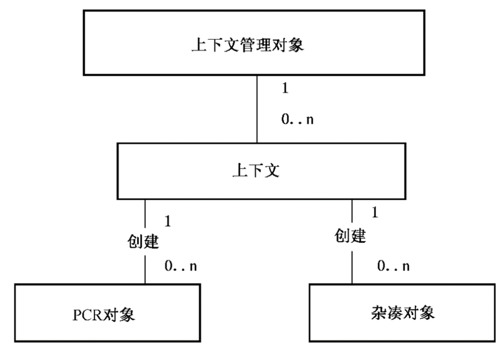

在可信计算密码支撑平台中需要授权的工作对象之间的关系
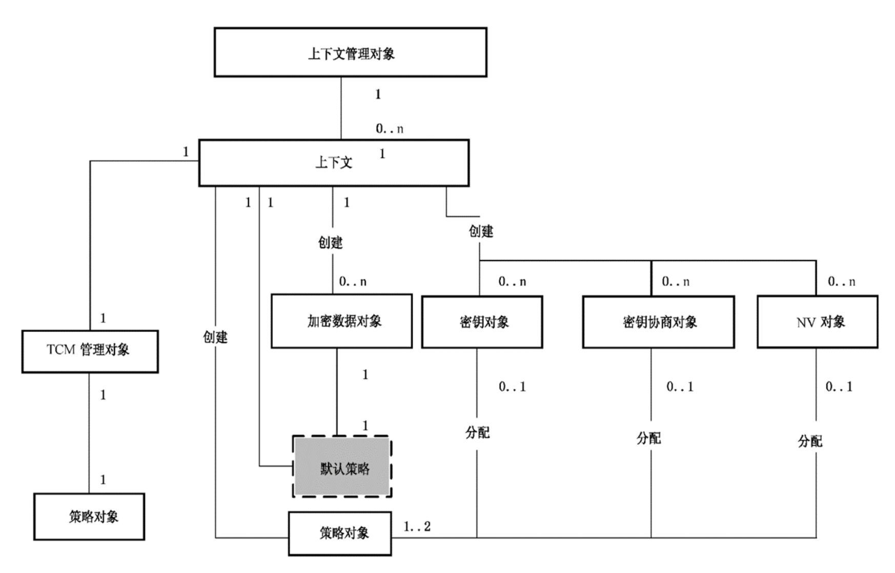

上下文管理类包含关于 TSM 对象的执行环境的信息, 如对象的标识和与其他 TSM 软件模块的交互/通信, 以及内存管理

## 5. TPM可信计算规范基本概念

### TPM规范基本概念

#### TPM规范
TPM 2.0第1部分：规范体系结构  
包含对TPM属性、功能和方法的叙述描述。  
TPM 2.0第2部分：规范数据结构  
包含对TPM接口的常量、数据类型、结构体和共用体的规范描述。  
TPM 2.0第3部分：命令  
包括：(1)命令的规范描述，(2)描述命令和响应格式的表，以及(3)说明TPM执行的操作的C代码。  
TPM 2.0第4部分：支持程序  
该部分是C代码，描述了TPM 2.0第3部分中命令代码使用的算法和方法。

#### 可信构建块（Trusted Building Block, TBB）  

可信构建块(TBB)指实例化可信根（信任根）所需的组件或组件集合。 通常，特定于平台的TBB是没有屏蔽位置的可信根的一部分。TBB的一个例子是CRTM（核心可信度量根），CRTM是存储和主板之间的连接，也是存储和CPU之间的路径，TPM和主板之间的连接，以及CPU和TPM之间的路径。 TBB的行为不会损害受信任平台。

#### 可信计算基（Trusted Computing Base, TCB）

可信计算基(TCB)是负责维护系统安全策略的系统资源(硬件和软件)的集合。TCB的一个重要属性是，它能够防止自己受到不属于TCB的任何硬件或软件的损害。TPM不是系统的可信计算基础。 相反，TPM只是一个组件，它允许一个独立的实体确定TCB是否已被破坏。

#### 信任边界（Trust Boundaries）

可信构建块TBB和可信(Root of Trust)的组合形成了一个信任边界，在这个边界内，可以通过最小的配置完成测量、存储和报告。在更复杂的系统中，CRTM可能需要建立对其他代码的信任，方法是对其他代码进行度量，并将度量结果记录在PCR中。如果CRTM将控制转移到其他代码，无论度量结果如何，那么信任边界都会扩展。如果CRTM不运行该代码，除非它的度量值是期望值，那么信任边界保持不变。因为被度量的代码是CRTM的预期扩展。

#### 可信根（Trusted Root）

TCG定义的可信计算体系依赖于可信根。这些可信根是必须信任的系统元素，因为可信根中的不当行为是无法被检测到的。TCG所需的根集提供了描述影响平台可信度的特征所需的最小功能集合。虽然无法确定可信根是否行为正确，但可以通过一系列规范确保根是可信的。证书提供了确保可信根由一种可信任的方式实现的保证。 例如，证书可以标识TPM的制造商和评估保证水平(Evaluated Assurance Level, EAL)。此认证提供了对TPM中实现的可信根的信任。来自平台制造商的证书可以保证TPM已正确安装在符合TCG规范的机器上。  
TCG要求在一个可信平台上需要三个信任根：RTM，RTS，RTR。

TPM利用密码技术可以为多个应用构造不同的可验证身份。TPM通过引用PCR值来报告平台的状态。为了保证这些PCR值能够准确反映这种状态，必须要建立RTR和平台之间的绑定。平台证书（Platform Certificate）可以为此绑定提供证明。平台证书是来自认证机构的平台(RTM)和RTR之间物理绑定的保证。

### TPM的认证和证明

#### 可信平台中的认证与证明

一个可信平台至少提供了前面描述的三个信任根。所有这三个根都使用认证(certification)和证明(attestation)来提供信息准确性的证据。可信平台还将为密钥和数据对象提供用于委托的受保护位置。最后，可信平台可以通过记录平台状态的变化来提供完整性度量，以确保平台的可信性；这些可以通过在PCR中记录的条目来完成，以便验证其正确性和未被篡改。

#### 认证（Certification）

使用密钥建立信任名义上的方法是使用一个证书，该证书表明创建密钥和保护密钥的过程符合必要的安全标准。证书可以通过装载了一个嵌入式密钥(即背书密钥)的TPM与一个EK的真实性证书一起提供。 EK及其证书可用于对凭据(证书)或其他TPM密钥进行关联。

#### 证明（Attestation）和身份验证

1. 证明的类型。可信平台采用层次结构进行证明，如图所示。
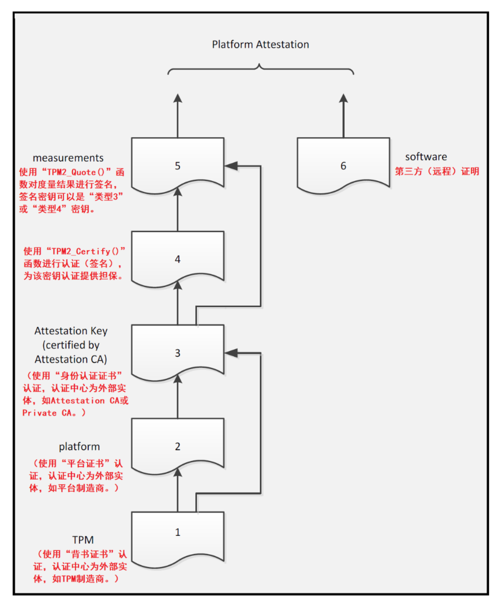

| 层次类型 | 描述                                                                                                                       | 实现方式                               |
| -------- | -------------------------------------------------------------------------------------------------------------------------- | -------------------------------------- |
| 1        | 外部实体对TPM进行认证，以保证TPM是真实的，符合本TPM规范。                                                                  | 背书证书                               |
| 2        | 外部实体对平台进行认证，以保证平台包含一个可信度量根(RTM)，一个真正的TPM，以及RTM和TPM之间的可信路径。                     | 平台证书                               |
| 3        | 一个称为“认证CA”的外部实体对TPM中的非对称密钥对进行认证，以保证密钥受到一个身份不明但真实的TPM的保护，并且具有特定的属性。 | 认证密钥证书                           |
| 4        | 可信平台对非对称密钥对进行验证，以保证密钥对受到一个真实但身份不明的TPM的保护，并具有特定的属性。                          | 使用TPM2_Certify()函数完成（签名方式） |
| 5        | 可信平台对度量进行验证，以保证平台中存在特定的软件/固件状态。                                                              | 使用TPM2_Quote()函数完成（签名方式）   |
| 6        | 外部实体对软件/固件度量进行证明，以保证特定的软件/固件。                                                                   | 第三方认证（远程证明）                 |
2. 证明密钥（Attestation Keys，AK）  
证明密钥(AK)是一种特定类型的签名密钥，它对其使用有限制，以防止伪造(具有与真正认证数据相同格式的外部数据的签名)。常见的限制是AK只能用于对TPM创建的摘要进行签名。
3. 证明密钥的身份认证  
签名密钥用于认证新对象身份。  
密钥创建者可以要求第三方(如认证证书颁发机构(CA))为其提供证书。认证CA可以请调用方提供一些证据，证明被认证的密钥是驻留TPM的密钥。可以使用之前同一TPM上的另一个密钥生成的证书来提供TPM驻留的证据。 背书证书或平台证书可提供此证据。如果一个经过认证的密钥可以签名，那么它可以用来证明某个其他对象驻留在同一个TPM上。这允许将新的AK链接到经过认证的密钥。CA可以使用来自TPM的证书为新密钥生成传统证书。  
解密密钥用于认证新对象身份。  
如果经过认证的密钥是一个解密密钥，并且可能不签名，那么将使用另一种方法来允许对新密钥或数据对象进行可靠的认证。对于这种替代认证，将被认证的对象的身份和解密密钥的证书(例如，EK)提供给CA。CA根据该证书确定解密密钥的公钥。CA然后为要认证的对象生成质询，并使用已认证的密钥对质询进行加密。对包含认证解密密钥和待认证密钥的TPM进行加密挑战。解密密钥（不可用于签名的密钥）需要借助CA来完成对新对象的认证。
4. 受保护位置  
当一个对象的敏感部分不是保存在TPM上的屏蔽位置时，它是加密的。 当不在TPM上进行加密时，它不能防止被删除，但可以防止其敏感部分的泄露。 不论存储在何处，它都位于受保护位置。长期保护存储的对象需要使用时应加载到TPM模块。 创建对象的应用程序管理对象从长期存储到TPM的移动。由于TPM的内存有限，它可能无法同时保存所有应用程序所需的所有对象。 TPM支持通过TPM资源管理器(TRM)交换对象上下文，以便TPM可以为这些多个应用程序提供服务。 在由TPM返回到TRM之前，对象上下文是加密的。 如果以后需要该对象，TRM可以将上下文重新加载到TPM中，从而提供类似缓存的行为。  
受保护位置的加密使用多个永不离开TPM的种子和密钥。 其中一个是Context Key。 它是一个对称密钥，在将数据临时交换出TPM时用于加密数据，以便加载不同的工作对象集。 从未离开TPM的其他敏感值是Primary Seeds。 这些种子是存储层次结构的根，用于保护应用程序保留的对象。 Primary Seed是一个随机数，用于为其他对象生成保护密钥; 这些对象可能是存储密钥，其中包含保护密钥，然后用于保护更多的对象。主种子可以被改变，当它们被改变时，它们保护的对象将不再可用。 例如，存储主种子(Storage Primary Seed, SPS)为与所有者相关的数据创建存储层次结构，当所有者发生变化时，该种子也会发生变化。
5. 完整性度量和报告  
核心可信度量根(CRTM)是度量的起点。 该过程对TPM平台进行初始度量并扩展到PCR寄存器中。 要使度量有意义，执行的代码需要控制它运行的环境，以便TPM中记录的值能够代表平台的初始信任状态。重新启动将进入一个处于已知初始状态的平台环境，主CPU从某个预制好的初始位置运行代码。 由于该代码在当时独占平台的控制权，因而它可以从固件中对平台进行度量。 从这些最初的度量，可以建立一条信任链。 由于该信任链是在平台重置时一次性建立的，所以初始信任状态不可能改变，因此称为静态RTM (S-RTM)。  
在一些处理器架构上可以使用另一种初始化平台的方法。 它让CPU充当CRTM，并对它度量的内存部分进行保护。这个过程可以在不重启平台的情况下启动一个新的信任链。由于RTM可以动态重建，因此这种方法被称为动态RTM (D-RTM)。 S-RTM和D-RTM都可以将一个处于未知状态的系统恢复到已知状态。 D-RTM的优点是不需要重新启动系统。  
完整性度量是一个表示平台信任状态可变的值。被测量的对象可以是任何有意义的东西，但通常是代码或数据的哈希值一些代码数据的签名者的指征。完整性报告是对PCR中记录的完整性度量进行验证的过程。 完整性度量、日志记录和报告背后的理念是，平台可能进入任何可能的状态——包括不受欢迎的或不安全的状态——但需要准确地报告这些状态。 一个独立的过程可以评估完整性状态并确定适当的响应。

### TPM基础架构

#### TPM的基本保护功能

TPM保护基于受保护功能和受保护对象的概念。受保护功能是一个正确执行的操作，TPM才能被信任。受保护对象指TPM操作受信任时需要保护的数据(包括密钥)。 TPM上的受保护对象位于“屏蔽位置”; TPM只能通过使用受保护功能来操作屏蔽位置的内容。屏蔽位置之外的受保护对象对其完整性和机密性进行加密保护。由于受保护对象可能位于屏蔽位置保护之外，因此“访问”受保护对象的定义是公开其内容，而不是修改。这些对象不能防止丢失或篡改。但是，在加载带有外部对象的屏蔽位置之前，TPM将使用一个安全哈希函数来验证该对象是否得到了适当的保护，并且没有被更改。如果完整性检查失败，TPM将返回错误，不加载该对象。  
受保护功能的保护：一个受保护功能只能被同一个TPM中的其他受保护功能修改。 因此，更新TPM固件的过程需要是一个受保护功能。受保护位置的保护：访问TPM上的任何数据都需要使用受保护功能。TPM不支持从内部导出数据，只能通过受保护功能导出数据。

#### TPM整体架构图
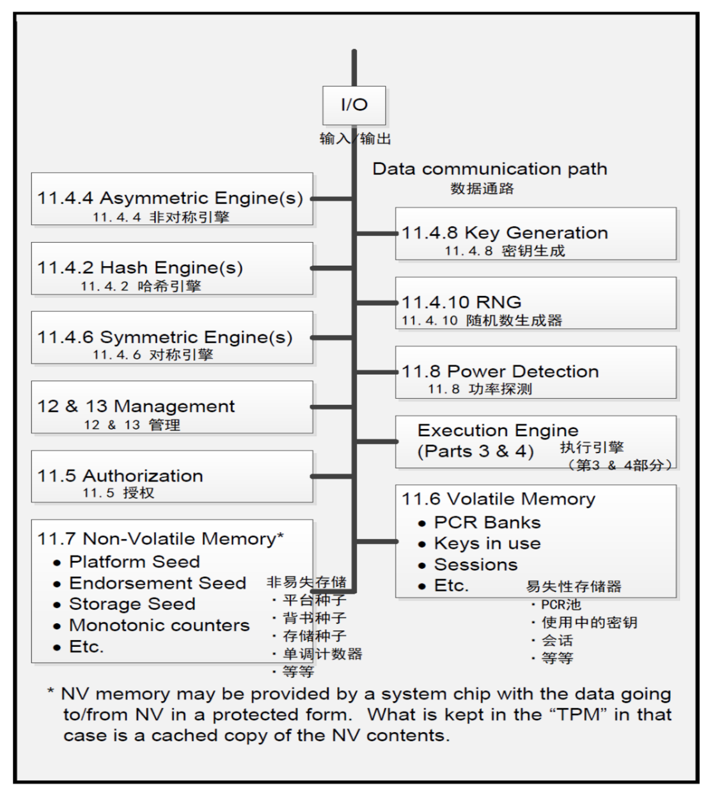

#### TPM命令处理流程图

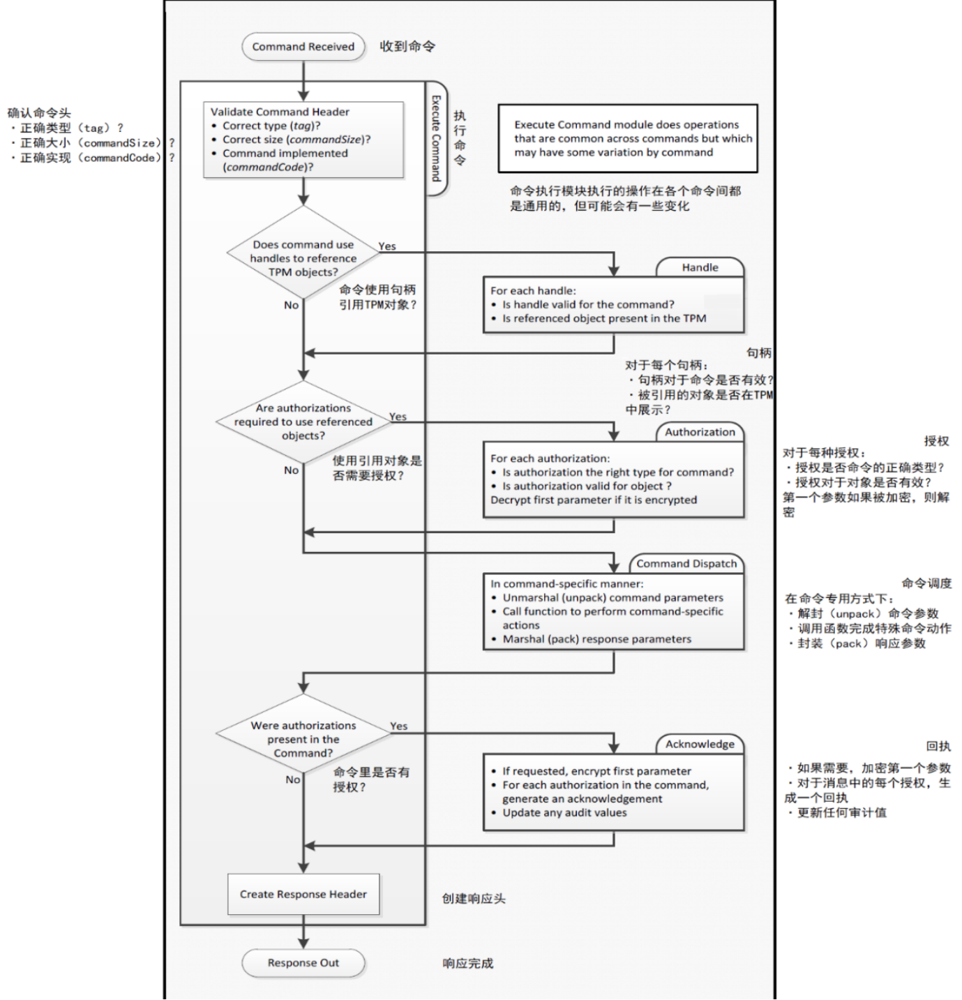

1. 该命令结构包括执行命令验证的标准头 然后，它确定该命令是否需要访问由句柄标识的任何屏蔽位置。如果是这样，它调用Handle模块来验证句柄是否引用了命令所需的正确类型的资源，以及该资源当前是否加载在TPM上。
2. 当控制返回到Execute Command时，它检查命令头中的标记参数，以确定是否提供了授权值。 如果是，则调用Authorizations来验证每个授权是否正确。授权与句柄值相关联，因此授权特定于特定实体。
3. 在验证授权之后，Execute Command调用Command Dispatch来解封剩余的命令参数 ，并验证是否存在所需类型的所需参数。对所有参数进行验证，以满足TPM 2.0 Part 2中定义的数据类型的要求，即使该参数随后将由于命令的可选行为而被丢弃。
4. 解封参数之后，Command Dispatch调用特定于命令的库函数来执行特定的命令。在特定于命令的操作中可能需要额外的参数检查。命令处理是结构化的，在TPM可以验证命令参数是否正确以及完成命令所需的资源是否可用之前，不会发生对TPM状态的更改。 只有这样，它才会对TPM状态进行不可逆的更改。 这种结构确保当TPM返回错误时，TPM将处于与命令操作修改任何屏蔽位置中的数据之前相同的状态。
5. 当命令执行完成后，Command Dispatch将响应参数封送到输出缓冲区中。如果命令有授权，则调用Acknowledge来为响应构造应答会话值。 如果命令遇到错误，响应包将包含一个具有错误特征的代码，并且在可能的情况下，指示错误是否与句柄、授权会话或命令参数相关联。 不存在额外的合格数据。 在大多数情况下，错误代码和参数位置值足以隔离问题。
6. 在构造响应(包括确认会话)之后，TPM向接口指示响应已经准备好返回。

#### I/O缓冲区

I/O缓冲区是TPM与主机系统之间的通信区域。系统将命令数据放在I/O缓冲区中，并从缓冲区中检索响应数据。不要求I/O缓冲区在物理上与系统的其他部分隔离，它可以是共享内存。但是，当开始处理命令时，必须确保TPM使用了正确的值。例如，如果TPM执行命令数据的散列作为授权处理的一部分，TPM需要保护已验证的命令数据不被修改。即在验证数据之前，需要保护数据不被修改。

#### 密码子系统

密码子系统实现TPM的密码功能，由命令解析模块、授权子系统或命令执行模块调用。TPM以常规方式使用常规密码操作，包括：
- 哈希功能
- 非对称加密和解密
- 非对称签名和签名验证
- 对称加解密
- 对称签名(HMAC和SMAC)和签名验证
- 密钥生成

#### SMAC算法

TPM可以实现SMAC (Symmetric Block Cipher Message Authentication Code)保证受保护的数据没有被修改，并且数据来自能够访问密钥值的实体。

#### 哈希功能

TPM使用哈希来提供完整性检查和身份验证，以及必要的单向函数(如KDF)。TCG可能会为hash和非对称算法创建不同安全强度的算法集。命令分发模块在验证某些类型的授权时将使用哈希函数。哈希函数还用于支持TPM中的其他操作，如PCR Extend。  
对于非对称密码来说，很难通过其密钥长度来计算算法强度。

#### HMAC算法

HMAC是对某些数据的一种对称签名形式。它保证受保护的数据没有被修改，并且数据来自能够访问密钥值的实体。命令分发模块可以使用HMAC功能对授权进行验证。命令执行模块可以使用HMAC功能来支持其操作。

#### 非对称运算

TPM使用非对称算法进行认证、识别和秘密共享。TPM可以支持任何由TCG分配标识符的非对称算法。非对称算法标识符将指示与该算法一起使用的一系列算法和方法。目前支持的非对称算法只有RSA和使用素数曲线的ECC。

#### 签名生成

对于非对称算法，签名的方法依赖于算法(RSA或ECC)。对于对称签名，定义了HMAC和SMAC签名方案。如果一个密钥可以用于签名，那么它将具有sign属性。带有签名属性的密钥还可能对可以用该密钥签名的消息内容进行限制。当密钥有此限制时，TPM将不使用该密钥对TPM没有计算的消息摘要进行签名。  
由TPM产生的任何验证消息都将有一个头(TPM_GENERATED_VALUE)，表明该摘要是由TPM生成的，并且可以安全地使用受限密钥进行签名。

#### 对称加密

TPM使用对称加密来加密一些命令参数(通常是身份验证信息)，并加密存储在它外面的Protected Objects。 密码反馈模式(CFB)是本规范所要求的唯一分组密码模式。可以使用TPM支持的任何对称分组密码进行参数加密。 然而，弱密钥是不允许使用的。 此外，TPM应该支持XOR混淆，这是一种基于哈希的流密码。 XOR混淆只能用于机密参数传递。注：XOR允许只一个应用程序使用一个与TPM相同的算法(哈希)进行机密和完整性保护的交互。  
当与非对称密钥配对时——就像在ECC解密密钥中一样——对称密钥需要具有与它配对的非对称密钥相同的安全强度位。  
当使用对称密钥进行数据加密时，被加密的数据具有HMAC。在数据解密之前会检查HMAC，以验证解密数据是否与对称密钥适当关联。

#### 密钥生成

可生成两种不同类型的密钥。第一个是普通的密钥，使用随机数生成器(RNG)生成计算。计算的结果是一个保存在屏蔽位置的密钥值。第二种类型是主密钥(Primary Key)，它来自于种子值，而不是直接来自RNG。RNG通常生成持久存储在TPM上的种子。从种子生成主密钥是基于使用批准的密钥派生函数(KDF)。该规格广泛使用SP800-108的KDF。该规范没有对允许生成密钥的时间设置上限。特定于平台的规范可能会限制生成各种密钥类型的时间。根据应用程序的不同，TPM可以通过以下输入生成一个密钥：
- 使用来自RNG的位（bits）
- 从另一个秘密值派生密钥

#### 密钥派生（Derivation）函数

TPM使用一个基于散列的函数来生成用于多种目的的密钥。该规范使用了两种不同的方案：一种用于ECDH，另一种用于KDF的所有其他用途。ECDH KDF来自SP800-56A。计数器模式KDF来自SP800-108，使用HMAC作为伪随机函数(PRF)。它在规范中称为KDFa()。除ECDH外，KDFa()用于所有需要KDF的情况。KDFa()使用SP800-108的Counter模式，HMAC作为PRF。

#### 随机数生成器（RNG）模块

RNG是TPM中的随机性来源。TPM在密钥生成和签名的随机性中使用随机值。RNG是一个没有访问控制的受保护功能。它名义上由以下几部分组成：一个熵源和收集器、状态寄存器、一个混合函数(通常是经过批准的哈希函数)。TPM应该至少有一个内部的熵源，可能更多。这些来源可能包括噪音、时钟变化、空气运动和其他类型的事件。熵源和熵收集器应该以一种对外部流程或其他TPM功能不可见的方式向状态寄存器提供熵。任何在TPM生成的随机数都是RNG模块提供的。

#### 授权子系统

命令分发模块在命令执行的开始和结束时调用授权子系统。在执行命令之前，授权子系统检查是否为使用每个屏蔽位置提供了适当的授权。一些命令访问屏蔽位置，不需要授权; 访问某些位置可能需要单因素授权; 和访问其他屏蔽位置可能需要使用任意复杂性的授权策略。授权子系统所需的唯一密码功能是哈希和HMAC。如果实现了TPM2_PolicySigned()，可能需要使用非对称算法。

#### 随机访问存储器（RAM）

PCR的内容可以修改或报告。修改PCR的两种方法是重置或扩展（Reset it or Extend it）。PCR报告可以通过简单的阅读、包含在认证中或包含在策略中来完成。虽然是在这一章中列出，但是PCR不必须在RAM中维护，它们可以保存在非易失性存储器中。 如果保存在非易失性存储器中，必须考虑在关键启动阶段(当记录许多测量值时)对TPM性能的可能影响。TPM可能支持TPM Resume，在整个TPM Resume序列中保留它们的状态，但在TPM Reset或TPM Restart时将其设置为默认初始值。

#### 会话存储（Session Store）

TPM使用会话来控制一系列操作。会话可以审核操作、为操作提供授权或加密命令中传递的参数。可以根据需要使用一个会话创建命令创建会话。 此时，会话被分配一个句柄。TPM可以被设计成用于会话的RAM与对象存储共享内存池。它也可以被设计成会话存储和对象存储是分离和专用的。

#### 非易失性（NV）存储器

NV存储模块存储与TPM相关的持久状态。 一些NV存储可供平台和TPM所有者授权的实体分配和使用。TPM NV内存包含“屏蔽位置”，“屏蔽位置”只能通过“受保护功能”访问。如果规范没有明确说明参数的存储位置，则根据供应商的偏好，该参数可以在RAM或NV中。TPM功能表明当命令引用持久对象时，TPM是否正在使用Transient Object资源。 如果是这样，TRM需要确保对这样引用的每个持久对象都有一个Transient Object插槽。

#### 电源检测模块

该模块结合平台电源状态管理TPM电源状态。所有定义了TPM到平台绑定的特定于平台的TCG规范都应该包括这样一个要求：将所有电源状态的更改通知TPM。TPM只支持ON和OFF两种电源状态。需要复位RTM的系统电源转移也会导致TPM复位(_TPM_Init)。任何导致TPM复位的系统电源转移也将导致RTM复位。

## 6. 可信软件栈

### 可信软件栈(Trusted Software Stack)编程开发

#### 可信软件栈结构
TSS是TCG的软件标准，TSS相当于一个微型的操作系统，管理着TPM，为上层应用提供可信服务。TSS包含几个可以移植的软件层，允许应用软件根据需要使用其不同的软件层。按照TSS规范编写的软件可以运行在任何实现TSS标准的可信系统上。  
TSS包含以下由高到低的几层软件：FAPI，ESAPI，SAPI，TCTI（TPM Command Transmission Interface），TAB（TPM Access Broker），RM（Resource Manager），和设备驱动。  

往下一层是ESAPI，它需要应用程序对TPM的内部构造有更深的了解，但是同时提供了会话管理以及加解密的辅助功能。这有点像使用C++开发应用程序。ESAPI的规范我们不做介绍。

ESAPI的下面一层是SAPI层，应用程序也可以直接基于SAPI这一层PM的所有功能。

TCTI层用于向TPM发送命令并接收TPM对命令的响应。应用可以直接通过TCTI发送命令的数据流并解析接收到的响应数据流。

TAB这一层主要负责多线程环境下TPM资源的同步。

因为TPM内部的存储资源非常有限，所以需要一个资源管理器RM，它的原理于虚拟内存管理类似，它可以将TPM对象和会话换进换出TPM。

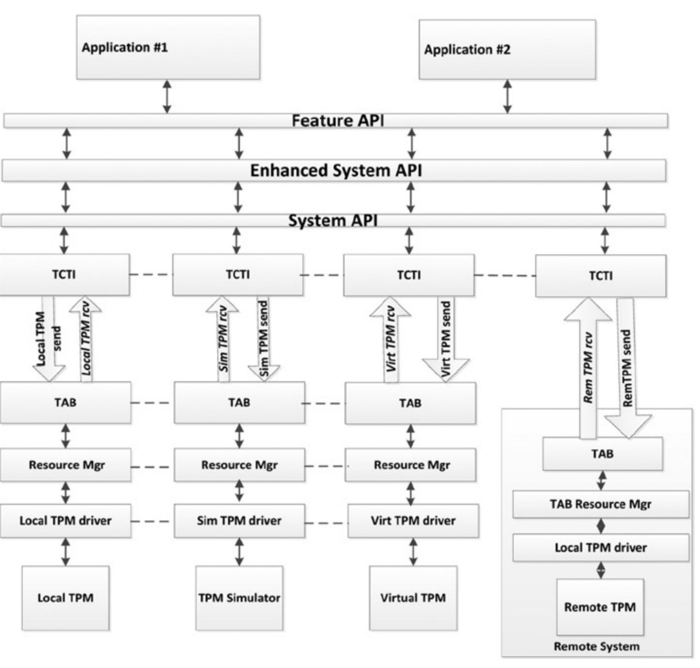

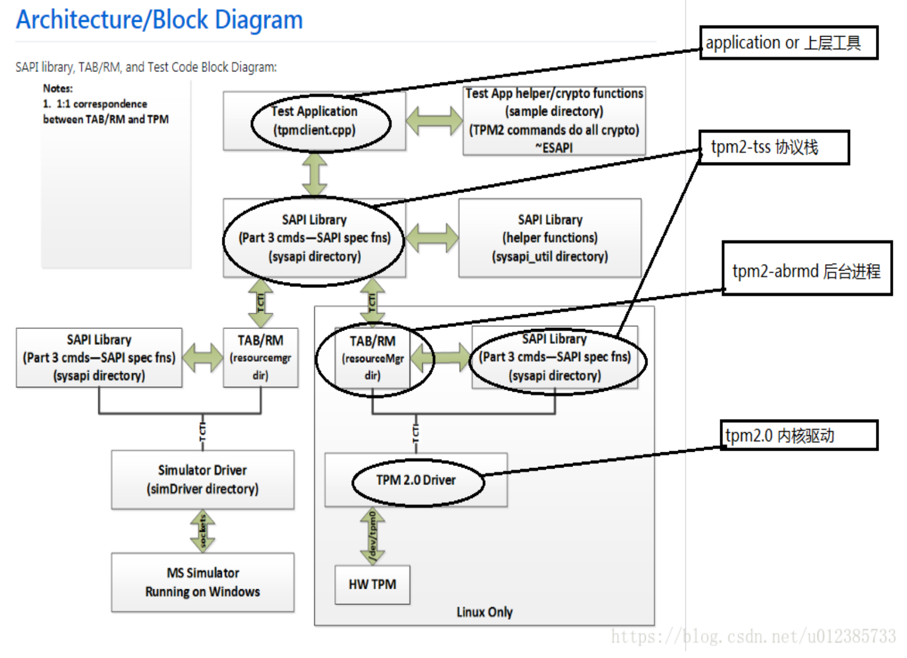

通常来说，SAPI以上的软件是线程相关的，SAPI以下的组件是与TPM硬件相关的。尽管TSS结构没有体现这一点，实际上TCTI可以作为RM和设备驱动的接口，这时候TCTI在软件栈中有多个层次的角色。到目前为止，TAB和RM最常见的实现方式是作为一个模块实现。

### 1、Feature API层
TSS的FAPI目标是让用户更容易地使用TPM2.0最常用的功能。因此，FAPI不能使用使用TPM的一些特殊功能。

#### 设定密码套件
P_RSA2048SHA1这个配置使用RSA2048位的非对称密钥来签名，签名过程遵循PKCS1v1.5规范。哈希算法使用SHA1，对称加密使用AES128的CFB模式。  
P_RSA2048SHA256这个配置同样使用RSA2048位非对称密钥类签名，签名过程遵循PKCSv1.5规范。哈希算法使用SHA256，对称加密使用AES128的CFB模式  
P_ECCP256这个配置的签名机制时ECDSA，密钥使用NIST ECC素数域256比特非对称密钥。

配置文件中的路径描述用于FAPI查找，密钥，Policies，NV，和其他的TPM对象和资源实体。路径的基本结构如下：  

#### TPM资源及实体的定位与命名
在使用TPM资源完成可信服务时，需要掌握TPM中资源的命名与定位方式。TPM中的资源与实体包含以下内容：密钥、策略、非易失性存储等。  
命名可以理解为给资源及实体起的名字。采用层次化的方式更容易管理大量的对象，存储组织架构（Storage Hierarchy）叫做H_S，背书组织架构（Endorsement Hierarchy）是H_E，平台组织架构（Platform Hierarchy）是H_P。一些常见对象：
- SNK：不可迁移密钥的系统父对象。
- SDK：可迁移密钥的系统父对象。
- UNK：不可迁移密钥的用户父对象。
- UDK：可迁移密钥的用户父对象。
- NV：用于NV的创建。
- Policy：用于Policy对象。

### 2、System API---SAPI层
SAPI实现了TPM2.0所有的功能。如果只将TPM作为可信启动服务安全模块，TPM-TSS只需要使用SAPI功能即可，不需要FAPI、EAPI。  
TPM SAPI协议栈部分，主要分为两层，一为上层开发者提供和封装统一的调用接口（SAPI），二为上层提供了访问底层硬件资源接口（核心层-含字节流命令组装&解析、会话管理等）。

#### SAPI的主要设计目标

- 提供所有TPM功能的访问接口
- 可以在尽可能多的平台上使用
- 在提供所有功能的前提下，尽可能让程序员的工作容易。
- 支持同步和异步调用。
- SAPI的实现本身不需要申请任何内存。同时SAPI的使用者要负责申请所有SAPI使用的内存。

SAPI架构图
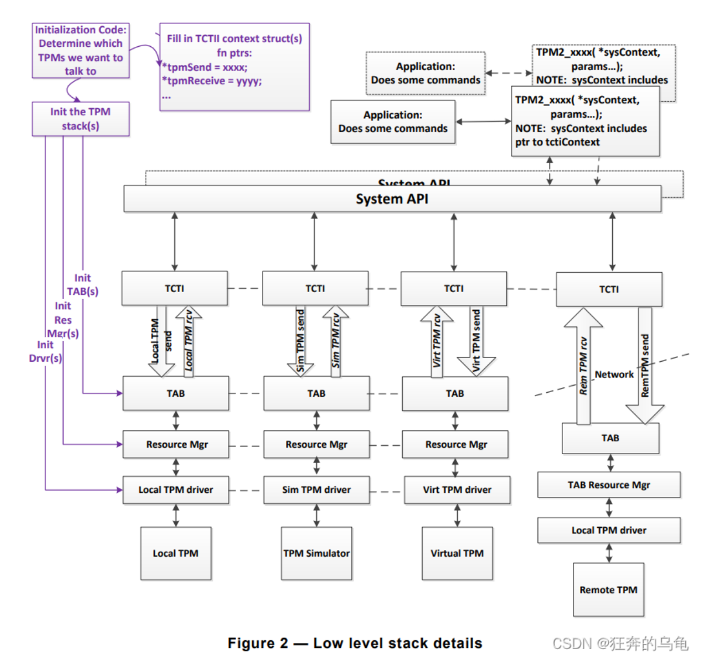

### 4、TPM访问代理（TPM Access Broker）
当一个进程在发送和接收数据时，其他的进程不能访问TPM。TAB的另外一个任务是阻止进程访问不属于他的TPM会话，对象，以及哈希和事件的序列。资源的所有权在使用对应的TCTI连接加载对象，开启会话，或者启动一个事件序列的时确定。  
在大多数的实现中，TAB和RM是集成到一起组成一个软件模块。这样做的主要原因是，对RM做一些简单修改就可以完成一个典型的TAB实现。

### 5、资源管理器RM
RM的角色和操作系统中的虚拟内存管理器类似。因为TPM通常有非常有限的片上内存资源，所以对象，会话，和操作序列等资源必须换入换出TPM来保证命令的执行。一个TPM命令最多可以使用三个资源实体handle和三个会话handle。所有这些handle都需要在TPM内部的内存中，这样TPM命令才能够执行。RM的工作就是解析TPM命令数据流，决定哪些资源需要加载到TPM中，加载资源之前还要换出一些TPM资源为加载留出足够空间，然后加载所需的TPM资源。对于TPM对象和操作序列来说，因为它们在加载到TPM知道可能包含多个handle，RM需要将这些handle虚拟化之后再返回给调用者。

RM和TAB通常组成一个软件组件，就是TAB/RM，并且一个TPM对应一个这样的软件组件；这是一个软件设计上的决定，但通常也是这样实现的。但是如果想要一个TAB/RM提供对多个TPM的访问功能，那么TAB/RM就需要跟踪所有的handle的信息，比如handle属于哪一个TPM，并且将它们分开管理。这种情况已经超出了TSS规范的范畴。所以不管是使用不同的可执行文件还是使用同一份代码中的不同列表来实现不同TPM的资源界限，这一层必须要实现不同TPM资源的清晰区分。

TAB和RM在大部分情况下对上层的软件栈来说是透明的，但是同时这两层是可选的。对于上层软件栈来说，不管是直接和TPM设备通信还是通过TAB/RM来发送和接收TPM命令数据，它们的操作都是一样的，这也就是“透明”的含义。但是，如果没有TAB/RM这一层，上层的软件必须在发送TPM命令之前，实现TAB/RM的操作，这样就能保证命令正确执行。通常情况下，应用程序会在多线程或者多进程环境中实现一个TAB/RM来隔离底层的信息。单线程或者高度嵌入式的应用通常不需要TAB/RM层。

### 6、设备驱动
设备驱动程序接收命令数据缓冲区及其大小，然后通过硬件操作来向TPM设备发送数据。当收到上层软件的请求之后，设备驱动会发送数据并阻塞直到命令响应数据准备好，然后返回到上层软件。

用于和TPM通信的物理层和逻辑层接口的设备驱动不在TPM2.0规范的范畴内，而在平台相关的规范中定义。目前为止，在PC上可选的TPM接口是FIFO和CRB(Command Response Buffer)。FIFO是先进先出字节传输接口，它使用固定的地址来发送和接收数据，同时还附带一些用于握手和状态操作的地址。FIFO接口可以使用SPI或者LPC总线。

## 7. TPM密码资源管理（一）

### 密码资源的管理
TSS作为一个控制TPM密码资源的微型操作系统，它需要对各种密码资源进行命名、定位、控制和调度，经过多年的演化，形成了一系列可信计算中独特的概念：实体（Entity）、命名（Name）、组织架构（Hierarchy）、索引（Index）、授权（Authorization）、会话（Session）、上下文（Context）。这些概念本质上都是从安全和效率的角度出发，对密码资源进行管理的数据结构。

### TPM资源实体（Entity）
一个TPM资源实体是在TPM内部可以通过句柄（handle）直接引用的内容。实体是对TPM中出现的各种抽象概念的一个概括。常见的资源实体类型包括：  
永久实体：组织架构，字典攻击锁定机制，和PCR；  
非易失性实体：NVRAM索引；  
对象：密钥和数据；  
易变的实体：会话。TPM中的会话指为完成一次对资源的授权访问所需要的全部中介的总称。

### 永久实体
永久实体指其句柄由TPM规范直接定义，系统初始化后就一直存在，而且不能被创建，也不能被删除，相当于TPM嵌入式密码模块初始化后自带的重要部件。在TPM1.2中，PCR及其所有者是唯一的永久实体；根存储密钥（SRK）有固定的handle，但是它不是永久实体。在TPM2.0中，有更多的永久实体类型：三个固定的组织架构，一个临时组织架构，字典攻击锁定复位，保留的句柄，明文口令授权会话，和平台组织架构的NV开关等。

#### 永久实体-固定组织架构
固定的组织架构。TPM2.0有三个固定的组织架构（平台、存储、背书），每一个架构都通过固定的handle来访问。  
只有获得授权后才能访问固定的组织架构，每个组织架构有自己的访问策略。组织架构的授权值和访问策略可以改变，但是不论怎样引用一个组织架构，都是指向的同一个TPM资源实体。  
固定的组织架构永远不能被删除，但是它们可以被自己的管理员或者平台管理员关闭。这三种组织架构可以包含相关的密钥链和数据，清除组织架构就能清除其中的密钥和数据。

#### 永久实体-临时组织架构

临时组织架构本身也是永久存在的，它不能被删除。和固定组织架构不同的是，它在TPM的每个加电周期里会被自动清除。

#### 永久实体-字典攻击锁定复位机制
字典攻击锁定机制是一个不包含密钥和对象的组织架构。当字典攻击触发锁定时，这个机制用于复位。它还可以用于清除TPM_RM_OWNER组织架构。  
示例：TPM可以被配置成输入口令失败5次之后用户将被锁定24小时。锁定期间所有受到字典攻击保护的资源都不能被授权。

#### 永久实体-平台配置寄存器（PCR）
TPM拥有大量的PCR，可以通过索引来访问。PCR可能和一个或多种哈希算法相关。PCR也拥有授权值和策略。根据这些授权值和策略，可以改写PCR中存储的值。  
读取PCR的值不需要任何授权。PC客户端平台规定至少要有24个PCR。但是强制规定需要有一个PCR库（bank），**PCR库指的是拥有相同哈希算法的一组PCR**。  
PCR是永久实体，所以不存在删除和创建PCR的命令，只能改变PCR的值和属性。

#### 永久实体-口令授权会话
TPM有一个会话也是永久性的，它就是口令授权会话，其句柄为TPM_RS_PW（0x40000009），用户可以使用这个句柄对明文口令的访问进行授权。

### 平台NV访问开关
当清除开关位后，对所有平台组织架构下的NV索引的访问都将被拒绝。  
通常情况下，NV索引可以隶属于平台组织架构，也可以隶属于存储组织架构。
- 存储组织架构自己就可以控制NV索引的开关，并不需要设置额外的开关来控制。  
- 在平台组织架构中需要设置独立的NV索引访问开关。平台组织架构常包含了如密钥、数据和NV索引等多项内容。

### NV索引
NVRAM就是TPM内部的非易失性存储空间。而NV索引则是访问这些空间的地址。用户可以对这些非易失性存储空间进行配置以便进行相关数据的存储。当配置完成后，这个空间就具备一个索引和一组属性，用户可以设置索引和属性的取值。  
因为NVRAM索引具有更多的属性，TPM规范没有把它视为一种对象。读写NVRAM可以被单独控制。它们可以被配置成类似PCR，计数器或者位域。同时也可以配置成只能写一次的实体。  
NVRAM索引同时具有授权值和授权策略。NV索引的拥有者可以改变授权值，但是不能改变授权策略，授权策略一旦被创建就不能再修改。如果NVRAM与某个平台组织架构绑定，那么当平台组织架构被清除时相关的NVRAM索引也将被删除。

### 对象
一个TPM对象就是指密钥或者和加密相关的数据。对象有一个公共的部分，并且“可能”还有一个私密的部分，比如一个非对称密钥对的私钥，一个对称密钥，或者是加密的数据。所有的对象都隶属于一个组织架构。TPM对象也都有相关的授权数据和授权策略。与NV索引相同的一点是，一个对象的访问策略一旦被创建后就不能再修改。  
当创建TPM对象时，用户可以决定在使用这个对象的命令中，哪一些命令可以通过授权数据来使用，哪一些只能使用策略。但是需要特别提醒的是：对于有些命令来说，不管密钥创建的时候配置什么样的属性，它们都只能通过策略进行访问授权。跟NVRAM索引相似，所有的TPM对象都隶属于以下组织架构中的一种：平台，存储，背书，或者NULL。当一个组织架构被清除时，它所有的对象也都将被删除。

### 非持续的实体
非持续的实体会在TPM一个上电周期内清除。这种非持续的实体同样也被分类：  
1、用于授权的会话，比如HMAC和策略会话。它们用于TPM实体的授权，命令和命令响应参数加密，和命令审计。  
2、哈希和HMAC事件序列实体。在完成对大数据块加密的时候，可能需要建立大量中间缓冲区。

### 持续性的实体
一个持续性的实体就是一个组织架构的所有者要求TPM在上电周期之间保留在TPM中的对象。它与永久实体的不同之处是相关组织架构的拥有者可以清除持续性实体。

### 实体的名称

#### 实体名称的作用
为安全起见，TPM规范的制定者决定给每一个TPM实体赋予一个全局唯一的名字，比如当使用某个实体的进行HMAC授权计算时，就可以把实体的名称传给HMAC计算命令。  
有了实体名称后，在使用TPM命令进行HMAC授权时，会对TPM命令参数进行哈希，然后还会在计算中隐式地加上句柄相关的实体名称，即使命令参数中不包含实体的名称也是如此。在这种情况下，攻击者只能修改实体的句柄，但是不能修改实体的名称，因为修改会导致HMAC授权失败。

名称是一个TPM实体唯一的身份标示。对于永久性的实体来说（如PCR和组织架构），句柄就可以作为它们的名称。但是对于其他的实体（如NV索引和加载的对象）来说，名称实际上是各自的公开数据的哈希值。

- 安全使用实体  
- 防止攻击者读取秘密信息  
- 方便TPM密钥的安全管理  
- 防止攻击者通过handle替换密钥  

### 总结  
TPM中的实体就是可以通过handle引用的TPM资源。永久实体在TPM的规范中具有固定的handle值，不但其handle不能被修改，而且自身也不能被删除或者重新创建。持续性实体可以通过用户选定的handle删除或者创建，它们能够在TPM上电周期之间保持，而非持续性实体则在TPM上电周期中被清除。对象是隶属于某一个组织架构下得实体，它们可能有一个私有区域，它们可以是易变的也可以被设置成持续性的。当对象被设置成可持续性时，它们就称作持续性实体。
一个实体的名称是实体唯一个身份标识。因为资源管理器在将实体换入换出TPM时，实体的handle会发生变化，所以为了安全考虑，实体的授权使用名称而非handle。

## 8. TPM密码资源管理（二）

### 组织架构（hierarchy）
组织架构由一组相关的实体构成，它们被当作一个组来管理。这些实体包括永久对象（组织架构的handle），树根节点密钥等。NV索引隶属于一个组织架构，但是不在树型组织中。除了其中的永久性实体，其他实体可以作为一个组被整体删除。  
一个组织架构的密码学根节点是一个密钥种子，这个密钥种子是在TPM内部生成的一个很大的随机数，并且不会暴露在TPM安全边界之外。
每一个组织架构都有一个相关的校验值（proof value），这个校验值可以独立生成或者由种子派生。TPM使用校验值来确保一个向TPM提供的值是之前由TPM产生的。   
一个组织架构可以是持续性的或者易失的。

### 三种持续性组织架构
TPM1.2只有一个组织架构，它代表所有者授权和根存储密钥。  
1.2版本的规范中只允许有一个SRK，它一直是一个存储密钥，并且是这个唯一组织架构的根节点。  
SRK是TPM在内部随机产生的，它一旦被擦除后就不能被重新产生。  
SRK也不能被换出TPM之外。子密钥可以被创建并使用SRK加密，这些SRK的子密钥可以用于加密它们自己的子密钥。

TPM2.0对持续性组织架构进行了扩充，以支持以下应用场景：
- 将TPM用作一个密码协处理器。
- 开关TPM的部分功能。
- 隔离隐私敏感和隐私不敏感的应用。

这三种组织架构有如下的共同特性：
- 每一个组织架构都有一个授权值和策略 。
- 每一个组织架构都有一个开关标志。
- 每一个组织架构都有一个用于派生密钥和数据对象的种子。
- 每一个组织架构都有可以包含子密钥的主要密钥。

### 平台组织架构
平台组织架构是TPM2.0中的新概念。在TPM1.2中，平台固件不能确保TPM已经打开，开发者不能借助TPM来完成一些安全相关的任务。

#### 平台组织架构应用：UEFI安全启动
当开启UEFI的安全启动特性时，平台固件需要验证一个RSA数字签名来验证软件的真实性。平台OEM会事先在TPM NV索引中存储一个公钥或者是一个可信公钥的哈希值列表。这个NV索引被设置成只有平台OEM可以更新它的内容。在启动过程中，平台固件会使用这个可信的公钥来验证签名。
TPM在这个应用中提供了安全的公钥存储空间和RSA算法。

平台组织架构在三个可持续性组织架构中的独有特性是，它在平台启动时就可以使用了，授权值被设置成空，让平台固件生成一个自己的授权值（policy可选）。与其他组织架构要求用户输入授权值不同的是，平台授权值是平台固件自己设置的。因此不需要将授权值存储到一个地方，代码本身就是授权值。  
因为平台组织架构有它自己的使能开关标志，所以平台固件可以决定何时使能和失能这个组织架构。这样以来就可以满足平台固件和操作系统的独特使用需求。  
存储组织架构被设计用于平台的所有者：企业IT组织或者个人终端用户。这个存储组织架构与TPM1.2中的是相同的。它有一个所有者policy和授权值，这两者是持续性的。这样设计的原因是它们被设置之后很少发生变化。
平台所有者可以关闭这个组织架构，并且不影响平台组织架构。即使平台所有者关闭了这个组织架构，平台固件仍可以照常使用TPM。但在TPM1.2中只有一个组织架构，关闭它就等于关掉整个TPM。与之类似的是，这个组织架构可以在不影响其他组织架构的情况下被清除（修改种子，删除持续性对象），存储组织架构主要用于非隐私相关的操作。

### 背书组织架构
背书组织架构是一个隐私树，用户在处理与隐私相关的任务时应该使用它。TPM和平台厂商可以认证这个组织架构下的主密钥是否受控于一个真实平台上的真实TPM设备。在TPM1.2中，一个主密钥可以是一个加密密钥，并且证书可以通过TPM2_ActivateCredential创建，TPM2.0有与之相同的身份激活命令。与TPM1.2不同的是，一个主密钥也可以当作一个签名密钥。创建和认证签名密钥是隐私相关的操作，因为它允许和一个独立唯一的TPM中的密钥相关。因为背书组织架构的目的是用于隐私相关的操作，它的使能开关位，policy，授权值也是独立于其他的组织架构的。它们受控于隐私管理员，当然这个管理员也有可能是终端用户。一个终端用户可以关闭背书组织架构，同时不影响TPM应用使用存储组织架构，平台软件也可以继续使用TPM。

### 隐私
TPM中的隐私保护是指远程组织或个人不能把收到的TPM数字签名信息同具体的TPM关联起来。为保护用户隐私，用户可以在不同的应用使用不同的签名密钥签名，攻击者很难把这多个签名同用户的身份关联起来。

隐私敏感主要应用于完全拥有并控制平台的家庭终端用户。在公司中，IT部门可能完全控制计算机，所以TPM的隐私保护特性显得没有那么重要。我们讨论的大部分情况是和远程（非法）关联相关，不涉及攻击者可以物理接触平台的情况。

### 确定平台的真实身份
关联操作的要求是判定签名密钥来自一个唯一的、真实的TPM。  
TPM厂商可以生成一个背书原始种子，还会用这个种子产生一个或多个主密钥，同时还生成主密钥的证书。证书用于厂商证明密钥来自一个真实的TPM设备。平台的厂商也可能生成一个类似的证书。其他密钥则通过这个认证过的主密钥来认证。

### 激活证书
TPM并不强制使用某一个证书格式，但是应该使用类似于X.509证书格式，证书包含证书提供者和密钥属性相关的信息，但是TCG的这个认证的过程有以下多个目标：
- 证书提供者可以确信它认证密钥的属性。
- TPM密钥证书的接收者不能确定多个密钥来自同一个TPM。
- 理论上证书授权机构有可能做非法关联，但是通常情况下我们认为这个私有的CA是可信的，不会这样做。在TPM1.2中，一个可以被激活的密钥被限制为一定是不可以迁移的身份认证密钥，并且只能用于对TPM产生的数据签名，而且一定是SRK的子密钥。TPM2.0规范在满足前面提到的两个设计目标的基础上，删除了这些限制。TPM2.0密钥的名称是密钥公共数据的摘要。名称完全可以做为密钥的身份。摘要包括公钥和密钥的属性。

### 主密钥可以是一个签名密钥
如果一个主密钥是一个签名密钥，并且直接用于认证其他签名密钥，前面提到的关联操作就很简单，因为所有的签名都聚合到了一个证书上。是这种情况可能会导致隐私的泄露。所以，背书组织架构下的主密钥通常是一个加密密钥而不是签名密钥。

### 主密钥是一个加密密钥
如果主密钥是一个加密密钥，那生成子密钥证书过程就相对比较复杂，这个过程叫做证书激活。此时，证书授权中心又被称作隐私保护CA，我们认为它是受信任的，相信它不会泄露任何跟它所认证密钥相关的信息。

### 证书激活
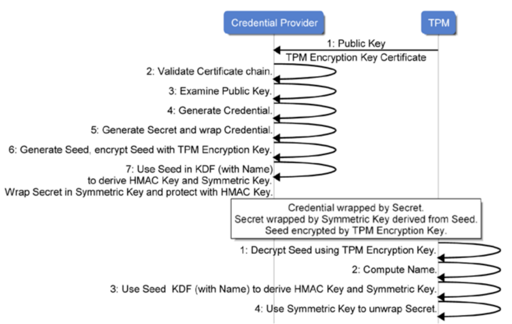

### 证书提供者生成证书
1. 证书提供者首先接收一个公钥和公钥的证书作为一个加密密钥。这个加密密钥通常来说是背书组织架构下的主密钥，这个主密钥的证书通常由TPM或者平台厂商颁发。
2. 证书提供者回溯主密钥证书直到它的根证书。通常情况下，证书提供者会验证这个加密密钥的确与一个已知兼容的硬件TPM绑定。
3. 证书提供者检查公钥并决定是否要颁发证书，以及所颁发的证书中应该写什么内容。在一个典型的应用案例中，证书提供者会颁发一个固定在TPM中的限制性密钥。
4. 证书申请者可能会试图修改公钥的属性。这种攻击是不可能成功的。
5. 证书提供者为密钥生成一个证书。

### 证书提供者安全发送证书
6. 证书提供者生成一个秘密信息用于保护证书。通常情况下这个秘密信息是一个对称加密密钥，但是也可以是一个可用于生成加密或者完整性密钥的秘密信息。TCG并没有强制规定这个秘密信息的格式。
7. 证书提供者为KDF生成一个种子。如果第一步的加密密钥是RSA密钥，那种子就是一个简单的随机数，因为RSA密钥可以直接用于加密和解密。如果密钥是基于椭圆曲线的密钥，需要使用一个更加复杂的Diffie-Hellman协议。
8. 证书提供者使用TPM提供的公钥加密种子，只有TPM可以解密这个种子。
9. 种子用于TCG指定的KDF生成一个对称加密密钥和HMAC密钥。对称加密密钥用于加密第6步的秘密信息，HMAC密钥用于提供秘密信息的完整性。隐秘但是很重要的一点是，KDF也会使用第1步中加密密钥的名称。
10. 加密过的秘密消息和它的完整性校验值将以证书数据块的方式发送到TPM中。同时，加密过的种子也将被发送。

### TPM收到的信息
- 用秘密消息保护的证书。
- 一个用密钥加密过的秘密消息，该密钥是由种子和加密密钥的名称生成的。
- 一个用TPM的加密密钥加密过的种子。

### TPM解密证书
1. TPM解密种子，并且保证种子保留在TPM中。
2. TPM计算加密密钥的名称。
3. TPM使用和之前相同的TCG KDF，并结合名称和种子生成对称加密密钥和HMAC密钥。
4. 上述生成的两个密钥用于验证秘密信息的完整性，然后解密。
5. 此时如果攻击者修改了公钥属性就会被检测到。因为如果攻击者向证书颁发机构提供了不同于TPM的密钥，相应的名称就会不同，因此对称密钥和HMAC密钥就会不同，这一步也就会失败。
6. TPM返回秘密消息。

- 在TPM之外，用户可以使用这个秘密信息按照协商好的方法解密证书。最简单的情况是把秘密消息当作一个对称解密密钥直接解密证书。
- 以上的协议使证书提供者相信只有满足以下条件时才能恢复证书：
- TPM拥有与加密密钥证书相对应的私钥。
- TPM的密钥与提供给证书颁发机构的密钥是同一个密钥。
- 隐私管理员应该控制背书密钥的使用，不管是作为签名密钥还是用于上述的激活证书的协议中。这样也就有效控制了它与其他TPM密钥的关联。

### TPM隐私保护的设计要点
- 平台拥有者控制着背书组织架构。平台的拥有者通常不能修改背书的种子，因为一旦修改种子，现有的TPM证书将失效，并且没有办法恢复。
- 用户可以使用模板中的随机数在背书组织架构生成其他的主密钥。用户通过以下方法彻底删除密钥：将密钥换出TPM，然后删除外部的副本并清除掉随机数。
- 当密钥用于签名（认证）一些数据时，认证命令响应数据中将包含一些隐私敏感的数据如：resetCount（TPM已经复位的次数），restartCount（TPM重启或者恢复的次数），以及固件版本。尽管这些值不直接映射到TPM，但是它们可以帮助攻击者实现非法关联。

### 空组织架构
与三个持续性的组织架构相对应的是易变组织架构，叫做空组织架构。空组织架构也可以拥有主密钥，并由主密钥派生子密钥。它的几个不同的属性如下：  
- 授权值是空口令，policy是永远不能满足的空值。并且它们不能被改变。
- 不能被关闭。
- 有一个可以生成密钥和数据对象的种子。这个种子不是持续性的，它会在每次重启后由不同的值重新生成。

### 空组织架构下的基本密码运算
可以采用前面讲述的各个组织架构完成密码运算，但是最适合的还是空组织架构，因为它总是可用的，授权值总是零长度的口令。  
在空组织架构下，TPM可以用作一个秘密协处理器。此时，TPM主要使用外部生成的密钥或者不需要秘密信息的算法进行密码运算。作为密码协处理器的主要功能包括随机数生成器，摘要和HMAC算法，对称和非对称加密操作。  
适合使用TPM进行密码运算的场景：
- 资源受限的环境，如处于启动阶段的软件。
- 在一个低性能的应用程序中，使用TPM实现密码运算可能更容易一些。
- 应用程序可能认为硬件优于软件。
- 应用程序可能要求一个经过认证的实现，而TPM被设定为通过认证的。

#### RSA基本操作
TPM2_RSA_Decrypt是一个私钥操作。TPM在返回明文之前会验证授权信息，验证填充并去掉填充信息。  
TPM2_RSA_Encrypt是一个公钥操作。必须制定一个消息和公钥，但是因为是公钥操作，所以不需要授权。TPM在加密操作之前会对明文做填充。

#### CRTM签名验证
一个平台可能实现了CRTM更新机制。这个机制要求更新签名，因为一旦攻破CRTM之后整个平台就会不安全。但是通常情况下CRTM的代码和数据空间都有限。因此CRTM很愿意使用TPM来做签名验证。  
CRTM会使用一个可以直接加载到TPM的硬编码公钥数据块。密钥的填充机制为空。CRTM可以使用TPM2_RSA_Encrypt命令使用公钥来验证签名，填充机制设置为空。最终，CRTM只需要把命令的结果和更新的摘要做一些简单的对比就完成验证工作。

#### 对称密钥基本操作
使用TPM2_EncryptDecrypt命令可以实现对称加密解密操作。这个函数只能处理较小的数据块，这同样也是因为TPM的输入缓冲区大小有限。但是，这个API包含一个初始化向量输入，同时输出一个可以链接的值，所以大的数据块可被分成多次进行处理。  
对于HMAC密钥来说，一个限制性的密钥有固定的模式。但是调用者可以指定对于非限制性的密钥的模式。  
相关密钥必须是一个对称密码对象。它必须是经过授权的，并且所有的授权方式都是可用的。  
对称密钥加密是一个敏感的话题。尽管TPM的运算速度不快，但是它由硬件保护的密钥远远比软件中的密钥安全。所以这个功能也有可能导致TPM受到进口管制，还可能引起相关政府机构的关注。正因为如此，PC客户端平台将这个命令列为了可选命令。

#### 总结  
TPM有三个持续性的组织架构和一个空组织架构。平台组织架构被平台OEM使用，表现为启动初期的代码。即使用户关闭了其他的组织架构，平台OEM仍然可以依赖这个组织架构完成一些功能。存储组织架构受控于用户，它应用于隐私不敏感的场景。背书组织架构应用于隐私相关的操作。隐私相关的证书激活操作通常在背书组织架构下完成。空组织架构是易变的。会话，上下文，和序列对象都会使用这种组织架构。同时，在这个空组织架构下也可以创建一个完整的密钥树，它们在重新上电后会被清除。除去TPM的安全存储特性，它还可以用作一个秘密协处理器。它主要是使用TPM外部生成的密钥或者不需要秘密信息的算法做密码学操作。作为密码协处理器的主要功能包括随机数生成器，摘要和HMAC算法，对称和非对称加密操作。

### 密钥
TPM的一个最强大的功能就是：应用程序可以把密钥安全地保存在硬件设备中。TPM可以生成密钥，也可以导入在外部生成的密钥，它支持对称和非对称密钥，因为TPM设备的存储资源有限，应用程序经常需要安全地将密钥换入换出TPM，这时TPM可以被认为是一个密钥缓存。  
密钥可以被看作TPM中的一种实体，也可以看作是被专门定义的TPM对象。它通常作为组织架构中的核心组成部分出现，很多时候我们也可以称上次课讲到的三种组织架构为密钥**组织架构。  
包含密钥的组织架构在访问时会遇到相应的安全控制方式：包括口令、增强的授权策略、密钥复制限制和密钥用途限制。

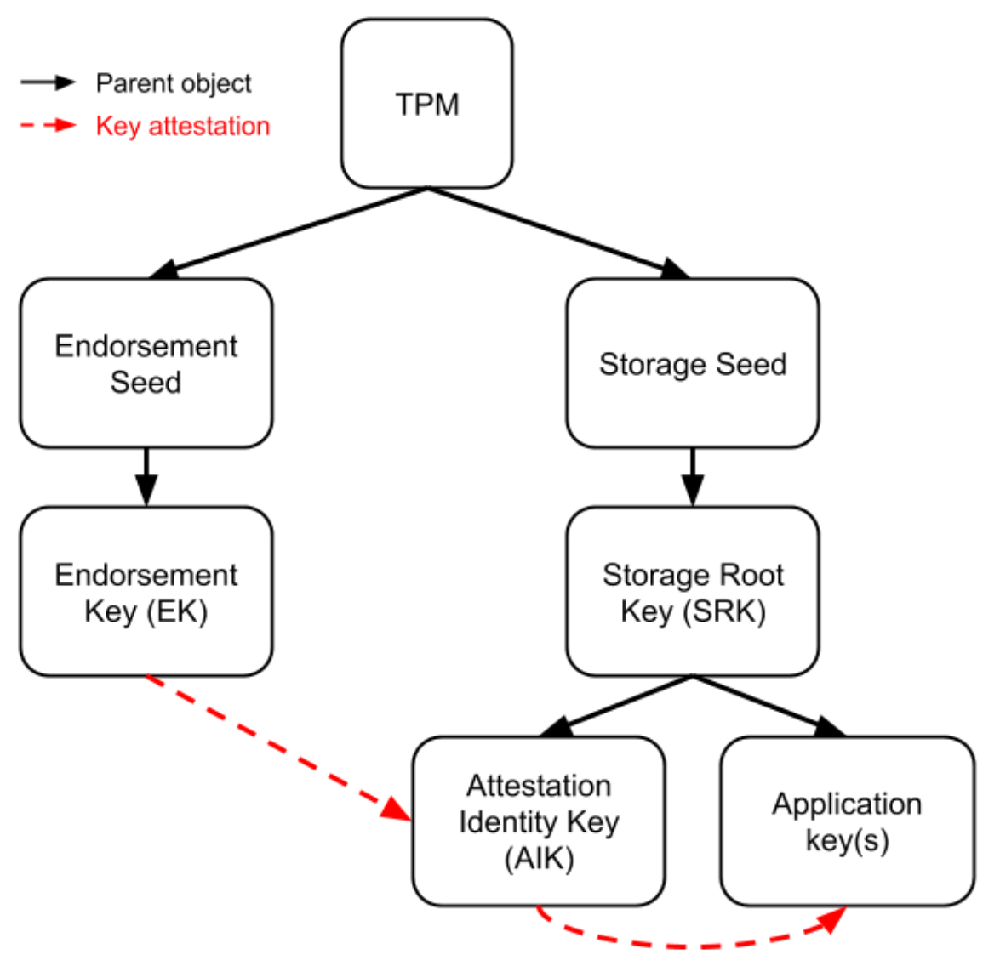

#### 密钥生成器
TPM最强大的能力是：它能产生密钥并将相关的秘密信息安全地保存在硬件中。密钥生成器基于TPM自己的随机数发生器，它不依赖任何外部的随机源。因此它消除了由较弱的软件随机数生成器或者不充足的熵值带来的弱点。  
为了保护对称密钥，TPM内部会形成一个天然的层次化组织架构，这也是TPM可信计算中组织架构名称的由来。在组织架构中，存在一个顶层父密钥，即主密钥，它们没有父节点。

#### 主密钥和种子
主密钥的创建命令使用易于理解的命名方式TPM2_CreatePrimary。TPM1.2中有一个和TPM2.0主密钥相同的密钥：根存储密钥（SRK），这个密钥会一直存在于TPM中。TPM2.0利用主种子控制主密钥的生成，它允许有无限多个主密钥，虽然这些主密钥并不一定一直存在于TPM中。这并不是因为TPM的永久性存储空间有限，而是因为只要控制了种子，就可以重新生成主密钥。  
TPM1.2在只有一个密钥的情况仍然可以工作的原因有两个。首先，它只有一个密钥算法和一个密钥大小用于加密密钥，那就是RSA-2048。然而TPM2.0中支持多种密钥算法和多种密钥大小。其次，TPM1.2只有一个密钥组织架构：存储组织架构。TPM2.0有三种组织架构，每一种都至少有一个根节点。  
TPM利用主密钥种子实现有限的非易失性存储空间支持数量无限的主密钥。  
三个组织架构的每一个都和一个主密钥种子关联，分别是：背书主密钥种子，平台主密钥种子，和存储主密钥种子。这些种子一直存在于TPM设备中。它们就是密钥生成函数输入的秘密信息。当TPM创建一个主密钥时，它使用主密钥种子和一个公共模板来生成密钥。密钥模板包含了所有的密钥配置信息：密码算法和密钥长度，密钥的policy，密钥的类型（签名，加密等等）。调用者还可以在模板中添加自己的独有数据。该独特数据在模板的公钥区域中添加。

#### 密钥的句柄与名称
TPM授权参数中并不包含密钥句柄，授权使用的是名称。原因来自于密钥缓存和密钥换入换出操作。一个平台可能有大量的应用软件相关的密钥存储在磁盘上，它们可能通过用户的句柄来识别。但是这样会导致句柄的数量远远超过TPM密钥槽的数量。当管理系统重新加载一个密钥后，它可能会得到一个不同的handle，这个handle可能是和TPM密钥槽的空闲状态相关的，而不是用户初始的handle。因此，中间件必须替换用户handle。如果授权数据中包含了handle信息，那中间件替换handle将会导致授权失败。
TPM2.0通过将名称添加到授权数据中来解决这个问题，名称就是密钥公钥部分的摘要值。TPM管理系统可以修改密钥的handle，但是不能改变密钥的名称。

#### 密钥授权访问控制
TPM对密钥做了硬件保护，相对于软件生成的密钥，在安全性上有很大的提高，但是它仍然在此基础上提供更加强大的密钥访问控制功能。一个软件生成的密钥经常通过使用口令做访问控制来保护密钥。比如说，一个密钥可能会用口令来加密。这种保护的强度与口令本身的强度一样，所以这个密钥很容遭受线下的暴力攻击。

#### 密钥访问控制
TPM针对软件生成的密钥做了两方面的改进。  
当密钥离开TPM时，它会被一个强度很高的父密钥加密。此时攻击者需要破解一个强度很高的密钥而不是一个口令。  
当密钥被加载到TPM中时，它还会受到字典攻击防护逻辑的保护。每一次攻击者尝试授权密钥失败时，这个行为就会被记录下来。当失败的次数达到一定预置值时，TPM就会阻止密钥授权，并保持一段事先配置好的时间。这将很可能大大降低攻击者实施攻击的频率。这种频率限制机制可以保证即使破解一个很弱的口令也要耗费比破解软件密钥长得多的时间，因为软件的密钥没有尝试频率限制。

#### 密钥销毁
TPM有三种持续性的组织架构（背书，存储，平台）和一个易失性的组织架构（空组织架构）。每一个架构都有它独有的主密钥种子。把主密钥种子擦除后，就可以阻止在相应的组织架构下重新创建主密钥，当然这是一个影响重大并且很少做的操作。擦除主密钥可以阻止所有它的子密钥被加载到TPM中。

#### 密钥组织架构
所有的父密钥都是存储密钥，用于加密它们的子密钥。当子密钥被存储到TPM安全的硬件边界之外时，父密钥能够提供保密性和完整性。这些存储密钥的用途因此受到限制，他们不能用于通用的数据解密操作，这样会泄漏子密钥的私密信息。  
在组织架构最顶端的父密钥就是主密钥。子密钥可以是存储密钥，可以有自己的子密钥。子密钥也可以是非存储密钥，这种情况下它们只能是叶子密钥，不能拥有自己的子密钥结点。

#### 密钥类型及其属性
每一个密钥在创建时都会设置自己的属性。密钥属性包括以下部分：
- 密钥用途，比如签名或者加密。
- 密钥类型，对称或者非对称，以及相关的算法。
- 和密钥复制相关的限制。
- 和密钥用途相关的限制。

#### 密钥复制属性
密钥复制是指将一个密钥从一个组织架构下拷贝到另外一个地方（组织架构）。主密钥不能被复制，它们对于一个TPM的一个组织架构来说是固定的。    
TPM1.2有一个密钥迁移。TPM2.0将这个名字修改成了复制。  
TPM2.0的密钥有两个控制复制的属性。在极端情况下，一个密钥可以被锁定到一个TPM的一个父密钥下，永远不能被复制。相反的极端情况是，一个密钥可以随意地被复制到相同或者不同TPM的另外一个父密钥下。

控制密钥复制属性的定义如下：  
`* fixedTPM`：如果这个属性被设置，这个密钥就不能被复制了。  
`* fixedParent`：如果这个属性被设置，这个密钥就不能被复制到不同的父密钥下。这相当于密钥被锁定到一个父密钥下。

#### 密钥复制属性组合

| `fixedTPM` | `fixedParent` | 解释                                                                                               |
| ---------- | ------------- | -------------------------------------------------------------------------------------------------- |
| T          | F             | TPM不允许这个配置组合存在                                                                          |
| T          | T             | 表示这个密钥不能以显式或隐式的方式被复制                                                           |
| F          | T             | 表示一个密钥不能显式地被复制。但是如果它的父密钥被复制了，这个密钥会被隐式地被复制                 |
| F          | F             | 表示一个密钥可以以复制组或者复制根的方式被复制。如果它是一个父密钥，那它的子密钥也将跟它一起被复制 |

#### 受限制的密钥
受限制的签名密钥：受限制的签名密钥主要用于对TPM的认证数据结构签名。这些结构包括PCR引用，一个正在被认证的TPM对象，一个针对TPM时间的签名，或者是针对一个审计摘要的签名。签名主要作用于摘要上，但是签名验证者想要确保这个摘要不是由外部的伪造数据计算而来，然后发送给TPM来签名。限制性的密钥可以保证这是针对一个由TPM自己产生的摘要产生的签名。  
受限制的解密密钥实际上是一个存储密钥。这种密钥只用于解密特定格式的数据，包括用于验证一个数据结构的完整性校验值。只有这样的密钥才可以作为父密钥去创建和加载子密钥对象，或者是去激活一个证书。这些操作为解密的结果增加了一些限制。    
一个不受限制的密钥可以用于通用的解密操作，给它提供相关的加密数据它就会返回解密后的结果（作为一个加解密模块来用）。如果这个密钥可以被用于隐藏数据，它不需要检查unseal授权就可以返回被隐藏的（sealed）数据。

#### 上下文管理和加载
加载密钥需要向TPM提供一个加密过的密钥和一个已经加载的父密钥。TPM使用父密钥解密子密钥并将解密后的密钥存储在易失性的密钥槽中。  
上下文管理包含将一个已经加载的密钥的上下文保存到TPM之外，然后将保存的上下文加载到TPM中。当一个密钥被保存时，它会被一个由组织架构秘密信息派生的对称密钥加密，这个对称密钥叫做组织架构证据。当密钥被加载时，TPM使用这个对称密钥来解密。

#### 空组织架构
空组织架构也有它自己独有的种子，组织架构也可以拥有主密钥和子密钥。但是，这个组织架构下的密钥在TPM重启时会被删除。

## 9. TPM密码资源管理（三）NV索引与PCR

### TPM非易失性存储
TPM内部拥有一定数量的非易失性存储空间，可以用于存储可信平台自身的系统数据。可以分为以下两种类型的数据：
- TPM架构定义的数据结构。
- 用户或者平台相关的规范定义的非结构性数据。
       
### 非易失性存储索引
TPM通过NV索引访问存储在非易失性存储中的数据。  
TPM通过文件系统能够对文件的访问设置索引的属性和状态来控制对指向区域数据的访问能力。  
TPM可以基于多种方式实施对NV索引的访问控制，如HMAC，PCR，locality，和物理存在（physical presence）等多种形式的访问控制，还可提供索引的读写锁定机制。

### NV索引的访问控制
未被初始化的索引不能访问，在常用的TPM访问控制策略中不能使用具有这种状态的索引。索引可以有授权值或者policy

### NV索引数据类型
TPM1.2版本只支持非结构化数据，TPM2.0增加了另外三种基本类型，一共有四种基本类型的索引：

#### 一、普通索引
一个NV普通索引用于存储任意长度的非结构化数据。与计数器，位字段以及扩展索引不同的是，普通NV索引**对所写入的数据类型没有限制**。

#### 二、NV计数器索引
NV计数器索引是一个只能增加的64位数值。在对一个NV计数值执行增加命令之前，这个计数值会被初始化为这个TPM上曾经出现过的最大NV计数值。这个值既包括当前存在的计数值也包括过去曾经定义的但是现在已经删除的计数值。这样一个计数器的计数值就永远不会被回滚，即使是被删除后重新创建也不行。

#### NV位字段索引
一个NV位字段包含64位，默认情况下全部初始化为0，但是也可以选择设置为1。位字段的某一位只能被写1而不能清0。

#### NV扩展索引
扩展索引是由特定的哈希算法定义的，并且有固定的索引生命期。索引对应NV区域的大小与哈希算法的输出相对应。NV区域会被初始化为全0。对这个NV区域的写操作是一个扩展操作，与PCR的操作类似。  
扩展索引最可能的应用案例就是与混合索引结合来创建灵活的PCR，后面的“混合索引”将会介绍。另外一个应用案例就是安全审计记录，因为扩展的操作可以创建一个无法篡改的密码保护历史记录。  
扩展索引本质上是一种哈希链。

#### 混合索引
NV索引元数据（索引句柄，大小、属性、策略和口令）都是非易失性的，而混合索引数据是在易失性存储器中创建的。除了混合计数器（后面会介绍），索引数据只有在关闭TPM时才会被写到NV区域中。四种索引类型（普通，计数器，位字段，或者扩展）都可以成为混合索引。  
当上层应用程序希望频繁写操作时，非易失性存储技术往往是带来存储介质的损耗，TPM可以通过拒绝频繁写操作保护自己。而易失性存储器不存在耗损问题，因此可以根据需要编写混合索引。  
混合索引主要强调索引数据存储在易失性存储中。

##### NV索引访问控制
每个NV索引还有一个独特的控制功能，这个控制与其他TPM对象如密钥的控制不同。每一个索引的读写控制都可以被独立配置，控制可以是索引的policy，口令授权，或者是所有者的口令和授权。  
TPM还支持一组读写锁定机制。一个索引可以被读或者写锁定，直到TPM重启。一个索引也可以作为一组索引中的一员被一次性地锁定（全局锁定），同样是直到TPM重启后才能解锁。  
许多TPM实体都受到字典攻击保护机制的保护。一个NV索引也可以受到这样的保护，还可以通过配置索引的属性取消这种保护。

##### NV写操作
每一个NV索引在创建的时候都有一个隐含的属性：未被写过。在TPM1.2中，一个索引被创建时数据被初始化为全0。但从读取的数值来看并不能区分全零数据和未被写过的数据。在TPM2.0中，没有写过数据是一个独立的状态。一个policy可以制定索引必须或者必须没有被写过。

##### NV索引的句柄值
当用户创建一个NV索引时，会为索引分配一个索引值。在TPM1.2中，这个值中的某些位有特殊的性质，比如说D位用于锁定。在TPM2.0软件规范中，NV索引值除了有一个整体上的范围之外没有对具体的位域定义特殊含义。TPM不会通过索引值来定义索引的属性。但是，一些平台相关的规范或者全局的TCG注册处可以制定特殊的索引值。  

##### NV名称
TPM实体的名称决定了实体的唯一性，并可用于授权。对于NV索引来说，它的名称就是它公共区域的哈希，公共区域包含索引值（句柄），属性（包含是否已经被写过），策略和大小。  
`TPM2_PolicyNV`允许在策略中使用NV索引值。该策略可以以索引上的一系列逻辑运算和算术运算为基础。如果该策略仅仅基于NV索引的值，它将提供很低的安全性：攻击者可能会删除这个索引，并将其替换为其它访问控制策略。基于这个原因，TPM2_PolicyNV会使用索引的名称。

#### NV索引总结
TPM2.0有四种类型的NV索引：普通（非结构化的数据），位域，计数器，和扩展数据索引。可以使用标准的TPM口令或者策略控制来读取或写入索引。混合索引通常情况下只存在于易失性内存中，但是正常的TPM关闭时可以将其中的数据存储到非易失性内存中。当一个索引被创建后，它具有一个没有被写过的状态。如果没有被写过，NV数据就不能被读取或者用于policy中，“未被写过”这个状态本身可以在策略中使用。  
给TPM设备初始配置证书或者公钥是NV索引的基本应用。高级一点的应用是将NV授权信息应用于一个策略中，然后让多个TPM实体共享这个策略。一个使用位字段索引或者计数器索引的策略可被用于撤销密钥访问权限。一个扩展的索引提供与PCR相同的特性，它可以支持不同的算法，支持授权，并且具有相同的生命周期特性。  
NV索引有独立的几组命令和属性用于控制授权，读写锁定，以及字典攻击保护。

### PCR
平台配置寄存器是TPM必需的特性之一。它们最初的应用是用于提供一种密码学的方式记录（测量）软件的状态：包括平台上运行的软件和软件使用的配置数据。PCR的更新方法叫做扩展，扩展是一种单向的哈希操作，从而保证测量值不被篡改。可以通过读取这些PCR的值报告相关软件的状态。此外，这些PCR的值可以被签名然后用于更加安全的报告，这被称作认证（或者说引用）。PCR还可以被用于扩展的授权policy从而限制其他TPM对象的使用。  
TPM从来不对测量的结果做任何判定。单单根据TPM内部的信息来看，并不能确定测量结果的好坏，或者结果是否安全可信。在测量软件时，TPM仅仅用PCR来记录测量值。至于是否安全，这要到应用程序真正使用PCR用于policy授权的时候，或者是远程请求者请求一个签名认证（quote，引用）然后判定可信性。  
TPM2.0新增加的关于PCR的特性是，TPM不再将PCR的哈希算法固定为SHA-1。哈希算法现在可以修改了。有一些TPM的实现包含bank的概念，每一个bank实现一种不同的算法。

一个TPM会实现一定数量的PCR：比如说，PC上使用的TPM实现了24个。这些PCR按照惯例被分配给各种各样的软件层使用，软件类型从早期启动代码到操作系统和应用。这些PCR的分配还可以分为以下两类：需要运行的软件（通常是偶数序号的PCR），和用于定制启动过程的配置文件（通常是奇数序号的PCR）。

#### 平台配置寄存器PCR
PCR最初的应用场景是用于表示平台软件的状态，重要软件运行到当前阶段时的历史信息（包括配置信息）。TPM上电时会初始化所有的PCR，初始值由TPM平台相关的规范定义，通常是全0或者全1。命令调用者不能直接向PCR写值。相反，PCR值的更新是通过被称为“扩展”的操作来完成的，这是一种链接式的哈希运算。  
TPM将会把需要加进来的数据连接到旧的PCR值中。要被扩展到PCR中的数据几乎总是哈希值，尽管TPM并没有限制一定是哈希值。然后TPM会对这个刚刚连接好的值做哈希，然后将新的哈希值存储到PCR中。  
系统重启以后，整个平台的运行由CRTM（Core Root of Trust Measurement）开始。CRTM会测量接下来将要运行的软件并将测量值扩展到一个偶数索引的PCR中。然后CRTM还会将软件的配置信息扩展到一个奇数索引的PCR中。这个被测量的软件，可能是BIOS，反过来又会测量和扩展它的下一级软件，这或许是MBR。这个测量链就这样继续下去直到测量完成早期的系统内核代码。在这个过程中，重要的安全配置文件也会被测量。  
最终测量的结果就是PCR的值，它代表了所有扩展到PCR中的测量历史。因为安全摘要机制的单向属性，这些值是无法篡改的。

#### PCR的数量
在实际应用中，一个TPM设备会有多个PCR。PC客户端平台要求TPM实现最少24个PCR，这也是PC平台实际具有的数量。自动化设备的TPM可能会有更多PCR。平台相关的TPM规范会指定PCR的属性，平台相关的软件规范规定各个PCR用于测量哪些软件。  
平台相关的规范可能会给用户软件分配几个PCR。还有一个PCR[16]，叫做调试PCR，用于软件测试。可以不在TPM重新上电的情况下复位。

#### PCR主要应用---授权
PCR的一个常用功能是授权。  
一个TPM实体可以设置一个如下的policy：只有当特定的PCR的值是一个特定值时才允许使用这个TPM实体。这个policy可以选择一组PCR，每个PCR制定不同的值。如果PCR的值与设定的值不同，policy就不会满足，因此相关的TPM实体就不能被访问。

#### 根据平台状态密封密钥
密封（sealing）操作让密钥不仅可以被一个口令保护，还可以被一个策略保护。一个典型的策略会将密钥锁定在密封操作时的一个PCR值上（代表了软件的状态）。这个方案还假设系统启动的状态没有变化。任何事先植入的恶意软件都将在启动过程中被测量到PCR中，密钥会在不安全的状态下继续处于密封状态。  
一个有较低可信度的公司可能会有一个自己的磁盘镜像，它可以将密钥密封到代表这个镜像状态的PCR中（可以理解为镜像启动以后PCR的值）。这些PCR的值可以在更安全的平台上事先被计算好。  
一个更加复杂的方案是公司使用TPM2_PolicyAuthorize命令，并提供用于授权一组可信PCR值的凭据（Tickets）。  
尽管普通口令也可以保护密钥，但是即使没有TPM密钥口令，这种TPM的保护也可以增加系统的安全性。攻击者可以在不提供TPM口令的情况下启动该平台，但是没有用户名和登录密码他是无法登录的。  
OS的安全特性可以用于保护数据。但是攻击者可以启动另外一个OS，比如通过DVD或者USB设备而不是硬盘启动，这样就可以越过OS登录的安全保护。  
在使用TPM的情况下，这种不同的启动配置（不从硬盘启动）和不同的OS软件将会改变PCR的值。这些被改变过的PCR值不能和之前正确的PCR值匹配，所以TPM不会释放解密磁盘的密钥，进而硬盘上的数据文件也就不会被解密。

#### PCR用于认证 
TPM认证功能为软件状态提供基于密码学的证据。认证的过程就是一个TPM引用证实（Quote）操作：将一组PCR的值做哈希，然后使用TPM密钥对哈希进行签名。如果远程一方可以验证这个用于签名的密钥确实来自一个真实的TPM，那就可以确认平台报告的PCR摘要没有被篡改过。在这个过程中，仅仅验证签名和签名密钥的证书是不够的。远程的一方接下来还要验证PCR的摘要值是否能与报告的PCR匹配。   
远程软件通过一个TPM签名过的哈希值了解了平台的软件状态。现在它需要决定这个软件的状态是否是安全的。这时候它需要将测量的哈希值与一个白名单比较，这就潜在地需要和第三方软件提商合作。PCR仅仅提供一种可信的用于表示平台软件状态的方法。但是它们本身并不会做关于软件是否安全的判定。

#### 引用（Quote）应用 

“引用”作为TPM提供的一个安全特性，可以和其他安全手段结合起来，实现更加完善和安全的网络访问。

#### PCR引用详解
引用的数据结构魔数--`TPM_GENERATED`：这可以阻止攻击者使用限制性的签名密钥对任意数据进行签名，然后声称这是一个TPM引用操作。  
- 签名密钥的标识名称：尽管密钥的强度可能很大，但是却可能由算法较弱的父密钥保护。标识名称代表密钥的整个父辈密钥。  
- 由调用者提供的数据：该数据通常是抗重放攻击的随机数。这个随机数证明了该引用是最新的。  
- TPM固件版本：包含在结构体中，以便验证者可以决定是否信任特定的TPM代码版本。  
- TPM时钟状态：`resetCount`对于下一个应用案例很重要。当使用背书组织架构之外的密钥签名时，时钟信息会被混淆的。基于隐私保护的考虑，时钟信息被非背书组织架构下的密钥签名时，需要做混淆处理。因为认证申请者只需要知道`resetCount`是否已经改变，而不需要读具体的值。

#### PCR属性
大部分的PCR都按照惯例分配给不同的特定软件来使用，但是也有一少部分是留给应用软件使用的。  
PCR的`Reset`属性用于表示PCR的值是否可以通过`TPM2_PCR_Reset`命令复位。通常来说复位值是全0。大多数的PCR是不能被复位的，因为允许复位将可能导致恶意软件将PCR复位成一个已知的正常状态。有一些PCR只能在特定的位置下被复位。  
PCR的`Extend`属性用于表示一个PCR是否可以通过`TPM2_PCR_Extend`或者`TPM2_PCR_Event`命令来扩展它的值。很显然，如果一个PCR不能被扩展，那这个PCR就是没有任何用处的，只是有一些PCR只能在某些特定的Locality下被扩展。  
通过DRTM来复位PCR的属性。它表明一个PCR是否可以通过直接向TPM的接口写数据来扩展它的值，而不是通过正常的TPM命令格式。这个属性既是平台相关的，又和具体的TPM硬件接口相关。这个属性通常在不同的Locality下有不同的设置。  
当系统重启后使用CLEAR参数执行`TPM2_Startup`命令时，所有的PCR会被复位。大多数的PCR值会被复位成0，但是有一些是不同的值，比如说全1或者与执行startup命令时的Locality有关系。  
`No Increment`属性是与`TPM2_PolicyPCR`绑定的。将一个Policy与PCR进行绑定是一个立即断言。  
执行`TPM2_PolicyPCR`命令时，PCR当前的值会被增加到Policy会话的摘要中。但是，一个PCR在这个立即断言（PolicyPCR命令）之后有可能被改变，“正常”情况下，这样就会导致这个policy会话无效。“无效”是通过一个用于记录PCR值变化的计数器来实现的。Policy会话会记录执行`TPM2_PolicyPCR`命令时的计数值，然后在使用这个policy会话时检查它。如果计数值不相等，TPM就知道PCR的值已经改变了，Policy会话就会失败。  
如果`No Increment`设置为真时，具有此属性的PCR改变时，不会增加计数值，因此不会使正在使用的策略会话无效。

#### PCR算法
促成TPM2.0的第一个需求就是去掉TPM1.2中固定的SHA-1哈希算法。TPM2.0通过`TPM2_PCR_Allocate`命令理论上为PCR提供了许多算法相关的可能性。  
这里的关键词是“理论上”。PCR可以按照bank来分配，每一个bank对应一种哈希算法。这个命令允许PCR按照任意组合来分配，一个PCR可以被分配到多个bank中，并且可以有多种哈希算法。如果是具有多种算法，除去PCR索引和摘要值以外，`TPM2_Extend`命令还要提供哈希算法参数。如果输入的算法与PCR配置的所有算法都不匹配，这个命令将会被忽略。

### 总结
PCR有两个最基本的应用。通过一个签名的认证引用可以把PCR的值传递出去。据此可以判断平台的软件状态是否可信。PCR还可以用于策略，基于PCR的值来授权其他TPM对象的使用。相对于TPM1.2，PCR的算法被固定成SHA-1，TPM2.0做了改进，允许使用其他的哈希算法。

## 10. TPM授权与会话

### 一、授权与会话
**授权**用于控制对TPM实体的访问，类似于操作系统中的访问控制机制，为TPM提供了安全保障。  
**会话**是TPM完成授权的载体和工具，有点类似于运行一个认证协议。通过设置会话的各种属性和状态来完成各种授权。当然，会话也可以单独完成自己的任务，不用于授权。

#### 1.4 三种会话对比
|                  | 口令                             | HMAC                                                                      | 策略                                                                                                       |
| ---------------- | -------------------------------- | ------------------------------------------------------------------------- | ---------------------------------------------------------------------------------------------------------- |
| 状态或其它信息   | 在后续使用之间不保持状态         | 在会话生命周期中保持状态                                                  | 1、在会话生命周期中保持状态  2、建立在HMAC之上                                                             |
| 安全性           | 口令是明文形式，攻击者很容易获得 | 1、远比口令会话要安全（尤其是在远程访问TPM时）  2、使用随机数对抗重放攻击 | 1、通过允许复杂的命令序列以及对内外部状态的授权来提高安全性  2、如果使用了HMAC，则会使用随机数对抗重放攻击 |
| 启动方式         | 无                               | `TPM2_StartAuthSession`                                                   | `TPM2_StartAuthSession`                                                                                    |
| 单命令会话修饰符 | 无                               | 解密、加密、审计                                                          | 解密、加密                                                                                                 |

#### 1.5 授权角色
TPM2.0规范的第3部分对每一个命令都指定了授权角色。授权角色的规则与计算机操作系统中的访问控制列表的工作方式类似。  
一共有三种可能的授权角色：USER，ADMIN，和DUP。
- USER用于TPM实体的正常使用。  
- ADMIN用于系统管理相关的任务。  
- DUP，一个不常用的角色，主要用在TPM2_Duplicate命令中。

#### 1.6 TPM命令中的授权域
授权域指定了会话和授权的位置和类型。对于所有需要授权的命令来说，授权区域都会被放置在句柄区域之后以及参数区域之前。命令响应的授权区域被放置在响应的末尾，紧随响应参数之后。  
对于任意可以使用授权的命令来说，授权区域最多可以有三个授权结构。对于一个成功执行的TPM2.0命令来说，命令响应的授权结构的数量总是与命令的授权数量相同。对于一个执行失败的TPM2.0命令来说，命令响应的授权数据结构的数量总是0。  
如果一个命令的authHandle前面用@符号修饰：这就意味着authHandle对应的实体的授权数据需要加入到这个命令的授权区域中。而`Auth role:USER`表示这个命令需要授权角色。

授权与会话关系
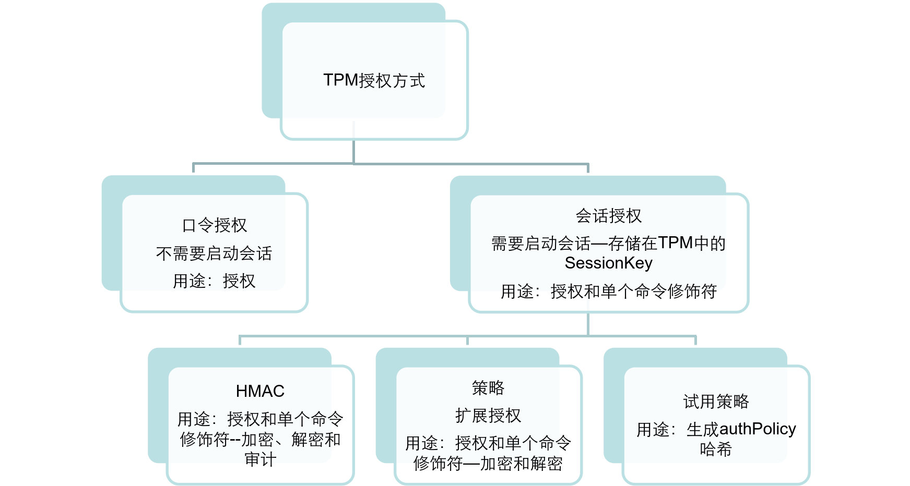

会话变体（HMAC和策略会话变体，应用于会话的整个生命周期）  
变体：未绑定/未加盐、绑定、加盐、加盐/绑定

#### 1.7 口令授权
口令授权生命周期：创建一个使用口令作为授权的实体，然后使用口令对实体相关的动作授权。创建和使用口令授权所需要步骤如下：

1. 创建一个使用口令授权的实体，或者修改已有实体的口令值。这个步骤对每一个实体来说只做一次。
2. 使用口令授权实体相关的动作。这一步骤可以执行多次，并且一旦给实体设定好授权口令后随时都有可能发生。

#### 1.8 会话变体
##### 加盐 vs. 不加盐  
HMAC和Policy会话都可以是加盐或者不加盐。一个加盐的会话会给会话密钥的创建过程增加更多熵值。如果authValue的强度很弱，给一个会话加盐有助于防止线下的暴力破解。

##### 绑定和非绑定
HMAC和Policy会话都可以是绑定或非绑定的。一个绑定会话通常是用于针对“bind”实体授权多次动作。绑定特性的优势在于可以简化操作，如果需要对同一个实体进行多次授权操作，那么可以采用绑定的方式，这样只需要提供一次授权值，后面的都可以重复使用。  
绑定会话还可以用于针对其他实体的授权，从这个角度来讲，“bind”实体的authValue为会话密钥增加熵值，从而得到更强命令和命令响应参数加解密。bind实体和将要被授权的实体的授权值都会被加入到HMAC的计算中。  
一个非绑定会话可以用于授权针对许多不同实体的动作。一个Policy会话通常会被配置成一个非绑定会话。相对于Policy会话提供的安全性来说，HMAC值就没有那么重要了，并且使用Policy会话时不用计算和插入HMAC值将会让授权变得容易很多。  
不加盐会话：当bind实体的authValue值确实是足够强到可以生成强度很高的会话密钥和加解密密钥时。如果系统管理员可以强制控制口令的强度时，使用一个unsalted未加盐的会话应该就足够了。  
加盐会话：当authValue被认为强度不足以生成安全的会话密钥和加解密密钥时。一个网站可能会向用户请求两种不同的口令：一个是用于加密密钥使用授权，另外一个用于加盐操作。只要使用从密码学上来说足够强的盐值，这两个口令的结合的强度比使用其中一个要强得多。

#### 1.9 HMAC和Policy会话的区别
HMAC和Policy会话的主要不同体现在动作授权的方式上。对于使用HMAC会话发送的命令来说，只有当和命令一起被发送到TPM的HMAC值正确时命令才会成功。为了生成一个正确的HMAC值，命令调用者和TPM之间需要共享一个秘密信息（authValue）。换句话说，计算正确的HMAC值需要知道会话密钥和实体的authValue，这样才能有效地授权实体执行动作。如果不知道会话密钥或者实体的authValue，就不能计算正确的HMAC值，进而导致命令失败。

Policy会话的授权基于一个正确的policy命令序列，在许多情况下还有这些命令成功执行所要求的条件。这仅仅是对这个丰富而又复杂的授权方式的简单描述。
在将要授权的命令执行以前需要有一个Policy命令执行序列。TPM通过检查policyDigest值来确认这个命令执行序列。每一个Policy命令都会将Policy相关的数据的哈希扩展到会话的policyDigest中。最简单的情况就是，将当前会话的policyDigest与被授权实体的policyDigest比较，比较的结果用于决定是否授权相应的命令。

总结下来就是，HAMC授权比口令授权更安全，Policy授权是最丰富也是最复杂的授权。HMAC授权使用事先完全计算好的HMAC值作为证明调用者知道授权秘密信息的方式。Policy授权需要一组Policy命令以及其所需要的一组特定条件来授权一个动作。对于HMAC和Policy授权来说，HMAC值可以用于保证命令和命令响应的完整性。

#### 1.10 HMAC授权
创建基于HMAC授权的实体包括以下几个步骤：
1. 创建一个使用授权值的实体，或者修改已有实体的授权值。对于每一个实体来说，这个步骤通常仅仅执行一次。
2. 创建一个HMAC会话。
3. 使用HMAC会话执行基于这个实体的操作。这个操作可以在步骤1和2完成之后的任意时间执行，并且可以执行多次。一个HMAC会话可以用于授权多个动作。

##### 1.10.1修改或者创建一个使用HMAC授权的实体
为了创建一个实体，选择authValue的方法与之前描述的口令授权方式相同。修改已有实体的授权值也是如此。 在这两种操作中，authValue是被同等对待的。

##### 1.10.2 创建一个HMAC会话
一个HMAC会话是通过将TPM2_StartAuthSession命令的sessionType参数设置成TPM_SE_HAMC来创建的。当HMAC会话启动以后，TPM会根据我们之前的描述创建一个会话密钥。会话密钥是在TPM内部创建的。TPM2_StartAuthSession命令返回之后，调用者会重新创建会话密钥，创建这个密钥会使用bind实体的authValue，salt（盐值），以及通过TPM2_StartAuthSession发送到TPM的参数nonceCaller，还有TPM返回的nonceTPM。

##### 1.10.3 使用HMAC会话对单命令授权

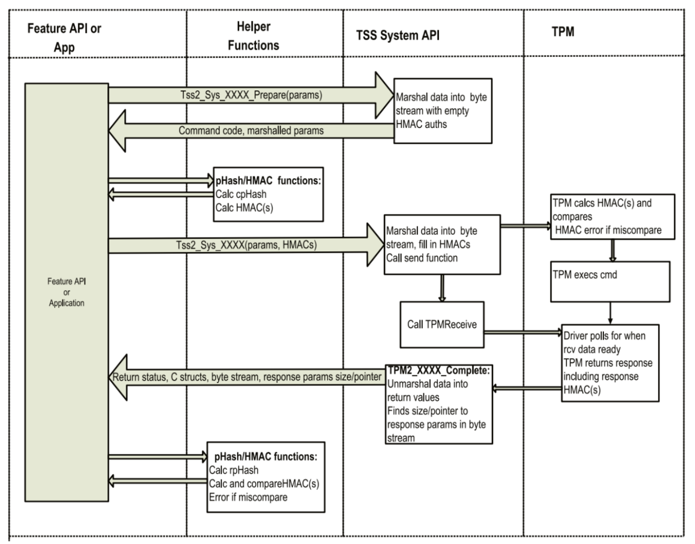

##### 1.10.4 HMAC会话安全
本质上来讲，TPM使用HMAC会话的三个方面来保证命令的安全性：  
会话密钥：与会话密钥绑定的authValue和salt应该是只有调用者和TPM设备知道的秘密信息。这两个值都是用于计算会话密钥的。不知道这些值的攻击者就不能计算出会话密钥。因为会话密钥用于创建HMAC密钥，这个特点阻止了中间人攻击。  
HMAC：会话密钥和实体的authValue用于生成HMAC密钥。将要被授权的实体的authValue应该只能被调用者和TPM知道。因此，这同样又意味着攻击者不能执行中间人攻击。  
Nonces：nonces用于阻止重放攻击。HMAC计算会包含nonce值，如果nonce值不正确的话就没办法计算出正确的HMAC值。又因为nonce值是一直在变化的，所以一次命令的字节流是不能被重复执行的。

只要合理地维护绑定实体的authValue，salt，以及被授权实体的authValue，攻击者就不能对这个实体进行授权，然后一直变化的nonce值又可以阻止重放攻击。

## 11. TPM扩展授权与密钥管理

### (**扩展授权**)又称策略授权
策略授权：如果一个用户想限制一个实体只能在某些特定情况下才能被使用，所有针对这个实体使用的限制的总和就叫做一个策略。
##### 策略授权类型
- 简单断言
- 基于命令的断言
- 多因素授权
- 多用户组合授权
- 可修改的灵活策略

### 策略授权与口令授权
所有TPM的实体都可以通过两种基本的方式授权。第一个是基于实体创建时期关联的口令，另外一种是实体创建时与该实体相关联的策略。  
一些由TPM系统自身创建的实体具有默认的访问口令和策略（如各种基本的组织架构、字典攻击重置句柄）。这样的实体拥有固定的名称，其自身并不依赖于附带的策略，同时这些策略是可以改变的。  
很多实体（如NV索引和密钥）的名称是根据它们创建时分配的策略计算哈希得到的，所以访问这些实体的口令可以更改，但是其访问策略不能更改，修改后这个实体的真实性无法通过验证。  
任何可以使用口令直接完成的事情也可以通过策略来完成，但是反之则不然，某些事情（如密钥复制）只能通过策略完成授权。  
策略授权更加灵活，可以对策略进行精细的调整。既可以将策略设置为永远不能满足的NULL策略，也可以通过策略为单独的命令或适用于一个实体的不同用户提供不同的认证方式。

### 策略授权的优点
- 允许多种变化的授权（口令，生物信息等等）。
- 允许多因素授权方式（多于一种的授权类型）。
- 允许在不使用TPM的情况下创建策略。策略本身不包含任何秘密信息，所以可以完全由软件来创建。但是这并不是说一个策略不需要秘密信息。
- 允许认证与一个实体相关联的策略。为了使用实体，应该可以证明哪些授权是必要的。
- 允许多个用户或者角色来满足一个策略。
- 允许将一个对象的特定角色的功能限制在特定操作或用户。
- 修正了PCR脆弱的问题。在TPM1.2中，如果一个实体被“锁定”到包含特定配置的一组PCR中，一旦配置必须被更改，那这个实体就不能使用了。

### 多因素认证
数字签名和HMAC是在令牌或密钥中使用的加密认证形式。  
为了授权执行一个命令，需要执行多种授权方式。这些授权可以有很多种形式——智能卡，口令，生物信息等等。基本的原理就是攻击多种授权比只攻击一种要难。不同类型的授权有不同的优缺点。

##### 用于认证的每种机制称作断言
- 口令
- HMAC
- 提供数字签名的智能卡
- 物理存在/接触
- 机器的状态（PCR）
- TPM的状态（计数器，时间）
- 外部设备的状态（指纹读卡器，GPS等等）
 
### 扩展授权的工作原理

一个策略就是一个可以表示一组授权的哈希值，这些授权组合起来可以描述如何满足一个策略。当一个实体（比如说一个密钥）被创建的时候，它可能和一个策略关联。为了使用这个实体，用户需要向TPM证明这个策略已经被满足了。

1. 创建一个策略会话。策略会话被启动时，TPM会为这个会话创建一个会话策略缓冲区。（缓冲区的大小与创建会话时选择的哈希算法相匹配，并且初始化为全0）
2. 用于通过TPM2_PolicyXXX命令向TPM会话提供一个或者多个授权信息。这些操作会改变会话策略缓冲区的值。这些操作还可能会设置会话的一些标志位，这些标志位用于指示TPM在执行命令时必须执行的一些检查。
3. 当一个命令使用一个实体时，TPM会比较会话策略缓冲区与实体的授权策略。如果这两者不同，命令就不会被执行。（此时，与策略授权相关的会话标志位也会被检查。如果它们也不满足，这个命令也不会被执行）。

策略不包含任何秘密信息。也就是说，所有的策略都可以使用纯软件的方式在TPM之外创建。但是，为了使用它们，TPM必须能够重新生成这些策略（以会话的策略摘要的形式）。因为TPM有产生策略的能力，所以允许用户使用TPM的这个功能来产生策略就比较合理了。这是通过Trial 策略来实现的。一个Trial 策略不能用于满足一个策略，但是它可以用于计算一个策略的哈希值。

### 可创建的策略类型
- 简单断言策略：使用一个认证方式创建策略。比如口令，智能卡，生物信息，时间等等。
- 多断言策略：将几种断言结合起来，比如同时要求生物信息和口令；或者智能卡和PIN码；或者口令，智能卡，生物信息，以及GPS位置信息。这样的策略等价于使用AND操作将多种断言组合。
- 混合策略：这里引入逻辑操作OR，比如说”Bill可以使用一个智能卡授权或者Sally可以使用口令授权“。混合策略可以由任何其他种类的策略组成。
- 灵活多变的策略：使用通配符或者占位符，具体的授权内容以后定义。一个策略的特定部分可以被其他允许的策略替换。这看起来像是一个简单的断言，但是实际上是任意的（简单或者复杂的）策略都可以替换它。

### 策略授权的运行原理
一个策略表现为一个哈希值，这个哈希值表现为满足这个策略的方式。一个策略启动时表现为一个缓冲区，缓冲区大小为相关实体的哈希算法对应的哈希长度，缓冲区会被初始化成全0。当部分策略被满足时，这个缓冲区会被扩展能够表示这一事件（具体来说就是策略相关命令的执行）的值。扩展缓冲区的操作就是连接缓冲区当前值和新的数据，然后使用指定的哈希算法对上述的连接结果做哈希，将缓冲区更新成这个哈希值。

### 简单断言策略
- 口令或者HMAC（需要向TPM证明，用户知道对象的口令的策略）。
- 数字签名（智能卡）。
- 外部设备的认证（一个生物信息读卡器用于验证特定的用户身份，或者一个用于证明机器在特定位置的GPS设备）。
- 物理存在（是一个类似开关的指示，它可以证明一个用户可以在物理上接触到TPM。尽管这个在规范中有定义，但是很可能不会实现，所以我们后续会忽略这个功能）。
- PCR（TPM宿主设备的状态）。
- Locality（表示发出TPM命令的软件所在的系统特权级别）。
- TPM内部状态（计数器值，定时器的值等等）。

### 使用多因素进行认证授权
TPM知道怎样使用断言来做认证。它还可以使用多个断言来做。举例来说，登录一台PC时，用户可能需要同时提供指纹和智能卡用于身份认证。

我们已经在前面的介绍中看到，策略的创建过程与PCR扩展的操作类似。它们都有一组全0的值开始（这组值的大小取决于创建策略时选择的哈希算法）。当一个策略命令被调用时，当前策略的值就会被更新，首先在旧值的基础上扩展新参数，然后对这个结果做哈希，最后用新的哈希值替换旧的哈希值。这个操作在PCR中叫做扩展。一个针对策略的逻辑AND操作就是通过在策略上扩展新的断言来实现的。就像一个PCR一样，策略在第一个断言之前是初始化的全0，但是之后断言就会在原有的基础上更新。

### 密钥管理
使用TPM设计一个密钥管理系统时需要考虑很多事情。如果密钥用于重要的操作，比如加密或者身份认证，使用一个提供标准方法来管理密钥的架构很重要，同时这个架构还要考虑到硬件损坏的情况。这样一个密钥管理架构必须能够处理密钥生成，密钥分发，密钥备份，密钥销毁。

#### 密钥生成
当我们生成一个密钥时，需要考虑的最重要的是密钥是否真的是随机产生的。如果选择了一个比较差的随机数发生器，那么生成的密钥就会不安全。其次就是要考虑保证密钥信息的机密性。TPM被设计成可以免受软件攻击。抗硬件攻击由制造商负责，并不属于TPM设计本身要考虑的范围。TPM的设计允许密钥的分离创建，这是指用于创建密钥的熵在TPM内部和外部都有存储，这样一来，当不使用TPM时，即使有人可以物理上接触到TPM，密钥也是安全的。

密钥在TPM中有三种存在形式。密钥可以由一个种子生成，由TPM的随机数发生器生成，或者被导入到TPM中。主密钥是通过TPM中的种子生成的。用于生成EK的种子与背书密钥组织架构有关，并且终端用户不太可能去修改它。
另一方面，与存储密钥组织架构相关的种子值在TPM收到TPM_Clear命令时就会改变。这个操作可以由使用平台组织架构的BIOS执行，或者由终端用户使用字典攻击复位口令来实现。

主密钥使用FIPS认可的KDF生成，KDF会将主种子和密钥模板组合起来做哈希。密钥生成的模板被分为两部分。第一部分是对密钥类型的描述——是否是一个签名密钥，具体的算法和密钥大小，等等。另外一部分描述的是密钥生成命令用于生成密钥的熵值从哪里来。大多数情况下，第二部分被设置成全0（TCG基础设施工作组公布的EK模板中有）。但是，如果用户不相信TPM内部的熵发生器，他们可以使用这个功能将密钥的熵分开，也就是密钥生成分割。

密钥分割是一个密码学构造，它包含两部分熵——每一部分都有与最终密钥相同的熵值——用于生成密钥。这两个中的任何单独一个都不能提供哪怕是一个比特的最终密钥的熵——所以这两者都是必需的。这样一来，一个可以独立于TPM存储，另外一个则存储在TPM中。

对于一个主密钥来说，一部分分割值是密钥对应组织架构的种子，这存在于TPM中。另外一部分存储在TPM之外的密钥模板中，当不使用时它可以被存储在安全的地方（比方说存储在智能卡中）。

主存储密钥有一个与之关联的对称密钥，它和主存储密钥一起生成。主密钥同样由主种子和外部引进的熵派生而来。只要与组织架构相关的种子没有变化，使用相同的密钥模板总会产生相同的主密钥和相关的对称密钥。因为这两种密钥都使用密钥模板，如果熵由模板提供，那模板中的熵也就是一部分分割的熵。

生成主密钥可能会花费相对较长的时间（如果密钥是RSA密钥），或者是几乎瞬间完成（如果是ECC密钥）。如果密钥生成需要很长时间，用户可能会决定将密钥存储在TPM的持续性内存中，这是通过TPM2_EvictControl命令来实现的，这个命令要求相关的组织架构授权。在这种情况下，密钥就会被分配一个持续性handle，并且重新上电不会影响这个密钥的存在。这个密钥可以使用相同的命令被擦除。用户可以根据所担心攻击的不同，决定是否让密钥变成持续性的密钥。

如果一个用户担心TPM的种子可能已经不安全了，那他们就会担心主密钥也不安全了。如果主密钥不安全了，所有存储在这个主密钥之下的密钥都不安全。在这种情况下，用户可以通过模板使用密钥分割来引入他们自己的熵，并且让密钥变成持续性的密钥，然后将密钥的模板放置在攻击者访问不到的地方。这样就阻止了知道TPM种子的攻击者拿到主密钥秘密信息（没有另外一部分熵）。

有标准的密钥模板用于创建密钥，通常情况下使用这些模板比自己创建模板更合理。因为模板会使用强度匹配的算法。在选择对称密钥的时候你可能会使用强度不匹配的算法。TPM2.0使用对称密钥加载其他密钥，而不是像TPM1.2中一样使用非对称密钥。因此，我们可以设计一套系统，系统使用比用于主密钥的非对称密钥强度更高的对称密钥。一旦实现了这样的系统，由TPM产生的密钥就不会面临非对称密钥或者算法强度弱的风险。

#### 密钥树
尽管从技术上来说，可以混用不同的算法——使用一种算法创建一个密钥，然后用一个不同算法的密钥保护这个密钥——这是一个不好的习惯（首先，已经看到了，TSS的FAPI就不允许这样做）。这样做有问题的原因是，一组密钥的整体强度是由其中强度最弱的密钥决定的。这样就意味着，不但不应该混用算法，而且密钥链（就是一个密钥加密后面的密钥，这样组成的链式结构）也应该尽量短。如果密钥链中的任何一个密钥被破坏了，那所有在这个密钥后面的密钥也都被破坏了。所以在面对暴力攻击时，一个由四个密钥组成的密钥链的强度是一个单独密钥的四分之一。

#### 密钥复制
密钥树中，有可能被复制的密钥是个人密钥，企业密钥，金融密钥（个人或者企业），娱乐密钥，HR密钥。为了让密钥可以被复制，在创建密钥时就需要将它们配置成可复制的，并且密钥还需要包含TPM2_PolicyCommandCode命令的策略，TPM2_PolicyCommandCode指定的命令为TPM2_Duplicate。在大多数情况下，一个用户会创建两种复制策略——一种用于个人密钥，另外一种用于商业密钥——并将它们分别与一个个人可复制密钥（Personal Duplicable Key）和一个用于商业的可复制密钥（Business Duplicable Key）关联起来。  
如果我们不想让一个密钥被复制，可以设置属性为fixedParent。如果一个密钥想独立于它的父密钥SDK或者UDK被复制，那么这个密钥本身也必须有一个可以允许复制的策略。

#### 密钥分发
在某些情况下，一些密钥需要在系统初始配置很久之后分发出去。这时，系统能够安全的分发密钥就显得很重要了。TPM的设计可以让密钥分发变得简单。当每个系统在初始配置时，系统会产生一个不可复制的存储密钥，中央管理系统会记录这个密钥以及密钥所在系统的名称（或者是系统的序列号）。Active Directory或者LDAP数据库可以做这件事情。另外，在本地平台初始配置时，会将中央管理系统中一个签名私钥对应的公钥备份到平台上。

#### 密钥激活
因为TPM拥有从种子创建和重复创建密钥的能力，所以在系统初始配置阶段可以使用多个密钥模板，并由中央IT系统配备密钥模板和密钥的公共部分。然后中央IT系统可以重启TPM从而删除系统上的密钥。这样一来，当一个系统被分发到最终的用户时，系统上并没有可用的密钥。之后，当IT想要激活这些密钥时，它只需要向对应的系统发送密钥模板，系统就可以通过TPM2_CreatePrimary命令重新创建密钥。需要注意的是密钥模板中包含密钥的策略，但是没有密钥的口令，口令是在每次重新创建密钥的时候设置的。如果中央IT系统希望避免使用口令授权密钥的访问，它可以通过配置模板中的两个比特位来实现：userWithAuth和adminWith策略。这两个位的设置可以使密钥不能通过口令访问。如果userWithAuth设置位False，并且adminWith策略为True，这样口令就不能做任何事情了。  
如果使用上述的技术重新生成密钥，密钥的模板需要包含熵。没有这个模板，密钥就不能被重新创建，因此中央管理系统可以确保客户端在收到模板之前不会使用这个密钥。  
还有一种激活密钥的方式，这与TPM1.2的方式类似：使用可迁移的密钥。当一个密钥被复制时，你可以对它双重加密：一次使用新的父密钥加密，一次使用一个对称密钥在复制密令操作完成以后加密。这就产生了一个经过双重加密的数据块。外面一层加密可以由新的父密钥的私钥解密。内层加密使用一个对称密钥。在这种情况下，当我们执行TPM2_Import命令时，TPM必须已经加载新的父密钥的私钥；这个私钥的handle将传递到TPM2_Import命令，同时还有一个秘密信息。这个秘密信息用于计算内层加密的对称密钥，然后用于解密内存加密数据。这个过程如下：
1. 中央管理系统生成一个可复制密钥。
2. 使用对称密钥选项复制这个密钥到客户端系统。对称密钥选项是指TPM2_Duplicate函数的encryptionKeyIn参数。
3. 中央管理系统签名密钥数据块并发送到客户端系统，但是IT要负责安全保存encryptionKeyIn参数。
4. 当IT管理员想要客户端系统使用这个被复制的密钥时，提供encryptionKeyIn，从而使客户端系统能够通过TPM2_Import命令成功导入密钥。

#### 密钥销毁
一旦密钥被创建以后，有时候能够成功销毁它也很重要。一个例子就是，如果一个用户将要卖掉多余的或者回收再利用一个电脑，并且他希望确保系统上的加密数据和密钥不再可用。TPM提供了多种容易实现的密钥销毁方式。  
如果要销毁的是主密钥，最简单的销毁方式就是修改用于创建这个主密钥的密钥组织架构的种子（通常是存储密钥组织架构）。TPM2_Clear可以清除存储密钥组织架构的种子。这个清除TPM的操作会销毁所有与密钥组织架构相关的不可复制密钥，清除密钥组织架构下的所有密钥，并且修改种子，这样就阻止了之前所有与这个组织架构相关的主密钥被重新创建。这个命令还会清除背书密钥组织架构，但是不修改它的种子（EK和设备厂商的证书仍然有效）。可复制的密钥再也不能被加载到系统中，如果它们已经被复制到另外一个系统中，那它们可能没有被删除。

如果一个主密钥是由模板中的熵生成的，并且被配置成持续性密钥的，那么销毁这个密钥需要做的仅仅是销毁密钥模板及其所有副本，然后将主密钥从持续性存储中删除。一旦完成这个操作，这个主密钥就消失了，并且它不能被重新创建。因为不同的主密钥下可以有不同的密钥树，所以这就提供了一种在不影响其他密钥树的情况下销毁一个特定密钥树的方式。当时系统有多个用户在使用同一个TPM时，这种能力显得尤其重要。TPM可以销毁在TPM之外产生的密钥，这些密钥创建以后被导入到TPM并配置成持续性密钥。如果TPM之外的密钥副本被销毁了（这个密钥已经成功地被导入到TPM之后），那仅仅需要将这个密钥从持续性内存中删除就可以销毁这个密钥了。
