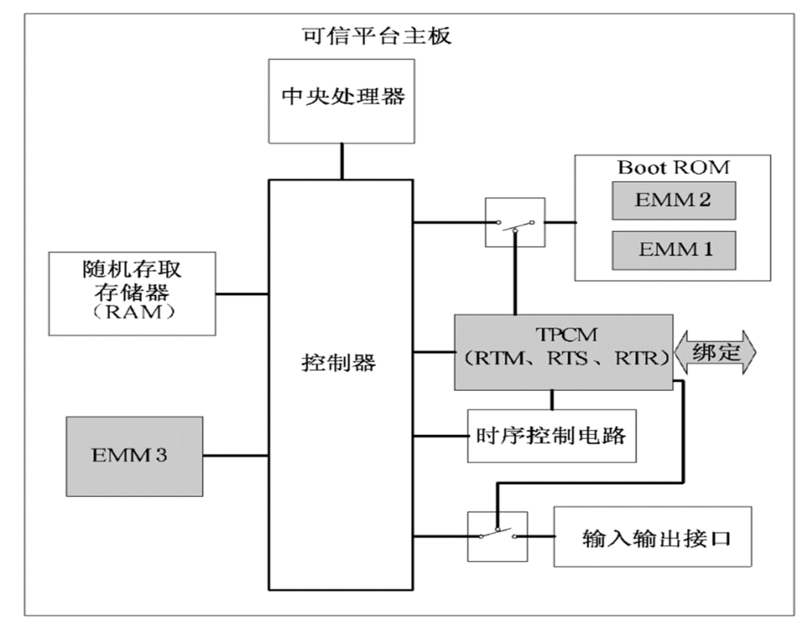
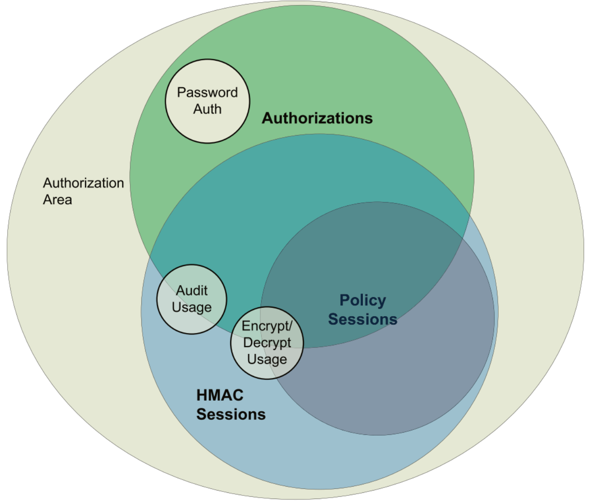

# 可信计算

## 1. 可信计算概论

### 1. 课程信息
信息安全专业必修课
先修课程：密码学，计算机原理，操作系统，信息安全导论
是一门综合性的课程：
可信计算需要操作系统、计算机体系结构、计算机网络、密码学等多方面的知识作为基础。
主要教学内容：
可信计算概述，可信计算规范，可信计算密码机制、可信计算对安全的支撑，可信计算实际应用，可信执行环境与机密计算，大作业练习

### 可信计算的概念
#### 什么是可信？
在可信计算中，可信被定义为：如果一个实体的行为总是以预期的方式朝着预期的目标执行，那么它就是可信的。可信计算的理念是以硬件安全芯片为基础，建立可信的计算环境，确保系统实体按照预期的行为执行。

网络空间是信息时代人类赖以生存的信息环境，是所有信息系统的集合，它以计算机和网络系统实现的信息化为特征。网络空间安全是人和信息对网络空间的基本要求，信息安全是网络空间安全的核心内涵。  
当前信息技术与产业空前繁荣，新型计算技术不断涌现，与信息技术相伴而生的信息安全问题正变得越来越严峻。  
由于CPU芯片、计算机操作系统和基础软件方面依赖国外产品，缺乏自主可控的根基，使得中国面临的信息安全问题更加严重。

#### 什么是可信计算
可信计算是一种旨在增强计算机系统可信性的综合性信息安全技术。
其基本思想是：在计算机系统中，建立一个信任根，从信任根开始到硬件平台、操作系统、应用。一级度量认证一级，一级信任一级，努力把这种信任扩展到整个计算机系统，并采取防护措施，确保计算资源的数据完整性和行为的预期性，从而提高计算机系统的可信性。  
什么是可信？可信≈可靠+安全，稳定可靠和安全保密是用户最关心的问题。

#### 可信计算思想的应用
1、增强微机系统的安全性。从微机的芯片、主板、硬件结构、BIOS和操作系统等软硬件底层安全做起，在网络、数据库、应用等方面综合采用密码技术、网络安全技术，有效增强微机系统的安全性。  
2、可信计算的总目标是提高计算机系统的安全性，现阶段可以确保信息系统数据完整性、数据安全存储和平台远程证明等安全功能。  
3、从长远看，一切使用CPU的信息系统都应当采用可信计算技术来增强系统的安全性。当前已经成为热点的云计算、物联网和工业控制系统，更应当也更适合采用可信计算技术来增强安全性。

### 可信计算的发展
#### 国外可信计算的发展
1985年，美国国防部制定了世界上第一个《可信计算机系统评价准则》，第一次提出了可信计算机（Trusted Computer）和可信计算基（Trusted Computing Base，TCB）的概念。美国国防部又相继推出了《可信网络解释》和《可信数据库解释》。这些文件的推出标志着可信计算的出现，这些文件在相当长的一段时间内成为评价计算机系统安全的主要准则。  
现在看来，这些评价准则也存在一定的局限性：强调了信息的秘密性，对完整性考虑较少；强调了系统安全性的评价标准，却没有给出达到这种安全性的系统结构和技术路线；产业化应用不广泛。这一阶段可以看作是可信计算目标的提出阶段。

#### TCG可信计算
1999年，美国IBM、Intel、Mircrosoft、和日本Sony等企业发起成立了可信计算平台联盟（TCPA），TCPA的成立标志着可信计算高潮的出现。2003年TCPA改组为可信计算组织TCG。TCG是一个非营利组织，旨在研究制定可信计算的工业标准：  
- 可信PC规范
- 可信平台模块TPM规范
- 可信软件栈TSS规范
- 可信服务器规范
- 可信网络连接规范
- 可信手机模块规范

在TCG技术规范的指导下，国外企业已经推出了一系列可信计算产品并走向了实际应用，对信息安全有着重要的意义：  
首次提出了可信计算平台的概念，并具体化到可信服务器、可信PC、可信PDA和可信手机，而且给出了相应的体系结构和技术路线。不仅考虑了信息的保密性，更强调了完整性，特别是可执行代码的完整性。更加产业化和更具广泛性。TPM芯片是目前应用最广泛的可信计算产品。

TPM规范是TCG最主要的技术规范之一，2005年TCG颁布了TPM1.2规范，经过不断改进和修订，2013年TCG颁布了TPM2.0规范，改进了TPM1.2的一些不足：支持密码算法的多样化和本地化，支持中国商用密码算法，增加了对虚拟化的支持。  
微软一直大力支持可信计算的发展。2007年微软推出了支持可信计算的VISTA操作系统，虽然安全，但是使用起来不太方便。2012年推出的Windows 8操作系统把TPM虚拟化成一个永久插入的智能卡，后来的Windows10操作系统继续支持可信计算，Windows11 更是把是否具有TPM模块当作安装升级操作系统的前提条件。

#### 欧洲的可信计算
2006年1月欧洲启动了名为“开放式可信计算”的可信计算研究计划，分为10个工作组，分别从事总体管理、需求定义与规范、底层接口、操作系统内核、安全服务管理、目标验证与评估、嵌入式控制、应用、实际系统发行发布以及标准化。目前已经实现了安全个人电子交易、家庭协同计算以及虚拟数据中心等应用。 

#### 可信计算中的容错流派
容错计算是计算机的一个重要领域。法国和美国分别从容错的角度给出了可信计算的概念，而且对可信计算的用词采用Dependable Computing。容错流派更强调计算机系统的可靠性、可用性和可维护性，而且强调可信性的可论证性。 

#### 中国可信计算的发展
2006年，我国制定出第一个可信计算技术规范---《可信计算平台密码方案》，将可信平台模块TPM称为可信密码模块TCM，并规定了应使用的中国密码算法。2013年，我国发布了三个可信计算技术标准：《可信平台主板功能接口（GB/T29827-2013）》《可信连接架构（GB/T 29828-2013）》以及《可信计算密码支撑平台功能与接口规范（GB/T 29829-2013）》。众多高校与企业加入了中国可信计算联盟。在中国商用密码核心技术的支持下，中国的可信计算有了自己的特色和创新。 

### 可信计算的关键技术
#### 什么是信任根
信任根是可信计算机的可信基点，也是实施安全控制的基点。它在功能上包含三个信任根，分别是：
- 可信度量根（Root of Trust for Measurement, RTM）  
RTM是对平台进行可信度量的基点。它是平台启动时首先被执行的一段软件，用以对计算机进行可信度量。它又被称为可信度量根核（Core Root of Trust for Measurement, CRTM），在可信PC机中，它是BIOS中最开始的部分代码，开机时对PC进行可信度量。
- 可信存储根（Root of Trust for Storage, RTS）  
RTS是对可信度量值进行安全存储的基点，由TPM芯片中的一组被称为平台配置寄存器（Platform Configuration Register, PCR）和存储根密钥（Storage Root Key）共同组成。  
- 可信报告根（Root of Trust for Report, RTR）  
RTR是平台向访问客体提供平台可信性状态报告的基点，它由TPM芯片中的平台配置寄存器和背书密钥（Endorsement Key，EK）的派生密钥（Attestation Identity Key）共同组成。


#### 什么是可信云计算技术
云计算的出现为可信计算提供了新的应用场景。云计算是一种面向服务的计算，面向服务的计算在技术上必然采用资源共享和虚拟化机制。资源共享和虚拟化会导致用户不信任云计算。所谓可信云计算是指将可信计算技术融入云计算环境中，构建一个可信云安全体系架构，为用户提供可信的云服务。可信计算界推出了虚拟可信平台模块（virtual TPM， vTPM）技术，并以物理TPM芯片和vTPM共同作为云计算虚拟机的信任根，结合密码技术以支持虚拟机的安全可信和可信迁移，进而实现可信云计算。 

#### 度量存储报告机制
基于信任根对计算平台的可信性进行度量，并对度量的可信值进行存储，在客体访问资源时提供报告，这一机制称作度量存储报告机制，它是可信计算机确保自身可信，并向外提供可信服务的一项重要机制。 

#### 常用可信值度量方法
TCG可信计算采用密码学哈希函数，对系统重要资源进行哈希计算，对哈希值进行完整性度量。事先对认定为处于正常状态的系统资源计算哈希值，然后进行安全的存储，当需要判断系统重要资源的完整性时，把资源当前的哈希值和存储的标准值进行比对，如果不相等，就认为系统的完整性受到破坏，可采取相应的措施。  
由于常见的计算系统的启动过程都是按照从系统引导程序到应用软件这样的顺序，和这样的启动方式相兼容的度量方法是：从最早获得启动权的部分开始进行完整性度量，直到最后一个应用软件，这就形成了可信计算中的信任链模型。 


#### 常用可信值存储方法
可信度量的值必须进行安全存储。为了反映资源在不同时刻的完整性，需要存储资源在不同时刻的哈希值，这样将会需要巨大的存储空间，TCG采用了一种扩展方法计算哈希值，将一个资源的当前哈希值和下一个时刻的资源具体内容连接在一起，再对这个连接值进行哈希，这样就可以把每个时刻资源的情况都汇聚到一个固定长度的哈希值中，存储空间固定，不随度量次数增加。常用的PCR配置寄存器就是采用这种方法进行哈希值的高效计算和安全存储。 

#### 常用可信值报告方法
当把资源哈希值进行了计算并安全存储后，当访问客体询问资源的可信性时，就可以以这些资源的哈希值给客体提供报告，由客体判断资源的可信状态，这一过程称为可信报告，可信报告的内容通常包括配置寄存器PCR值和日志等资源完整性信息。  
如果仅仅向客体提供资源的哈希值，无法确保哈希值的真实性，即客体无法判断这个哈希值是否真正属于指定资源，所以必须利用密码学中的加密、数字签名和认证等技术，来保证报告内容的真实性，这被称作平台远程证明。在此基础上，又提出了Direct Anonymous Attestation, DAA，直接匿名证明，可以在报告过程中保护平台的隐私。

#### 可信平台模块
可信平台模块是一种SoC芯片，它是可信计算平台的信任根，包括RTS和RTR，是可信计算平台实施安全控制的基点，由执行引擎、存储器、I/O部件、密码协处理器、随机数产生部件等组成。  
长期的实践经验告诉我们：如果没有硬件的支持，任何检测恶意代码的方法都可能被恶意软件回避，加上硬件的支持，就可以阻止恶意软件的回避行为。设计可信平台模块的目的就是给漂浮在软件海洋中的船只（客户终端）提供一只锚。  
除了TCG提出的TPM之外，中国提出了可信密码模块TCM，TCM强调采用中国商用密码，其密码配置比TPM更加合理。为了实现可信云计算，又提出了虚拟可信平台模块(vTPM)，利用软件模拟物理TPM的功能，为虚拟机提供与TPM相同的安全功能。

#### 可信计算平台
任何一个计算平台如服务器、PC和手机，只要其具有可信平台模块和可信计算主要技术机制，就可以称为可信计算平台，主要包括信任根、度量存储报告机制、可信软件栈、可信度量与存储、可信报告等关键部分。

#### 可信软件栈TSS
当计算平台具有了可信平台模块和可信机制后，就具备了成为可信计算平台的资格，但是，计算平台中的通用操作系统和应用软件并不知道如何使用这个后期添加的可信平台模块，这就需要可信软件栈TSS来完成这个任务，把可信平台模块与上层应用联系起来。  
TSS是可信计算平台上TPM的支撑软件，它的主要作用是为操作系统和应用软件提供使用TPM的接口，在结构上主要由底层的TPM设备驱动库TDDL、TSS核心服务TCS和TSS服务提供者三部分组成。

 
       
#### 可信远程证明
判断通过计算机网络与自己进行交互的远程平台的可信性的过程称为远程证明。要实现远程证明，需要建立在可信计算的度量存储报告机制和密码技术的基础之上。当可信计算平台需要进行远程证明时，由可信报告根向用户提供平台可信性报告（PCR值），同时需要配合密码技术，以实现安全的平台可信性的远程证明。 

#### 可信网络连接
TCG通过可信网络连接（TNC）技术实现可信从平台到网络的扩展，以确保网络的可信。其主要思想是验证网络访问请求者的完整性，依据一定的安全策略对其进行评估，以决定是否允许请求者与网络连接，从而确保网络连接的可信性。TNC架构包括三个实体、三个层次和若干个接口组件，在传统的网络访问层上增加了完整性评估层与完整性度量层，以实现对接入平台的身份验证和完整性验证。 


TCG提出的TNC是一个开放的、支持异构环境的网络访问控制架构，既要考虑架构的安全性，更重要的一点是要考虑与现有标准和技术的兼容性，并在一定程度上折衷。存在一些不足如只有服务器对终端的认证，而没有终端对服务器的认证。  
中国在TNC的基础上提出了可信连接架构TCA，对TNC中存在的不足之处进行了改进。  
不论是TNC还是TCA，在实际应用中都存在类似的局限性：可信性验证只限于完整性验证，缺乏接入之后的网络安全保护和安全交互协议支持，缺少应用支持，规范本身过于复杂，难以在实际中推广应用。 


        
#### 密码技术
密码技术是信息安全的关键技术，也是可信计算的关键技术，可信计算的主要特征技术---度量存储报告机制，就是建立在密码技术基础之上的。可信平台模块（TPM,TCM,TPCM）是一个以密码功能为主的芯片，而且是可信计算最成功的技术和产品之一。  
为了满足实际需求，可信计算对密码技术的使用方式经历了不断改进，现在正变得更加合理、更加安全、更加高效。 

#### TPM2.0密码技术的变化
1.  密码配置更加合理。支持多种类型密码算法，支持中国商用密码。
2.  混合使用公钥密码算法和对称密码算法，提高了整体效率。
3.  密钥管理更加合理：密钥层次和类型更合理，减少了密钥和证书种类，密钥产生方案更合理。
4.  支持虚拟化。
5.  提高了密钥使用的安全性。  
但是TPM2.0的密码技术仍存在以下问题：实际应用尚少，安全性、兼容性和易用性还需要经过大量实际应用的检验。

### 对可信计算的思考
#### 可信计算是提高计算机系统安全性的有效技术 
1.  可信计算是旨在增强计算机系统可信性的综合性信息安全技术。
2.  可信计算的总目标是提高计算机系统的可信性，现阶段可信计算只实现了确保系统重要资源的数据完整性、数据安全存储和平台远程证明等安全功能。
3.  可信计算综合采用密码、访问控制、硬件安全、软件安全、网络安全等技术来提高计算机系统的安全性，其核心是基于密码技术确保系统重要资源的数据完整性、进而提高计算机系统的可信性。

#### 可信计算发展和提升的重要方向
1.  可信计算产品的实际应用尚不广泛   
（1）可信平台模块芯片的应用是广泛的。  
（2）可信计算平台的应用不够广泛。有很多计算平台装备了可信密码模块，但是只是把它当作密码支持部件使用，不具备可信计算的重要机制，不能称为可信计算平台。
1.  可信度量技术需要进一步完善和提升。当前的可信度量技术是静态的，难以对不断更新与升级的软件进行有效度量。其更适用于服务器平台和工业控制计算机等业务相对固定的计算系统。
2.  基于资源数据完整性来确保系统安全性的方法具有一定的局限性。软件的数据完整性只能说明软件没有被篡改，并不能说明软件不存在漏洞和缺陷。软件的完整性具有静态完整性和动态完整性，当前的完整性度量方法只能度量静态完整性。
3.  动态度量技术是可信服务器和可信工控机成败的关键。对于一直处于开机状态的服务器和工控机，需要研究多次度量技术。现在已有基于芯片的动态度量技术如Intel TXT和AMD的PSP技术。
4.  可信计算需要与其他信息安全技术相结合。任何一种信息安全技术可能在解决某些信息安全问题方面具有优势，但是都不能解决所有的信息安全问题。
5.  可信计算的发展要注意遵循信息安全领域的共同性规律。普遍性规律、折中性规律和就低性规律。
6.  一般计算机系统的安全问题是一个不可判定问题，一般计算机系统的病毒检测问题是不可判定问题，我们没有必要也没有可能追求绝对的安全。
7.  软件定义一切，一切软件运行在硬件之上，硬件系统安全和操作系统安全是信息系统安全的基础，一定要注意硬件的安全性！

### 可信计算相关名词
#### 机密计算
在计算的过程中，数据存在三种状态：传输中、静止和使用中。数据于网络中传输属于“传输中”状态，存储的数据属于“静止”状态，正在处理的数据属于“使用中”状态。在这个世界上，我们不断地存储、使用和共享各种敏感数据：从信用卡数据到病历，从防火墙配置到地理位置数据。保护处于所有状态中的敏感数据比以往任何时候都更为重要。如今被广泛使用的加密技术可以用来提供数据机密性（防止未经授权的访问）和数据完整性（防止或检测未经授权的修改），但目前这些技术主要被用于保护传输中和静止状态的数据，目前对数据的第三个状态“使用中”提供安全防护的技术仍旧属于新的前沿领域。  
当前，攻击者已转向对使用中的数据进行攻击。 整个业界已经目睹了几次引人注目的基于内存的攻击手段，如Target安全事件和CPU侧通道攻击，这些攻击大大增加了人们对使用中数据安全的关注，以及几次涉及恶意软件注入的攻击手法，如Triton攻击和乌克兰电网攻击。  
当前，攻击者已转向对使用中的数据进行攻击。 整个业界已经目睹了几次引人注目的基于内存的攻击手段，如Target安全事件和CPU侧通道攻击，这些攻击大大增加了人们对使用中数据安全的关注，以及几次涉及恶意软件注入的攻击手法，如Triton攻击和乌克兰电网攻击。  
随着越来越多的数据迁移到了云端进行处理，传统的网络安全和物理安全防护机制在防范攻击的能力上越来越有限。已被广泛研究的针对云应用的攻击模式包括虚拟机逃逸、容器逃逸、固件损坏和内部威胁。虽然每种攻击模式都使用了不同的攻击技术，但它们的共性是被攻击对象都是使用中的代码或数据。传统的保护数据在传输和静止状态的安全防护措施仍然是实施良好纵深防御策略的重要组成部分，但它们无法处理云场景下敏感数据在使用中的数据安全。

#### 机密计算有什么用？
机密计算指使用基于硬件的可信执行环境对使用中的数据提供保护。 通过使用机密计算，我们现在能够针对在上面所描述的许多威胁提供保护。
##### 什么是可信执行环境？
可信执行环境（TEE）通常被定义为能够提供一定程度的数据完整性、数据机密性和代码完整性保证的环境。基于硬件的TEE使用硬件支持的技术为代码的执行和环境中数据的保护提供了更好的安全性保证。

在机密计算的上下文中，未经授权的实体可以包括主机上的应用程序、主机操作系统和Hypervisor、系统管理员、服务提供商、基础设施所有者或对硬件具有物理访问权限的任何其他人。机密计算中的数据机密性指的是这些未经授权的实体无法查看在TEE中使用的数据；机密计算中的数据完整性指的是防止未经授权的实体篡改正在处理中的数据；机密计算中的代码完整性意味着TEE中的代码不能被未经授权的实体替换或修改。 总之，这些安全属性不仅保证了数据的机密性，而且还保证了所执行的计算是符合预期的，从而使人们可以相信计算的结果。

#### 机密计算与可信计算的区别？
可信计算与机密计算是两个既有区别又有联系的概念。可信计算是机密计算的平台基础，可信计算与机密计算都包括可信执行环境，但可信计算实现静态可信执行环境，而机密计算可以动态创建、调整、销毁可信执行环境。

#### 隐私计算
隐私计算是涵盖了众多学科的交叉融合技术，包含了安全多方计算、同态加密、差分隐私、零知识证明、联邦学习以及可信执行环境等主流技术。隐私计算在保证数据本身不对外泄露的前提下，实现“数据可用不可见”的目的，以及数据价值的转化和释放。

## 2. 可信计算规范与标准

### 可信计算标准的产生

#### 可信计算国际标准---TPM
可信计算从产生到发展壮大，离不开可信计算标准的支撑。说到可信计算标准，就不能不提TPM安全芯片。所谓TPM安全芯片，是指符合TPM标准的安全芯片，它能有效地保护PC，防止非法用户访问。TPM标准由可信计算组织（Trusted Computing Group，TCG）制定。TCG的前身是多家IT巨头联合发起成立的可信运算平台联盟（TCPA），在2003年3月，TCPA改组为可信计算组织(TCG)。  
TCG是专门致力于制定可信计算标准的非营利性机构，它从安全的BIOS、安全的硬件、安全的操作系统、安全的网络连接等PC平台的各个方面入手来重新构建一个可信的计算机平台标准，作为安全产业基础的TCG标准将渗透到IT各个领域，包括：PC平台(台式和笔记本)、手机平台、可信网络接入及应用中间件、服务器平台、存储系统、应用软件等所有环节。  
TCG提出了TPM标准，目前最新版本为2.0。符合TPM标准的芯片首先必须具有产生加解密密钥的功能，此外还必须能够进行高速的数据加密和解密，以及充当保护BIOS和操作系统不被修改的辅助处理器。尽管TCG是非营利性机构，TPM的技术也是开放的，但由于掌握核心技术的仍是Microsoft、Intel、IBM等国际巨头，因此采用TPM标准的安全设备会使国家信息安全面临巨大威胁。

#### 国家安全需要中国可信计算标准
从安全战略方面分析，如果采用国外的TPM技术，我国的安全体系就会控制在别人手上，中国将来的标准计算机上产生的所有信息对外国人来说将不存在秘密，这样安全技术的主导权、产业的主导权就更谈不上了。另外我们肯定要为该专利买单。因此，国内产业界、学术界发出共同的心声：必须要建立独立自主的可信计算技术体系和标准。只有我们拥有独立自主的可信计算技术体系，为国家信息安全基础建设打下坚实基础，才能保证未来我们有能力、有办法保护秘密，保护主权。只有掌握这些关键技术，才能提升我国信息安全核心竞争力。

#### 中国可信计算标准---TCM
虽然我国的信息化技术同国际先进技术相比，存在一定的差距。但是，中国和国际上其他组织几乎是同步在进行可信计算平台的研究和部署工作。其中，部署可信计算体系中，密码技术是最重要的核心技术。具体的方案是以密码算法为突破口，依据嵌入芯片技术，完全采用我国自主研发的密码算法和引擎，来构建一个安全芯片，我们称之为可信密码模块（Trusted Cryptography Module，TCM）。  
考虑到中国安全芯片标准发展时间比较短，参考国际规范可以避免我们走很多弯路；同时对于以后将中国标准让国际规范兼容和采纳，有很大的帮助。因此TCM与TPM1.2有很多的相同点,TCM是借鉴了TPM1.2的架构，替换了其核心算法后的产品。同时TCM中也按照我国的相关证书、密码等政策提供了符合我国管理政策的安全接口。  

### 可信计算标准的发展
TCM是按照我国密码算法自主研制的具有完全自主知识产权的可信计算标准产品。中国错过了发展具有自主知识产权的CPU和操作系统的机会，TCM是我国信息安全最后的防线。TCM由长城、中兴、联想、同方、方正、兆日等十二家厂商联合推出，得到国家密码管理局的大力支持，TCM安全芯片在系统平台中的作用是为系统平台和软件提供基础的安全服务，建立更为安全可靠的系统平台环境。
- TCM与TPM1.2有很多的相同点,TCM是借鉴了TPM1.2的架构，替换了其核心算法后的产品。
- 同时TCM中也按照我国的相关证书、密码等政策提供了符合我国管理政策的安全接口。

#### 国际可信计算标准TPM的变化
TPM2.0与TPM1.2芯片不兼容，在上层软件链成熟前，TPM1.2还会持续一段时间。但由于TPM2.0的灵活性，解决了TPM1.2的很多安全问题，且满足更多场景的应用，其代替TPM1.2芯片是一个必然趋势。自2016年7月28日起，所有新设备和产品线都必须默认实现并启用TPM2.0。  
TPM1.2密码算法：RSA加密、RSA签名、RSA-DAA、SHA1、HMAC，并没有要求支持对称算法。  
TPM2.0密码算法：RSA加密和签名、ECC加密和签名、ECC-DAA、ECDH、SHA1、SHA256、HMAC、AES，而且厂商可以随意使用TCG IDs来增加新的算法，如在国内实现必须增加SM2、SM3和SM4算法，拥有一定的灵活性。  
TPM1.2主要面向PC平台设计，而类似的安全思维其实可以扩展到网络、服务器、云环境、移动设备和嵌入式产品等。TPM安全芯片本身是以安全芯片的形式在主机上隔离出一个拥有独立处理能力和存储能力的区域，从这个层面来看，和虚拟技术、TrustZone、智能卡等技术在本质上是一致的，不过安全性可能并不在一个层次。TPM1.2的owner只有一个就是用户，而计算平台本身可能也需要使用TPM。在TPM1.2中，所有安全和隐私都在该owner的控制下。  
TPM2.0将这种控制功能进行了隔离，给出了三个控制域：安全域或者存储域（owner为用户，用户正常的安全功能）；隐私域（owner为平台或者用户，平台身份认证）；平台域（owner为平台，保护平台固件的完整性）。另外TPM2.0规范主要是提供一个参考，以及可能实现的方式，但是并没有限制必须以安全芯片的形式存在，如可以基于虚拟技术或者ARM TrustZone、Intel TXT等进行构建，只要能提供一个可信执行环境（TEE），就可以进行构建。一个安全芯片嵌入到服务器上，体现不了多少成本；但是如果在空间有限的移动设备或者嵌入式设备上配备一个安全芯片，就需要慎重考虑了。  
TPM1.2的背书密钥只有EK，出厂时厂商就预置在芯片内，更换非常困难。takeowner后可以生成属主和唯一的存储根密钥SRK，从而可以构建密钥的存储体系。  
在TPM2.0中，EK属于隐私域，可以有多个，而且可以支持不同的非对称算法；SRK属于安全域，也可以有多个和支持不同的算法。实际上TPM2.0的三个控制域中，都支持多密钥和多算法。TPM2.0的主密钥都是通过主种子，使用密钥派生算法KDF来生成。存储种子的空间比存储密钥的空间要小很多。TPM2.0中密钥的存储通常是通过对称加密，父密钥的强度不能低于子密钥，要不子密钥的安全强度也无法达到其声称的水平。  
微软早在win8中就使用PCR来恢复unsealing Bitlocker的密钥。如果系统启动过程中有任何微小的变化，都需要用户干预才能恢复，因此这个过程比较脆弱。PCRs主要用来存储系统启动和运行过程中的度量值，防止度量日志被篡改。PCRs值不只保证每次系统启动时执行相同的代码，其保证以相同的顺序执行相同的代码。  
TPM2.0规范运行其有多个PCRsbanks，一个bank内所有PCR使用相同的算法进行扩展操作。而且不同的banks可以分配不同的PCRs。对于不同的bank，扩展操作是相互独立的，互不干扰。  
授权指是否允许软件进程访问TPM内部的资源（密钥、计数器、NV存储空间等）。TPM1.2拥有不同的机制来授权客体（objects）的使用、委托使用和迁移等。TPM1.2的授权比较受限制，唯一的授权访问方式是基于passwords和PCR值。例如，为了使用TPM内部的一个密钥，软件需要证明其拥有某个password的知识（通过hash的方式嵌入在可信命令中）；而且可以将该密钥与特定的PCR状态seal在一起。这使得TPM1.2的授权机制缺乏灵活性。通常一个计算机平台拥有多个用户，如何共享TPM密钥和数据是比较困难的。不同用户由于password不一样，他们知道的密钥集合也是相互独立的。系统管理员如何授权这些密钥的使用是一个难点。  
TPM1.2中，软件通过授权会话证明其拥有password（消息验证码），在命令需要授权前通常通过一个独立的命令来开启会话。TPM2.0提出了增强的授权机制（Enhanced Authorization，EA）。  
而TPM2.0提供了一个统一的框架来使用授权功能，授权功能可以通过各种独特的方式进行组合来增加灵活性。TPM2.0允许使用明文密码和HMAC的授权，也允许使用多个授权限定符来构造任意复杂的授权策略。增强的授权机制是TPM2.0的一个特色。    
TPM2.0对密钥和数据的授权使用方式进行了扩展，授权会话变成了策略会话，多个授权方式可以通过布尔逻辑的形式进行组合。例如，在一个场景中，Alice和Bob两个用户拥有不同的passwords，现在想要让他们可以访问同一个密钥，可以创建一个策略“当且仅当Password(Alice) or Password(Bob),允许访问密钥”。软件进程可以先创建策略，在生成TPM密钥或者数据时指定该策略的哈希值即可，TPM不需要知道策略的详情，hash值提供了足够的信息。  
影响TPM1.2使用的最大一个障碍是PC厂商将TPM默认置为关闭状态。为了激活TPM的使用，用户必须进入固件（BIOS），找到管理TPM安全芯片的目录，将其激活。这是因为TCG早期受到了质疑的影响，质疑者认为使用TPM可能导致PC平台绑定特定的软件，而影响其他软件的使用，特别是厂商可以借此推广自己的软件，因此推荐默认情况下关闭TPM。这是非常浪费的行为，但国内TCM在这方面做的还好，只是一些特定型号的安全主机才会配备TCM芯片，并不是每个PC主板上都装。  
既然要在BIOS中对TPM的使用进行激活，而实际上大部分用户都没有修改过BIOS，这样导致大部分TPM永远沉睡在主板上。即便激活了TPM1.2，其状态是没有属主的（unowned），需要通过一个特定的命令来建立属主，往往第一个建立属主的人才是TPM的实际拥有者。在非属主状态，能使用的TPM很有限，没有SRK，密钥也无法创建或者加载，PCR状态也无法进行验证。在TPM1.2中，固件（BIOS）无法验证启动状态（boot state），固件可以哈希代码并扩展PCRs，但是检查具体的度量值只能靠更上层的操作系统或者应用程序。  
在TPM2.0中默认状态应该是开启的，并增加了平台域，保证平台固件也可以操作完整的TPM资源，即固件可以创建密钥、加密数据、验证PCR值等。这意味着，平台固件和平台用户可以同时成为TPM的属主（owner）。固件开发者可以使用这种能力来保证一个安全的预引导环境，类似操作系统使用TPM的能力来保护其操作以及上层应用。  
TPM1.2规范对功能的描述采用伪代码的形式，虽然更加正式，但是厂商实现时在细节上还是会存在一定的误解。TPM2.0规范采用C语言的形式进行了描述，为不同厂商实现时提供了标准的指导。但TPM2.0的标准看起来也很费劲，对于一个不懂可信计算的开发人来说，让其根据规范实现芯片，绝对是一种煎熬。但对于搞可信计算的人来说，认真研读TPM2.0规范，还是很有收获的。  
TPM2.0规范主要有四部分，Part1是比较系统的介绍，要了解可信平台模块的基本思想和原理，主要参考Part1。Part2给出TPM接口的变量、数据类型、数据结构和常量。Part3总结TPM能执行的所有命令，对于每个命令给出命令请求和响应的格式，并且通过C代码形式分析了每个命令的执行流程。最后的Part4是给出了Part3中命令代码用到的算法和方法。实际使用可信计算是很多命令的组合，但具体使用时必须从整体上思考，才能组合出实际的应用。

1. 信任根（Root of Trust）,是无法检测到不当行为而必须信任的最小计算系统，它包括测量根信任、存储根信任以及报告根信任三部分组成，是可信计算的基础和出发点。
2. 可信构建块（Trusted Building Block，TBB），是指用于实例化信任根所需的一个或一组元件。
3. 可信计算基（Trusted Computing Base，TCB），是负责系统安全策略的系统资源（硬件和软件）的集合。
4. 信任边界（Trusted Boundaries），TBB与根信任的组合构建了信任边界，在边界内可针对最小配置完成测量、存储和报告。
5. 传递信任（Transitive Trust），传递信任是一个过程，基于信任根建立可执行函数的信任关系，然后基于该函数建立下一个可执行函数的信任关系，从而构建计算环境的信任链。
6. 信任机构（Trust Authority），是指创建和发布可信构建块的制造厂商。
7. 可信平台模块（Trusted Platform Module, TPM），是提供系统可信计算基（TCB）的与主机系统隔离的系统组件，基于标准的规范接口与主机交互。具体实现方式包括：直接或者间接的基于物理资源的实现，例如在处理器中独立的TPM单元或者临时分配的TPM计算单元；单一独立的TPM芯片单元；在主机处理器特定工作模式下运行的代码等。  
TPM规范中对加密算法以及引擎、随机生成器、管理以及授权、远程证明等内容做出规范，并定义了软件接口规范。其典型架构如右图所示：

为推进TPM应用，打造可信计算生态，TCG定义了软件栈规范，将TPM底层细节接口与TPM应用程序隔离起来，为高端系统和资源受限的低端系统设计和定义了可信计算组织软件栈（TCG Software Stack），采用多层设计从而允许扩展。如右图所示，TSS分别用于本地应用场景和远程应用场景。

TSS通过TPM命令转发接口（TPM Command Transmission Interface，TCTI）实现应用层到底层各个组件的连接与通信。  

TPM得到了包括微软、英特尔、华硕、微星、华为、联想、惠普等众多软件、半导体、硬件厂家的支持，其中微软的Windows 11、BitLocker等软件强制性要求硬件厂商支持TPM 1.2、TPM 2.0。受中国法律政策以及其他因素的影响，TPM相关技术产品在中国的发展一度遭到严厉的限制。随着中国TCM标准的制定，以及包括“恒智”等国产TPM芯片的出现，TPM 2.0标准逐渐被中国市场接受，并逐步扩大合作空间。

#### 中国可信计算标准TCM的发展思路

中国可信计算工作组(TCMU)  
31家单位，覆盖IT各领域

- 使用自主密码算法：SM2/SM3/SMS4/RNG
- 构建3个维度安全功能体系
  - 构建信任链确保平台完整性
  - 通过身份密钥和数字签名实现平台身份可信
  - 通过“密封”和“绑定”确保平台数据安全


#### 中国可信计算平台架构


#### 中国可信计算技术规范体系


#### 制定TCM通用接口标准
可信计算标准的发展
为推进现有安全应用平滑移植至TCM上，制定了通用的TCM应用接口标准《可信计算平台密码应用接口规范》，使安全应用以CryptoAPI、CNG-API、PKCS-API接口形式直接实现TCM功能调用，使TCM成为构建安全应用的信任根。


#### TCM可信计算体系结构
1.  可信计算节点 trusted computing node  
由可信部件和计算部件共同构成、具备计算和防护并行特征的计算节点。
2.  可信密码模块 trusted cryptography module  
可信计算平台的硬件模块,为可信计算平台提供密码运算功能,具有受保护的存储空间[GB/T 29829-2013,定义3.1.7]。  
3、可信平台控制模块 trusted platform control module
一种集成在可信计算中,用于建立和保障信任源点的硬件核心模块,为可信计算提供完整性度量存储、可信报告及密码服务等功能[GB/T 29827-2013,定义3.20]。  
4、可信平台主板 trusted main board
由可信平台控制模块和其他通用部件组成，可实现从开机到操作系统内核加载前的平台可信。
5、可信软件基 trusted software base
为可信计算平台的可信性提供支持的软件元素的集合.【GB/T 37935-2019,定义3.3】  
6、信任链  trusted chain
在计算节点启动和运行过程中,使用完整性度量方法在部件之间所建立的信任传递关系【GB/T 29829-2013,定义3.1.13】  

可信计算的体系由可信计算节点及其间的可信连接构成，为其所在的网络环境提供相应等级的安全保障。可信计算节点可根据其所处业务环境部署不同功能的应用程序，可信计算节点包括可信计算节点（服务）和可信计算节点（终端），不同类型的可信节点可独立或相互间通过可信连接构成可信计算体系。


- 可信计算节点由可信部件和计算部件组成。计算部件为程序提供计算、存储和网络资源，主要包括通用硬件和固件、操作系统及中间件、应用程序和网络等部分构成。
- 可信部件主要对计算部件进行度量和监控，其中监控功能依据不同的完整性度量模式为可选功能，可信部件同时提供密码算法、平台身份可信、平台数据安全保护等可信计算功能调用的支撑。
- 可信计算节点中的计算系统部件和可信部件逻辑相互独立，形成具备计算功能和防护功能并存的双体系结构。

可信部件主要包括：可信密码模块（ＴＣＭ）或可信平台模块（ＴＰＭ）、可信平台控制模块（ＴＰＣＭ）、可信平台主板、可信软件基（ＴＳＢ）和可信连接。可信部件具有三种工作模式，即裁决度量模式、报告度量模式和混合度量模式，三种工作模式依赖不同的可信部件。  
可信密码模块／可信平台模块：可信密码模块（ TCM ）／可信平台模块（TPM）应提供密码算法支撑，具有完整性度量、可信存储及可信报告等功能。  
可信平台控制模块：可信平台控制模块（ TPCM ）在ＴＣＭ／ＴＰＭ 的支撑下应具备主动度量和控制功能。ＴＰＣＭ 应是一个逻辑独立或者物理独立的实体，可采用独立的模块或物理封装、通过ＩＰ核或固件方式与TCM ／TPM集成、虚拟化实现实体等形式。  
可信平台主板：可信平台主板是集成了TPCM的计算机主板，将TPCM作为信任根建立信任链，并TPCM与其他硬件的连接。

#### TCM可信计算常用缩写语
BIOS：基本输入输出系统(Basic Input Output System)  
CRTM：核心可信度量根(Core Root of Trust for Measurement)  
TCM：可信密码模块(Trusted Cryptography Module)  
TPCM：可信平台控制模块(Trusted Platform Control Module)  
TPM：可信平台模块(Trusted Platform Module)  
TSB：可信软件基(Trusted Software Base)  
TSM：TCM 服务模块(TCM Service Module)  
TSS：可信软件栈(TCG Software Stack)  

#### TCM可信计算节点组成


幻灯片 49:
#### 完整性度量模式
1.  裁决度量模式  
在硬件及固件层，TPCM 应为可信计算节点中第一个运行的部件，作为可信计算节点的信任根，应用TCM/TPM 或其他的密码算法和完整性度量功能对BIOS、宿主基础软件等计算部件主动发起完整性度量操作，并依据度量结果进行主动裁决和控制。  
在宿主基础软件及中间件层，TPCM向上层提供使用TPCM基础资源的支撑，TSB通过调用TPCM的相关接口对应用软件进行主动监控和主动度量，对应用软件完全透明，保证应用软件启动时和运行中的可信。可信计算节点在接入网络时，对于支持可信连接的网络部署，可信连接调用TSB和TPCM提供的完整性度量结果，进行相应操作。


2.  报告度量模式  
在硬件及固件层，BIOS中的CRTM 构成可信计算节点的信任根，并通过TSM／TSS等向上层提供使用TCM/TPM等基础资源的支撑。在信任链建立过程中，各计算部件代码应调用TCM/TPM等的完整性度量接口对信任链建立的下一环节进行完整性度量，并报告度量结果，由应用程序或其使用者进行裁决。  
在宿主软件及中间件层，由应用层的应用程序调用TSM/TSS等相关接口进行完整性度量，并给出完整性报告，由应用程序使用者进行裁决。对于支持可信连接的网络部署，可信连接调用TSM/TSS等提供的接口进行完整性度量，并根据度量结果进行相应操作。


3.  混合度量模式  
可信部件的混合度量模式参与部件应为TCM/TPM和TSB。信任链建立过程中，在硬件及固件层的TCM/TPM工作于报告度量模式，在宿主基础软件及中间件层，TSB通过调用TCM/TPM相关接口工作于裁决度量模式。


## 3. TCM可信计算基础架构

### 可信计算底层架构

#### 可信计算节点基本概念
可信密码模块  (trusted cryptography module) TCM：具有可信计算所需要的密码运算等功能,并可提供受保护的存储空间的一种模块。

可信平台控制模块 （trusted platform control module ）TPCM：集成在可信计算节点中的防护部件组件,由硬件、软件及固件组成,与计算部件的硬件、软件及固件并行连接,是用于建立和保障信任源点的一种基础核心模块,为可信计算节点提供主动度量、主动控制、可信验证、加密保护、可信报告、密码调用等功能。

可信软件基（trusted software base ）TSB：为可信计算节点提供可信支撑的软件元素集合。

可信计算节点 （trusted computing node）TCN：指由可信防护部件和计算部件共同构成、具备计算和防护并行运行功能的计算节点。

可信平台控制模块---Trusted Platform Control Module (TPCM)：可信计算节点由计算部件和防护部件构成，TPCM 是可信计算节点中实现可信防护功能的关键部件，可以采用多种技术途径实现，如板卡、芯片、IP 核等,其内部包含中央处理器、存储器等硬件、固件以及操作系统与可信功能组件等软件，支撑其作为一个独立于计算部件的防护部件组件，并行于计算部件按内置防护策略工作，对计算部件的硬件、固件及软件等需防护的资源进行可信监控，是可信计算节点中的可信根。

#### 可信计算节点架构


#### 可信平台控制模块与外部的交互
TPCM 需与 TSB、TCM、可信管理中心和可信计算节点的计算部件交互：
- TPCM 的硬件、固件与软件为 TSB 提供运行环境,设置的可信功能组件为 TSB 按策略库解释要求实现度量、控制、支撑与决策等功能提供支持；
- TPCM 通过访问 TCM 获取可信密码功能,完成对防护对象可信验证、度量和保密存储等计算任务,并提供 TCM 服务部件以支持对 TCM 的访问；
- TPCM 通过管理接口连接可信管理中心,实现防护策略管理、可信报告处理等功能；
- TPCM 通过内置的控制器和 I/O 端口,经由总线与计算部件的控制器交互,实现对计算部件的主动监控；
- 计算部件操作系统中内置的防护代理获取预设的防护对象有关代码和数据提供给 TPCM,TPCM 将监控信息转发给 TSB,由 TSB 依据策略库进行分析处理。


#### 可信平台控制模块功能组成
TPCM模块是一个逻辑概念，由功能组件、基础软件和硬件组成。


硬件层应包括中央处理器、易失存储器、非易失存储器、计算部件接口、管理接口、可信密码接口,为TPCM 的功能实现提供基础运行环境。硬件组件之间通过内部总线实现相互连接。根据连接对象的不同,计算部件接口可分为控制器和 I/O 接口。  
基础软件层应包括固件、操作系统核心,实现对 TPCM 内部的资源调度、任务管理,以及提供 I/0接口驱动及控制。

功能组件层包括可信控制、可信度量、判定服务、支撑机制服务及策略库管理,以及可信软件基接口，各部分功能如下：
- 可信控制是指 TPCM 依据防护策略和度量结果,进行基于节点控制部件的总线、电源信号等方式的控制;
- 可信度量是依据防护策略,获取预设的计算部件中防护对象有关内存、I/O、固件中的关键数据信息，并进行密码运算;
- 判定服务为可信软件基判定机制的实现提供支持;
- 支撑机制服务为可信软件基提供有关系统处理的运算;
- 策略库管理对节点的可信度量、可信控制等规则进行管理；
- 可信软件基接口为可信软件基提供功能访问。

#### 可信平台控制模块接口
TPCM通过互联接口实现访问计算部件资源、连接可信密码模块和提供面向外部的功能访问,接口应包括计算部件接口、可信密码模块接口、可信软件基接口和管理接口。
- 计算部件接口主要为总线接口,与节点计算部件中不同类型的总线相连接,用于访问内存、I/0、系统固件等系统资源,并通过控制器对系统资源进行控制。TPCM 可通过计算部件总线接口连接计算部件硬件层的控制器,实现对可信计算节点的主动监控,监控对象可包括内存、硬盘、USB、并口、串口和网络等。
- 可信密码模块接口提供 TPCM 对可信密码模块访问的 I/O 通道。
- 可信软件基接口为软接口,为可信软件基提供 TPCM 功能的调用。TPCM 在提供接口服务前,应先与调用者进行相互认证并建立可信的数据通道。可信软件基可通过该接口调用 TPCM 中的度量、控制、判定和支撑等服务功能,并返回处理数据。
- 管理接口为物理接口,应为网络或总线接口模式,由可信管理中心访问，TPCM 的管理接口应包括 TPCM 自身管理、可信密码模块管理、基本信任基管理及日志管理等各接口功能要求如下:
     a)TPCM 自身管理接口应包括 TPCM 配置管理和安全管理;  
     b)可信密码模块管理接口应提供 TPCM 所使用的可信密码模块的授权管理、密钥管理;  
     c)基本信任基管理接口应提供基本信任基的度量值管理与度量策略管理;  
     d) 日志管理接口应提供 TPCM 管理行为日志的导出机制。

#### TPCM模块安全性要求
检查可信计算节点设计,应确认 TPCM 先于主机计算部件上电启动,并全程并行于计算部件运行，实现从计算部件第一条指令开始的可信建立。不但在系统启动过程中能防止使用经篡改的部件来构建运行环境、抵御恶意代码攻击,并且在系统运行中能动态地保护运行环境及应用程序的可信安全,最终实现对计算系统全生命周期的可信度量和可信控制,如图 3 所示：


#### 可信平台主板功能

当我们构建了可信平台控制模块后，还需要一个能够承载TPCM模块的物理部件，这就是可信平台主板。可信平台主板功能规范适用于基于可信平台控制模块的可信平台主板的设计、 生产和使用方法。  
可信平台主板是由可信平台控制模块和其他通用部件组成, 实现从开机到操作系统内核加载前的平台可信引导功能。 通用部件主要包括: 中央处理器、 随机存取存储器(RAM) 、 输入输出接口、Boot ROM 固件等。

#### 可信平台主板组成结构


可信平台控制模块(TPCM) 
- TPCM 由物理硬件、嵌入式系统、对外的接口等实体组成
- TPCM 是可信平台的唯一可信根，其包括:可信度量根(RTM)、可信存储根(RTS)和可信报告根(RTR)。
- TPCM 通过系统总线连接到可信平台主板的控制器。

可信平台主板:
- 嵌入 TPCM,支持 TPCM 功能，实现信任链传递的计算机主板。
- 包括中央处理器、控制器、随机存取存储器、TPCM 硬件设备、Boot ROM 固件层支撑模块及其设备驱动程序和 TPCM 嵌入式系统等实体。
- 支持 TPCM 对输入输出接口的控制,TPCM 最少但不限于控制以下输入输出接口的开启或关闭:USB、PS/2、PCIE、PCI、SATA、串口、并口、网络接口。 

#### 可信平台主板与TPCM一对一绑定
必须确保可信平台主板和 TPCM 一对一的绑定关系。TPCM 与可信平台主板其他部件的协作关系应满足如下要求：在 CPU 执行 Boot ROM 代码前，TPCM 先启动。TPCM 通过电路连接,可靠地读取平台 Boot ROM 的初始引导模块(Boot Block)。TPCM 中的 RTM 对 Boot ROM 中的 Boot Block 进行完整性度量和度量结果的存储。

### 计算机常规启动

#### 计算机引导过程
BIOS：Basic Input Output System, 可以理解为写死在主板上或者硬件上的一段程序, 当然后来也可以升级（修改）, 机器开机之后运行的第一个程序就是BIOS, BIOS加载CMOS上的参数，并寻找第一个可启动的设备(磁盘)。  
MBR：Mast Boot Record,  主引导分区，位置就是第一个可开机装置（磁盘）的第一个扇区， 通常大小为512byte，旧的磁盘一个扇区都是512B, 最新的有4KB，这个扇区有两部分：MBR和分区纪录表，64byte，最多记录4个分区。  
MBR是安装开机管理程序的地方，所谓开机管理程序，可以理解为bootloader，bootloader的作用是加载核心文件，也就是引导操作系统开始工作。boot loader的主要任务有下面几项：  
提供菜单：用户可以选择不同的开机选项。  
载入OSLoader，为执行操作系统核心代码作准备（这个是我们通用的流程）  
或者转交其他loader：将引导加载功能转交给其他loader负责。


#### Intel 80x86 CPU 工作模式
1. 实模式：
- 8086/8088唯一工作方式
- 20位地址总线，00000H--FFFFFH（1MB大小）
- 16位寄存器, 物理地址=段基址X16+偏移地址 
- 80386以上的微处理器在启动时，自动进入实模式
2. 保护模式
- 32/64位寄存器和地址总线
- 用硬件对每个进程内存空间进行保护，阻止非法访问
- 分段管理和分页管理结合：逻辑地址->线性地址->物理地址
3. 虚拟8086模式
- 运行在保护模式中的实模式，为了在32位保护模式下执行纯16位程序

#### 关于计算机系统的BIOS
BIOS "Basic Input Output System"，"基本输入输出系统"，它是一组固化到计算机内主板上一个ROM（CMOS）芯片上的程序，它保存着计算机最重要的基本输入输出的程序、开机后自检程序和系统自启动程序，为计算机提供最底层的、最直接的硬件设置和控制。


#### 加载程序的内存地址空间


#### BIOS系统调用

- BIOS以中断调用的方式 提供了基本的I/O功能
  - INT 10h: 字符显示
  - INT 13h: 磁盘扇区读写
  - INT 15h: 检测内存大小
  - INT 16h: 键盘输入
- 只能在x86的实模式下访问

#### 计算机启动流程


#### CPU初始化

- CPU加电稳定后从0XFFFF0读第一条指令
  - CS:IP = 0xf000:fff0
  - 第一条指令是跳转指令
- CPU初始状态为16位实模式
  - CS:IP是16位寄存器
  - 指令指针PC = 16*CS+IP
  - 最大地址空间是1MB

#### BIOS初始化过程

- 硬件自检POST
- 检测系统中内存和显卡等关键部件的存在和工作状态
- 查找并执行显卡等接口卡BIOS，进行设备初始化；
- 执行系统BIOS，进行系统检测；
  - 检测和配置系统中安装的即插即用设备；
- 更新CMOS中的扩展系统配置数据(ESCD)
- 按指定启动顺序从软盘、硬盘或光驱启动

#### 主引导记录(MBR)格式


#### 分区引导扇区格式


#### 加载程序(bootloader)


#### 系统启动规范

BIOS
- 固化到计算机主板上的程序
- 包括系统设置、自检程序和系统自启动程序
- BIOS-MBR、BIOS-GPT、PXE
UEFI
- 接口标准
- 在所有平台上一致的操作系统启动服务

#### 计算机系统启动过程

常见的计算机系统启动部分有BIOS和UEFI两类。BIOS是英文"Basic Input Output System"的缩略词，直译过来后中文名称就是"基本输入输出系统"。UEFI全称Unified Extensible Firmware Interface，即“统一的可扩展固件接口”，是一种详细描述全新类型接口的标准，是适用于电脑的标准固件接口，旨在代替BIOS（基本输入/输出系统），UEFI旨在提高软件互操作性和解决BIOS的局限性。

##### UEFI相比BIOS的优势
1.  通过保护预启动或预引导进程，抵御rootkit攻击，从而提高安全。
2.  缩短了启动时间和从休眠状态恢复的时间。
3.  支持容量超过2.2 TB的驱动器。
4.  支持64位的现代固件设备驱动程序，系统在启动过程中可以使用它们来对超过 172亿GB的内存进行寻址。
5.  UEFI硬件可与BIOS结合使用。

所有的电脑都会有一个BIOS，用于加载电脑最基本的程序代码，担负着初始化硬件，检测硬件功能以及引导操作系统的任务。而UEFI就是与BIOS相对的概念，这种接口用于操作系统自动从预启动的操作环境，加载到一种操作系统上，从而达到开机程序化繁为简节省时间的目的。传统BIOS技术正在逐步被UEFI取而代之，在最近新出厂的电脑中，很多已经使用UEFI，使用UEFI模式安装操作系统是趋势所在。

本质上，UEFI就是为了替代BIOS而生的，在功能上，UEFI的扩展性和执行能力，远比简陋的BIOS高级，最直观的是你可以在UEFI界面下看到图形界面，可以使用鼠标操作，可以让启动时自检过程大为简化，这就是最基本的区别。

### 计算机可信启动

#### 扩展度量模块（EMM）
EMM 作为 RTM 度量根的扩展度量模块,实现对执行部件的完整性度量,实现信任链传递。
EMM1:存储于 Boot ROM 的初始引导模块(Boot Block)中,被 RTM 度量；EMM1 对Boot ROM 的版本信息和 EMM2 进行完整性度量。
EMM2:存储于 Boot ROM 的主引导模块(Main Block)中,被 EMM1 度量；EMM2 对平台启动部件,以及 OS Loader 进行完整性度量。
EMM3:存储于外部存储器中的 OS Loader 中,被 EMM2 度量；EMM3 对操作系统内核进行度量。本标准对 OS Loader 存储的位置不作规定,图中 OS Loader 存储于外部存储器只是示例。
扩展度量模块 EMM 通过 TPCM 提供的接口,访问 TPCM,存储度量结果和日志。

#### 信任链传递
a) TPCM 先于Boot ROM 被执行前启动, 由 TPCM 中的 RTM 度量Boot ROM 中的初始引导模块(Boot Block) , 生成度量结果和日志, 并存储于 TPCM 中;  
b) 如果度量通过，TPCM 发送控制信号, 使 CPU、 控制器和动态存储器等复位; 平台加载并执行 Boot ROM 中的 Boot Block 代码;  
c) Boot Block 中的 EMM1 获得系统执行控制权, 信任从 RTM 传递到 EMM1;  
d) EMM1 度量 Boot ROM 版本信息和 主引导模块（Main Block）中的 EMM2 代码;EMM1 存储度量结果到TPCM 中的 PCR 并存储度量日志;  
Boot Rom包含处理器在上电或复位时执行的第一个代码。它可以决定从哪里加载要执行的下一部分代码以及如何或是否验证其正确性或有效性。由初始引导模块（Boot Block）和主引导模块（Main Block）组成。常见的BIOS可以看作是一种简化固定的Boot Rom.  
e) 如果度量通过，平台加载并执行 Main Block 中 EMM2 的代码;  
f) Main Block 中的 EMM2 获得系统执行控制权, 信任从 EMM1 传递到 EMM2;  
g) 平台加载并执行 OS Loader 的代码;  
h) OS Loader 中的 EMM3 获得系统执行控制权, 信任从 EMM2 传递到 EMM3;  
i) EMM3 度量操作系统内核, 生成度量结果和日志, 度量结果存储到 TPCM 的 PCR 中, 度量事件日志保存到 LSA 中;  
j) 平台加载并执行 OS Kernel 的代码;  
k) OS Kernel 中的 EMM4 获得系统执行控制权, 信任从 EMM3 传递到 EMM4。

#### 信任链建立流程


#### 信任链建立要求
a) 信任链的建立过程必须以可信度量根 RTM 为起点;  
b) 当需要装载并运行一个部件前, 应由 RTM 或者 EMM 对该部件进行完整性度量, 然后再将其加载和运行;  
c) TPCM 中 PCR 存储的杂凑值应与系统引导过程中的度量事件和度量顺序相对应;  
d) TPCM 中 PCR 存储的杂凑值应与系统引导过程中生成的度量日志相对应;  
e) 在每次开机时应重新生成 LSA 中的度量日志和 TPCM 中 PCR 存储的杂凑值。


#### 完整性度量方法
信任链基于可信度量根 RTM 建立, 通过扩展度量模块 EMM 实现信任传递。 RTM 和 EMM 采用杂凑算法对部件代码进行完整性计算, 并存储度量结果, 实现完整性度量。


#### 完整性度量流程
a) RTM 或者 EMM 使用杂凑算法对“部件i”的二进制代码进行计算;  
b) RTM 或者 EMM 生成在第a) 步中对“部件i”的计算结果“度量事件i 描述”; 该描述包括杂凑算法的结果, “度量值i”, 以及本次度量事件的上下文信息“度量事件i 上下文”;  
c) RTM 或者 EMM 通过接口调用 TPCM, 将“度量值i” 扩展存储到预先定义与部件i 相关的PCR[i]中。扩展(Extend) 存储方式详细规则见 GB/T29829—2013 的5.7.4;  
d) RTM 或者 EMM 将“度量事件i 描述”存储于 LSA 中。  
完成上述4 个步骤的整个过程为一次完整性度量事件。

#### 完整性度量存储
完整性度量事件日志应存放于系统的 LSA (Log Storage Area）中。


#### 可信平台主板功能接口
可信平台主板功能接口包括与底层 TPCM 的接口和与上层应用之间的接口。 在 TPCM 上建立设备驱动层(TPCM Device Driver: TDD) 实现主板可信应用功能对底层 TPCM 的调用。在 TDD 之上, 可建立服务提供层(TPCM Service Provider) 对 TDD 进行再封装, 为上层应用提供更高层次的接口, 简化上层编程实现。


#### BIOS完整性度量
传统 BIOS 完整性度量过程:
- 被 TPCM 度量过的 EMM1获得控制权后,对 BIOS 的版本信息和扩展度量模块 EMM2 进行度量,并将度量结果进行存储并传递控制权。EMM2 获得控制权后对平台启动部件和操作系统装载器进行度量;
- EMM2 度量的部件主要包括平台启动部件、操作系统装载器和 EMM3。
- EMM3 度量操作系统内核		


#### EMM1 度量 Main Block
- EMM1 的度量内容如下.  
a)  Main Block 的版本信息;  
b） 扩展度量模块 EMM2:
- EMM1度量过程如下:
a） EMM1 对 Main Block 版本标识符和 EMM2 进行完整性度量;  
b） EMM1 存储度量结果和日志:  
        1） EMM1 检测主机系统内存当前可用状态;当内存可用时,将度量结果扩展到 PCR 07,并记录度量日志到 ACPI表中;
        2）若内存处于缺失状态,EMM1 调用 TPCM,将度量结果扩展到 PCR 07,并记录度量日志到 Boot Block 中。		

#### EMM2 度量平台各个启动部件

平台启动部件包含了能够使平台硬件环境正常运行的基本部件, 包括POST BIOS 代码、 板载固件代码。PCR[1]负责进行度量的对象包括：
| 度量代理 | 度量对象                                        | 必须/可选 |
| :------: | ----------------------------------------------- | --------- |
|   EMM2   | POST BIOS代码                                   | 必须度量  |
|   EMM2   | SMM（系统管理模式）代码和建立系统管理模式的程序 | 必须度量  |
|   EMM2   | ACPI Flash 数据                                 | 必须度量  |
|   EMM2   | 硬盘特征信息（包括硬盘生产商和序列号）          | 可选度量  |
|   EMM2   | 光驱特征信息（包括光驱生产商、型号等信息）      | 可选度量  |
|   EMM2   | 网卡特征信息（包括生产商、型号、MAC地址等信息） | 可选度量  |
|   EMM2   | 显卡特征信息                                    | 可选度量  |
|   EMM2   | 声卡特征信息                                    | 可选度量  |
|   EMM2   | 其他输出和启动相关的硬件信息                    | 可选度量  |

PCR[2]平台部件数据配置信息对象包括：
| 度量代理 | 度量对象                  | 必须/可选 |
| :------: | ------------------------- | --------- |
|   EMM2   | 任何对CPU进行升级的微码   | 必须度量  |
|   EMM2   | 主机平台配置事件          | 必须度量  |
|   EMM2   | ESSD、CMOS和其他NVRAM数据 | 可选度量  |
|   EMM2   | SMBIOS结构                | 可选度量  |

PCR[3]Option ROM 的代码度量对象包括：
| 度量代理 | 度量对象                                                       | 必须/可选 |
| :------: | -------------------------------------------------------------- | --------- |
|   EMM2   | 被BIOS调用的 Option ROM Code                                   | 必须度量  |
|   EMM2   | 针对BIOS不可见的 Option ROM Code 部分                          | 必须度量  |
|   EMM2   | 固化在主机平台的主板上，但由非设备制造商控制的 Option ROM Code | 必须度量  |

PCR[4]Option ROM 的配置度量对象包括：
| 度量代理 | 度量对象                    | 必须/可选 |
| :------: | --------------------------- | --------- |
|   EMM2   | Option ROM 所使用的配置信息 | 必须度量  |
|   EMM2   | Option ROM 所使用的数据     | 必须度量  |

PCR[5]状态迁移度量对象包括：
| 度量代理 | 度量对象                                                                  | 必须/可选 |
| :------: | ------------------------------------------------------------------------- | --------- |
|   EMM2   | 系统从S3/S4（休眠）和S5（关机）状态返回到S0（全速运行）状态的状态转换事件 | 必须度量  |

#### 度量操作系统装载器Boot Loader
操作系统装载器被调用前, 必须被 Boot ROM 中的 EMM2 度量。度量流程如下图所示：		


EMM2 通过调用 TPCM 中的杂凑算法, 对位于外部存储器中的操作系统装载器进行完整性度量。 EMM2 通过 TPCM 厂商提供的驱动程序访问 TPCM 的密码运算功能, 该驱动程序应由 TPCM 制造厂商提供。  
位于外部存储器内部的操作系统装载器是操作系统启动前的代码, 负责装载、 校验和启动操作系统内核。 操作系统装载器包含了磁盘启动扇区和必要启动文件。 磁盘启动扇区又包含了主引导扇区和其他辅助扇区, 必要启动文件包含了操作系统装载器运行所需要的辅助文件, 对磁盘主引导记录的度量为必须, 对必要启动文件的度量为可选。		
| 度量对象   | 必须/可选 | 占用PCR寄存器 |
| ---------- | --------- | ------------- |
| 主引导扇区 | 必须      | PCR[8]        |
| 辅助扇区   | 必须      | PCR[9]        |
| 辅助文件   | 可选      | PCR[10]       |

#### EMM3 度量操作系统内核

位于操作系统装载器中的 EMM3 负责对操作系统内核进行度量, 保证操作系统内核程序的完整性。度量对象包括两部分内容：  
1.  操作系统内核代码包括操作系统内核程序和运行时监控程序，度量值扩展到 PCR[14]。
2.  操作系统核心配置信息和数据: 包括操作系统内核程序和运行时监控程序使用的配置信息和数据；度量值扩展到 PCR[15]		

#### TPCM与TPM的区别

- TPM作为可信计算平台的核心，实际上是一块安装在主板上，含有密码运算部件和存储部件的系统级芯片。TPM技术最核心的功能在为平台提供安全可信的密钥存储、完整性报告和基础的密码运算等功能。  
- TPM的主要功能包括平台的密码计算、完整性报告和可信存储，而 TPCM 从应用角度出发，对芯片功能进行了改进，可以为可信计算平台提供控制机制、主动的完整性度量、主动的可信报告、可信存储和可信通信等功能。  
- TPM的平台完整性度量属于一种被动的度量方式。系统启动时，必须先启动了BIOS，对硬件和系统检测完毕后，BIOS加载TPM芯片才能发挥度量作用，这给黑客入侵、攻击BIOS提供了机会。
- TPCM作为系统的可信根，在TCM基础上加以信任根控制功能，实现了以密码为基础的主动控制和度量；TPCM要优先于CPU启动，并主动对BIOS进行验证。在验证通过后，在通过电源和总线控制机制允许CPU启动运行。先于CPU启动是为了保证对系统的控制，防止可信机制被系统旁路。由此改变了TPM作为被动设备的传统思路，将TPCM设计为主动控制节点，实现了TPCM对整个平台的主动控制。这样，即使CPU或操作系统存在后门，攻击者也难以利用这些漏洞篡改访问控制策略。
- 平台完整性报告是指可信计算平台将平台软硬件系统的完整性状态传送给可信验证方，以便向可验证方报告待验证平台的完整性状态，然后再由可信验证方根据平台的完整性报告，结合完整性参考值和度量操作的工作日志对平台状态进行可信验证。
- TPCM在平台完整性度量结束后，对度量结果进行比较，同时还将错误的度量结果通过触发中断方式主动报告给平台；而TPM的完整性报告方案不对度量结果进行比较，只将度量结果存储在PCR寄存器中。
- TPCM可以通过检查硬件设备的可执行程序、控制策略配置信息、工作模式配置信息和Option ROM 的完整性，以及当前硬件电路的工作状态，判断硬件设备的可信性；同时，TPCM 还可以通过配置、切换控制策略和工作模式配置信息，实现对硬件设备的控制功能。而TPM储存当前硬件设备的度量信息，无法像TPCM一样实现根据度量结果的主控控制；此外，由于平台借助操作系统实现对硬件系统的控制，会导致平台控制系统的安全隐患。  

国际上，TCG在TPM2.0之前的标准中，公钥密码算法只采用了RSA，杂凑算法只支持SHA1系列，回避了对称密码。由此导致密钥管理、密钥迁移和授权协议的设计复杂化（5类证书，7类密钥），也直接威胁着密码的安全。我国的可信计算密码标准主要在3个方面体现了自主创新：  
- 在密码算法上，全部采用国有自主设计的算法，定义了可信计算密码模块（TCM）；
- 在密码机制上，采用对称和非对称密码相结合体制，提高了安全性和效率；
- 在证书结构上，采用双证书体系（平台证书和用户证书），简化证书管理，提高了可用性和客观性。

目前，这3个方面已被TCG组织吸收，并在TPM2.0标准中有所体现。TPCM中非对称密码算法采用椭圆曲线密码算法SM2，对称密码算法采用SM4，杂凑算法采用SM3用于完整性校验。利用密码机制可以保护系统平台和用户的敏感数据。


## 4. TCM可信密码支撑平台

### 可信计算密码支撑平台的作用

#### 可信计算密码支撑平台定义
可信计算密码支撑平台是可信计算平台的重要组成部分, 包括密码算法、密钥管理、证书管理、密码协议、密码服务等内容, 为可信计算平台自身的完整性、身份可信性和数据安全性提供密码支持。可信计算密码支撑平台的产品形态主要表现为可信密码模块和可信密码服务模块。

#### 可信计算密码支撑平台功能
a) 平台完整性  
利用密码机制, 通过对系统平台组件的完整性度量, 确保系统平台完整性, 并向外部实体可信地报告平台完整性。  
b) 平台身份可信  
利用密码机制, 标识系统平台身份, 实现系统平台身份管理功能, 并向外部实体提供系统平台身份证明。  
c) 平台数据安全保护  
利用密码机制, 保护系统平台敏感数据。 其中数据安全保护包括平台自身敏感数据的保护和用户敏感数据的保护。 另外也可为用户数据保护提供服务接口。

密码模块与功能的对应关系


#### 可信计算密码支撑平台组成

可信计算密码支撑平台主要由可信密码模块(TCM) 和TCM 服务模块(TSM) 两大部分组成。可信计算密码支撑平台以可信密码模块为可信根, 通过如下三类机制及平台自身安全管理功能, 实现平台安全功能:  
a) 以可信度量根为起点, 计算系统平台完整性度量值, 建立计算机系统平台信任链, 确保系统平台可信。  
b) 可信报告根标识平台身份的可信性, 具有唯一性, 以可信报告根为基础, 实现平台身份证明和完整性报告。  
c) 基于可信存储根, 实现密钥管理、 平台数据安全保护功能, 提供相应的密码服务。

可信计算密码支撑平台组成


#### 可信密码模块
可信密码模块(TCM) 是可信计算密码支撑平台必备的关键基础部件, 提供独立的密码算法支撑。TCM 是硬件和固件的集合, 可以采用独立的封装形式, 也可以采用IP 核的方式和其他类型芯片集成在一起, 提供 TCM 功能。


### 可信密码模块

#### 可信密码模块部件功能
I/O:TCM 的输入输出硬件接口;  
SM4 引擎: 执行SM4 对称密码运算的单元;  
SM2 引擎: 产生SM2 密钥对和执行SM2 加/解密、 签名运算的单元;  
SM3 引擎: 执行杂凑运算的单元;  
随机数发生器: 生成随机数的单元;  
HMAC 引擎: 基于SM3 引擎的计算消息认证码单元;  
执行引擎:TCM 的运算执行单元;  
非易失性存储器: 存储永久数据的存储单元[1-5] ;  
易失性存储器:TCM 运行时临时数据的存储单元。

#### TCM服务模块
可信密码模块定义了一个具有存储保护和执行保护的子系统, 该子系统将为计算平台建立信任根基, 并且其独立的计算资源将建立严格受限的安全保护机制。为防止 TCM 成为计算平台的性能瓶颈，将子系统中需执行保护的函数与无需执行保护的函数划分开, 将无需执行保护的功能函数由计算平台主处理器执行, 而这些支持函数构成了 TCM 服务模块, 简记为 TSM。  
国际上通用的可信计算规范由可信计算组织（Trusted Computing Group, TCG）制定，核心是可信平台芯片（Trusted Platform Module, TPM ）和可信软件栈（Trusted Software Stack,TSS ）。TCM 对应 TPM, 是我国具有自主知识产权的可信芯片。对应TSS的就是 TCM 服务模块（TCM Service Module, TSM ）。
可信密码模块

#### TSM设计目标
TSM 主要为用户使用 TCM 基础资源提供支持, 由多个部分组成, 每个部分间的接口定义具有互操作性 。TSM 提供规范化的函数接口。TSM的设计目标是:
- 为应用程序调用 TCM 安全保护功能提供一个入口点;
- 提供对 TCM 的同步访问;
- 向应用程序隐藏 TCM 所建立的功能命令;
- 管理 TCM 资源。

### 可信计算密码算法规范
国家可信计算标准涉及的密码算法包括 SM2 椭圆曲线密码算法、SM4 对称密码算法、SM3 密码杂凑算法、HMAC 消息认证码算法、随机数发生器。上述密码算法必须符合国家密码管理局管理要求并在可信密码模块内实现。

#### SM2密码算法规范
SM2算法, 其密钥位长为m (m =256) 。SM2 算法包含: 系统参数、密钥对生成、 数字签名算法(SM2-1)、密钥交换协议(SM2-2) 和加密算法(SM2-3) 共五个部分。SM2是基于椭圆曲线的密码算法。

#### SM2密钥生成算法
SM2 的密钥对包括私钥(记为d ) 和公钥(记为Q) , 其中d 为小于n -1 的一个随机的正整数,Q 为曲线E (Fp) 上的一个非无穷远点且满足Q =dG(即连续d 个 G 点“相加”, 简称为“点乘”) 。  
输入参数:无  
输出参数: d（私钥），Q=dG（公钥）  
说明:  
a) E (Fp ) 上的两个点“相加”是一个较复杂的运算过程(与普通的整数加法不同) ,O 与E (Fp ) 上的任意点 P“相加”结果仍为 P, “相加”是一个可结合、 可交换的运算。
b) Q = (xQ , yQ ) ∈E (Fp ) ,Q ≠O, 可以看作一个有序整数对;
SM2 系统参数作为公共参数, 可以在所有的平台和系统之间公开共享。

#### SM2-1 数字签名算法
- 数字签名是书写签名的电子形式。数字签名可以向第三方证明消息是由声称的始发者所签。与书写签名不同, 数字签名要验证消息的完整性。对存储的数据和程序产生数字签名, 使得在以后的任何时刻都可以验证数据和程序的完整性。
- 数字签名算法流程是由一个签名者对数据产生数字签名, 并由一个验证者验证签名的正确性。每个签名者有一个公钥和一个私钥, 其中私钥用于产生签名, 验证者用签名者的公钥验证签名的正确性。
- 在签名的生成和验证过程之前, 都要用密码杂凑函数对待签消息 M 和待验证消息进行杂凑运算。

#### SM2-2 密钥交换协议
- 密钥交换协议是在两个用户 A 和 B 之间建立一个共享秘密密钥的协商过程, 通过这种方式能够确定一个共享秘密密钥的值。设密钥协商双方为 A、B, 其密钥对分别为(dA, QA) 和(dB, QB) , 双方需要获得的密钥数据的比特长度为klen。密钥交换协议分为两个阶段。
- 第一阶段:产生临时密钥对，用户A调用密钥对产生算法产生一对临时密钥对(rA，RA)将 RA 和 A 的个人信息 MA发送给B。用户B调用密钥对产生算法产生一对临时密钥对(rB，RB)，将RB和B 的个人信息 MB。发送给A。
- 第二阶段:计算共享的密钥数据。

#### SM2-3公钥加密算法
SM2-3 可提供消息的机密性。在SM2公钥加密算法中, 公钥用于加密, 私钥用于解密。国标中的SM2公钥加密算法包括两个方面: 一方面是发送者用接收者的公钥将信息加密成密文;另一方面是接收者用自己的私钥对收到的密文进行解密还原成原始信息。可信计算平台中的SM2公钥加密算法用于加密对称密钥和随机数等敏感信息，公钥加密的明文信息的字节长度是可变的。

#### SM3杂凑算法
可信计算标准规定密码杂凑算法为SM3。对于给定的长度为k (k <264 ) 的消息,SM3 密码杂凑算法经过填充、 迭代压缩和选裁, 生成杂凑值。经预处理过的消息分组长度为512 比特, TCM标准选用的杂凑值长度为256 比特。  
输入参数：512 比特长度的消息  
输出参数：256 比特长度的摘要

#### HMAC消息验证码
消息验证码算法: 利用密码杂凑算法 SM3, 对于给定的消息和验证双方共享的秘密信息产生长度为t个字节的消息验证码。


#### SM4对称加密算法
标准规定对称密码算法为SM4。 该算法是一个分组算法, 该算法的分组长度为128 比特, 密钥长度为128 比特。加密算法与密钥扩展算法都采用32 轮非线性迭代结构。 解密算法与加密算法的结构相同, 只是轮密钥的使用顺序相反, 解密轮密钥是加密轮密钥的逆序。

##### 加密算法
输入参数
- M：128比特长度的明文信息
- K：128比特长度的密钥信息  

输出参数
- C：128比特长度的密文信息

#### SM4对称加密算法工作模式
TCM标准规定采用 CBC 模式,IV 由用户自定义。对于数据的最后一个分组, 数据需要填充, 方法如下:
- 填充完的数据长度必须是16 的整数倍;
- 如果最后一个分组缺少d1个字节(0<d1<16) , 则在该组后面填充d1个字节, 每个字节内容均是d1;
- 如果d1=0则填充16个字节, 每个字节内容均是16。

#### 随机数发生器
TCM标准没有规定随机数生成的具体算法, 随机数生成算法由可信密码模块制造商设计实现。所生成的随机数必须为真随机数,并满足国家商用密码随机数检测要求。

### 基于密码技术的完整性度量

可信计算密码支撑平台利用密码机制, 通过对系统平台组件的完整性度量、 存储与报告, 确保平台完整性。完整性度量与存储是指计算部件的度量值, 记录该事件到事件日志, 并把度量值记入可信密码模块内相应的平台配置寄存器(PCR) 中。

#### 完整性度量流程


#### 完整性度量与存储要求

a) 计算度量值的过程应是执行杂凑运算的过程;  
b) 杂凑运算输入的数据应为度量者指定的可以表征被度量者特性的数据;  
c) 杂凑运算输出的杂凑值即为被度量者的完整性度量值;  
d) 度量者应把度量值记入指定的 PCR 中。 记入的办法是:   
新 PCR 值 = 密码杂凑算法 ( 原PCR 值 ‖ 度量值 ) ;  
e) 应把度量过程信息记录到平台事件日志中。至少应记录: 度量者信息、被度量者信息、原PCR值、 度量值、新 PCR 值、完成时间等;  
f) 如果一个部件序列中的各部件完整性度量值存储在同一个 PCR 中, 则采用一种专门的压缩存储方式, 即从第一个部件开始, 将该部件完整性度量值与目标 PCR 的已有存储值拼接, 进行杂凑运算, 然后将所得结果再存储于该 PCR 中, 依次类推, 最后一个部件的完整性度量值存储操作完成后, 所得值即为该部件序列存储到 PCR 中的完整性度量值。

#### 完整性报告
完整性报告是指平台向验证者提供平台或部分部件的完整性度量值的过程。完整性报告应满足如下要求:  
a) 平台能够向验证者提供指定 PCR 值, 无需任何授权;  
b) 平台能够向验证者提供指定 PCR 值以及对 PCR 值的签名。 签名使用平台身份密钥;  
c) 平台可向验证者提供指定 PCR 的相关事件日志信息;  
d) 验证者可通过分析完整性度量事件日志信息判断该 PCR 值是否来自正确的度量过程;  
e) 验证者应使用平台身份密钥验证 PCR 值签名, 获得平台完整性报告结果。

#### 建立信任链
信任链可以保障平台完整性。 以 PC 为例, 平台信任链的建立是以可信度量根为起点, 首先对BIOS 的其他部件进行完整性度量, 并将度量值存储于可信密码模块的PCR 中, 按照选择的判断机制判断BIOS 的完整性, 若完整性未被破坏, 则运行 BIOS; 并度量初始化程序加载器(Initial Program Loader—IPL)/主引导分区(Master Boot Record—MBR) 的完整性, 基于判断机制判断IPL/MBR 完整性：  
若IPL/MBR 完整性没有被破坏, 则运行 MBR; 然后由IPL/MBR 度量 OS 内核的度量与修复部件的完整性, 若该部件完整性未被破坏, 则由该部件度量 OS 内核的完整性, 若未被篡改, 则运行 OS 内核。 OS内核启动后基于同样机制检测 OS 服务完整性, 通过信任关系传递, 可以确保所启动的系统是可信的。

#### 向外部实体证明平台完整性
系统运行时可以设置一个平台防护模块, 用于检测应用程序或进程的完整性, 确保应用程序或进程的可信性。  
平台可向外部实体提供完整性报告, 所报告的度量值作为判断平台可信性的依据。报告完整性度量值时, 平台身份密钥应对完整性度量值进行数字签名, 接收方通过验证签名有效性以及校验完整性度量值来判断该平台的可信性。外部实体可以向平台请求验证平台的完整性。

#### 完整性证明流程
a) 平台按如下方式报告其完整性
1) 平台启动后, 外部实体向平台发送完整性度量报告的请求;
2) 可信密码模块收集 PCR 的值, 使用平台身份密钥(PIK) 对 PCR 的值进行签名;
3) 平台将 PCR 的值,PIK 对 PCR 值的签名和 PIK 证书发送给验证者。

b) 验证者验证平台完整性
1) 验证者得到平台发送的 PCR 值,PIK 对 PCR 值的签名和 PIK 证书
2) 验证者验证 PIK 证书;
3) 验证者验证 PCR 值的签名;
4) 验证者对 PCR 的值与平台的完整性基准值进行比较, 若相同, 则表明当前平台处于可信状态。

### 基于密码技术的平台身份可信

#### 建立可信平台身份标识
- 可信计算密码支撑平台采用密码模块密钥(EK) 标识其身份, 在平台所有者授权下, 在 TCM 内部生成一个SM2密钥对, 作为平台身份密钥(PIK) , 用于对 TCM 内部的信息进行数字签名, 实现平台身份认证和平台完整性报告, 从而向外部证实平台内部数据的可信性。
- 密码模块密钥(EK) 是唯一的, 必须被保存在 TCM 内, 仅仅在获取平台所有者操作及申请平台身份证书时使用, 且不得被导出 TCM 外部。
- 密码模块证书符合X.509 V3 标准, 在平台使用前由一个可信方签署, 确保其可信性, 用于建立密码模块密钥与可信密码模块的一一对应关系。
- 一个可信计算密码支撑平台可以产生多个 PIK, 每个 PIK 均与 EK 绑定, 对外代表平台身份。平台身份证书及其对应的平台加密证书由可信方提供, 符合 X.509 V3 标准, 用于验证平台身份密钥(PIK) 私钥对 PCR 值的签名。

#### 获得可信平台所有权
生成密码模块密钥(EK) 后, 才可以取得平台所有权，具体操作步骤如下:  
a) 所有者输入口令, 对输入数据进行长度归一化处理得到平台所有者的授权数据;  
b) 使用密码模块密钥对应的公钥对平台所有者授权数据进行加密并植入到可信密码模块中, 在可信密码模块内部, 使用密码模块密钥的私钥, 对加密的授权数据进行解密, 得到长度归一化的平台所有者授权数据并存储于可信密码模块内部;  
c) 所有者输入存储主密钥口令, 对输入数据进行长度归一化处理得到存储主密钥的授权数据;  
d) 使用密码模块密钥的公钥对存储主密钥授权数据进行加密并植入到可信密码模块中, 在可信密码模块内部, 使用密码模块密钥的私钥, 对加密的授权数据进行解密, 得到长度归一化的存储主密钥授权数据并存储于可信密码模块内部;  
e) 可信密码模块采用对称密码算法SM4生成存储主密钥, 将其存储于可信密码模块内部;  
f) 使用随机数发生器产生平台验证信息, 存储于可信密码模块内部, 不允许外部实体访问, 在平台所有权有效期内平台验证信息不能被改变。平台验证信息主要用于数据封装。

#### 生成平台身份密钥
1) 可信密码模块验证平台所有者的授权数据和存储主密钥的授权数据;  
2) 设置平台身份密钥授权数据, 使用密码模块密钥的公钥对授权数据进行加密并植入到可信密码模块中, 在可信密码模块内部, 使用密码模块密钥的私钥, 对加密的授权数据进行解密, 得到长度归一化的平台身份密钥授权数据并存储于可信密码模块内部;  
3) 可信密码模块采用SM2 密钥生成算法产生平台身份密钥;  
4) 可信密码模块使用存储主密钥加密平台身份密钥的私钥部分;  
5) 对权威中心的公钥进行杂凑运算, 获得权威中心公钥杂凑值;  
6) 可信密码模块使用平台身份密钥的私钥, 采用SM2 签名算法对权威中心公钥杂凑值和平台身份密钥的公钥进行签名, 获得平台身份密钥签名;  
7) 可信密码模块将平台身份密钥的公钥, 密码模块密钥的公钥和平台身份密钥签名发送给权威中心。

#### 权威中心签署平台身份证书
1) 验证平台身份密钥的签名;
2) 验证通过, 则使用SM2 签名算法签署平台身份证书;
3) 随机生成对称加密密钥SessionKey, 并采用对称加密算法(SM4) 加密平台身份证书, 得到加密的平台身份证书;
4) 采用以下步骤创建平台身份密钥证书与可信密码模块的匹配关系：使用密码杂凑算法计算平台身份密钥的公钥的杂凑值。使用密码模块密钥的公钥, 对平台身份密钥的公钥的杂凑值和SessionKey 进行加密, 将加密结果和加密的平台身份证书发送给平台。

#### 激活平台身份证书
1) 可信密码模块使用密码模块密钥的私钥, 解密得到平台身份密钥的公钥的杂凑值和随机生成的对称加密密钥;
1) 判断所得到的平台身份密钥的公钥的杂凑值是否与该平台的平台身份密钥的公钥的杂凑值相同;
2) 若相同, 则可信平台使用所得到的对称加密密钥解密被加密的平台身份证书, 获得平台身份证书。

### 保护平台数据安全

#### 平台数据安全保护方法
数据安全保护是可信计算密码支撑平台的核心功能之一, 数据安全保护就是通过密钥对数据采用特定的保护方式进行处理, 基本单元包括密钥、数据、数据保护方式。  
1) 用于数据安全保护的密钥分为对称密钥和非对称密钥。密钥管理包括密钥生成、密钥加载、密钥销毁、密钥导入、密钥迁移、密钥协商等功能;
2) 被保护的数据可以是任何数据;
3) 数据安全保护方式包括数据加解密、数据封装、 数字信封等方式。

#### 密钥生成方法
密钥生成是指由应用层软件设置所需生成密钥的密钥属性、密钥使用授权、密钥迁移授权、密钥的保护操作密钥, 并发送给可信密码模块生成指定的密钥。在可信密码模块内, 由保护操作密钥加密所生成的密钥私钥部分, 然后将生成的密钥数据结构返回给应用层软件。

1) 密码模块密钥由厂商生成, 为256位SM2非对称密钥。密码模块密钥可以定义为不可撤销和可撤销两种类型;
2) 存储主密钥必须在获取平台所有权时生成, 为128位SM4 对称密钥, 平台所有者生成存储主密钥时, 必须在可信密码模块内部生成;
3) 平台身份密钥为256 位的SM2 密钥, 必须在可信密码模块内部生成。需向权威中心申请相应平台身份证书并激活该密钥;
4) 平台加密密钥由KMC生成。可信密码模块向权威中心发送 PEK证书请求, 获取加密的PEK证书(包含PEK公私钥信息) , 然后解密获得 PEK 及其证书, 并激活该 PEK;
5) 用户密钥可以在可信密码模块内部生成, 也可在可信密码模块外部生成后导入。用户密钥可以是对称密钥或非对称密钥, 其属性设置参考附件密钥对象属性要求。


#### 密钥加载
密钥生成后, 在应用层软件使用该密钥进行数据安全保护操作时, 如果需要使用该密钥的私钥, 需要将密钥数据(为一个数据结构) 加载到可信密码模块内部, 由保护操作密钥解密后才能使用。 如果使用该密钥的公钥, 则在应用层软件直接使用。

#### 密钥加载流程
1) 使用可信密码模块密钥公钥在设置平台所有者之前不需要验证授权, 设置平台所有者之后, 必须验证所有者授权; 密码运算过程必须在可信密码模块内部进行;
2) 使用存储主密钥必须验证所有者授权、存储主密钥授权; 密码运算过程必须在可信密码模块内部进行;
3) 使用平台身份密钥必须验证平台身份密钥授权、存储主密钥授权; 平台身份密钥的私钥必须被加载到可信密码模块内部进行密码运算, 公钥的密码运算过程在模块外部进行;
4) 使用平台加密密钥必须验证平台加密密钥授权、存储主密钥授权; 平台加密密钥的私钥必须被加载到可信密码模块内部进行密码运算, 公钥的密码运算过程在模块外部进行;
5) 使用用户密钥必须验证用户密钥授权; 用户密钥的私钥必须被加载到可信密码模块内部进行密码运算。

#### 密钥销毁
密钥生成后, 应用层软件可以销毁指定的密钥。 对于可信密码模块内各类密钥, 销毁方法如下:
1) 销毁密码模块密钥是通过撤销可撤销的密码模块密钥完成的。 对于不可撤销的密码模块密钥, 不能销毁;
2) 销毁存储主密钥通过清除所有者来完成;
3) 销毁平台身份密钥必须验证平台身份密钥授权、存储主密钥授权后, 在可信密码模块内执行;
4) 销毁平台加密密钥必须验证平台加密密钥授权、存储主密钥授权后, 在可信密码模块内执行;
5) 销毁用户密钥需验证其保护操作密钥授权后, 在 TCM 服务模块内执行。

#### 密钥导入
应用层软件可以采用密钥导入方式, 对可信密码模块外部创建的 SM2、SM4 密钥进行保护, 并纳入到可信密码模块的密钥体系中。  
密钥导入方法: 外部密钥需按照指定格式设定密钥属性, 并使用指定的保护操作密钥对被导入密钥的私钥部分加密。

#### 密钥迁移
为保证用户数据安全, 需要把相应的用户密钥予以迁移备份。 迁移时需要保证被迁移密钥的机密性和完整性。 平台内只有用户密钥可以迁移, 进行密钥迁移时需确保目标平台是可信计算平台。假定要将平台 A 的一个可迁移密钥迁移到平台 B 上, 其迁移方法描述如下:
1) 平台 B 将保护操作密钥的公钥发送给平台 A;
2) 平台 A 将被迁移的密钥加载到可信密码模块中, 解密出被迁移的密钥;
3) 平台 A 的可信密码模块随机产生一个对称加密密钥, 使用该密钥加密被迁移的密钥, 生成被迁移密钥的迁移数据;
4) 用平台 B 的保护操作密钥的公钥加密对称加密密钥;
5) 将迁移数据和已加密的对称加密密钥从平台 A 传递到平台 B;
6) 平台B使用其保护操作密钥的私钥解出对称加密密钥, 使用SM4 对称密码算法, 用解密出的对称加密密钥解密迁移数据, 得到被迁移密钥;
7) 平台 B 将被迁移密钥重新加密保护, 完成整个迁移过程。

#### 密钥协商
密钥协商是在两个用户 A 和 B 之间建立一个共享秘密密钥的过程, 通过这种方式能够确定一个共享秘密密钥的值, 用来提供 A 用户与 B 用户之间数据安全保护。

#### 数据加解密
数据加解密可以采用对称密码算法和非对称加密算法实现。非对称加密操作可在 TCM 服务模块执行, 非对称密钥解密和对称加解密必须在可信密码模块内部执行。在可信密码模块内部进行加解密操作时, 需要先加载密钥。非对称加解密主要用于短信息绑定, 对称加解密可以操作任意长度数据。

#### 数据封装
将数据与特定的平台状态(PCR 值) 及可信密码模块绑定在一起, 这种操作称为数据封装。数据加密使一个数据只能绑定于一个可信密码模块。数据封装使一个数据不仅绑定于一个可信密码模块, 同时通过PCR绑定于一种平台状态。使用对称密码算法的封装表示为:sealedData = SM4_Encrypt [key, (data ‖ PCRValue ‖ TCM_Proof ) ]其中 TCM_Proof 为 TCM 唯一性标识。

#### 数据解封
1) 可信密码模块解密数据:
data ‖ PCRValue ‖ TCM_Proof = SM4_Decrypt (key,sealedData) ;
2) 可信密码模块比对当前 PCR 的值是否与解密出的 PCRValue 相同;
3) 可信密码模块比对解密出的 TCM_Proof 是否与内部存储的数值相同;
4) 若比对相同, 输出data。

#### 基于SM2算法的数据封装
sealedData = SM2_Encrypt (SM2PUBKEY, ( data ‖ PCRValue ‖ TCM_Proof ) )
数据的解封表示为:
1) 可信密码模块解密数据:
2) data ‖ PCRValue ‖ TCM_Proof = SM2_Decrypt (SM2PRIKEY, sealedData) ;
3) 可信密码模块比对当前 PCR 的值是否与解密出的 PCRValue 相同;
4) 可信密码模块比对解密出的 TCM_Proof 是否与内部存储的数值相同;
5) 若比对相同, 输出data。

#### 数据信封
采用对称密码算法对数据进行加密保护, 同时采用椭圆曲线密码算法对对称密码算法使用的密钥进行加密保护, 这种数据安全保护操作称为数字信封。 具体方法如下:
1) 随机产生对称加密密钥symmetricKey;
2) 使用对称加密密钥, 采用对称加密算法对数据进行加密:
3) encData = SMS4_Encrypt (symmetricKey, data ) ;
4) 使用SM2 密钥的公钥, 采用SM2 加密算法加密对称密钥:
5) encSymmetricKey = SM2_Encrypt (PUBKEY, symmetricKey ) ;
6) 在可信密码模块内部, 使用SM2 密钥的私钥, 采用SM2 解密算法, 解密对称密钥, 使用对称密钥在平台内解密数据。

#### 功能接口
可信计算密码支撑平台功能接口, 包括上下文管理、策略管理、可信密码模块管理、密码管理、数据加密与解密、PCR 管理、非易失性存储管理、杂凑操作、密钥协商等九大类接口的定义。  
这些接口采用面向对象思想来设计, 应用软件在调用时需要创建各个类的工作对象。工作对象分为需要授权与无需授权两种, 需要授权的工作对象包括 TCM 管理工作对象、密钥对象、加密数据对象、NV 对象、密钥协商对象和策略对象。无需授权的工作对象包括杂凑对象和 PCR对象。

在可信计算密码支撑平台中无需授权即可工作的对象之间的关系


在可信计算密码支撑平台中需要授权的工作对象之间的关系


上下文管理类包含关于 TSM 对象的执行环境的信息, 如对象的标识和与其他 TSM 软件模块的交互/通信, 以及内存管理

## 5. TPM可信计算规范基本概念

### TPM规范基本概念

#### 什么是TPM
可信平台模块（Trusted Platform Module）是一种植于计算机内部为计算机提供可信根的芯片。该芯片的规格由可信计算组（Trusted Computing Group）来制定。中国国内研究的TCM（Trusted Cryptography Module,可信密码模块），与之对应。

#### TPM规范
TPM 2.0第1部分：规范体系结构  
TPM 2.0第1部分包含对TPM属性、功能和方法的叙述描述。  
TPM 2.0第2部分：规范数据结构  
TPM 2.0第2部分包含对TPM接口的常量、数据类型、结构体和共用体的规范描述。  
TPM 2.0第3部分：命令  
包括：(1)命令的规范描述，(2)描述命令和响应格式的表，以及(3)说明TPM执行的操作的C代码。  
TPM 2.0第4部分：支持程序  
该部分是C代码，描述了TPM 2.0第3部分中命令代码使用的算法和方法。

#### 可信构建块（Trusted Building Block, TBB）  

可信构建块(TBB)指实例化可信根（信任根）所需的组件或组件集合。 通常，特定于平台的TBB是没有屏蔽位置的可信根的一部分。TBB的一个例子是CRTM（核心可信度量根），CRTM是存储和主板之间的连接，也是存储和CPU之间的路径，TPM和主板之间的连接，以及CPU和TPM之间的路径。 TBB的行为不会损害受信任平台。

#### 可信计算基（Trusted Computing Base, TCB）

可信计算基(TCB)是负责维护系统安全策略的系统资源(硬件和软件)的集合。TCB的一个重要属性是，它能够防止自己受到不属于TCB的任何硬件或软件的损害。TPM不是系统的可信计算基础。 相反，TPM只是一个组件，它允许一个独立的实体确定TCB是否已被破坏。

#### 信任边界（Trust Boundaries）

可信构建块（TBB）和可信根（Root of Trust）的组合形成了一个信任边界，在这个边界内，可以通过最小的配置完成测量、存储和报告。在更复杂的系统中，CRTM可能需要建立对其他代码的信任，方法是对其他代码进行度量，并将度量结果记录在PCR中。如果CRTM将控制转移到其他代码，无论度量结果如何，那么信任边界都会扩展。如果CRTM不运行该代码，除非它的度量值是期望值，那么信任边界保持不变。因为被度量的代码是CRTM的预期扩展。

#### 可信根（Trusted Root）

TCG定义的可信计算体系依赖于可信根。这些可信根是必须信任的系统元素，因为可信根中的不当行为是无法被检测到的。TCG所需的根集提供了描述影响平台可信度的特征所需的最小功能集合。虽然无法确定可信根是否行为正确，但可以通过一系列规范确保根是可信的。证书提供了确保可信根由一种可信任的方式实现的保证。 例如，证书可以标识TPM的制造商和评估保证水平(Evaluated Assurance Level, EAL)。 此认证提供了对TPM中实现的可信根的信任。来自平台制造商的证书可以保证TPM已正确安装在符合TCG规范的机器上。  
TCG要求在一个可信平台上需要三个信任根：可信度量根(Root of Trust for Measurement, RTM)，可信存储根(Root of Trust for Storage, RTS)，可信报告根(Root of Trust for Report, RTR)。

#### 可信度量根（RTM)

TPM中用于可信度量的组件（软件和硬件）就叫可信度量根。RTM向RTS发送与平台完整性相关的信息(度量值)。通常，RTM是由可信度量核心根(CRTM)控制的CPU。CRTM是建立新的信任链时执行的第一组指令。当系统复位时，CPU开始执行CRTM。之后CRTM向RTS发送指示其身份的值，这为信任链建立了起点。对于独立硬件的TPM实现，RTM就是TPM的CPU和固件代码。对于非独立硬件的TPM实现（平台和TPM共用处理器/存储），RTM就是（平台）处理器和TPM代码。总之，TPM中用于可信度量的组件（软件和硬件）就叫可信度量根。  
与RTM相关的一个重要概念就是CRTM(可信度量核心根)。CRTM和RTM的区别主要在用途上：CRTM是平台上初始执行的一段被信任的代码（如BIOS），它是可信构建块（TBB）的一个（重要组成）部分；RTM是可信状态下具备控制权的平台CPU（假定是独立的硬件TPM）。这两个概念的使用场景不同，CRTM可以看作是RTM的基础和条件，两个概念不具备可比性。

#### 可信存储根(RTS)

TPM存储对TPM以外的任何实体实行访问屏蔽。由于TPM可以被信任（防止对其内存的不当访问），所以TPM可以充当RTS。根据信息的敏感程度，TPM对内存中信息的访问实施不同的管理方法。可以屏蔽TPM外部实体访问TPM存储的实体就叫可信存储根。一般情况下，可信存储根就是TPM本身。

#### 可信报告根(RTR)

TPM中生成可信报告的部件就是可信报告根，可信报告根报告可信存储根的内容。 RTR报告通常是TPM中所选值内容的数字签名摘要。RTR报告通常所包含的值：  
PCR中平台配置的证据(例如，TPM2_Quote())  
审计日志(如TPM2_GetCommandAuditDIgest ())  
关键属性(如TPM2_Certification())  

TPM利用密码技术可以为多个应用构造不同的可验证身份。TPM通过引用PCR值来报告平台的状态。为了保证这些PCR值能够准确反映这种状态，必须要建立RTR和平台之间的绑定。平台证书（Platform Certificate）可以为此绑定提供证明。平台证书是来自认证机构的平台(RTM)和RTR之间物理绑定的保证。

### TPM的认证和证明

#### 可信平台中的认证与证明

一个可信平台至少提供了前面描述的三个信任根（可信度量根RTM、可信存储根RTS和可信报告根RTR）。所有这三个根都使用认证(certification)和证明(attestation)来提供信息准确性的证据。 可信平台还将为密钥和数据对象提供用于委托的受保护位置。最后，可信平台可以通过记录平台状态的变化来提供完整性度量，以确保平台的可信性；这些可以通过在PCR中记录的条目来完成，以便验证其正确性和未被篡改。

#### 认证（Certification）

使用密钥建立信任名义上的方法是使用一个证书，该证书表明创建密钥和保护密钥的过程符合必要的安全标准。证书可以通过装载了一个嵌入式密钥(即背书密钥)的TPM与一个EK的真实性证书一起提供。 EK及其证书可用于对凭据(证书)或其他TPM密钥进行关联。

#### 证明（Attestation）和身份验证

1. 证明的类型。可信平台采用层次结构进行证明，如图所示。


| 层次类型 | 描述                                                                                                                       | 实现方式                               |
| -------- | -------------------------------------------------------------------------------------------------------------------------- | -------------------------------------- |
| 1        | 外部实体对TPM进行认证，以保证TPM是真实的，符合本TPM规范。                                                                  | 背书证书                               |
| 2        | 外部实体对平台进行认证，以保证平台包含一个可信度量根(RTM)，一个真正的TPM，以及RTM和TPM之间的可信路径。                     | 平台证书                               |
| 3        | 一个称为“认证CA”的外部实体对TPM中的非对称密钥对进行认证，以保证密钥受到一个身份不明但真实的TPM的保护，并且具有特定的属性。 | 认证密钥证书                           |
| 4        | 可信平台对非对称密钥对进行验证，以保证密钥对受到一个真实但身份不明的TPM的保护，并具有特定的属性。                          | 使用TPM2_Certify()函数完成（签名方式） |
| 5        | 可信平台对度量进行验证，以保证平台中存在特定的软件/固件状态。                                                              | 使用TPM2_Quote()函数完成（签名方式）   |
| 6        | 外部实体对软件/固件度量进行证明，以保证特定的软件/固件。                                                                   | 第三方认证（远程证明）                 |


2. 证明密钥（Attestation Keys，AK）  
证明密钥(AK)是一种特定类型的签名密钥，它对其使用有限制，以防止伪造(具有与真正认证数据相同格式的外部数据的签名)。常见的限制是AK只能用于对TPM创建的摘要进行签名。

3. 证明密钥的身份认证  
签名密钥用于认证新对象身份。  
密钥创建者可以要求第三方(如认证证书颁发机构(CA))为其提供证书。认证CA可以请调用方提供一些证据，证明被认证的密钥是驻留TPM的密钥。可以使用之前同一TPM上的另一个密钥生成的证书来提供TPM驻留的证据。 背书证书或平台证书可提供此证据。如果一个经过认证的密钥可以签名，那么它可以用来证明某个其他对象驻留在同一个TPM上。 这允许将新的AK链接到经过认证的密钥。 CA可以使用来自TPM的证书为新密钥生成传统证书。  
解密密钥用于认证新对象身份。  
如果经过认证的密钥是一个解密密钥，并且可能不签名，那么将使用另一种方法来允许对新密钥或数据对象进行可靠的认证。对于这种替代认证，将被认证的对象的身份和解密密钥的证书(例如，EK)提供给CA。CA根据该证书确定解密密钥的公钥。CA然后为要认证的对象生成质询，并使用已认证的密钥对质询进行加密。对包含认证解密密钥和待认证密钥的TPM进行加密挑战。解密密钥（不可用于签名的密钥）需要借助CA来完成对新对象的认证。

4. 受保护位置  
当一个对象的敏感部分不是保存在TPM上的屏蔽位置时，它是加密的。 当不在TPM上进行加密时，它不能防止被删除，但可以防止其敏感部分的泄露。 不论存储在何处，它都位于受保护位置。长期保护存储的对象需要使用时应加载到TPM模块。 创建对象的应用程序管理对象从长期存储到TPM的移动。由于TPM的内存有限，它可能无法同时保存所有应用程序所需的所有对象。 TPM支持通过TPM资源管理器(TRM)交换对象上下文，以便TPM可以为这些多个应用程序提供服务。 在由TPM返回到TRM之前，对象上下文是加密的。 如果以后需要该对象，TRM可以将上下文重新加载到TPM中，从而提供类似缓存的行为。  
受保护位置的加密使用多个永不离开TPM的种子和密钥。 其中一个是Context Key。 它是一个对称密钥，在将数据临时交换出TPM时用于加密数据，以便加载不同的工作对象集。 从未离开TPM的其他敏感值是Primary Seeds。 这些种子是存储层次结构的根，用于保护应用程序保留的对象。 Primary Seed是一个随机数，用于为其他对象生成保护密钥; 这些对象可能是存储密钥，其中包含保护密钥，然后用于保护更多的对象。主种子可以被改变，当它们被改变时，它们保护的对象将不再可用。 例如，存储主种子(Storage Primary Seed, SPS)为与所有者相关的数据创建存储层次结构，当所有者发生变化时，该种子也会发生变化。
5. 完整性度量和报告  
核心可信度量根(CRTM)是度量的起点。 该过程对TPM平台进行初始度量并扩展到PCR寄存器中。 要使度量有意义，执行的代码需要控制它运行的环境，以便TPM中记录的值能够代表平台的初始信任状态。重新启动将进入一个处于已知初始状态的平台环境，主CPU从某个预制好的初始位置运行代码。 由于该代码在当时独占平台的控制权，因而它可以从固件中对平台进行度量。 从这些最初的度量，可以建立一条信任链。 由于该信任链是在平台重置时一次性建立的，所以初始信任状态不可能改变，因此称为静态RTM (S-RTM)。  
在一些处理器架构上可以使用另一种初始化平台的方法。 它让CPU充当CRTM，并对它度量的内存部分进行保护。这个过程可以在不重启平台的情况下启动一个新的信任链。由于RTM可以动态重建，因此这种方法被称为动态RTM (D-RTM)。 S-RTM和D-RTM都可以将一个处于未知状态的系统恢复到已知状态。 D-RTM的优点是不需要重新启动系统。  
完整性度量是一个表示平台信任状态可变的值。被测量的对象可以是任何有意义的东西，但通常是代码或数据的哈希值一些代码数据的签名者的指征。完整性报告是对PCR中记录的完整性度量进行验证的过程。 完整性度量、日志记录和报告背后的理念是，平台可能进入任何可能的状态——包括不受欢迎的或不安全的状态——但需要准确地报告这些状态。 一个独立的过程可以评估完整性状态并确定适当的响应。

### TPM基础架构

#### TPM的基本保护功能

TPM保护基于受保护功能和受保护对象的概念。 受保护功能是一个正确执行的操作，TPM才能被信任。 受保护对象指TPM操作受信任时需要保护的数据(包括密钥)。 TPM上的受保护对象位于“屏蔽位置”; TPM只能通过使用受保护功能来操作屏蔽位置的内容。 屏蔽位置之外的受保护对象对其完整性和机密性进行加密保护。由于受保护对象可能位于屏蔽位置保护之外，因此“访问”受保护对象的定义是公开其内容，而不是修改。 这些对象不能防止丢失或篡改。 但是，在加载带有外部对象的屏蔽位置之前，TPM将使用一个安全哈希函数来验证该对象是否得到了适当的保护，并且没有被更改。 如果完整性检查失败，TPM将返回错误，不加载该对象。  
受保护功能的保护：一个受保护功能只能被同一个TPM中的其他受保护功能修改。 因此，更新TPM固件的过程需要是一个受保护功能。受保护位置的保护：如前所述，访问TPM上的任何数据都需要使用受保护功能。 因此，TPM模块的所有信息都处于“被屏蔽的位置”。被屏蔽的位置的内容不公开，除非根据受保护功能的定义进行披露。 TPM不支持从内部导出数据，只能通过受保护功能导出数据。

#### TPM整体架构图


#### TPM命令处理流程图


1. 该命令结构包括执行命令验证的标准头 然后，它确定该命令是否需要访问由句柄标识的任何屏蔽位置。如果是这样，它调用Handle模块来验证句柄是否引用了命令所需的正确类型的资源，以及该资源当前是否加载在TPM上。
2. 当控制返回到Execute Command时，它检查命令头中的标记参数，以确定是否提供了授权值。 如果是，则调用Authorizations来验证每个授权是否正确。授权与句柄值相关联，因此授权特定于特定实体。
3. 在验证授权之后，Execute Command调用Command Dispatch来解封剩余的命令参数 ，并验证是否存在所需类型的所需参数。对所有参数进行验证，以满足TPM 2.0 Part 2中定义的数据类型的要求，即使该参数随后将由于命令的可选行为而被丢弃。
4. 解封参数之后，Command Dispatch调用特定于命令的库函数来执行特定的命令。在特定于命令的操作中可能需要额外的参数检查。命令处理是结构化的，在TPM可以验证命令参数是否正确以及完成命令所需的资源是否可用之前，不会发生对TPM状态的更改。 只有这样，它才会对TPM状态进行不可逆的更改。 这种结构确保当TPM返回错误时，TPM将处于与命令操作修改任何屏蔽位置中的数据之前相同的状态。
5. 当命令执行完成后，Command Dispatch将响应参数封送到输出缓冲区中。如果命令有授权，则调用Acknowledge来为响应构造应答会话值。 如果命令遇到错误，响应包将包含一个具有错误特征的代码，并且在可能的情况下，指示错误是否与句柄、授权会话或命令参数相关联。 不存在额外的合格数据。 在大多数情况下，错误代码和参数位置值足以隔离问题。
6. 在构造响应(包括确认会话)之后，TPM向接口指示响应已经准备好返回。

#### I/O缓冲区

I/O缓冲区是TPM与主机系统之间的通信区域。系统将命令数据放在I/O缓冲区中，并从缓冲区中检索响应数据。不要求I/O缓冲区在物理上与系统的其他部分隔离，它可以是共享内存。 但是，当开始处理命令时，必须确保TPM使用了正确的值。例如，如果TPM执行命令数据的散列作为授权处理的一部分，TPM需要保护已验证的命令数据不被修改。即在验证数据之前，需要保护数据不被修改。修改数据前，要求数据所在位置为“被屏蔽的位置”。

#### 密码子系统

密码子系统实现TPM的密码功能。它可以由命令解析模块、授权子系统或命令执行模块调用。 TPM以常规方式使用常规密码操作。 这些操作包括：
- 哈希功能
- 非对称加密和解密
- 非对称签名和签名验证
- 对称加解密
- 对称签名(HMAC和SMAC)和签名验证
- 密钥生成

#### SMAC算法

TPM可以实现SMAC (Symmetric Block Cipher Message Authentication Code)。 SMAC是使用对称分组密码算法对某些数据进行对称签名的一种形式。 它保证受保护的数据没有被修改，并且数据来自能够访问密钥值的实体。 为了在保护数据方面有用，密钥值需要是一个秘密或共享秘密。

#### 哈希功能

哈希功能可以直接被外部软件使用，也可以作为许多TPM操作的附带效果。 TPM使用哈希来提供完整性检查和身份验证，以及必要的单向函数(如KDF)。TPM应该实现一个经过批准的哈希算法，该算法的安全强度与其最强的非对称算法大致相同。例如：使用384-bit密钥的ECC安全强度为192位。 SHA384的安全性为192位，则满足上述要求。说明：TCG可能会为hash和非对称算法创建不同安全强度的算法集。命令分发模块在验证某些类型的授权时将使用哈希函数。 哈希函数还用于支持TPM中的其他操作，如PCR Extend。  
对于非对称密码来说，很难通过其密钥长度来计算算法强度。如果是RSA算法，2048位的RSA密钥强度与112位的对称密钥强度相当，3076位，15360位分别与128位，256位的强度相当。对于ECC来说，其强度与密钥长度是其一半的对称算法相当。例如256比特，384比特密钥强度分别与128位，192位的对称算法密钥强度相当。

#### HMAC算法

TPM实现了ISO/IEC 9797-2中描述的哈希消息认证码(HMAC)算法。HMAC是对某些数据的一种对称签名形式。 它保证受保护的数据没有被修改，并且数据来自能够访问密钥值的实体。 为了在保护数据方面有用，密钥值需要是一个秘密或共享秘密。命令分发模块可以使用HMAC功能对授权进行验证。 命令执行模块可以使用HMAC功能来支持其操作。

#### 非对称运算

TPM使用非对称算法进行认证、识别和秘密共享。 TPM可以支持任何由TCG分配标识符的非对称算法。 非对称算法标识符将指示与该算法一起使用的一系列算法和方法。使用非对称算法的方法可以在TPM 2.0第1部分的特定算法附件中找到。 目前支持的非对称算法只有RSA和使用素数曲线的ECC。需要TPM模块实现至少一种非对称算法。

#### 签名生成

TPM可以使用非对称算法或对称算法进行签名。 签名的方法取决于密钥的类型。 对于非对称算法，签名的方法依赖于算法(RSA或ECC)。 对于对称签名，定义了HMAC和SMAC签名方案。 如果一个密钥可以用于签名，那么它将具有sign属性。带有签名属性的密钥还可能对可以用该密钥签名的消息内容进行限制。 当密钥有此限制时，TPM将不使用该密钥对TPM没有计算的消息摘要进行签名。  
由TPM产生的任何验证消息都将有一个头(TPM_GENERATED_VALUE)，以识别在TPM中产生的数据。 如果使用受限密钥对该数据进行签名，则依赖方可以确保消息数据来自TPM。为了允许受限制的密钥对外部生成的消息进行签名，使用TPM生成消息摘要。当TPM计算摘要时，它将验证消息是否以TPM_GENERATED_VALUE开头。 如果是这样，那么TPM将不会产生特殊的认证(票据)，该认证表明该摘要是由TPM生成的，并且可以安全地使用受限密钥进行签名。

#### 签名验证

- TPM2_VerifySignature()通过摘要验证签名。 该命令接受公钥句柄、摘要和包含摘要上签名的块。
- TPM将验证签名方案与所选密钥是否兼容。 通常，TPM将能够验证它可能生成的摘要上的任何签名。
- 如果签名有效，TPM将生成一张票据（ticket）。

#### 票据（ticket）  
票据是一种HMAC签名，用一个证明值作为HMAC密钥。TPM使用票据有两个目的:
1. 重签数据（re-signing data）。在检查了非对称签名之后，TPM使用TPM对称密钥重新对摘要进行签名。TPM稍后可以重新验证签名，而不必加载非对称密钥。
2. 扩展状态存储。当对外部消息进行散列时，TPM有一些状态表明消息不是以TPM_GENERATED_VALUE开始的。 此状态信息不能无限期地保留在TPM中。票据允许以一种便于TPM验证的方式将此状态存储在TPM之外。当稍后将摘要呈现给要签名的TPM时，将提供票据，允许TPM验证要签名的摘要是安全的。用于票据的证明值的位数至少等于散列算法生成的摘要的大小。例：SHA256票据需要256位的证明值。

#### 对称加密

TPM使用对称加密来加密一些命令参数(通常是身份验证信息)，并加密存储在它外面的Protected Objects。 密码反馈模式(CFB)是本规范所要求的唯一分组密码模式。可以使用TPM支持的任何对称分组密码进行参数加密。 然而，弱密钥是不允许使用的。 此外，TPM应该支持XOR混淆，这是一种基于哈希的流密码。 XOR混淆只能用于机密参数传递。注：XOR允许只一个应用程序使用一个与TPM相同的算法(哈希)进行机密和完整性保护的交互。  
当与非对称密钥配对时——就像在ECC解密密钥中一样——对称密钥需要具有与它配对的非对称密钥相同的安全强度位。例1：SP800-57将2048位RSA归类为提供112位安全性。 128位或256位密钥的AES为与2048位RSA密钥配对提供了足够的对称安全性。例2：质数模的ECC密钥的安全强度是质数模的一半。 256位ECC密钥适合使用128或256位的AES加密算法，384位ECC密钥不建议使用128位的AES加密算法。当使用对称密钥进行数据加密时，被加密的数据具有HMAC。 在数据解密之前会检查这个HMAC。 验证解密数据是否与对称密钥适当关联，目的是增加效能分析的难度。

#### 扩展（extend）操作

Extend操作用于对摘要值进行增量更新。 它对于更新PCR、审计和构建策略非常有用。 Extend使用散列函数将新数据与现有摘要结合起来。 它的标记为：  
digestnew ≔ HhashAlg (digestold || datanew)  
Extend操作也可以应用于具有TPMA_NV_EXTEND属性的NV索引。

#### 密钥生成

可生成两种不同类型的密钥。第一个是普通的密钥，使用随机数生成器(RNG)生成计算。计算的结果是一个保存在屏蔽位置的密钥值。第二种类型是主密钥(Primary Key)，它来自于种子值，而不是直接来自RNG。RNG通常生成持久存储在TPM上的种子。从种子生成主密钥是基于使用批准的密钥派生函数(KDF)。该规格广泛使用SP800-108的KDF。该规范没有对允许生成密钥的时间设置上限。特定于平台的规范可能会限制生成各种密钥类型的时间。根据应用程序的不同，TPM可以通过以下输入生成一个密钥：
- 使用来自RNG的位（bits）
- 从另一个秘密值派生密钥

#### 密钥派生（Derivation）函数

TPM使用一个基于散列的函数来生成用于多种目的的密钥。 该规范使用了两种不同的方案：一种用于ECDH，另一种用于KDF的所有其他用途。ECDH KDF来自SP800-56A。 计数器模式KDF来自SP800-108，使用HMAC作为伪随机函数(PRF)。 它在规范中称为KDFa()。除ECDH外，KDFa()用于所有需要KDF的情况。 KDFa()使用SP800-108的Counter模式，HMAC作为PRF。

#### 随机数生成器（RNG）模块

RNG是TPM中的随机性来源。TPM在密钥生成和签名的随机性中使用随机值。RNG是一个没有访问控制的受保护功能。它名义上由以下几部分组成：一个熵源和收集器、状态寄存器、一个混合函数(通常是经过批准的哈希函数)。TPM应该至少有一个内部的熵源，可能更多。这些来源可能包括噪音、时钟变化、空气运动和其他类型的事件。熵源和熵收集器应该以一种对外部流程或其他TPM功能不可见的方式向状态寄存器提供熵。任何在TPM生成的随机数都是RNG模块提供的。

#### 授权子系统

命令分发模块在命令执行的开始和结束时调用授权子系统。在执行命令之前，授权子系统检查是否为使用每个屏蔽位置提供了适当的授权。一些命令访问屏蔽位置，不需要授权; 访问某些位置可能需要单因素授权; 和访问其他屏蔽位置可能需要使用任意复杂性的授权策略。授权子系统所需的唯一密码功能是哈希和HMAC。如果实现了TPM2_PolicySigned()，可能需要使用非对称算法。

#### 随机访问存储器（RAM）

PCR的内容可以修改或报告。修改PCR的两种方法是重置或扩展（Reset it or Extend it）。PCR报告可以通过简单的阅读、包含在认证中或包含在策略中来完成。虽然是在这一章中列出，但是PCR不必须在RAM中维护，它们可以保存在非易失性存储器中。 如果保存在非易失性存储器中，必须考虑在关键启动阶段(当记录许多测量值时)对TPM性能的可能影响。TPM可能支持TPM Resume，在整个TPM Resume序列中保留它们的状态，但在TPM Reset或TPM Restart时将其设置为默认初始值。

#### 对象存储（Object Store）

TPM RAM保存着从外部内存加载到TPM的密钥和数据。 在大多数情况下，除非使用对象加载命令(TPM2_Load()， TPM2_CreatePrimary()， TPM2_LoadExternal()，或TPM2_ContextLoad())将对象首先加载到TPM RAM中，否则对象可能不会被使用或修改。注：TPM2_Create()不会自动加载对象。 创建之后，需要使用TPM2_Load()显式加载对象，以加载公共和私有部分，或者使用TPM2_LoadExternal()仅加载公共部分。TPM操作在特定命令中作为参数传递的其他结构。 这些结构是暂时的，在命令完成后不会作为可识别实体存储在TPM中。加载到TPM中的项被提供句柄以便在后续命令中引用它们。

#### 会话存储（Session Store）

TPM使用会话来控制一系列操作。会话可以审核操作、为操作提供授权或加密命令中传递的参数。可以根据需要使用一个会话创建命令创建会话。 此时，会话被分配一个句柄。TPM可以被设计成用于会话的RAM与对象存储共享内存池。它也可以被设计成会话存储和对象存储是分离和专用的。


#### 非易失性（NV）存储器

NV存储模块存储与TPM相关的持久状态。 一些NV存储可供平台和TPM所有者授权的实体分配和使用。TPM NV内存包含“屏蔽位置”，“屏蔽位置”只能通过“受保护功能”访问。如果规范没有明确说明参数的存储位置，则根据供应商的偏好，该参数可以在RAM或NV中。TPM功能表明当命令引用持久对象时，TPM是否正在使用Transient Object资源。 如果是这样，TRM需要确保对这样引用的每个持久对象都有一个Transient Object插槽。

#### 电源检测模块

该模块结合平台电源状态管理TPM电源状态。所有定义了TPM到平台绑定的特定于平台的TCG规范都应该包括这样一个要求：将所有电源状态的更改通知TPM。TPM只支持ON和OFF两种电源状态。需要复位RTM的系统电源转移也会导致TPM复位(_TPM_Init)。任何导致TPM复位的系统电源转移也将导致RTM复位。

## 6. 可信软件栈

### 可信软件栈(Trusted Software Stack)编程开发

#### TPM2开源软件包
目前在github上TPM2开源软件一共包含六个项目`tpm2-tools`、`tpm2-tss`、`tpm2-pkcs11`、`tpm2-tss-engine`、`tpm2-abrmd`、`tpm2-totp`。

#### 1、tpm2-tools
这一个项目基于tpm2-tss，为用户使用TPM资源提供了命令行接口，用户通过命令行可以快速的调用可信计算服务，它相当于在TSS之上又封装了一层更加便于用户使用的软件层，其代码主要以C语言和Linux脚本语言编写。  
tpm2_create：创建key  
tpm2_sign；初始化TPM  
tpm2_listpcrs: 打印出TPM中所有的pcrs值  
tpm2_send_command: 可以发送字节流命令  
tpm2_hash: 计算哈希等等。

https://github.com/tpm2-software/tpm2-tools

#### 2、tpm2-tss
这一个项目是TPM 协议栈部分，可以简单地分为两层，一为上层开发者提供和封装统一的调用接口，二为上层提供了访问底层硬件资源接口。也是我们重点讲解的部分。

https://github.com/tpm2-software/tpm2-tss

#### 3、tpm2-abrmd
这是一个后台进程，主要做TPM硬件资源管理。比如：当我们上层应用加载key的时候，不需要关心TPM中是否还有空闲的key slot,因为tpm2-abrmd后台进程会帮助我们做，如果TPM中key slot不够用，那么就会把不用的key交换出来，然后供当前访问的进程使用。

https://github.com/tpm2-software/tpm2-abrmd

#### 可信软件栈结构
TSS是TCG的软件标准，TSS相当于一个微型的操作系统，管理着TPM，为上层应用提供可信服务。TSS包含几个可以移植的软件层，允许应用软件根据需要使用其不同的软件层。按照TSS规范编写的软件可以运行在任何实现TSS标准的可信系统上。  
TSS包含以下由高到低的几层软件：FAPI，ESAPI，SAPI，TCTI（TPM Command Transmission Interface），TAB（TPM Access Broker），RM（Resource Manager），和设备驱动。  
大多数的用户层应用程序基于FAPI开发就可以了，因为FAPI实现了TPM百分之八十的常用应用场景。使用这一层开发应用就像是使用JAVA，C#等高级语言开发应用一样方便。  
往下一层是ESAPI，它需要应用程序对TPM的内部构造有更深的了解，但是同时提供了会话管理以及加解密的辅助功能。这有点像使用C++开发应用程序。ESAPI的规范我们不做介绍。

ESAPI的下面一层是SAPI层，应用程序也可以直接基于SAPI这一层，但这需要你对TPM的内部构造了如指掌。这就像是使用C语言开发系统程序，而不是用高级语言。它提供了TPM的所有功能，但是要想用好它你必须对TPM有很深的理解。

TCTI层用于向TPM发送命令并接收TPM对命令的响应。应用可以直接通过TCTI发送命令的数据流并解析接收到的响应数据流。这就像是使用汇编语言来编写应用程序。

TAB这一层主要负责多线程环境下TPM资源的同步。它允许多个线程同时访问TPM而不发生冲突。

因为TPM内部的存储资源非常有限，所以需要一个资源管理器RM，它的原理于虚拟内存管理类似，它可以将TPM对象和会话换进换出TPM。


最后一层就是设备驱动，它主要是控制通信外设与TPM互相传输数据。如果你愿意的话，直接调用设备驱动接口来编写应用程序也是可以的，当然这就像是你用二进制数据编写程序一样。

尽管通常情况下，对于应用来说只有一个可用的TPM设备，但是有多个TPM设备也是可以的。其他的TPM设备可以是软件实现的TPM，比如微软的TPM模拟器；也可以是通过网络来远程访问的TPM，TPM设备有这样的远程管理功能。

通常来说，SAPI以上的软件是线程相关的，SAPI以下的组件是与TPM硬件相关的。尽管TSS结构没有体现这一点，实际上TCTI可以作为RM和设备驱动的接口，这时候TCTI在软件栈中有多个层次的角色。到目前为止，TAB和RM最常见的实现方式是作为一个模块实现。

### 1、Feature API层
TSS的FAPI目标是让用户更容易地使用TPM2.0最常用的功能。因此，FAPI不能使用使用TPM的一些特殊功能。

在设计FAPI时，设计者希望80%的应用程序仅仅使用FAPI这一层就能满足要求，而不用使用其他的TSS API。同时也尽可能让用户较少地调用API函数，以及定义最少的参数。

实现上述构想的一种实现方式就是使用一个配置文件，这个配置文件中定义了用户对算法，密钥大小，加密模式，签名模式等的默认配置；用户在创建密钥的时候就可以使用这些默认的配置。它假设用户希望选择一组互相匹配的密码，用户可以设置是否使用这些默认的配置。有时候用户可能希望选择一个配置文件，当然这也是可以的。但是通常情况下用户总是会选择默认的配置。FAPI在发布的时候总是附带一个预先设置好的配置文件，配置文件总是包含最常用的配置。

#### 设定密码套件
P_RSA2048SHA1这个配置使用RSA2048位的非对称密钥来签名，签名过程遵循PKCS1v1.5规范。哈希算法使用SHA1，对称加密使用AES128的CFB模式。  
P_RSA2048SHA256这个配置同样使用RSA2048位非对称密钥类签名，签名过程遵循PKCSv1.5规范。哈希算法使用SHA256，对称加密使用AES128的CFB模式  
P_ECCP256这个配置的签名机制时ECDSA，密钥使用NIST ECC素数域256比特非对称密钥。

配置文件中的路径描述用于FAPI查找，密钥，Policies，NV，和其他的TPM对象和资源实体。路径的基本结构如下：  
```
<Profile name> / <Hierarchy> / <Object Ancestor> / key tree
```

假设用户使用P_RSA2048SHA1，所有以下的路径都是相等的：  
P_RSA2048SHA1/H_S/SNK/myVPNkey  
H_S/SNK/myVPNkey  
SNK/myVPNkey  
P_RSA2048SHA1/H_S/SNK/MYVPNKEY  
H_S/SNK/MYVPNKEY  
SNK/MYVPNKEY

一个父对象为用户备份密钥的ECC P-256 NIST 签名密钥可以用如下的路径标识：  
P_ECCP256/UDK/backupStorageKey/mySigningKey

#### FAPI层开发流程
在FAPI层进行可信服务开发，类似于利用Java等高级语言进行应用开发。FAPI提供了大量易用的API接口，开发者通过调用这些接口，可以完成80%左右的任务。但是在FAPI层进行开发，必须按照约定好的模式进行。
1. 命名并定位TPM资源与实体
2. 设置密码算法配置文件
3. 设置基本数据结构
4. 调用FAPI接口完成可信服务。

#### TPM资源及实体的定位与命名
在使用TPM资源完成可信服务时，需要掌握TPM中资源的命名与定位方式。TPM中的资源与实体包含以下内容：密钥、策略、非易失性存储等。  
命名。可以理解为给资源及实体起的名字。在指代固定的资源和实体时，通常给它们赋予固定的值。采用层次化的方式更容易管理大量的对象，TPM中经常见到Hierarchy这个词，通常翻译成组织或架构。存储组织架构（Storage Hierarchy）叫做H_S，背书组织架构（Endorsement Hierarchy）是H_E，平台组织架构（Platform Hierarchy）是H_P。一些常见对象：
- SNK：不可迁移密钥的系统父对象。
- SDK：可迁移密钥的系统父对象。
- UNK：不可迁移密钥的用户父对象。
- UDK：可迁移密钥的用户父对象。
- NV：用于NV的创建。
- Policy：用于Policy对象。

#### FAPI默认资源实体
密钥
ASYM_STORAGE_KEY：一个用于存储密钥或者数据的非对称密钥。  
EK：一个含有证书的背书密钥，它用户证明（或者在一个操作中证明其他的密钥）它属于一个真实的TPM。  
ASYM_RESTRICTED_SIGNING_KEY：一个类似于TPM1.2中的AIK，但是它可以用于对TPM之外的数据签名。  
HMAC_KEY：一个不受限制的对称密钥。它的主要用途就是用于HMAC对非TPM产生的哈希做签名。

#### 非易失性存储NV

NV_MEMORY：普通的NV内存。  
NV_BITFIELD：一个64位的位域。  
NV_COUNTER：一个64位的计数器。  
NV_PCR：使用哈希算法模板的NV_PCR。  
NV_TEMP_READ_DISABLE：在一次启动周期内禁止读操作。

#### 标准的策略和认证
TSS2_POLICY_NULL：一个永远都不会通过的NULL Policy（空缓冲区）。  
TSS2_AUTH_NULL：一个空口令。  
TSS2_POLICY_AUTHVALUE：指向一个对象的授权数据。  
TSS2_POLICY_SECRET_EH：指向背书组织架构的授权数据。  
TSS2_POLICY_SECRET_SH：指向存储组织架构的授权数据。  
TSS2_POLICY_SECRET_PH：指向平台组织架构的授权数据。  
TSS2_POLICY_SECRET_DA：指向字典攻击handle的授权数据。  
TSS2_POLICY_SECRET_TRIVIAL：指向一个全0的policy。这个policy很容易通过，因为每一个policy会话都是由全0开始的。它可以用于通过FAPI创建一个很容易满足policy的对象。

#### TPM资源定位
路径：路径用于查找TPM中的密钥，Policies，NV，和其他的TPM对象和资源实体。路径的基本结构如下：
```
<配置文件> / <组织架构> / <父对象> /密钥树
```
其中的密钥树就是由一系列用/隔开的父密钥和子密钥组成。注意这个路径是不区分大小写的。  
路径示例：  
SNK/myVPNkey  
P_RSA2048SHA1/H_S/SNK/MYVPNKEY  
H_S/SNK/MYVPNKEY  
SNK/MYVPNKEY  
P_RSA2048SHA1/H_S/SNK/myVPNkey  
H_S/SNK/myVPNkey  

#### 密码算法配置文件 
为方便可信应用开发者，FAPI层采用配置文件的方式让用户使用TPM密码资源。配置文件中定义了用户对算法，密钥大小，加密模式，签名模式等的默认配置；用户在创建密钥的时候就可以使用这些默认的配置。它假设用户希望选择一组互相匹配的密码，用户可以设置是否使用这些默认的配置。有时候用户可能希望选择一个配置文件，当然这也是可以的。但是通常情况下用户总是会选择默认的配置。FAPI在发布的时候总是附带一个预先设置好的配置文件，配置文件总是包含最常用的配置。举例如下：  
1、P_RSA2048SHA1：使用RSA2048位的非对称密钥来签名，签名过程遵循PKCS1v1.5规范。哈希算法使用SHA1，对称加密使用AES128的CFB模式。  
2、P_RSA2048SHA256：使用RSA2048位非对称密钥类签名，签名过程遵循PKCSv1.5规范。哈希算法使用SHA256，对称加密使用AES128的CFB模式  
3、P_ECCP256：签名使用ECDSA，密钥使用NIST ECC素数域256比特非对称密钥。

#### 定义基本数据结构
1、缓冲区：TSS2_SIZED_BUFFER是FAPI经常使用的一个数据结构。这个结构包含两个域：一个size和一个指向缓冲区的指针。size代表了缓冲区的大小：
```
typedef struct { 
     size_t size;
     uint8_t *buffer;
      } TSS2_SIZED_BUFFER;
```
2、定义上下文结构context，所有的FAPI层函数调用都包含这个结构。
```
typedef struct  _FAPI_CONTEXT FAPI_CONTEXT;
```
FAPI_CONTEXT是一个是非常复杂的结构，包含了很多TPM内部的状态信息，每个这样的结构代表了一个与TPM建立的逻辑连接。这个结构是TSS对TPM进行管理的一个重要基础。它存储着调用TPM资源完成密码服务的大量元数据信息。不需要掌握该结构的内部细节，但是需要了解这个结构的使用方法。

#### FAPI编程示例
需求：
使用FAPI编写一个程序，这个程序首先创建一个密钥，然后利用该密钥对字符串“Hello World”进行签名，最后对签名进行验证
步骤：
1、创建一个Context。
通过设置第二个参数为NULL来告诉系统，这个context将会使用本地的TPM
```
TSS2_CONTEXT *context;
Tss2_Context_Intialize(&context, NULL);
```
2、使用用户的默认配置创建一个签名密钥。这里我们使用P_RSA2048SHA1这个配置而不是默认的。参数UNK说明这个密钥是不可复制的。名称是mySigningKEY。参数ASYM_RESTRICTED_SIGNING_KEY表明这个密钥是一个签名密钥。同时我们还使用一个非常容易验证通过的Policy和一个空的口令。
```
Tss2_Key_Create(context, // pass in the context I just created
"P_RSA2048SHA1/UNK/mySigningKey", // non-duplicableRSA2048
ASYM_RESTRICTED_SIGNING_KEY, // signing key
TSS2_POLICY_TRIVIAL, // trivially policy
TSS2_AUTH_NULL); // the password is NULL
```
3、调用OpenSSL对字符串“Hello World”做哈希。
```
TSS2_SIZED_BUFFER myHash;
myHash.size=20
myHash.buffer=calloc(20,1);
SHA1("Hello World",sizeof("Hello World"),myHash.buffer);
```
4、利用密钥对字符串的哈希值进行签名
```
TSS2_SIZED_BUFFER signature,  publicKey, certificate;
Tss2_Key_Sign(context, // pass in the context
"P_RSA2048SHA1/UNK/mySigningKey", // the signing key
&myHash,
&signature,
&publicKey,
&certificate);
```
注意：密钥是刚刚创建的，所以密钥的证书是空的，该函数会返回所有用于验签的信息。即签名值、公钥和证书。  
5、验证签名
```
if (TSS_SUCCESS!=Tss2_Key_Verify(context ,&signature,
&publicKey,&myHash) )
{
printf("The command failed signature verification\n");
}
else printf("The command succeeded\n");
```
6、销毁创立的各种缓冲区，回收资源。
```
free(myHash.buffer);
free(signature.buffer);
free(publicKey.buffer);
/* I don’t have to free the certificate buffer, because
it was empty */
Tss2_Context_Finalize(context);
```
这个例子非常简单，原因在于创建密钥时没有进行认证。而在实际应用中，需要对密钥进行认证。

在使用密钥时增加认证过程，涉及到对Policy相关命令的调用。Policy相关的命令有两类：
需要和TPM外部进行通信的命令：  
- PolicyPassword：要求输入口令。
- PolicyAuthValue：要求输入口令。
- PolicySecret：需要输入口令。
- PolicyNV：需要输入口令。
- PolicyOR：需要在可选列表中做一个选择。
- PolicyAuthorize：需要选择一个授权过的选项。
- PolicySigned：需要一个来自某个设备的签名。

需要和TPM内部打交道的命令：
- PolicyPCR：命令会检查TPM内部的PCR值。
- PolicyLocality：检查命令对应的Locality。
- PolicyCounterTimer：检查TPM内部的计数器。
- PolicyCommandCode：检查是什么命令。
- PolicyCpHash：检查命令和命令相关的参数。
- PolicyNameHash：检查送往TPM内部的对象的名称。
- PolicyDuplicationSelect：检查密钥被复制的目的位置。
- PolicyNVWritten：检查一个NV索引有没有被写过。
     
许多Policy需要以上两类命令配合使用。如果一个Policy需要和TPM内部打交道，则FAPI部件会负责处理，用户不需要做其他工作。如果是要和TPM外部通信，那么用户就需要向FAPI提供相应的参数。

用户向FAPI提供参数是通过回调机制来实现的。
首先在程序中注册这些回调函数，这样一来FAPI就知道要求口令，选择或者签名时应该调用什么样的函数来和用户交互。一共有三种类型的回调函数，定义如下：
- TSS2_PolicyAuthCallback：用于需要输入口令的情况。
- TSS2_PolicyBranchSelectionCallback：用于用户在执行PolicyOR或者TPM_PolicyAuthorize命令时选择其中一个Policy。
- TSS2_PolicySignatureCallback：用于当一个Policy需要用户输入一个签名的情况。

1、创建具体事务处理函数
```
myPasswordHandler (TSS2_CONTEXT context,
void *userData,
char const *description,
TSS2_SIZED_BUFFER *auth)
{
/* Here the program asks for the password in some application specific
way. It then puts the result into the auth variable. */
return;
}
```
2、向FAPI注册回调函数
```
Tss2_SetPolicyAuthCallback(context, TSS2_PolicyAuthCallback, NULL);
```
### 2、System API---SAPI层
在TPM2.0的SAPI这一层进行软件开发相当于使用C语言编写软件。SAPI实现了TPM2.0所有的功能（前面的FAPI只实现了TPM2.0 80%的功能）。SAPI就像是C语言一样，它是一个功能强大的工具，但是需要非常专业知识才能用好它。

如果只将TPM作为可信启动服务安全模块，TPM-TSS只需要使用SAPI功能即可，不需要FAPI、EAPI等花里胡哨的功能。

TPM SAPI协议栈部分，主要分为两层，一为上层开发者提供和封装统一的调用接口（SAPI），二为上层提供了访问底层硬件资源接口（核心层-含字节流命令组装&解析、会话管理等）。

#### SAPI的主要设计目标

- 提供所有TPM功能的访问接口。
- 可以在尽可能多的平台上使用，从高度嵌入式，内存受限的环境到多核的服务器上都可以使用。为了支持较小的应用，SAPI的代码需要考虑很多，从而可以让内存使用最小化或者提供最小化的选项。
- 在提供所有功能的前提下，尽可能让程序员的工作容易。
- 支持同步和异步调用。
- SAPI的实现本身不需要申请任何内存。同时SAPI的使用者要负责申请所有SAPI使用的内存。

SAPI架构图


#### 1、命令上下文申请函数

1、Tss2_Sys_GetContextSize这个函数用于决定SAPI上下文数据结构需要多少内存空间。这个命令返回内存空间的大小能够满足执行任何TPM2.0规范第三部分中描述的命令。或者调用者也可以提供最大的命令和响应大小，这个函数会计算所需的上下文大小。

2、Tss2_Sys_Initialize用于初始化SAPI的上下文。它需要如下四个参数：一个指向足够用于上下文的内存区域的指针；Tss2_Sys_GetContextSize返回的上下文大小；指向TCTI上下文的指针，这个上下文定义了发送命令和接收命令响应的方法；最后还有SAPI版本信息。

#### 2、命令执行函数
这一组函数用于向TPM发送命令和从TPM接收命令响应数据。命令可以被以同步或者异步的方式发送。同步发送又分为两种：3-5个函数调用；或者是完成所有事情的一次调用。支持同步，异步和单次，多次调用主要是为了支持尽可能多的应用架构。  
Tss2_Sys_ExecuteAsync是发送命令的最基础方法。它使用TCTI发送函数来发送命令，并尽快返回。如下是一个示例：  
rval = Tss2_Sys_ExecuteAsync( sysContext）  
Tss2_Sys_ExecuteFinish是与ExecuteAsync配套的函数。它会调用TCTI函数来接收命令响应数据。这个函数有一个timeout参数用于决定要命令响应的超时时间。下面是一个响应超时设置为20ms的例子：  
rval = Tss2_Sys_ExecuteFinish( sysContext, 20 );  
Tss2_Sys_Execute是与Tss2_Sys_ExecuteAsync功能相同的异步方法。在这个函数调用之后就是 Tss2_Sys_ExecuteFinish，它同样是同步的方法，所以相当于无限大的timeout。如下是一个调用示例：  
rval = Tss2_Sys_Execute( sysContext );

#### 3、命令完成函数
这一组函数用于TPM命令的后处理。这些后处理包括命令响应的HMAC计算，以及在加密会话中命令响应参数的解密。Tss2_Sys_GetRpBuffer需要一个指向命令响应参数数据的指针，以及参数数据的大小作为参数。知道这两个参数后，用户就可以计算命令响应的HMAC，然后与命令响应授权区域的HMAC比较。  
Tss2_Sys_GetRspAuths用于获取命令响应授权区的数据。比如上面提到的HMAC。完成响应数据的验证后，如果命令响应是通过加密会话传输的，就可以进一步通过Tss2_Sys_GetEncryptParam和Tss2_Sys_SetEncryptParam解密响应参数，并将它们插入到响应的数据流中，后续的解编码（unmarshalling）操作会将它们解析成对应的数据结构。  
响应参数被解密后，数据流就可以被解码了。这个操作使用Tss2_Sys_XXXX_Complete。因为不同的命令有不同的响应参数，所有规范第三部分中的每个命令也对应一个函数。示例如下:  
rval = Tss2_Sys_GetTestResult_Complete( sysContext, &outData, &testResult );


#### SAPI测试代码
前面出现的GetTestResult作为一个测试被包含在SAPI测试代码中。测试代码中包含了很多SAPI功能测试。但是需要知道的是它绝对不是一个完整的测试。一个完整的测试有许多情况，一个开发者没有时间去写所有的测试。这个测试就是用于最基本功能的检查，有些情况下可能会针对要测试的功能做细分测试。

测试代码在Test\tpmclient子目录下。tpmclient.cpp这个文件包含测试应用的初始化以及主函数（注：现在已改名为tpmclient.int.c）。tpmclient这个子目录下还包含了测试辅助代码。simDriver包含了用于和TPM模拟器通信的设备驱动。resourceMgr子目录包含了RM的示例代码。sample主要包含了应用层的代码，它主要有一下功能：维护会话状态信息，计算HMAC，密码学运算。（注：现在simDriver/resourceMgr/sample目录已经不存在了，参考tpm2-software）

SAPI测试代码的主要设计原则是使用TPM设备本身来做密码学运算。所以不需要使用外部的密码算法库如OpenSSL。这样做的好处有两点：首先，通过调用TPM的密码学命令可以增加SAPI测试代码的覆盖率。第二，测试应用可以作为一个相对独立的应用，不需要以来外部的软件库。另外其实还有第三个好处：应用软件的开发者可以从SAPI的测试代码开始：可以在测试代码中找到一个你想用的命令作为参考，这将大大加速开发者的软件开发进度。

SAPI的测试代码还使用了TSS软件栈的其他部分来做测试：TCTI，TAB，和RM。因为SAPI使用TCTI向TAB发送命令。

### 3、TPM TSS TCTI
前面我们已经分析了SAPI的函数，但是仍需要解决的疑问是，命令的数据流究竟是怎样被发送到TPM设备的，应用程序又是如何从TPM设备接收命令响应数据的。答案就是TPM命令传输接口（TCTI）。在Tss2_Sys_Initialize函数的介绍中简单提到过这个问题。其中Tss2_Sys_Initialize接收一个TCTI上下文结构体作为它的第一个参数。

TCTI上下文结构体用于指示SAPI函数如何与TPM设备通信。这个结构体包含了TCTI最重要的两个函数的指针，transmit和receive；以及相对较少使用的cancel，setLocality，和其他函数的指针。如果一个应用程序需要和多个TPM通信，它可以创建多个TCTI上下文，然后设置好相应与TPM通信的函数指针。

TCTI上下文结构是进程和TPM相关的数据结构，初始化代码负责配置这个数据结构。具体来说，它可以在编译时初始化，也可在OS启动时动态初始化。系统的一些进程必须可以发现TPM设备或者是提前知道远程TPM的相关信息，然后用相应用于通信的函数指针来初始化这个结构。发现设备和初始化的过程已经超出了SAPI和TCTI规范的范畴。

最常用也是必须有的两个函数指针是transmit和receive，它们完成你期望的事情，发送和接受数据。这两个函数都接收一个缓冲区指针和大小作为参数。当SAPI函数准备好发送和接受时就会调用相应的函数，它们会正确地完成该做的任务。

cancel函数用于支持TPM2.0的新功能：在命令发送到TPM之后可以取消命令的执行。这个功能可以让一些耗时的命令中途被取消。比如说，在一些TPM设备上生成密钥有可能花费超过90秒的时间。如果在此期间系统因为响应用户操作需要进入睡眠，系统在执行睡眠操作之前可以通过这个命令取消TPM操作，从而使系统合理的处理当前的状态然后进入睡眠。

getPollHandles这个函数指针用于SAPI使用异步方式发送和接收命令数据时，也就是执行Tss2_Sys_ExecuteAsync和Tss2_Sys_ExecuteFinish时。这个函数的实现与系统相关，它可以用于等待接收命令响应时机。

最后一个要介绍的函数指针是finalize，它用于在TCTI连接中断之前做一些清理工作。TCTI可以应用于TPM软件栈中任何标准化的数据流发送和接收的地方。当前的做法是，它可以出现在两个地方：在SAPI和TAB之间，或者RM和设备驱动之间。

### 4、TPM访问代理（TPM Access Broker）
TAB用于多个进程共享一个TPM时的控制和同步操作。当一个进程在发送和接收数据时，其他的进程不能访问TPM。这是TAB主要的任务。TAB的另外一个任务是阻止进程访问不属于他的TPM会话，对象，以及哈希和事件的序列。资源的所有权在使用对应的TCTI连接加载对象，开启会话，或者启动一个事件序列的时候就确定了。

在大多数的实现中，TAB和RM是集成到一起组成一个软件模块。这样做的主要原因是，对RM做一些简单修改就可以完成一个典型的TAB实现。

### 5、资源管理器RM
RM的角色和操作系统中的虚拟内存管理器类似。因为TPM通常有非常有限的片上内存资源，所以对象，会话，和操作序列等资源必须换入换出TPM来保证命令的执行。一个TPM命令最多可以使用三个资源实体handle和三个会话handle。所有这些handle都需要在TPM内部的内存中，这样TPM命令才能够执行。RM的工作就是解析TPM命令数据流，决定哪些资源需要加载到TPM中，加载资源之前还要换出一些TPM资源为加载留出足够空间，然后加载所需的TPM资源。对于TPM对象和操作序列来说，因为它们在加载到TPM知道可能包含多个handle，RM需要将这些handle虚拟化之后再返回给调用者。（正是由于这个原因，授权信息的计算不包含handle信息，因为应用看到的是经过RM虚拟化的handle，而TPM则使用实际的handle，这样就会导致授权认证失败。）

RM和TAB通常组成一个软件组件，就是TAB/RM，并且一个TPM对应一个这样的软件组件；这是一个软件设计上的决定，但通常也是这样实现的。但是如果想要一个TAB/RM提供对多个TPM的访问功能，那么TAB/RM就需要跟踪所有的handle的信息，比如handle属于哪一个TPM，并且将它们分开管理。这种情况已经超出了TSS规范的范畴。所以不管是使用不同的可执行文件还是使用同一份代码中的不同列表来实现不同TPM的资源界限，这一层必须要实现不同TPM资源的清晰区分。

TAB和RM在大部分情况下对上层的软件栈来说是透明的，但是同时这两层是可选的。对于上层软件栈来说，不管是直接和TPM设备通信还是通过TAB/RM来发送和接收TPM命令数据，它们的操作都是一样的，这也就是“透明”的含义。但是，如果没有TAB/RM这一层，上层的软件必须在发送TPM命令之前，实现TAB/RM的操作，这样就能保证命令正确执行。通常情况下，应用程序会在多线程或者多进程环境中实现一个TAB/RM来隔离底层的信息。单线程或者高度嵌入式的应用通常不需要TAB/RM层。

### 6、设备驱动
当FAPI，ESAPI，SAPI，TCTI，TAB和RM完成它们的任务之后，就到最后一级的设备驱动程序登场了。设备驱动程序接收命令数据缓冲区及其大小，然后做必要的硬件操作来向TPM设备发送数据。当收到上层软件的请求之后，设备驱动会发送数据并阻塞直到命令响应数据准备好，然后返回到上层软件。

设备驱动用于和TPM通信的物理层和逻辑层接口不在TPM2.0规范的范畴内，它们在平台相关的规范中定义。目前为止，在PC上可选的TPM接口是FIFO和CRB(Command Response Buffer)。FIFO是先进先出字节传输接口，它使用固定的地址来发送和接收数据，同时还附带一些用于握手和状态操作的地址（寄存器接口）。FIFO接口在TPM2.0中没有太大的变化，只有一小部分的修改。FIFO接口可以使用SPI或者LPC总线。


## 7. TPM密码资源管理（一）


### 密码资源的管理
TSS为上层应用调用TPM密码资源提供了多层接口，开发者可以根据自己的需要，按照规范要求调用这些接口来构建可信应用。但是，TSS作为一个控制TPM密码资源的微型操作系统，它需要对各种密码资源进行命名、定位、控制和调度，经过多年的演化，形成了一系列可信计算中独特的概念：实体（Entity）、命名（Name）、组织架构（Hierarchy）、索引（Index）、授权（Authorization）、会话（Session）、上下文（Context）。这些概念本质上都是从安全和效率的角度出发，对密码资源进行管理的数据结构。

### TPM资源实体（Entity）
一个TPM资源实体是在TPM内部可以通过句柄（handle）直接引用的内容。实体这个概念范围比较广，它更像是对TPM中出现的各种抽象概念的一个概括，比如TPM中的安全机制和业务会话都可被定义成实体。常见的资源实体类型包括：  
永久实体：组织架构，字典攻击锁定机制，和PCR；  
非易失性实体：NVRAM索引；  
对象：密钥和数据；  
易变的实体：会话。TPM中的会话指为完成一次对资源的授权访问所需要的全部中介的总称。

### 永久实体
永久实体指其句柄由TPM规范直接定义，系统初始化后就一直存在，而且不能被创建，也不能被删除，相当于TPM嵌入式密码模块初始化后自带的重要部件。在TPM1.2中，PCR及其所有者是唯一的永久实体；根存储密钥（SRK）有固定的handle，但是它不是永久实体。在TPM2.0中，有更多的永久实体类型：三个固定的组织架构，一个临时组织架构，字典攻击锁定复位，保留的句柄，明文口令授权会话，和平台组织架构的NV开关等。

#### 永久实体-固定组织架构
固定的组织架构。TPM2.0有三个固定的组织架构（平台、存储、背书），每一个架构都通过固定的handle来访问
```
TPM_RH_PLATFORM  (0x4000000C)
    TPM_RH_OWNER（0x40000001）  
    TPM_RH_ENDORSEMENT（0x4000000B）
```
只有获得授权后才能访问固定的组织架构，每个组织架构有自己的访问策略。组织架构的授权值和访问策略可以改变，但是不论我们如何引用一个组织架构，都是指向的同一个TPM资源实体。  
固定的组织架构永远不能被删除，但是它们可以被自己的管理员或者平台管理员关闭。这三种组织架构可以包含相关的密钥链和数据，清除组织架构就能清除其中的密钥和 数据。

#### 永久实体-临时组织架构
TPM2.0有一个叫做NULL的临时组织架构，它通过一个固定的handle来引用：TPM_RH_NULL（0x40000007）。这是一个非常特殊的组织架构，当TPM被用作密码协处理器时（向主机提供高效的密码运算服务，但是并不是可信服务），会利用到这个临时组织架构。临时组织的授权值和policy都是空的。

与固定组织架构类似，临时组织架构本身也是永久存在的，它不能被删除，但是和固定组织架构不同的是，它在TPM的每个加电周期里会被自动清除。有点类似于计算机内存中的固定系统数据。

#### 永久实体-字典攻击锁定复位机制
字典攻击锁定机制有一个固定的句柄：TPM_RH_LOCKOUT（0x4000000A）。它同样有一个授权和policy。和之前介绍的三个固定组织架构一样，它的授权可以被自身的管理员修改。但是它是一个不包含密钥和对象的组织架构。当字典攻击触发锁定时，这个机制用于复位。它还可以用于清除TPM_RM_OWNER组织架构。通常情况下这个复位机制充当TPM存储组织架构的IT管理员。  
示例：TPM可以被配置成输入口令失败5次之后用户将被锁定24小时。锁定期间所有受到字典攻击保护的资源都不能被授权。用户需要让IT管理员相信这个锁定不是因为攻击，仅仅是因为密码输入错误。管理员可以使用锁定授权复位计数器，用户不需要等待24小时才能访问资源。

#### 永久实体-平台配置寄存器（PCR）
TPM拥有大量的PCR，这些PCR可以通过索引来访问。根据特定平台可信计算规范的要求，PCR可能和一个或多种哈希算法相关。PCR也拥有授权值和策略。根据这些授权值和策略，可以改写PCR中存储的值。  
读取PCR的值不需要任何授权。PC客户端平台规定至少要有24个PCR。但是强制规定需要有一个PCR库（bank），PCR库指的是拥有相同哈希算法的一组PCR。这个PCR库可以在系统启动时被配置为使用SHA-1或者SHA-256算法。也可以使用锁定授权复位失败计数器减少用户访问资源的等待时间。  
由于PCR是永久实体，所以不存在删除和创建PCR的命令，用户只能改变PCR的值和属性。

#### 永久实体-口令授权会话
TPM有一个会话也是永久性的，它就是口令授权会话，其句柄为TPM_RS_PW（0x40000009），用户可以使用这个句柄对明文口令的访问进行授权。

### 平台NV访问开关
句柄（0x4000000D）TPM_RH_PLATFORM_NV控制着平台组织架构的NV访问开关。当清除开关位后，对所有平台组织架构下的NV索引的访问都将被拒绝。  
通常情况下，NV索引可以隶属于平台组织架构，也可以隶属于存储组织架构。存储组织架构自己就可以控制NV索引的开关，并不需要设置额外的开关来控制，但是在平台组织架构中，由于包含了更多的内容，所以需要设置独立的NV索引访问开关。平台组织架构常包含了如密钥、数据和NV索引等多项内容。很多情况下，我们需要对这些内容访问进行独立的控制。例如：  
平台的固件可以很方便地使用TPM作为存储启动参数中的NV空间。即使是在TPM平台组织架构关闭的情况下，这个空间也必须保持可读。在这种情况下，独立控制就显现出它的作用了。

### NV索引
NVRAM就是TPM内部的非易失性存储空间。而NV索引则是访问这些空间的地址。用户可以对这些非易失性存储空间进行配置以便进行相关数据的存储。当配置完成后，这个空间就具备一个索引和一组属性，用户可以设置索引和属性的取值。  
因为NVRAM索引具有更多的属性，TPM规范没有把它视为一种对象。读写NVRAM可以被单独控制。它们可以被配置成类似PCR，计数器或者位域。同时也可以配置成只能写一次的实体。  
NVRAM索引同时具有授权值和授权策略。NV索引的拥有者可以改变授权值，但是不能改变授权策略，授权策略一旦被创建就不能再修改。如果NVRAM与某个平台组织架构绑定，那么当平台组织架构被清除时相关的NVRAM索引也将被删除。

### 对象
一个TPM对象就是指密钥或者和加密相关的数据。对象有一个公共的部分，并且“可能”还有一个私密的部分，比如一个非对称密钥对的私钥，一个对称密钥，或者是加密的数据。所有的对象都隶属于一个组织架构。TPM对象也都有相关的授权数据和授权策略。与NV索引相同的一点是，一个对象的访问策略一旦被创建后就不能再修改。  
当创建TPM对象时，用户可以决定在使用这个对象的命令中，哪一些命令可以通过授权数据来使用，哪一些只能使用策略。但是需要特别提醒的是：对于有些命令来说，不管密钥创建的时候配置什么样的属性，它们都只能通过策略进行访问授权。跟NVRAM索引相似，所有的TPM对象都隶属于以下组织架构中的一种：平台，存储，背书，或者NULL。当一个组织架构被清除时，它所有的对象也都将被删除。

### 非持续的实体
一个非持续的实体会在TPM一个上电周期内清除。尽管可以通过TPM2_ContextSave来保存一个非持续实体，但是TPM的密码学机制不允许重新上电之后加载之前保存的内容，这样就保证了它不断变化的特点。这种非持续的实体同样也被分类：  
1、用于授权的会话，比如HMAC和策略会话。它们用于TPM实体的授权，命令和命令响应参数加密，和命令审计。  
2、哈希和HMAC事件序列实体。在完成对大数据块加密的时候，可能需要建立大量中间缓冲区。
  与非持续实体相对应的是持续性实体，持续性实体会在TPM的上电周期之间保存。

### 持续性的实体
一个持续性的实体就是一个组织架构的所有者要求TPM在上电周期之间保留在TPM中的对象。它与永久实体的不同之处是相关组织架构的拥有者可以清除持续性实体。因为TPM的持续性内存空间有限，所以我们应该节约使用持续性实体。

应用案例1：VPN进行密钥访问，在系统启动的早期阶段访问VPN时需要一个签名密钥。然而这个时候硬盘并不可用。如果某个应用将密钥保存在TPM的持续性存储空间内，系统在早期启动阶段可以立即使用该密钥做密码学运算。  
应用案例2：主密钥优化  一个主存储密钥通常作为一个密钥架构的根节点。密钥生成是密码运算中最为耗时的操作。当创建一个密钥之后把它存储到TPM的持续性空间中，这样就可以避免每次启动都重新生成密钥。主板制造企业通常会为TPM配置一个受限制的签名密钥。这个密钥用于标识这个平台的身份。如果主板损坏，然后TPM被替换到其他主板上，那么密钥将不能被加载使用（因为这里认为默认情况下密钥存储在与主板连接的磁盘上）。同时，一个企业的IT部门也希望给备用主板配置新的签名密钥。但是因为一个单纯的主板并没有硬盘，所以也没有办法存储密钥。这时IT部门可以将生成的密钥存储在TPM的持续性空间里，这要以来即使主板损坏了，TPM持续性空间存储的密钥仍然可以在替换的主板上使用。通常情况下，主存储密钥比如SRK，受限的主签名密钥比如身份认证密钥AIK，以及背书密钥是TPM中仅有的持续性实体。

### 实体的名称
实体的名称是TPM2.0的一个新概念，它主要用于解决TPM1.2规范中出现的问题。极端严苛的安全分析表明，攻击者有可能在数据被传送到TPM的过程中截获这些数据，TPM需要防止这种篡改数据的攻击方式。但是TPM的存储资源有限，所以它允许一个密钥管理器在必要的时候将密钥加载到TPM或者由TPM导出。当密钥被加载到TPM之后，密钥就可以通过句柄来访问，这个句柄就是密钥所加载到的内存的速记符。因为应用软件可能不知道密钥管理器为了腾出额外空间改变了密钥的位置，所以密钥的handle也就没有防止修改的保护机制，并且恶意软件可以通过修改发送到TPM的数据来非法访问一个句柄指向的位置。

#### 实体名称的作用
通常情况下，上面描述的问题并不严重。但是如果用户将两个以上的密钥设置相同的口令，那么有可能通过修改句柄来非法访问另外一个具有相同口令的密钥。虽然在实际中很难实现，但是存在理论上的可能，为安全起见，TPM规范的制定者决定给每一个TPM实体赋予一个全局唯一的名字，比如当使用某个实体的进行HMAC授权计算时，就可以把实体的名称传给HMAC计算命令。这样一来，即使句柄发生变化也没有问题，因为实体的名称唯一而且不会变化。  
有了实体名称后，在使用TPM命令进行HMAC授权时，会对TPM命令参数进行哈希，然后还会在计算中隐式地加上句柄相关的实体名称，即使命令参数中不包含实体的名称也是如此。在这种情况下，攻击者只能修改实体的句柄，但是不能修改实体的名称，因为修改会导致HMAC授权失败。

名称是一个TPM实体唯一的身份标示。对于永久性的实体来说（如PCR和组织架构），因为他们的句柄永远不会变，所以句柄就可以作为它们的名称。但是对于其他的实体（如NV索引和加载的对象）来说，它们的名称实际上是他们各自的公开数据的哈希值。TPM设备本身和API调用者在授权时会独立地计算实体的名称。

- 安全使用实体  
基于安全的考虑，在创建一个实体时就计算它的名称并合理存储是非常重要的。一种非常容易受到攻击的实现是提供一个由handle产生名称的函数，这个函数用handle作为输入，然后通过handle引用相关实体的公开数据并计算名称。这种做法将完全破坏使用名称来做HMAC运算的初衷。因为handle有可能被篡改，这样计算出的名称就有可能不是授权者预期的名称。

- 防止攻击者读取秘密信息  
用户可能定义一个普通的索引用于存储秘密信息。索引的policy保证只有用户自己可以读取秘密信息。然而在写入秘密信息之前，攻击者可能删除并使用不同的policy重新创建这个索引，这个policy允许攻击者可以读取索引位置的秘密信息。由于索引名称是通过索引公开部分的哈希计算出来的，所以攻击者最终会因为索引名称改变而授权失败。当用户试图去向新创建的索引位置写入秘密信息时也会授权失败，因为“事先通过哈希计算好的名称”将会用于写入命令的参数哈希值计算。暂时性和持续性实体的名称同样也是由其公共区域的摘要计算而来。实体的公共区域因类型不同而不同。

- 方便TPM密钥的安全管理  
当用户加载一个密钥时会收到TPM返回的handle。用户申请这个密钥的授权时会计算命令参数的HMAC值，HMAC值会隐式地包含密钥的名称（前文已经说过）。资源管理器可能在用户不知情的情况下将密钥导出，然后又重新加载到TPM中。需要知道的是，密钥重新加载到TPM后handle就会发生变化。资源管理器会将用户的handle替换成新的handle。这时授权仍然能够成功的原因是授权计算时并没有包含handle，而是名称。

- 防止攻击者通过handle替换密钥  
用户重新加载一个密钥后会收到一个handle。尽管攻击者可能通过使用相同的handle来替换用户的密钥，但是因为密钥的授权需要正确的名称，显然攻击者的密钥计算出的名称和原始的密钥不相同，所以攻击会因为HMAC授权不通过而失败。

总结  
TPM中的实体就是可以通过handle引用的TPM资源。永久实体在TPM的规范中具有固定的handle值，不但其handle不能被修改，而且自身也不能被删除或者重新创建。持续性实体可以通过用户选定的handle删除或者创建，它们能够在TPM上电周期之间保持，而非持续性实体则在TPM上电周期中被清除。对象是隶属于某一个组织架构下得实体，它们可能有一个私有区域，它们可以是易变的也可以被设置成持续性的。当对象被设置成可持续性时，它们就称作持续性实体。
一个实体的名称是实体唯一个身份标识。因为资源管理器在将实体换入换出TPM时，实体的handle会发生变化，所以为了安全考虑，实体的授权使用名称而非handle。


## 8. TPM密码资源管理（二）

### 组织架构（hierarchy）
一个组织架构由一组相关的实体构成，它们被当作一个组来管理。这些实体包括永久对象（组织架构的handle），树根节点密钥等。NV索引隶属于一个组织架构，但是不在树型组织中。除了其中的永久性实体，其他实体可以作为一个组被整体删除。

一个组织架构的密码学根节点是一个密钥种子，这个密钥种子是在TPM内部生成的一个很大的随机数，并且不会暴露在TPM安全边界之外。TPM使用这个种子来生成主要的密钥比如根存储密钥。作为组织架构根节点的密钥用于加密保护它们的子节点密钥。

每一个组织架构都有一个相关的校验值（proof value），这个校验值可以独立生成或者由种子派生。TPM使用这个校验值来确保一个向TPM提供的值是之前由TPM产生的。通常情况下，TPM会用校验值派生出一个HMAC密钥，然后对TPM内部产生的数据做HMAC运算。之后数据会被送到TPM之外，当这些数据再次被送到TPM时，TPM会验证HMAC来保证数据真实性。  
一个组织架构可以是持续性（TPM上电周期之间保持）的或者易变的（重启后消失）。每一个组织架构都有不同的应用场景：用于平台厂商，用户，隐私相关的应用，以及临时性的需求。

### 三种持续性组织架构
TPM1.2只有一个组织架构，它代表所有者授权和根存储密钥。1.2版本的规范中只允许有一个SRK，它一直是一个存储密钥，并且是这个唯一组织架构的根节点。SRK是TPM在内部随机产生的，它一旦被擦除后就不能被重新产生。SRK也不能被换出TPM之外。子密钥可以被创建并使用SRK加密，这些SRK的子密钥可以用于加密它们自己的子密钥。但是总体上来说，整个密钥的组织架构都在所有者的控制下，这最终的导致TPM1.2只能有一个管理员。

TPM2.0对持续性组织架构进行了扩充，以支持以下应用场景：
- 将TPM用作一个密码协处理器。
- 开关TPM的部分功能。
- 隔离隐私敏感和隐私不敏感的应用。

这三种组织架构有如下的共同特性：
- 每一个组织架构都有一个授权值和策略 。
- 每一个组织架构都有一个开关标志。
- 每一个组织架构都有一个用于派生密钥和数据对象的种子。
- 每一个组织架构都有可以包含子密钥的主要密钥。

TPM2.0规范增加了更多的灵活性。首先，组织架构主密钥不仅仅用于存储。它们还可以用作签名密钥。其次，主密钥不仅限于一个（理论上是无限多个），并且密钥使用的算法也多种多样（RSA，ECC，SHA-1，SHA-256）。第三，因为可以存在多个主密钥，所以不可能将它们全部存储在TPM内部。因此，与TPM1.2的SRK不同的是，主密钥是由秘密种子派生而来的。派生的过程是可重复的：也即相同的种子和密钥属性总是产生相同的密钥。除了将所有的主密钥存储起来，还可以选择需要的时候重新生成。所以本质上来说，种子是密码学的根。一个主密钥可以被换出TPM，保存上下文，并且还可以在下一个上电周期内被重新加载，从而省去重新生成密钥的时间。

各个组织架构有自己独立的授权控制（口令和策略 ），所以它们自然就可以有不同的管理员。TCG选择这三种组织架构，以及它们略有不同的操作是为了满足不同的应用场景，这个场景在组织架构的名字上也有所体现。

### 平台组织架构
平台组织架构被设计成由平台厂商控制，平台厂商的控制体现在平台上的系统启动早期运行的代码。平台组织架构是TPM2.0中的新概念。在TPM1.2中，因为平台固件不能确保TPM已经打开，平台固件开发者就不能借助TPM来完成一些安全相关的任务。

#### 平台组织架构应用：UEFI安全启动
当开启UEFI的安全启动特性时，平台固件需要验证一个RSA数字签名来验证软件的真实性。平台OEM会事先在TPM NV索引中存储一个公钥或者是一个可信公钥的哈希值列表。这个NV索引被设置成只有平台OEM可以更新它的内容。在启动过程中，平台固件会使用这个可信的公钥来验证签名。
TPM在这个应用中有两个优点。首先，它提供了安全的公钥存储空间。其次，它提供RSA算法，可以不用软件实现。

平台组织架构在三个可持续性组织架构中的独有特性是，它在平台启动时就可以使用了，授权值被设置成空，让平台固件生成一个自己的授权值（policy可选）。与其他组织架构要求用户输入授权值不同的是，平台授权值是平台固件自己设置的。因此不需要将授权值存储到一个地方，代码本身就是授权值。  
因为平台组织架构有它自己的使能开关标志，所以平台固件可以决定何时使能和失能这个组织架构。这样以来就可以满足平台固件和操作系统的独特使用需求。  
存储组织架构被设计用于平台的所有者：企业IT组织或者个人终端用户。这个存储组织架构与TPM1.2中的是相同的。它有一个所有者policy和授权值，这两者是持续性的。这样设计的原因是它们被设置之后很少发生变化。
平台所有者可以关闭这个组织架构，并且不影响平台组织架构。即使平台所有者关闭了这个组织架构，平台固件仍可以照常使用TPM。但在TPM1.2中只有一个组织架构，关闭它就等于关掉整个TPM。与之类似的是，这个组织架构可以在不影响其他组织架构的情况下被清除（修改种子，删除持续性对象），存储组织架构主要用于非隐私相关的操作。

### 背书组织架构
背书组织架构是一个隐私树，用户在处理与隐私相关的任务时应该使用它。TPM和平台厂商可以认证这个组织架构下的主密钥是否受控于一个真实平台上的真实TPM设备。在TPM1.2中，一个主密钥可以是一个加密密钥，并且证书可以通过TPM2_ActivateCredential创建，TPM2.0有与之相同的身份激活命令。与TPM1.2不同的是，一个主密钥也可以当作一个签名密钥。创建和认证签名密钥是隐私相关的操作，因为它允许和一个独立唯一的TPM中的密钥相关。因为背书组织架构的目的是用于隐私相关的操作，它的使能开关位，policy，授权值也是独立于其他的组织架构的。它们受控于隐私管理员，当然这个管理员也有可能是终端用户。一个终端用户可以关闭背书组织架构，同时不影响TPM应用使用存储组织架构，平台软件也可以继续使用TPM。

### 隐私
TPM中的隐私保护是指远程组织或个人不能把收到的TPM数字签名信息同具体的TPM关联起来。为保护用户隐私，用户可以在不同的应用使用不同的签名密钥签名，攻击者很难把这多个签名同用户的身份关联起来。

隐私敏感主要应用于完全拥有并控制平台的家庭终端用户。在公司中，IT部门可能完全控制计算机，所以TPM的隐私保护特性显得没有那么重要。我们讨论的大部分情况是和远程（非法）关联相关，不涉及攻击者可以物理接触平台的情况。

### 确定平台的真实身份
关联操作的要求是判定签名密钥来自一个唯一的，真实的TPM。如果密钥可以在另外的TPM中复制或者是用软件生成的，那相应的签名就不能被回溯到一个唯一的设备（对应一个唯一的平台拥有者）。

TPM厂商可以生成一个背书原始种子，还会用这个种子产生一个或多个主密钥，同时还生成主密钥的证书。证书用于厂商证明密钥来自一个真实的TPM设备。平台的厂商也可能生成一个类似的证书。其他密钥则通过这个认证过的主密钥来认证。

### 激活证书
TPM并不强制使用某一个证书格式，但是应该使用类似于X.509证书格式，证书包含证书提供者和密钥属性相关的信息，但是TCG的这个认证的过程有以下多个目标：
- 证书提供者可以确信它认证密钥的属性。
- TPM密钥证书的接收者不能确定多个密钥来自同一个TPM。
- 理论上证书授权机构有可能做非法关联，但是通常情况下我们认为这个私有的CA是可信的，不会这样做。在TPM1.2中，一个可以被激活的密钥被限制为一定是不可以迁移的身份认证密钥，并且只能用于对TPM产生的数据签名，而且一定是SRK的子密钥。TPM2.0规范在满足前面提到的两个设计目标的基础上，删除了这些限制。TPM2.0密钥的名称是密钥公共数据的摘要。名称完全可以做为密钥的身份。摘要包括公钥和密钥的属性。

### 主密钥可以是一个签名密钥
如果一个主密钥是一个签名密钥，并且直接用于认证其他签名密钥，前面提到的关联操作就很简单，因为所有的签名都聚合到了一个证书上。证书链的认证者就可以验证这个签名来自一个真实的TPM。证书链表明这个密钥是固定在一个特定的TPM设备中。但是这种情况可能会导致隐私的泄露。所以，背书组织架构下的主密钥通常是一个加密密钥而不是签名密钥。

### 主密钥是一个加密密钥
如果主密钥是一个加密密钥，那生成子密钥证书过程就相对比较复杂，这个过程叫做证书激活。此时，证书授权中心又被称作隐私保护CA，我们认为它是受信任的，相信它不会泄露任何跟它所认证密钥相关的信息。

### 证书激活


### 证书提供者生成证书
1. 证书提供者首先接收一个公钥和公钥的证书作为一个加密密钥。这个加密密钥通常来说是背书组织架构下的主密钥，这个主密钥的证书通常由TPM或者平台厂商颁发。
2. 证书提供者回溯主密钥证书直到它的根证书。通常情况下，证书提供者会验证这个加密密钥的确与一个已知兼容的硬件TPM绑定。
3. 证书提供者检查公钥并决定是否要颁发证书，以及所颁发的证书中应该写什么内容。在一个典型的应用案例中，证书提供者会颁发一个固定在TPM中的限制性密钥。
4. 证书申请者可能会试图修改公钥的属性。这种攻击是不可能成功的。
5. 证书提供者为密钥生成一个证书。

### 证书提供者安全发送证书
6. 证书提供者生成一个秘密信息用于保护证书。通常情况下这个秘密信息是一个对称加密密钥，但是也可以是一个可用于生成加密或者完整性密钥的秘密信息。TCG并没有强制规定这个秘密信息的格式。
7. 证书提供者为KDF生成一个种子。如果第一步的加密密钥是RSA密钥，那种子就是一个简单的随机数，因为RSA密钥可以直接用于加密和解密。如果密钥是基于椭圆曲线的密钥，需要使用一个更加复杂的Diffie-Hellman协议。
8. 证书提供者使用TPM提供的公钥加密种子，只有TPM可以解密这个种子。
9. 种子用于TCG指定的KDF生成一个对称加密密钥和HMAC密钥。对称加密密钥用于加密第6步的秘密信息，HMAC密钥用于提供秘密信息的完整性。隐秘但是很重要的一点是，KDF也会使用第1步中加密密钥的名称。
10. 加密过的秘密消息和它的完整性校验值将以证书数据块的方式发送到TPM中。同时，加密过的种子也将被发送。

### TPM收到的信息
- 用秘密消息保护的证书。
- 一个用密钥加密过的秘密消息，该密钥是由种子和加密密钥的名称生成的。
- 一个用TPM的加密密钥加密过的种子。

### TPM解密证书
1. 因为种子是通过TPM的加密密钥来加密的，所以TPM会解密，并且保证种子保留在TPM中。
2. TPM计算加密密钥的名称。
3. TPM使用和之前相同的TCG KDF，并结合名称和种子生成对称加密密钥和HMAC密钥。
4. 上述生成的两个密钥用于验证秘密信息的完整性，然后解密。
5. 此时如果攻击者修改了公钥属性就会被检测到。因为如果攻击者向证书颁发机构提供了不同于TPM的密钥，相应的名称就会不同，因此对称密钥和HMAC密钥就会不同，这一步也就会失败。
6. TPM返回秘密消息。

- 在TPM之外，用户可以使用这个秘密信息按照协商好的方法解密证书。最简单的情况是，把秘密消息当作一个对称解密密钥直接解密证书。
- 以上的协议使证书提供者相信只有满足以下条件时才能恢复证书：
- TPM拥有与加密密钥证书相对应的私钥。
- TPM的密钥与提供给证书颁发机构的密钥是同一个密钥。
- 隐私管理员应该控制背书密钥的使用，不管是作为签名密钥还是用于上述的激活证书的协议中。这样也就有效控制了它与其他TPM密钥的关联。

### TPM隐私保护的设计要点
- 平台拥有者控制着背书组织架构。平台的拥有者通常不能修改背书的种子，因为一旦修改种子，现有的TPM证书将失效，并且没有办法恢复。
- 用户可以使用模板中的随机数在背书组织架构生成其他的主密钥。用户通过以下方法彻底删除密钥：将密钥换出TPM，然后删除外部的副本并清除掉随机数。
- 当密钥用于签名（认证）一些数据时，认证命令响应数据中将包含一些隐私敏感的数据如：resetCount（TPM已经复位的次数），restartCount（TPM重启或者恢复的次数），以及固件版本。尽管这些值不直接映射到TPM，但是它们可以帮助攻击者实现非法关联。

#### 隐私保护案例：检测两次可信声明之间的重启
一个认证服务器每隔一段时间就会轮询可信平台机器，用于验证PCR没有变化，或者验证新的PCR值是否可信。当可信平台重启时，这种认证可能会存在问题。在TPM1.2中，当可信平台已经进入到一个不可信的状态然后又重新启动，这时认证服务器没办法检测到重启，也就无法准确判断平台的可信性。在TPM2.0中，认证需要的数据中包含了启动次数信息。在这个过程中，需要混淆敏感信息，同时还要确保能够检测到重启次数，从而确定是否发生了重启。

##### 检测步骤
1. 周期性地执行TPM2_Quote命令。
2. 每一次Quote命令都返回一个TPM2B_ATTEST结构体。
3. quote包含TPM2B->TPMS_CLOCK_INFO->resetCount。
4. resetCount通过一个基于密钥名称的对称密钥来混淆。
5. 对于相同的密钥来说，如果resetCount值不变，那么混淆后的resetCount值也不变。
6. 对于不同的密钥，混淆后的值不会相同，这样就阻止了攻击者进行的非法关联。

### 空组织架构
与三个持续性的组织架构相对应的是易变组织架构，叫做空组织架构。空组织架构与三个持续性的组织架构类似。它也可以拥有主密钥，并由主密钥派生子密钥。它的几个不同的属性如下：  
- 授权值是空口令，policy是永远不能满足的空值。并且它们不能被改变。
- 不能被关闭。
- 有一个可以生成密钥和数据对象的种子。这个种子不是持续性的，它会在每次重启后由不同的值重新生成。

### 空组织架构下的基本密码运算
可以采用前面讲述的各个组织架构完成密码运算，但是最适合的还是空组织架构，因为它总是可用的，授权值总是零长度的口令。

在空组织架构下，TPM可以用作一个秘密协处理器。此时，TPM主要使用外部生成的密钥或者不需要秘密信息的算法进行密码运算。作为密码协处理器的主要功能包括随机数生成器，摘要和HMAC算法，对称和非对称加密操作。

适合使用TPM进行密码运算的场景：
- 资源受限的环境，如处于启动阶段的软件。
- 在一个低性能的应用程序中，使用TPM实现密码运算可能更容易一些。
- 应用程序可能认为硬件优于软件。
- 应用程序可能要求一个经过认证的实现，而TPM被设定为通过认证的。

#### 摘要基本操作
TPM2.0提供两种密码学摘要基本操作API。它们都具备算法灵活性，允许在调用函数的时候选择哈希算法。相对简单但是灵活性稍差的方法是TPM2_Hash。调用者输入消息，TPM返回相应的摘要。消息的长度受限于TPM输入缓冲区的大小，通常情况下是1-2KB。另外一种API可以实现对大文件的哈希。API分别为TPM2_HashSequenceStart, TPM2_SequenceUpdate, 和TPM2_SequenceComplete。

##### 应用案例1：对大文件做哈希  
在这个应用案例中，我们假设TPM的输入缓冲区大小为2KB。用户希望使用SHA-256算法对一个4KB的文件做哈希。用户使用TPM做哈希是因为在软件层面没有实现SHA-256哈希算法。用户使用后一种序列式的操作命令是因为文件大于2KB。步骤如下：
1. 执行TPM2_HashSequenceStart并选择SHA-256算法。
2. 执行两次TPM2_SequenceUpdate，每一次输入2KB。
3. 执行TPM2_SequenceComplete来返回最终的结果。

这种API和TPM1.2中的类似，但是它有如下几方面的加强：
- 支持多种哈希算法。
- start函数返回一个handle。可以并发执行多个哈希操作。
- update函数不再限制输入大小是64的倍数。
- complete函数可以大于64字节。
- complete函数可以返回一个凭据，这个凭据可以用在限制性密钥进行的签名中。

##### 应用案例2：存储登陆口令
一个典型的口令文件存储经过加盐的口令哈希值。验证操作主要是对输入的口令进行加盐操作并作哈希，然后与存储的值相比较。因为上述的计算中没有包含秘密信息，这种方法经常会遭受针对口令文件的线下攻击。

在这个应用案例中，我们使用一个TPM生成的HMAC密钥。口令文件存储加盐口令的HMAC值。验证的过程主要是对输入的口令进行加盐操作并做HMAC计算，然后将结果与存储值比较。因为线下攻击者没有HMAC密钥，所以他们无法实施攻击。

安全存储登录口令
1. 执行TPM2_Create，选择一个可以使用大家熟知的空口令的HMAC密钥（也叫做keyedhash对象）。
2. 执行TPM2_Load来加载HMAC密钥，或者也可以执行加载之后再通过TPM2_EvictControl来让密钥对象持续存在于TPM中。
3. 执行TPM2_HAMC来计算加盐的口令的HMAC值。

#### RSA基本操作
有两个命令可以支持基本的RSA操作：TPM2_RSA_Encrypt和TPM2_RSA_Decrypt。这两个操作都需要一个已经加载的RSA密钥。它们都允许以下几种填充机制：PKCS#1，OAEP，和无填充。加载到TPM中的密钥的填充配置信息不能被覆盖。但是如果密钥的填充机制是空的话，调用者可以制定一种有效的填充方法。

TPM2_RSA_Decrypt是一个私钥操作。TPM在返回明文之前会验证授权信息，验证填充并去掉填充信息。

TPM2_RSA_Encrypt是一个公钥操作。必须制定一个消息和公钥，但是因为是公钥操作，所以不需要授权。TPM在加密操作之前会对明文做填充。

#### CRTM签名验证
一个平台可能实现了CRTM更新机制。这个机制要求更新签名，因为一旦攻破CRTM之后整个平台就会不安全。但是通常情况下CRTM的代码和数据空间都有限。因此CRTM很愿意使用TPM来做签名验证。

CRTM会使用一个可以直接加载到TPM的硬编码公钥数据块。密钥的填充机制为空。CRTM可以使用TPM2_RSA_Encrypt命令使用公钥来验证签名，填充机制设置为空。最终，CRTM只需要把命令的结果和更新的摘要做一些简单的对比就完成验证工作。

#### 对称密钥基本操作
使用TPM2_EncryptDecrypt命令可以实现对称加密解密操作。这个函数只能处理较小的数据块，这同样也是因为TPM的输入缓冲区大小有限。但是，这个API包含一个初始化向量输入，同时输出一个可以链接的值，所以大的数据块可被分成多次进行处理。  
对于HMAC密钥来说，一个限制性的密钥有固定的模式。但是调用者可以指定对于非限制性的密钥的模式。  
相关密钥必须是一个对称密码对象。它必须是经过授权的，并且所有的授权方式都是可用的。  
对称密钥加密是一个敏感的话题。尽管TPM的运算速度不快，但是它由硬件保护的密钥远远比软件中的密钥安全。所以这个功能也有可能导致TPM受到进口管制，还可能引起相关政府机构的关注。正因为如此，PC客户端平台将这个命令列为了可选命令。

#### 总结  
TPM有三个持续性的组织架构和一个空组织架构。平台组织架构被平台OEM使用，表现为启动初期的代码。即使用户关闭了其他的组织架构，平台OEM仍然可以依赖这个组织架构完成一些功能。存储组织架构受控于用户，它应用于隐私不敏感的场景。背书组织架构应用于隐私相关的操作。隐私相关的证书激活操作通常在背书组织架构下完成。空组织架构是易变的。会话，上下文，和序列对象都会使用这种组织架构。同时，在这个空组织架构下也可以创建一个完整的密钥树，它们在重新上电后会被清除。除去TPM的安全存储特性，它还可以用作一个秘密协处理器。它主要是使用TPM外部生成的密钥或者不需要秘密信息的算法做密码学操作。作为密码协处理器的主要功能包括随机数生成器，摘要和HMAC算法，对称和非对称加密操作。

### 密钥
TPM的一个最强大的功能就是：应用程序可以把密钥安全地保存在硬件设备中。TPM可以生成密钥，也可以导入在外部生成的密钥，它支持对称和非对称密钥，因为TPM设备的存储资源有限，应用程序经常需要安全地将密钥换入换出TPM，这时TPM可以被认为是一个密钥缓存。  
密钥可以被看作TPM中的一种实体，也可以看作是被专门定义的TPM对象。它通常作为组织架构中的核心组成部分出现，很多时候我们也可以称上次课讲到的三种组织架构为密钥**组织架构。  
包含密钥的组织架构在访问时会遇到相应的安全控制方式：包括口令、增强的授权策略、密钥复制限制和密钥用途限制。


#### 密钥使用命令
`TPM2_Create`和`TPM2_CreatePrimary`可以通过模板创建所有类型的密钥。  
`TPM2_Load`(用于加密的私钥)和`TPM2_LoadExternal`(用于公钥或者明文私钥)可以将密钥加载到TPM中。  
`TPM2_ContextSave`和`TPM2_ContextLoad`用于将密钥换入换出TPM缓存。`TPM2_FlushContext`用于删除TPM中的密钥。  `TPM2_EvictControl`可以让一个密钥持续存在于TPM中或者删除一个持续存在的密钥。  
`TPM2_Unseal`，`TPM2_RSA_Encrypt`，和`TPM2_RSA_Decrypt`使用加密密钥完成相关操作。

TPM2_HMAC，TPM2_HMAC_Start，TPM2_SequenceUpdate，和TPM2_SequenceCompete使用对称签名密钥和HMAC算法完成相关操作。  
TPM2_Sign是一个通用的签名命令，TPM2_VerifySignature用于验证数字签名。  
TPM2_Certify，TPM2_Quote，TPM2_GetSessionAuditDigest，TPM_GetTime是用于对认证数据签名的特殊命令。具体来讲，TPM2_Certify可以实现一个密钥签名另外一个密钥（密钥的名称）。这样一来，TPM就可以作为一个证书授权机构，使用自己的密钥认证证书相关密钥的属性。


#### 密钥生成器
TPM最强大的能力是：它能产生密钥并将相关的秘密信息安全地保存在硬件中。密钥生成器基于TPM自己的随机数发生器，它不依赖任何外部的随机源。因此它消除了由较弱的软件随机数生成器或者不充足的熵值带来的弱点。  
为了保护对称密钥，TPM内部会形成一个天然的层次化组织架构，这也是TPM可信计算中组织架构名称的由来。在组织架构中，存在一个顶层父密钥，即主密钥，它们没有父节点。

#### 主密钥和种子
主密钥的创建命令使用易于理解的命名方式TPM2_CreatePrimary。TPM1.2中有一个和TPM2.0主密钥相同的密钥：根存储密钥（SRK），这个密钥会一直存在于TPM中。TPM2.0利用主种子控制主密钥的生成，它允许有无限多个主密钥，虽然这些主密钥并不一定一直存在于TPM中。这并不是因为TPM的永久性存储空间有限，而是因为只要控制了种子，就可以重新生成主密钥。  
TPM1.2在只有一个密钥的情况仍然可以工作的原因有两个。首先，它只有一个密钥算法和一个密钥大小用于加密密钥，那就是RSA-2048。然而TPM2.0中支持多种密钥算法和多种密钥大小。其次，TPM1.2只有一个密钥组织架构：存储组织架构。TPM2.0有三种组织架构，每一种都至少有一个根节点。  
TPM利用主密钥种子实现有限的非易失性存储空间支持数量无限的主密钥。  
三个组织架构的每一个都和一个主密钥种子关联，分别是：背书主密钥种子，平台主密钥种子，和存储主密钥种子。这些种子一直存在于TPM设备中。它们就是密钥生成函数输入的秘密信息。当TPM创建一个主密钥时，它使用主密钥种子和一个公共模板来生成密钥。密钥模板包含了所有的密钥配置信息：密码算法和密钥长度，密钥的policy，密钥的类型（签名，加密等等）。调用者还可以在模板中添加自己的独有数据。该独特数据在模板的公钥区域中添加。

#### 密钥生成函数KDF
密钥生成函数是固定的，相同的输入可以生成相同的输出。对于相同的种子，相同的密钥模板总是会产生相同的密钥。用户通过改变密钥模板中的独特数据，可以创建无限多个主密钥。

当TPM创建好一个主密钥后，密钥就存储在TPM的易失性内存中。这时候用户有两种选择。通过TPM2_EvictControl将有限数量的主密钥转到非易失性的内存空间。剩下的主密钥继续保存在易失性内存中。

如果所需的主密钥数量多于TPM可以保存到持续性存储空间和易失性存储空间中的密钥数量，可以选择性地将密钥从易失性内存中清除，或者先将非易失性存储空间中的密钥移动到易失性存储空间，然后再清除。因为密钥种子是永久性的，所以密钥永远不会丢失。
如果调用者知道完全公开的密钥模板，TPM就可以在需要的时候重新创建一个完全一样的密钥。进一步讲，如果重新创建的密钥是RSA密钥，那这个过程可能需要很长时间。如果重新创建的密钥是椭圆曲线，AES，或者HMAC密钥，创建的过程就会非常快。

在TPM1.2中，有一个背书密钥和与这个密钥相关的TPM厂商签名过的证书。他们被存储在非易失性内存中，在最终的用户使用包含TPM设备的系统时，它们也就同样拥有了这个背书密钥的证书，证书和密钥通常被存储在TPM的NVRAM中。在TPM2.0中，用户可以拥有多个密钥/证书对。如果不想浪费持续性存储空间，那应该怎么办呢？

一个可能的同时也是TPM厂商期望的解决方法是：让TPM生产商使用背书密钥种子生成多个背书主密钥和相应的证书，密钥使用标准算法集和广为人知的模板。其中的一种密钥及其证书，比如流行的RSA-2048被存储到持续性内存中。厂商可以将剩下的密钥清除，但是保存相应的证书。

TCG的基础设施工作组已经定义了一些背书主密钥的模板。RSA模板使用RSA-2048，SHA-256，和AES-128。ECC模板使用NIST-P256曲线，SHA-256，和AES-128。这两种模板使用相同的授权策略，这个授权策略要求知道背书组织架构的口令。

模板的独有数据部分是空的。密钥属性fixedTPM和fixedParent都为真，也就是背书密钥被期望的那样，不能被复制。userWithAuth和adminWithPolicy被设定固定值。密钥的类型是restricted decryptkey：

假设用户想要一个不同的主密钥。他可以将TPM厂商预置在TPM中的密钥清除，然后自己选择算法重新生成一个主密钥。因为密钥的种子没有变化，并且用户重新生成密钥的时候使用的模板与TPM厂商使用的相同，所以用户得到的密钥和TPM厂商之前生成的密钥相同。用户可以把密钥的公钥部分当作TPM厂商证书列表的索引。这个证书可以存储在一个公共的服务器上。这样用户就可以方便的访问证书并开始使用。这种可重复的密钥生成方式允许TPM厂商在生产TPM时就预先生成许多密钥及其证书，但是不用将所有的密钥都存储到非易失性内存中。可在最终的用户需要的时候重新生成。

一旦种子被修改，主密钥就永远不能再重新生成了，TPM中所有基于这个种子的密钥都被认为是无效的。种子被修改也意味着所有厂商生成的所有证书都将没有意义。TPM厂商为一个新的TPM背书密钥生成证书非常困难，所以修改背书组织架构的种子将受控于平台组织架构，这里的平台组织架构通常是指OEM厂商。这也就意味着最终的用户很难修改这个种子。
从另一方面讲，只要用户在密钥模板中的随便输入一些独有数据，他就可以创建和TPM厂商完全没有关系的，自己独立的背书密钥，可以在特定的场景下使用这个方法。

#### 应用案例：多个主密钥
用户可以拥有多个主存储密钥作为密钥组织架构的根节点。但是这些密钥不能全部存储在非易失性内存中。如果用户使用大家熟知的模板创建密钥，他就可以在需要的时候重新创建这些密钥。TPM命令如下：  
TPM2_NV_Read：从TPM的NV区域中读取密钥模板。TPM厂商可能会事先配置几种模板（比如说，一个RSA和一个ECC），这些模板和厂商配置的证书相匹配。用户也有可能有公司级别的模板。  
TPM2_CreatePrimary：需要选择模板。  
TPM2_EvictControl：可以选择性地将密钥配置成持续存在于TPM中。尤其是对于RSA密钥来说，这样就能节省重新生成密钥的时间（重新生成这种密钥很费时间）。当然密钥也可以留在易失性内存种，每次上电以后重新生成它们。

#### 密钥的持续性
用户可以通过TPM2_EvictControl命令将一个密钥有易失性内存转移到非易失性内存中，密钥可以在两个上电周期之间保持加载状态。通常情况下，我们只希望有一小部分主密钥，可能是一个组织架构一个，被转成持续性的，这样就可以省去重新生成密钥的时间，从而提升性能。背书，存储，和平台组织架构下除主密钥以外的其他密钥也可以被设置成持续性的。一个典型的应用案例是，在系统启动初期时硬盘不可用，但是这时候需要一个密钥。另外一个应用场景就是在资源受限的平台上，比如说嵌入式控制器，它可能没有外部的持续性非易失性的存储空间。NULL组织架构下的密钥都不能被设置成持续性的。它们在重启后被清除。虽然只有有限数量的密钥可以被设置成持续性的，但是TPM可以处理理论上无限多的密钥。因为应用程序将TPM当作密钥缓存来使用。

#### 密钥缓存
对于不是主密钥的其他密钥来说，TPM就像是一个密钥缓存。具体来说，TPM2_Create命令创建一个密钥后，使用这个密钥的父密钥加密，然后向调用者返回加密过的密钥。用户会将密钥存储在TPM之外，可能是硬盘中。当用户需要使用这个密钥时，他必须使用TPM2_load密令将密钥加载到它的父密钥下。使用完成以后，用户可以使用TPM2_FlushContext命令将密钥从TPM内存中清除。这个使用过程与主密钥不同，主密钥没有父节点，他被创建以后会暂时保留在TPM中。一个典型的硬件TPM可能会有5-10个密钥位置（槽，key slots）：密钥槽就是密钥可以加载到的TPM内存空间。TPM管理系统负责将密钥换入换出密钥缓存。

#### 密钥的句柄与名称
TPM授权参数中并不包含密钥句柄，授权使用的是名称。原因来自于密钥缓存和密钥换入换出操作。一个平台可能有大量的应用软件相关的密钥存储在磁盘上，它们可能通过用户的句柄来识别。但是这样会导致句柄的数量远远超过TPM密钥槽的数量。当管理系统重新加载一个密钥后，它可能会得到一个不同的handle，这个handle可能是和TPM密钥槽的空闲状态相关的，而不是用户初始的handle。因此，中间件必须替换用户handle。如果授权数据中包含了handle信息，那中间件替换handle将会导致授权失败。
TPM2.0通过将名称添加到授权数据中来解决这个问题，名称就是密钥公钥部分的摘要值。TPM管理系统可以修改密钥的handle，但是不能改变密钥的名称。

#### 密钥授权访问控制
TPM对密钥做了硬件保护，相对于软件生成的密钥，在安全性上有很大的提高，但是它仍然在此基础上提供更加强大的密钥访问控制功能。一个软件生成的密钥经常通过使用口令做访问控制来保护密钥。比如说，一个密钥可能会用口令来加密。这种保护的强度与口令本身的强度一样，所以这个密钥很容遭受线下的暴力攻击。也就是说，一旦攻击者拿到了加密过的密钥，解密这个密钥就变成了破解用于加密它的口令。密钥的所有者不能阻止一个高频率尝试口令的攻击方法。并且这种攻击可以被并行化，可以利用不同的机器同时使用不同的口令来实施破解。云服务已经让这种攻击变得非常容易了。

#### 密钥访问控制
TPM针对软件生成的密钥做了两方面的改进。  
当密钥离开TPM时，它会被一个强度很高的父密钥加密。此时攻击者需要破解一个强度很高的密钥而不是一个口令。  
当密钥被加载到TPM中时，它还会受到字典攻击防护逻辑的保护。每一次攻击者尝试授权密钥失败时，这个行为就会被记录下来。当失败的次数达到一定预置值时，TPM就会阻止密钥授权，并保持一段事先配置好的时间。这将很可能大大降低攻击者实施攻击的频率。这种频率限制机制可以保证即使破解一个很弱的口令也要耗费比破解软件密钥长得多的时间，因为软件的密钥没有尝试频率限制。

#### 密钥销毁
通常情况下密钥的销毁非常困难，因为通过软件生成的密钥可能被复制过多份，存储在不同的地方。但是TPM中的密钥有父密钥或者本身就是主密钥，通过销毁父密钥或者主密钥种子，就可以确保这些密钥被彻底销毁。  
TPM有三种持续性的组织架构（背书，存储，平台）和一个易失性的组织架构（空组织架构）。每一个架构都有它独有的主密钥种子。把主密钥种子擦除后，就可以阻止在相应的组织架构下重新创建主密钥，当然这是一个影响重大并且很少做的操作。擦除主密钥可以阻止所有它的子密钥被加载到TPM中。这样任何属性配置为必须存在于TPM中的密钥也都被认为是销毁了。

#### 密钥组织架构
一个组织架构可以被想象成由一个父节点密钥和子密钥，或者说是祖先和后代组成的层次化结构。所有的父密钥都是存储密钥，也就是说这些密钥都是用于加密它们的子密钥的。因此这些存储密钥用于保护它们的子密钥，当子密钥被存储到TPM安全的硬件边界之外时，父密钥能够提供保密性和完整性。这些存储密钥的用途因此受到限制，他们不能用于通用的数据解密操作，这样会泄漏子密钥的私密信息。  
在组织架构最顶端的终极父密钥就是主密钥。子密钥可以是存储密钥，这种情况下它可以有自己的子密钥。子密钥也可以是非存储密钥，这种情况下它们只能是叶子密钥，而不能拥有自己的子密钥结点。

#### 密钥类型及其属性
每一个密钥在创建时都会设置自己的属性。密钥属性包括以下部分：
- 密钥用途，比如签名或者加密。
- 密钥类型，对称或者非对称，以及相关的算法。
- 和密钥复制相关的限制。
- 和密钥用途相关的限制。

#### 密钥复制属性
密钥复制是指将一个密钥从一个组织架构下拷贝到另外一个地方（组织架构）。这个密钥可以成为另外一个父密钥的子密钥。目的组织架构或者父密钥可以在相同或者不同的TPM中。主密钥不能被复制，它们对于一个TPM的一个组织架构来说是固定的。

密钥复制的初始作用是密钥备份。如果一个密钥被永久地锁定到一个TPM中，但是这个TPM或者TPM所在的主板损坏了，这个密钥也就永远的丢失了。
第二种应用案例就是在多个设备之间共享密钥。一个用户的签名密钥可以在他的笔记本，平板和手机之前复制。

TPM1.2有一个和密钥复制类似的过程叫做密钥迁移。从字面意义上看，迁移的言外之意就是一个密钥经过迁移之后只存在于目的为止，而原来的位置已经没有这个密钥了。但是实际上并不是这样的。密钥迁移完成之后，密钥仍然存在于原来的位置。基于这个原因，TPM2.0将这个名字修改成了更加准确的复制。

TPM2.0的密钥有两个控制复制的属性。在极端情况下，一个密钥可以被锁定到一个TPM的一个父密钥下，永远不能被复制。相反的极端情况是，一个密钥可以随意地被复制到相同或者不同TPM的另外一个父密钥下。


控制密钥复制属性的定义如下：
* fixedTPM：如果密钥的这个属性被设置，这个密钥就不能被复制了。
* fixedParent：如果密钥的这个属性被设置，这个密钥就不能被复制到不同的父密钥下。这相当于密钥被锁定到一个父密钥下。

#### 密钥复制属性组合
这两个布尔属性一共有如下四种组合：  
fixedTPM为真，fixedParent为假。TPM不允许这个配置组合存在。因为fixedTPM已经表明密钥不能以任何形式被复制，这样fixedParent为false又暗示密钥可以复制到不同的父密钥下，这就自相矛盾了。  
fixedTPM和fixedParent都为真，表示这个密钥不能以显式或隐式的方式被复制。  
fixedTPM为假，fixedParent为真，表示一个密钥不能显式地被复制。因为它被锁定到一个父密钥下。但是如果它的父密钥被复制了，这个密钥会被隐式地被复制。  
fixedTPM和fixedParent都为假，表示一个密钥可以以复制组或者复制根的方式被复制。如果它是一个父密钥，那它的子密钥也将跟它一起被复制。  

#### 受限制的密钥
受限制的签名密钥：受限制的签名密钥主要用于对TPM的认证数据结构签名。这些结构包括平台配置寄存器（PCR）引用，一个正在被认证的TPM对象，一个针对TPM时间的签名，或者是针对一个审计摘要的签名。签名主要作用于摘要上，但是签名验证者想要确保这个摘要不是由外部的伪造数据计算而来，然后发送给TPM来签名。比如说，一个“引用”就是一个针对一组PCR值的签名，但是真正的签名过程实际上是针对这组PCR值的摘要来做的。一个用户可能对任意PCR做摘要，然后使用一个非限制性的密钥来签名这个摘要。之后这个用户还可以声称这个签名值就是一个“引用”。但是，一个可信赖第三方会发现这个密钥不是限制性密钥，所以不会相信这个声明。因此，一个限制性的密钥可以保证这是针对一个由TPM自己产生的摘要产生的签名。

受限制的解密密钥实际上是一个存储密钥。这种密钥只用于解密特定格式的数据，包括用于验证一个数据结构的完整性校验值。只有这样的密钥才可以作为父密钥去创建和加载子密钥对象，或者是去激活一个证书。这些操作为解密的结果增加了一些限制。比如说，加载密钥并不会返回解密的结果（而是一个密钥的handle）。

一个不受限制的密钥可以用于通用的解密操作，给它提供相关的加密数据它就会返回解密后的结果（作为一个加解密模块来用）。如果这个密钥被允许用作存储密钥，它就可以解密一个子密钥的私钥并返回给调用者。如果这个密钥可以被用于隐藏数据，它不需要检查unseal授权就可以返回被隐藏的（sealed）数据。

#### 上下文管理和加载
加载密钥需要向TPM提供一个加密过的密钥和一个已经加载的父密钥。TPM使用父密钥解密子密钥并将解密后的密钥存储在易失性的密钥槽中。

上下文管理包含将一个已经加载的密钥的上下文保存到TPM之外，然后将保存的上下文加载到TPM中。当一个密钥被保存时，它会被一个由组织架构秘密信息派生的对称密钥加密，这个对称密钥叫做组织架构证据。当密钥被加载时，TPM使用这个对称密钥来解密。

#### 空组织架构
除去三个持续性的组织架构之外，TPM还有一个空组织架构。这个组织架构也有它自己独有的种子，组织架构也可以拥有主密钥和子密钥。但是，种子和主密钥都不是持续性的。TPM重启之后就会重新生成一个空组织架构的种子。这个组织架构下的密钥都是临时性的：在TPM重启时它们将会被删除。

## 9. TPM密码资源管理（三）NV索引与PCR

### TPM非易失性存储
TPM内部拥有一定数量的非易失性存储空间，可以用于存储可信平台自身的系统数据。这些数据包括授权值，种子，凭据以及TPM从不会暴露在安全边界之外的秘密数据。除此之外，这些数据还包括计数器，时钟，以及其他用户可以读取的数据。可以分为以下两种类型的数据：
- TPM架构定义的数据结构。
- 用户或者平台相关的规范定义的非结构性数据。
       
### 非易失性存储索引
计算机通过文件系统地址访问存储在硬盘上的文件，TPM通过NV索引访问存储在非易失性存储中的数据。  
文件系统能够对文件的访问施加访问控制，诸如读写等访问权限的设置。TPM通过设置索引的属性和状态来控制对指向区域数据的访问能力。  
TPM可以基于多种方式实施对NV索引的访问控制，如HMAC，PCR，locality，和物理存在（physical presence）等多种形式的访问控制，还可提供索引的读写锁定机制。

### NV索引的访问控制
未被初始化的索引不能访问。索引有一个状态叫做“未初始化的，没有被写过”。在第一次写操作之前的读操作都将失败。在常用的TPM访问控制策略中不能使用具有这种状态的索引，这样可以向索引的使用者保证这个索引的值一定是被具有授权权限的一方初始化过的，而不是简单默认值或者未初始化值。  
索引可以有授权值或者policy

### NV索引数据类型
TPM支持多种数据类型的NV索引。TPM1.2版本只支持非结构化数据（现在叫做普通数据）。TPM2.0增加了另外三种基本类型，所以一共有四种基本类型的索引：
- 普通索引
- 计数器索引
- 位字段索引
- 扩展索引

TPM2.0还支持以上基本索引类型的混合，即混合索引。

#### 一、普通索引
一个NV普通索引用于存储任意长度的非结构化数据。与计数器，位字段以及扩展索引不同的是，普通NV索引对所写入的数据类型没有限制。

##### 案例1：存储秘密信息
假设一个可信平台在系统启动阶段需要用到一个20字节长的秘密信息，那么这个信息可以存储在一个NV普通索引中。索引的属性被设置为TPMA_NV_PPREAD，这表示读取这个索引需要平台授权。在系统启动时运行的平台软件知道平台的授权信息，所以这些软件可以读取这个秘密信息。这同时也确保一旦启动软件完成启动任务之后这个秘密信息再也不会被读取。因为系统启动之后的其他软件并不知道平台授权信息，也就不能读取秘密信息了。  
相关命令：  
TPM2_NV_DefineSpace：创建一个普通的索引，NV内存大小为20字节，并且需要平台授权读写。  
TPM2_NV_Read：使用平台授权信息读取信息。


##### 案例2：存储一个通用的口令
假如一个用户使用某个策略创建了一组密钥，该策略规定，只有提供了一个正确的口令时才可以使用这些密钥。在这种情况下，可以采用普通索引存储该口令，这样密钥的创建者可以通过存储口令来授权所有密钥的访问。而且用户只需要对NV区域做一次写操作就可以修改所有相关密钥的口令。

### 存储通用口令相关命令
1. TPM2_NV_DefineSpace：普通索引，大小为0，因为这个应用案例中并不会实际使用NV内存，设置NV索引的授权值为一个通用口令，也就是用于修改密钥授权值的policy口令。
2. 创建一个通用policy：执行TPM2_PolicySecret，并用NV索引的名称作为参数。
3. TPM2_Create：使用这个通用的policy创建多个密钥。userWithAuth属性为清除状态，这样就强制使用policy来授权密钥使用。
4. TPM2_NV_ChangeAuth：使用当前NV索引的口令来一次性修改所有密钥的授权值。

##### 案例3：存储证书
一个平台OEM厂商会创建一个证书，这个证书会声明平台拥有一个固定的背书密钥，并且平台具备一定程度的安全保证。OEM会在平台生成阶段将证书存储在NV中。其中，这个NV区域的读操作是不受限制的。但是写操作需要OEM的policy，它用于OEM安全地更新证书。

#### 存储证书命令
TPM2_NV_DefineSpace：创建一个普通NV索引，大小与证书大小相等，写操作需要平台授权，读操作授权是一个空口令。  
TPM2_NV_Write：使用平台授权（policy）。  
TPM2_NV_Read：使用空口令授权。

##### 案例4：存储密钥树根节点的公钥
IT管理员可以将一个公钥的哈希值存储在NV中，这个NV可以被写锁定，从而防止其他用户修改。这个哈希值用于验证另外一个公钥，这“另外一个公钥”又进一步用于验证一些签名确实来自于这个IT组织。所以，这个NV中存储的是一个证书链中根证书的公钥的哈希值。

#### 存储公钥命令
1. IT组织创建一个签名密钥，并对它的公钥做哈希。
2. 创建一个读操作的policy：TPM2_PolicyCommandCode指定TPM2_NV_READ命令。这个policy允许任何人读取NV索引的信息，并且不用提供任何授权信息。
3. TPM2_NV_DefineSpace：同样也是一个普通的索引，大小为哈希的大小，授权值为IT管理员的口令，口令用于写授权，读操作使用上述的policy。
4. TPM_NV_Write：使用IT管理员的授权口令授权NV写操作，将公钥的哈希值写入NV。

#### 验证签名操作
1. TPM2_NV_Read命令读取公钥的哈希值。
2. 验证根证书中公钥的哈希值（在一个应用中，被验证的实体中会包含一个完整的证书链）。
3. 使用公钥来验证签名。

##### 案例5：存储一个HMAC密钥
在Linux系统的完整性测量架构（Integrity Measurement Architecture）的扩展验证模块（Extended Verification Module）中存储了一个HMAC密钥，这个密钥在启动早期就释放给内核，然后内核使用它验证文件的扩展属性。主要目的是看这些文件是否允许被内核加载或者使用。

#### 相关操作命令
TPM2_NV_DefineSpace：普通NV索引，大小等于HMAC密钥的大小，IT管理员口令用于写操作，读操作仍然使用上一个案例中使用的任何人可以不用授权就读的policy。  
TPM2_NV_Write：使用IT管理员口令授权NV写操作，将HMAC密钥存储到NV中。  
TPM2_NV_Read：读取HMAC密钥。

#### 二、NV计数器索引
NV计数器索引是一个只能增加的64位数值。在对一个NV计数值执行增加命令之前，这个计数值会被初始化为这个TPM上曾经出现过的最大NV计数值。这个值既包括当前存在的计数值也包括过去曾经定义的但是现在已经删除的计数值。这样一个计数器的计数值就永远不会被回滚，即使是被删除后重新创建也不行。

##### 案例1：撤销一个密钥的访问权限
当密钥的所有者想撤销密钥的访问权限时，密钥在创建时使用policy作为授权方式，policy可以被设定为当一个NV计数器的值与当前值相同时（NV没有增加时）可以访问密钥。这样一来，只要增加NV计数器的值就可撤销密钥的访问权限。

#### 密钥撤销命令
TPM2_NV_DefineSpace：计数器索引，口令设置为密钥所有者的口令，并且口令用于写授权。读操作授权为Policy，policy执行TPM2_PolicyCommandCode并选择TPM2_PolicyNV命令。这个policy可以让任何人读取计数器的值。  
TPM2_Create：创建一个密钥，密钥属性userWityAuth设置为0，这就说明必须使用policy授权密钥访问。policy创建使用TPM2_PolicyNV，参数为当前NV的值。  
TPM2_NV_Increment：撤销密钥的使用（这个密钥撤销后，可以继续用该NV做类似的事情）

#### NV位字段索引
一个NV位字段包含64位，默认情况下全部初始化为0，但是也可以选择设置为1。位字段的某一位只能被写1而不能清0。

##### 应用案例：撤销多用户的共享密钥
密钥持有者希望为多达64位用户授予和撤销对密钥的访问权限。密钥是由具有多达64个OR条件的策略创建的。每一个条件将一些特定的授权（例如生物特征或智能卡数字签名）与每个用户结合起来，并且清空指定位。通过设置非NV位字段中的位来撤销用户密钥。当设置NV位域的某一位之后就可以撤销对应用户对这个密钥的使用权限，因为他再也得不到正确的policy了。

#### 相关命令
TPM2_NV_DefineSpace：参数包括位字段索引，密钥持有者的口令，以及用于写操作的口令和用于读操作的策略。策略TPM2_PolicyCommandCode是由命令TPM2_PolicyNV创建的。该策略允许任何人在没有授权的情况下在策略中使用索引。  
TPM2_Create：创建一个密钥，密钥属性userWithAuth设置为0，说明必须使用policy授权密钥访问。policy创建使用TPM2_PolicyNV，参数为TPM_EO_BITCLEAR。  
TPM2_NV_SetBits：设置给某一个用户分配的NV索引位，这样就撤销了这个用户的使用权限。

#### NV扩展索引
扩展索引是由特定的哈希算法定义的，并且有固定的索引生命期。索引对应NV区域的大小与哈希算法的输出相对应。NV区域会被初始化为全0。对这个NV区域的写操作是一个扩展操作，与PCR的操作类似。

扩展索引最可能的应用案例就是与混合索引结合来创建灵活的PCR，后面的“混合索引”将会介绍。另外一个应用案例就是安全审计记录，因为扩展的操作可以创建一个无法篡改的密码保护历史记录。

扩展索引本质上是一种哈希链。

#### CA密钥使用的安全审计日志
一个证书授权中心想要记录每次用来签署证书的密钥使用情况，同时也希望能够检测记录在磁盘上的日志是否已被更改。它就可以通过策略创建一个独占写权限的NV扩展索引。

每次CA签名一个新的证书时，它会记录证书并将证书的摘要扩展到NV索引中。为了验证最终的记录结果，CA会遍历证书并用扩展操作重新创建记录，然后与NV索引中的值进行比较。为了达到更加安全的目的，CA还可以越过NV索引值直接得到签名。

TPM2_NV_DefineSpace：参数包括扩展索引、CA具有权限的写策略，以及任何人都可以读的policy，CA签发的证书、在审计日志中记录的证书、证书摘要。

TPM2_NV_Extend：将摘要增加到NV审计日志。如果证书足够小，则可以直接扩展。但是由于在TPM之外做哈希可能会更快，因为只需要扩展一个摘要值即可。

#### 混合索引
TPM2.0在NV方面的另外一个新特性就是混合索引。NV索引元数据（索引句柄，大小、属性、策略和口令）都是非易失性的，而混合索引数据是在易失性存储器中创建的。除了混合计数器（后面会介绍），索引数据只有在关闭TPM时才会被写到NV区域中。四种索引类型（普通，计数器，位字段，或者扩展）都可以成为混合索引。

当上层应用程序希望频繁写操作时，混合索引可能才是适用的。由于非易失性存储技术往往是带来存储介质的损耗（类似固态硬盘），TPM可以通过拒绝频繁写操作保护自己。而易失性存储器不存在耗损问题，因此可以根据需要编写混合索引。
混合索引主要强调索引数据存储在易失性存储中。

##### 案例：增加PCR数量
PC客户端平台的TPM厂商通常只提供24个PCR，可以利用混合索引增加平台PCR的数量。因为对于TPM内置的PCR来说，PCR的索引在上电周期之间是保持不变的，但是PCR的值在重新上电后会被清零。这看起来和普通的易失性内存并没有本质区别，也就意味着可以利用易失性存储中的混合索引来模拟构造PCR。  
操作命令：  
TPM2_NV_DefineSpace：参数包括混合索引，空口令。可以构造任何人可以读写的混合索引。  
TPM2_NV_Extend：等同于TPM2_PCR_Extend.

##### 案例：构造不同属性的PCR
一个应用可能想要使用一个PCR，但是标准的PCR有平台设置的固定属性。比如说，操作系统可能想限制某一个PCR的访问，应用可能想限制PCR的授权，应用可能想用与当前PCR不同的哈希算法，或者应用想要限制只能通过扩展的locality来更新PCR。

这时，应用可以使用自己想要的属性创建一个混合扩展索引，然后把它当作PCR来使用，应用程序结束的时候可以直接删除这个索引。需要强调的是，因为索引是混合索引，所以扩展操作并不会占用NV内存，这避免了性能和NV内存写坏的问题。

#### 操作命令
TPM2_NV_DefineSpace：混合扩展索引，应用程序自己选择的哈希算法，使用应用程序相关的policy，可以增加更多的限制。
TPM2_NV_Extend：应用程序按需操作。
TPM2_NV_UndefineSpace：应用程序结束时执行。
这些PCR可以由读操作授权：授权可以是与平台不同的读写policy。这些PCR还可以用在虚拟TPM中，用于记录虚拟机助手的状态。

#### NV索引访问控制
NV可能是普通索引、计数器索引，位字段或者扩展的索引，并且NV也可以是一个混合的索引。每个NV索引还有一个独特的控制功能，这个控制与其他TPM对象如密钥的控制不同。每一个索引的读写控制都可以被独立配置，控制可以是索引的policy，口令授权，或者是所有者的口令和授权。
TPM还支持一组读写锁定机制。一个索引可以永久地写锁定。它也可以被读或者写锁定，直到TPM重启。一个索引也可以作为一组索引中的一员被一次性地锁定（全局锁定），同样是直到TPM重启后才能解锁。
许多TPM实体都受到字典攻击保护机制的保护。授权尝试失败达到一定次数之后，TPM就会拒绝执行授权，直到经过一定的时间之后才会解锁授权。一个NV索引也可以受到这样的保护，还可以通过配置索引的属性取消这种保护。

#### NV写操作
每一个NV索引在创建的时候都有一个隐含的属性：未被写过。在TPM1.2中，一个索引被创建时数据被初始化为全0。但从读取的数值来看并不能区分全零数据和未被写过的数据。在TPM2.0中，没有写过数据是一个独立的状态。一个policy可以制定索引必须或者必须没有被写过。

##### 案例：单次写NV索引
在TPM初始配置的时候，NV索引的创建者可能会要求索引只能被写一次。一旦被写入后，任何知道正确口令的人都可以读取。

为了实现这个功能，可以创建一个具有两个条件的“或”策略，这个策略是两部分执行“或”操作的结果。第一部分保证只有在NV没有被写过时才能执行NV Write命令。第二部分则用于允许在提供口令的情况下执行读操作。

#### 操作命令
1. 创建包含两个项目的policy：
TPM2_PolicyCommandCode(TPM2_NV_Write)以及TPM2_PolicyNvWritten(writtenSet clear)。
TPM2_PolicyCommandCode(TPM2_NV_Read)以及TPM2_PolicyPassword。
1. TPM2_NV_DefineSpace，创建一个普通的索引，且具有可读写的策略。 

#### NV索引的句柄值
当用户创建一个NV索引时，会为索引分配一个索引值。在TPM1.2中，这个值中的某些位有特殊的性质，比如说D位用于锁定。在TPM2.0软件规范中，NV索引值除了有一个整体上的范围之外没有对具体的位域定义特殊含义。TPM不会通过索引值来定义索引的属性。但是，一些平台相关的规范或者全局的TCG注册处可以制定特殊的索引值。

举例来说，TCG注册处会为TPM厂商（0-0x3fffff），平台厂商，以及背书和平台证书分配句柄。它还会为平台相关的规范保留句柄范围，比如PC客户端，服务器，移动，和嵌入式平台。所有这些范围都是根据惯例来分配的，TPM不能以任何形式强制它们。

#### NV名称
TPM实体的名称决定了实体的唯一性，并可用于授权。对于NV索引来说，它的名称就是它公共区域的哈希，公共区域包含索引值（句柄），属性（包含是否已经被写过），策略和大小。

TPM2_PolicyNV允许在策略中使用NV索引值。该策略可以以索引上的一系列逻辑运算和算术运算为基础。如果该策略仅仅基于NV索引的值，它将提供很低的安全性：攻击者可能会删除这个索引，并将其替换为其它访问控制策略。基于这个原因，TPM2_PolicyNV会使用索引的名称。

#### NV索引名称作用案例
假设你创建了一个NV位字段索引用于密钥撤销。密钥的策略包含一个TPM2_PolicyNV条件，只有当NV的第0位是清除状态时才会满足策略。NV索引策略要求：只有私钥的所有者可以写这个索引（TPM2_PolicySigned）。为了撤销这个密钥，密钥的所有者需要签名一个随机值以满足NV索引策略，然后利用（TPM2_NV_SetBits）将第0位设置为1。  
现在假设一个攻击者试图恢复密钥的访问权限。首先，攻击者不能清除NV索引的第0位，因为NV索引本身的特性决定了这些比特位只能被设置不能被清零。攻击者可能尝试其它的方法：删除这个索引然后重新创建一个名称与之前相同的索引。这个操作会因为策略TPM2_PolicySigned限制而失败。同时攻击者也不能重写NV索引，因为他们不能满足NV索引的策略。

“删除和重新创建索引”的攻击方法不可行是因为以下两个TPM的特性：  
如果NV索引没有被写过就不能用于策略。  
策略中的NV索引使用完整名称（公共区域），而不仅仅是索引句柄。

#### NV口令
TPM的微妙之处是用户并不能真正地改变一个TPM对象的口令。  
TPM2_ObjectChangeAuth命令可以使用新的口令创建一个TPM对象，但是原有的对象仍然存在。用户可以删除所有的对象副本，但是TPM并不会强制这样做。

但是NV索引并不会有这些奇怪的性质。索引仅仅存在于TPM中，它们的上下文不能被保存或者是以任何形式存储到TPM之外。因此，TPM2_NV_ChangeAuth可以改变NV对象的口令。

#### NV索引写操作命令
TPM2_NV_Write用于写一个普通的NV索引。索引的属性决定是否可以写NV索引的部分内存空间。  
TPM2_NV_Increment用于增加一个NV计数器索引的值。根据NV索引属性和计数器当前的值，这个操作可能会产生一个向非易失性内存写数据的操作。  
TPM2_NV_Extend用于将任意数据（并不一定是哈希值）扩展到NV扩展索引中。  
TPM2_NV_SetBits用户设置NV位域索引的值。它会将命令输入值与当前值做OR操作。输入全0是合法并且有用的。它可以让索引变成被写过的同时被初始化为0。

#### NV索引读操作命令
TPM2_NV_Read可以读取任意的NV索引对应的数据。一个读操作要求这个索引已经至少被写过一次。TPM2_NV_ReadPublic可以读取一个索引的公共数据。这个命令与会话审计特性结合之后，用户就可以获得一个NV索引公共区域的哈希值，从而证明它的属性。

#### NV索引锁定命令
TPM2_NV_WriteLock可以用于锁定一个索引，索引可以到TPM下次重启后结束或者永久性的。  
TPM2_NV_GlobalWriteLock可以锁定一组索引，同样是可以到TPM下次重启后结束或者永久锁定。  
TPM2_NV_ReadLock用于锁定索引的读操作，锁定之后索引只能在TPM重启之后才能被读取。  
TPM2_NV_ChangeAuth用户改变索引的口令。TPM2_NV_Certify可以为索引的数据创建一个签名。这个命令在PC客户端规范中是可选的。但是通过在审计会话中读取索引可以得到一个经过签名的审计摘要，这与TPM2_NV_Certify的结果类似。

#### NV索引总结
TPM2.0有四种类型的NV索引：普通（非结构化的数据），位域，计数器，和扩展数据索引。可以使用标准的TPM口令或者策略控制来读取或写入索引。混合索引通常情况下只存在于易失性内存中，但是正常的TPM关闭时可以将其中的数据存储到非易失性内存中。这个特点可以避免产生性能和NV空间被写坏的问题。当一个索引被创建后，它具有一个没有被写过的状态。如果没有被写过，NV数据就不能被读取或者用于policy中，“未被写过”这个状态本身可以在策略中使用。

给TPM设备初始配置证书或者公钥是NV索引的基本应用。高级一点的应用是将NV授权信息应用于一个策略中，然后让多个TPM实体共享这个策略。一个使用位字段索引或者计数器索引的策略可被用于撤销密钥访问权限。一个扩展的索引提供与PCR相同的特性，它可以支持不同的算法，支持授权，并且具有相同的生命周期特性。

NV索引有独立的几组命令和属性用于控制授权，读写锁定，以及字典攻击保护。

### PCR
平台配置寄存器是TPM必需的特性之一。它们最初的应用是用于提供一种密码学的方式记录（测量）软件的状态：包括平台上运行的软件和软件使用的配置数据。PCR的更新方法叫做扩展，扩展是一种单向的哈希操作，从而保证测量值不被篡改。可以通过读取这些PCR的值报告相关软件的状态。此外，这些PCR的值可以被签名然后用于更加安全的报告，这被称作认证（或者说引用）。PCR还可以被用于扩展的授权policy从而限制其他TPM对象的使用。
TPM从来不对测量的结果做任何判定。单单根据TPM内部的信息来看，并不能确定测量结果的好坏，或者结果是否安全可信。在测量软件时，TPM仅仅用PCR来记录测量值。至于是否安全，这要到应用程序真正使用PCR用于policy授权的时候，或者是远程请求者请求一个签名认证（quote，引用）然后判定可信性。

TPM2.0新增加的关于PCR的特性是，TPM不再将PCR的哈希算法固定为SHA-1。哈希算法现在可以修改了。有一些TPM的实现包含bank的概念，每一个bank实现一种不同的算法。

一个TPM会实现一定数量的PCR：比如说，PC上使用的TPM实现了24个。这些PCR按照惯例被分配给各种各样的软件层使用，软件类型从早期启动代码到操作系统和应用。这些PCR的分配还可以分为以下两类：需要运行的软件（通常是偶数序号的PCR），和用于定制启动过程的配置文件（通常是奇数序号的PCR）。

#### 平台配置寄存器PCR
PCR最初的应用场景是用于表示平台软件的状态，重要软件运行到当前阶段时的历史信息（包括配置信息）。TPM上电时会初始化所有的PCR，初始值由TPM平台相关的规范定义，通常是全0或者全1。命令调用者不能直接向PCR写值。相反，PCR值的更新是通过被称为“扩展”的操作来完成的，这是一种链接式的哈希运算。从密码学的角度来看，这个过程如下：  
PCR new value = Digest of (PCR old value || data to extend)  
TPM将会把需要加进来的数据连接到旧的PCR值中。要被扩展到PCR中的数据几乎总是哈希值，尽管TPM并没有限制一定是哈希值。然后TPM会对这个刚刚连接好的值做哈希，然后将新的哈希值存储到PCR中。

系统重启以后，整个平台的运行由CRTM（Core Root of Trust Measurement）开始。CRTM会测量接下来将要运行的软件并将测量值扩展到一个偶数索引的PCR中。然后CRTM还会将软件的配置信息扩展到一个奇数索引的PCR中。这个被测量的软件，可能是BIOS，反过来又会测量和扩展它的下一级软件，这或许是MBR。这个测量链就这样继续下去直到测量完成早期的系统内核代码。在这个过程中，重要的安全配置文件也会被测量。

最终测量的结果就是PCR的值，它代表了所有扩展到PCR中的测量历史。因为安全摘要机制的单向属性，这些值是无法篡改的。

#### PCR的数量
在实际应用中，一个TPM设备会有多个PCR。PC客户端平台要求TPM实现最少24个PCR，这也是PC平台实际具有的数量。自动化设备的TPM可能会有更多PCR。平台相关的TPM规范会指定PCR的属性，平台相关的软件规范规定各个PCR用于测量哪些软件。

平台相关的规范可能会给用户软件分配几个PCR。还有一个PCR（16），叫做调试PCR，用于软件测试。因为是调试的原因，这个PCR的值可以不在TPM重新上电的情况下复位。

#### PCR命令
TPM2_PCR_Extend：几乎是PCR最常用的命令，用户可以将一个摘要值扩展到（extend）到PCR中。  
TPM2_PCR_Event：让TPM来做哈希并将哈希值扩展到PCR中。这个命令要求输入消息的长度最长为1024字节，和上一个命令相比，多了一个哈希值计算。  
TPM_PCR_Read：读取一个PCR的值，这在我们后面要介绍的验证事件记录中很有用。  
TPM2_PCR_Reset：复位一个PCR，主要用于为用户层软件分配的PCR（比如前面刚刚介绍的debug用PCR）。大多数的PCR在TPM一个上电周期内是不允许被复位的。  
TPM_PCR_Allocate：为PCR设定哈希算法。如果需要修改默认的哈希算法，需要使用这个命令，并且大多数情况下只需要执行一次就足够了。  
TPM2_PCR_SetAuthPolicy：为一个PCR组设定一个授权policy。在PC客户端上并不需要这个命令。  
TPM2_PCR_SetAuthValue：为一个PCR组设定一个授权口令。在PC客户端上并不需要这个命令。

#### PCR主要应用---授权
PCR的一个常用功能是授权。  
一个TPM实体可以设置一个如下的policy：只有当特定的PCR的值是一个特定值时才允许使用这个TPM实体。这个policy可以选择一组PCR，每个PCR制定不同的值。如果PCR的值与设定的值不同，policy就不会满足，因此相关的TPM实体就不能被访问。

##### 案例：根据平台状态密封密钥
把全磁盘加密软件的密钥存储在TPM中比存储在磁盘上并且仅使用口令保护要安全很多。首先，TPM能够防止暴力攻击，这使得针对口令的暴力攻击不会成功。如果软件使用一个强度较弱的口令保护密钥，那这个密钥会很容易受到攻击。  
将密钥存储在磁盘上很容被窃取。拿到硬盘也就意味着拿到了密钥。而如果使用TPM存储密钥，如果要想窃取密钥就需要窃取包含TPM的整个平台，或者至少先窃取硬盘和主板。

#### 根据平台状态密封密钥
密封（sealing）操作让密钥不仅可以被一个口令保护，还可以被一个策略保护。一个典型的策略会将密钥锁定在密封操作时的一个PCR值上（代表了软件的状态）。这个方案还假设系统启动的状态没有变化。任何事先植入的恶意软件都将在启动过程中被测量到PCR中，密钥会在不安全的状态下继续处于密封状态。  
一个有较低可信度的公司可能会有一个自己的磁盘镜像，它可以将密钥密封到代表这个镜像状态的PCR中（可以理解为镜像启动以后PCR的值）。这些PCR的值可以在更安全的平台上事先被计算好。  
一个更加复杂的方案是公司使用TPM2_PolicyAuthorize命令，并提供用于授权一组可信PCR值的凭据（Tickets）。  
尽管普通口令也可以保护密钥，但是即使没有TPM密钥口令，这种TPM的保护也可以增加系统的安全性。攻击者可以在不提供TPM口令的情况下启动该平台，但是没有用户名和登录密码他是无法登录的。  
OS的安全特性可以用于保护数据。但是攻击者可以启动另外一个OS，比如通过DVD或者USB设备而不是硬盘启动，这样就可以越过OS登录的安全保护。  
在使用TPM的情况下，这种不同的启动配置（不从硬盘启动）和不同的OS软件将会改变PCR的值。这些被改变过的PCR值不能和之前正确的PCR值匹配，所以TPM不会释放解密磁盘的密钥，进而硬盘上的数据文件也就不会被解密。

#### 密封密钥操作步骤
1. 构建一个Policy，使用TPM2_PolicyPCR，选择将来解封（Unseal）密钥时的PCR值作为输入。
2. 执行以下操作（与TPM1.2类似）  
使用TPM2_GetRandom在TPM外部创建对称密钥。  
使用TPM2_Create命令，根据指定的对称密钥和策略来创建密封对象。在2.0中，TPM2_Create只需要指定策略就可以了。

#### 解封密钥
TPM2_Load加载TPM2_Create创建的对象。  
TPM2_PolicyPCR来满足Policy。  
TPM2_Unseal返回被密封的对称密钥。  

PCR的典型的应用就是将一个TPM实体的使用授权与平台软件的状态绑定，但是PCR还有其他可能的应用。比如说，可以将一个口令扩展到PCR中，从而解锁一个实体的访问。当不需要访问时，就把PCR复位（如果允许复位操作的话）或者扩展其他的值。

#### PCR用于认证
PCR用于认证是一种高级的应用案例。在没有TPM的平台上，远程应用软件通常不能决定平台软件的状态。如果平台软件状态是通过软件来报告的，一旦这个软件被攻击，它就可以欺骗远程应用软件。  
TPM认证功能为软件状态提供基于密码学的证据。回想一下，我们曾今介绍过，大部分的PCR（除去debug PCR）中的测量状态是不能被撤销的。具体来说就是PCR不能被撤回到曾经的某一个值。认证的过程就是一个TPM引用证实（Quote）操作：将一组PCR的值做哈希，然后使用TPM密钥对哈希进行签名。如果远程一方可以验证这个用于签名的密钥确实来自一个真实的TPM，那就可以确认平台报告的PCR摘要没有被篡改过。在这个过程中，仅仅验证签名和签名密钥的证书是不够的。远程的一方接下来还要验证PCR的摘要值是否能与报告的PCR匹配。  
远程的一方还要读取一个事件记录，记录包含很多测量过的软件等信息，以及所有的测量值。然后会执行类似于PCR Extend的操作得到最终的哈希值，然后与报告过来的PCR值比较。这些操作仍然不算难，它仅仅包含了一些数学计算。  
远程软件通过一个TPM签名过的哈希值了解了平台的软件状态。现在它需要决定这个软件的状态是否是安全的。这时候它需要将测量的哈希值与一个白名单比较，这就潜在地需要和第三方软件提商合作。PCR仅仅提供一种可信的用于表示平台软件状态的方法。但是它们本身并不会做关于软件是否安全的判定。

#### 引用（Quote）应用
一个网络设备想要决定是否允许客户端平台连接一个网络。它需要知道客户端平台上运行的软件是否安装了完整的软件补丁（patch）。此时网络设备就可以引用TPM的PCR，然后与一个打过补丁的软件模块的（哈希）白名单比较。如果平台是正常的，它就允许连接网络。如果不是，平台的网络连接将被路由到一个特殊的patch服务器，但是不能访问网络。  
开源的VPN解决方案StrongSwan可以使用TCG TNC标准，从而结合TPM引用和一个策略为VPN的连接实施访问控制。  
从上述方法可以看出，“引用”作为TPM提供的一个安全特性，可以和其他安全手段结合起来，实现更加完善和安全的网络访问。

#### PCR引用详解
引用的数据结构  
魔数--TPM_GENERATED：这可以阻止攻击者使用限制性的签名密钥对任意数据进行签名，然后声称这是一个TPM引用操作。  
签名密钥的标识名称：尽管密钥的强度可能很大，但是却可能由算法较弱的父密钥保护。标识名称代表密钥的整个父辈密钥。

由调用者提供的数据：该数据通常是抗重放攻击的随机数。这个随机数证明了该引用是最新的。  
TPM固件版本：包含在结构体中，以便验证者可以决定是否信任特定的TPM代码版本。  
TPM时钟状态：resetCount对于下一个应用案例很重要。当使用背书组织架构之外的密钥签名时，时钟信息会被混淆的。基于隐私保护的考虑，时钟信息被非背书组织架构下的密钥签名时，需要做混淆处理。因为认证申请者只需要知道resetCount是否已经改变，而不需要读具体的值。

##### 案例：检测交易过程中的重启
一个正在进行金融交易的平台，监控设备每15分钟执行一次引用操作，以检测平台软件状态的变化。然后攻击者潜伏在引用操作执行中，重新启动平台至受破坏的软件，执行未经授权的交易，然后再次重新启动平台使之回到受信任状态，下一次正常的引用操作将显示相同的可信PCR值。但是，resetCount能够检测到重启的发生，并且会（通过Quote）报告给监听软件。

#### PCR属性
每个PCR都具备一些属性。TPM软件库规范定义了这些属性，但是平台相关的规范最终决定哪个PCR拥有什么样的属性。通常来说，大部分的PCR都按照惯例分配给不同的特定软件来使用，但是也有一少部分没有被分配，它们是留给应用软件使用的。  
PCR的Reset属性用于表示PCR的值是否可以通过TPM2_PCR_Reset命令复位。通常来说复位值是全0。大多数的PCR是不能被复位的，因为允许复位将可能导致恶意软件将PCR复位成一个已知的正常状态。有一些PCR只能在特定的位置下被复位。  
PCR的Extend属性用于表示一个PCR是否可以通过TPM2_PCR_Extend或者TPM2_PCR_Event命令来扩展它的值。很显然，如果一个PCR不能被扩展，那这个PCR就是没有任何用处的，只是有一些PCR只能在某些特定的Locality下被扩展。  
通过DRTM来复位PCR的属性。它表明一个PCR是否可以通过直接向TPM的接口写数据来扩展它的值，而不是通过正常的TPM命令格式。这个属性既是平台相关的，又和具体的TPM硬件接口相关。这个属性通常在不同的Locality下有不同的设置。  
当系统重启后使用CLEAR参数执行TPM2_Startup命令时，所有的PCR会被复位。大多数的PCR值会被复位成0，但是有一些是不同的值，比如说全1或者与执行startup命令时的Locality有关系。  
No Increment属性是与TPM2_PolicyPCR绑定的。将一个Policy与PCR进行绑定是一个立即断言。  
执行TPM2_PolicyPCR命令时，PCR当前的值会被增加到Policy会话的摘要中。但是，一个PCR在这个立即断言（PolicyPCR命令）之后有可能被改变，“正常”情况下，这样就会导致这个policy会话无效。“无效”是通过一个用于记录PCR值变化的计数器来实现的。Policy会话会记录执行TPM2_PolicyPCR命令时的计数值，然后在使用这个policy会话时检查它。如果计数值不相等，TPM就知道PCR的值已经改变了，Policy会话就会失败。  
如果No Increment设置为真时，具有此属性的PCR改变时，不会增加计数值，因此不会使正在使用的策略会话无效。

#### PCR算法
促成TPM2.0的第一个需求就是去掉TPM1.2中固定的SHA-1哈希算法。因为PCR与哈希算法关系很紧密，TPM2.0通过TPM2_PCR_Allocate命令理论上为PCR提供了许多算法相关的可能性。

这里的关键词是“理论上”。PCR可以按照bank来分配，每一个bank对应一种哈希算法。这个命令允许PCR按照任意组合来分配，一个PCR可以被分配到多个bank中，并且可以有多种哈希算法。如果是具有多种算法，除去PCR索引和摘要值以外，TPM2_Extend命令还要提供哈希算法参数。如果输入的算法与PCR配置的所有算法都不匹配，这个命令将会被忽略。

### 总结
PCR有两个最基本的应用。通过一个签名的认证引用可以把PCR的值传递出去。据此可以判断平台的软件状态是否可信。PCR还可以用于策略，基于PCR的值来授权其他TPM对象的使用。相对于TPM1.2，PCR的算法被固定成SHA-1，TPM2.0做了改进，允许使用其他的哈希算法。

## 10. TPM授权与会话

### 一、授权与会话
什么是授权？  
授权是TPM2.0规范中的核心概念，TPM所有的规范都在保证对各类资源的访问必须得到授权。授权用于控制对TPM实体的访问，类似于操作系统中的访问控制机制，为TPM提供了安全保障。  
什么是会话？  
在TPM中，会话与授权紧密联系，有时在概念上会有一些重叠。会话是TPM完成授权的载体和工具，有点类似于运行一个认证协议。通过设置会话的各种属性和状态来完成各种授权。当然，会话也可以单独完成自己的任务，不用于授权。

#### 1.1 口令会话
这是三种基本的会话形式之一。TPM在进行访问授权时，可根据安全性需要，选择不同形式的会话完成授权。

口令会话是最简单的授权类型：TPM进行授权时，可以通过把明文口令传递到TPM设备中完成任务。口令会话只能用于本地TPM实体访问授权，用于远程授权则会存在安全性问题，因为口令是明文的，无法进行远程传送。

#### 1.2 HMAC会话
一旦应用程序和TPM设备针对口令达成一致后（这是在实体被创建或者实体的授权值被修改时形成的一种共识），就再也不需要传输口令了。而在创建实体或者修改实体授权信息时的一次性口令传输也可以以一种安全的方式完成：那就是口令可以用加密形式传输。  
一个HMAC会话可以把口令（这个口令在TPM2.0规范中叫做authValue）作为命令和响应计算HMAC时的一个输入参数，从而使授权达到一个很高的安全级别。

##### HMAC会话
在执行一个命令时，调用命令的应用程序会计算HMAC值并将这个值插入到命令字节流中。当TPM收到这个命令字节流后，如果TPM判定HMAC被正确地计算，那么相应的动作就被授权。在响应一个命令时，TPM会计算响应数据的HMAC值然后将这个值插入到响应字节流中。调用命令的应用程序收到命令响应数据流后会再单独计算一次HMAC，然后再与响应字节流中TPM计算的结果对比。如果这两个值匹配，那么响应数据就是可信的。所有的这些过程都是建立在应用程序和TPM都知道并且达成共识的authValue之上的。  
HMAC会话会用到两个随机数，又叫作nonce，一个来自于调用者（nonceCaller），另外一个来自TPM（nonceTPM），这两个随机数可以用于防止重放攻击。随机数会用于HMAC的计算中。因为nonceTPM在每次执行命令时都会改变，调用命令的应用程序如果愿意的话也可以在每次执行命令的时候修改nonceCaller，所以攻击者就不能重复使用命令数据流。重复使用的命令字节流用于HMAC计算时一定会失败，这是因为随机数（确切的说是nonceTPM）在重复使用时会变化。  
HMAC会话会维护会话生命周期内的状态，因此会话可以用于针对TPM实体的多个动作。启动一个HMAC会话使用TPM2_StartAuthSession命令。当启动会话时，它可以被配置为bound vs. unbound以及salted vs. unsalted会话。这两种选择的组合构成了四种HMAC会话的变量；这四个变量决定了会话密钥和HMAC如何被创建。

#### 1.3 策略会话
策略会话，又被称作增强的授权（Enhanced Authorizaiton），是建立在HMAC会话的基础上的，并且增加了额外的授权级别。HMAC授权仅仅使用授权值或者口令，Policy授权在此基础上做了增强，它可以根据TPM命令的顺序，TPM状态，以及外部设备如指纹读卡器，视网膜扫描器，和智能卡等信息来做授权。多个普通授权条件可以通过AND和OR操作组合成复杂的授权树，从而提供无限多的授权可能。

#### 1.4 三种会话对比
|                  | 口令                             | HMAC                                                                      | 策略                                                                                                       |
| ---------------- | -------------------------------- | ------------------------------------------------------------------------- | ---------------------------------------------------------------------------------------------------------- |
| 状态或其它信息   | 在后续使用之间不保持状态         | 在会话生命周期中保持状态                                                  | 1、在会话生命周期中保持状态  2、建立在HMAC之上                                                             |
| 安全性           | 口令是明文形式，攻击者很容易获得 | 1、远比口令会话要安全（尤其是在远程访问TPM时）  2、使用随机数对抗重放攻击 | 1、通过允许复杂的命令序列以及对内外部状态的授权来提高安全性  2、如果使用了HMAC，则会使用随机数对抗重放攻击 |
| 启动方式         | 无                               | TPM2_StartAuthSession                                                     | TPM2_StartAuthSession                                                                                      |
| 单命令会话修饰符 | 无                               | 解密、加密、审计                                                          | 解密、加密                                                                                                 |

#### 1.5 授权角色
TPM2.0规范的第3部分对每一个命令都指定了授权角色。授权角色的规则与计算机操作系统中的ACLs（Access  Control Lists）的工作方式类似。授权角色控制着与命令执行相关的授权的类型，实际上也就是控制着谁可以在什么情况下执行哪些命令。

一共有三种可能的授权角色：USER，ADMIN，和DUP。USER用于TPM实体的正常使用。ADMIN用于系统管理相关的任务。DUP，一个不常用的角色，主要用在TPM2_Duplicate命令中。

##### 确定实体的授权方式
决定TPM某个实体授权方式的两个属性是userWithAuth和userWithPolicy。这些属性既可以在创建对象的时候显式地指定，也可以通过特定的永久性handle和NV索引来决定：  
userWithAuth：  
- 置为1表示USER角色的授权可以通过口令，HMAC，或者Policy会话提供。
- 置为0表示USER角色的授权必须通过Policy会话提供。  
adminWithPolicy：
- 置为1表示ADMIN角色的授权必须通过Policy会话提供。
- 置为0表示ADMIN角色的授权可以通过口令，HAMC，或者Policy会话提供。

如果一个命令的授权角色是ADMIN：
- 对于TPM对象的handle来说，需要的授权由这个对象的adminWithPolicy属性决定，这个属性是在对象创建的时候设置的。
- 对于TPM_RH_OWNER，TPM_RH_ENDORSEMENT，以及TPM_RH_PLATFORM这些handle来说，它们的授权相当于adminWithPolicy置为1。也就是说必须通过Policy会话提供授权。
- 对于NV索引来说，它们的授权相当于创建NV索引时将adminWithPolicy这个属性置为1。

#### 1.6 TPM命令中的授权域
在TPM的命令和响应规范中，包含了一个重要字段—授权域，这个域指定了会话和授权的位置和类型。对于所有需要授权的命令来说，授权区域都会被放置在句柄区域之后以及参数区域之前。命令响应的授权区域被放置在响应的末尾，紧随响应参数之后。  
对于任意可以使用授权的命令来说，授权区域最多可以有三个授权结构。对于一个成功执行的TPM2.0命令来说，命令响应的授权结构的数量总是与命令的授权数量相同。对于一个执行失败的TPM2.0命令来说，命令响应的授权数据结构的数量总是0。  
如果一个命令的authHandle前面用@符号修饰：这就意味着authHandle对应的实体的授权数据需要加入到这个命令的授权区域中。而“Auth role:USER”表示这个命令需要授权角色。

##### TPM命令授权域
| 类型                | 名称        | 描述                       |
| ------------------- | ----------- | -------------------------- |
| 命令常规区域        |             |                            |
| TPMI_ST_COMMAND_TAG | Tag         | 会话标识                   |
| UINT32              | CommandSize | 命令大小                   |
| TPM_CC              | CommandCode | NV读命令代码               |
| TPMI_RH_NV_AUTH     | @authHandle | 授权数据需要加入到授权域中 |
| TPMI_RH_NV_INDEX    | nvIndex     | NV索引                     |
| 授权区域            |             |                            |
| UINT16              | size        | 授权域长度                 |
| UINT16              | offset      | 授权域偏移地址             |


##### 命令授权结构TPM_AUTH_COMMAND
| 字段     | 功能                                        |
| -------- | ------------------------------------------- |
| 会话句柄 | 四个字节，表示与这个数据块相关的会话序号    |
| 大小字段 | 一个两字节的数值用于表示nonce中的字节数     |
| 随机数   | 如果存在的话就表示命令调用者的nonce值       |
| 会话属性 | 一个字节，表示会话的用途                    |
| 大小字段 | 一个两字节的数值用于指定authorization的大小 |
| 授权     | 如果存在的话，它包含一个口令或者HMAC值      |

##### TPM命令响应授权域
| 类型                | 名称         | 描述         |
| ------------------- | ------------ | ------------ |
| TPM_ST              | Tag          | 标志         |
| UINT32              | responseSize | 响应数据大小 |
| TPM_RC              | responseCode | 响应码       |
| TPM2B_MAX_NV_BUFFER | data         | 响应授权数据 |

##### TPM命令响应授权结构
授权结构TPM_AUTH_RESPONSE显示了命令响应中授权域的详细信息。
| 字段     | 功能                                     |
| -------- | ---------------------------------------- |
| 大小     | 一个两字节的数值用于表示nonce中的字节数  |
| 随机数   | 如果存在的话就表示TPM的nonce值           |
| 会话属性 | 一个字节，其中的一些位用于表示会话的用途 |
| 大小     | 两字节，用于表明应答数据的大小           |
| 应答     | 如果存在的话，它包含HMAC值               |

授权与会话关系


会话变体（HMAC和策略会话变体，应用于会话的整个生命周期）  
变体：未绑定/未加盐、绑定、加盐、加盐/绑定



#### 1.7 口令授权
口令授权生命周期：创建一个使用口令作为授权的实体，然后使用口令对实体相关的动作授权。具体来说，创建和使用口令授权所需要步骤如下：

1. 创建一个使用口令授权的实体，或者修改已有实体的口令值。这个步骤对每一个实体来说只做一次。
2. 使用口令授权实体相关的动作。这一步骤可以执行多次，并且一旦给实体设定好授权口令后随时都有可能发生。

##### 1.7.1 创建一个口令授权实体
为了创建一个实体，需要使用以下命令：TPM2_CreatePrimary，TPM2_Create，以及TPM2_NV_DefineSpace。

这几个命令都有一个用户传递authValue的参数，这个authValue就是用于授权的口令。authValue既可以是一个明文口令，也可以是HMAC授权中的输入。

##### 创建不同类型的口令授权实体
TPM2_CreatePrimary用于创建一个组织架构中的主对象。如果参数inPublic的userWithAuth属性为1，USER授权可以是一个口令授权；使用USER角色的授权动作可以是口令或者HMAC。authValue的值是通过参数inSensitive中的userAuth传递的，现在authValue指的就是口令值。  
TPM2_Create用于创建可以加载到TPM中的对象。这个命令的授权类型userWithAuth，以及authValue的配置方式都与TPM2_CreatPrimary相同。   
TPM2_NV_DefineSpace用于定义一个NV索引。如果属性TPMA_NV_AUTHREAD或者TPMA_NV_AUTHWRITE被设置，就可以使用口令授权。输入参数authValue是通过TPM2_NV_DefineSpace的auth参数来传递的。

##### 1.7.2 更改已创建的实体的口令授权
如果需要修改一个实体的授权口令，可能需要以下命令：  
TPM2_ObjectChangeAuth：它可以用于修改“非”主对象的授权值。  
TPM2_HierarchyChangeAuth：用于修改一个组织架构的授权值（平台，存储，或者背书），或者是锁定机构的授权值。  
TPM2_NV_ChangeAuth：用于修改一个NV索引的授权值。

##### 1.7.3 使用口令授权
要使用口令授权，不需要启动会话，调用者只需要填充命令和响应中的信息即可。  
口令授权命令信息
| 类型                 | 名称              | 描述         |
| -------------------- | ----------------- | ------------ |
| TPMI_SH_AUTH_SESSION | authHandle        | 授权会话句柄 |
| TPM2B_NONCE          | nonce             | 随机数       |
| TPMA_SESSION         | sessionAttributes | 会话属性     |
| TPM2B_AUTH           | password          | 口令         |

响应中的口令应答信息

| 类型         | 名称              | 描述                 |
| ------------ | ----------------- | -------------------- |
| TPM2B_NONCE  | nonceTPM          | 用于口令授权的随机数 |
| TPMA_SESSION | sessionAttributes | 会话属性             |
| TPM2B_AUTH   | hmac3             | 授权数据缓冲区       |

##### 1.7.4 开启HMAC和策略会话
HMAC和Policy会话都是由TPM2_StartAuthSession命令来启动的。当会话被启动的时候，它必须是以下几种会话类型之一：HMAC，Policy，或者是Trial Policy。Trial Policy会话是一个功能不健全的Policy会话：它们不能被用于授权任何动作，但是可以用于在创建实体之前生成Policy摘要。  
当一个会话启动之后，会话的基本特性已经确定了。具体来说，会话是否绑定、加盐或不加盐、会话密钥的强度，防止重放攻击的强度，参数加解密的强度，以及会话的HMAC强度都通过TPM2_StartAuthSession的参数来确定。

##### 1.7.5 TPM2_StartAuthSession命令特点
两个handle：  
如果tpmKey是TPM_RH_NULL，那么这个会话是未加盐的会话；否则，就是加盐的会话，并且encryptedSalt参数将会被TPM解密然后拿到salt值来增加熵值。TPM使用tpmKey这个handle指向的已加载密钥来解密encryptSalt。  
如果bind是TPM_RH_NULL，那么这个会话就是unbound会话。否则，就是一个bound会话，并且bind指向的实体的authValue将会和K的salt值连接，K是用于计算sessionKey的HMAC密钥。

五个参数：
- nonceCaller是第一个随机数，它由调用者设置。这个随机数也决定了后面由TPM返回的随机数的大小。
- encryptedSalt只有在会话是salted时才会使用，如果会话是unsalted，这个参数必须是空。
- sessionType决定了会话的类型：HMAC，policy，或者trial policy。
- symmetric，当会话被设置成encrypt或者decrypt时，它用于指定参数加密的类型。
- authHash是一个算法ID，这个ID指定了会话的HMAC操作所需的哈希算法。

##### TPM2_StartAuthSession命令运行
1. 当一个会话被启动后，TPM会处理命令然后创建一个会话handle，然后计算nonceTPM，以及一个会话密钥。这个会话密钥会用于产生HMAC值，加密命令参数，以及解密命令响应参数。
2. 当会话被创建以后，会话密钥就保持不变直到会话结束。会话的handle和nonceTPM将通过命令响应返回。
3. 会话密钥将由传递到命令TPM2_StartAuthSession的参数决定，这些参数包括：tpmKey，bind，encryptedSalt，nonceCaller，以及authHash。命令响应的参数，nonceTPM，也被包含在会话密钥中。使用nonceTPM来创建会话密钥可以保证使用相同的authValue，salt，以及nonceCaller将会产生不同的会话密钥。
4. 因为调用命令的应用同样也需要会话密钥，所以应用会使用nonceTPM以及其他输入参数复制TPM的计算过程。到现在为止，会话已经启动了，并且调用者和TPM都知道会话密钥。

##### TPM2_StartAuthSession会话强度
会话密钥的强度是由bind，tpmKey，encryptedSalt，nonceCaller，以及用于会话的哈希算法共同决定的。  
强度最高的会话密钥是通过如下的配置得来的：使用bind指向一个TPM实体（意思是这是一个bound会话），tpmKey指向一个已经加载到TPM的密钥（意思是指这是一个salted会话），nonceCaller的大小设置成哈希算法输出的大小。  
如果bind和tpmKey都被设置成TPM_RH_NULL，那理论上结果就是一个长度为0的会话密钥——非常弱的会话密钥。但是，只要实体本身的authValue的强度足够高，那HMAC密钥（实际上就是authValue本身）也是足够强的。  
会话中参数nonceCaller的长度决定了nonceTPM的长度。这个随机数越大，会话防止重放攻击的效果就越好。  
会话密钥和实体的授权值最终将会用于生成会话的HMAC。所以再次声明，一个高强度的会话密钥和授权值将会带来更好的安全性。  
调用TPM2_StartAuthSession的程序员在选择命令参数时需要认真考虑需要什么样的安全属性。

#### 1.8 会话变体
##### 加盐 vs. 不加盐  
HMAC和Policy会话都可以是加盐或者不加盐。一个加盐的会话会给会话密钥的创建过程增加更多熵值。一个会话是否加盐取决于TPM2_StartAuthSession的tpmKey参数。使用tpmKey解密后的盐值会被加入到会话密钥的创建过程中。如果authValue的强度很弱，给一个会话加盐有助于防止线下的暴力破解。线下暴力破解是指多次尝试authValue的值看是否可以生成正确的HMAC值。如果破解成功的话，authValue就暴露了。给会话加盐会提高这种类型攻击的门槛。

##### 绑定和非绑定
HMAC和Policy会话都可以是绑定或非绑定的。一个绑定会话就意味着会话被“绑定”到一个特定的TPM实体上，也就是前面提到的“bind”实体；一个绑定会话通常是用于针对“bind”实体授权多次动作。绑定特性的优势在于可以简化操作，如果需要对同一个实体进行多次授权操作，那么可以采用绑定的方式，这样只需要提供一次授权值，后面的都可以重复使用了，这种做法的优势在于：调用程序不用一直提示用户输入授权值（口令）或者将授权值存储到内存中。

绑定会话还可以用于针对其他实体（非“bind”实体）的授权，从这个角度来讲，“bind”实体的authValue为会话密钥增加熵值，从而得到更强命令和命令响应参数加解密。bind实体和将要被授权的实体的授权值都会被加入到HMAC的计算中。  
一个非绑定会话可以用于授权针对许多不同实体的动作。一个Policy会话通常会被配置成一个非绑定会话。相对于Policy会话提供的安全性来说，HMAC值就没有那么重要了，并且使用Policy会话时不用计算和插入HMAC值将会让授权变得容易很多。

不加盐会话：当bind实体的authValue值确实是足够强到可以生成强度很高的会话密钥和加解密密钥时。如果系统管理员可以强制控制口令的强度时，使用一个unsalted未加盐的会话应该就足够了。  
加盐会话：当authValue被认为强度不足以生成安全的会话密钥和加解密密钥时。一个网站可能会向用户请求两种不同的口令：一个是用于加密密钥使用授权，另外一个用于加盐操作。只要使用从密码学上来说足够强的盐值，这两个口令的结合的强度比使用其中一个要强得多。

#### 1.9 HMAC和策略会话的区别
HMAC和Policy会话的主要不同体现在动作授权的方式上。对于使用HMAC会话发送的命令来说，只有当和命令一起被发送到TPM的HMAC值正确时命令才会成功。为了生成一个正确的HMAC值，命令调用者和TPM之间需要共享一个秘密信息（authValue）。换句话说，计算正确的HMAC值需要知道会话密钥和实体的authValue，这样才能有效地授权实体执行动作。如果不知道会话密钥或者实体的authValue，就不能计算正确的HMAC值，进而导致命令失败。

Policy会话的授权基于一个正确的policy命令序列，在许多情况下还有这些命令成功执行所要求的条件。这仅仅是对这个丰富而又复杂的授权方式的简单描述。
在将要授权的命令执行以前需要有一个Policy命令执行序列。TPM通过检查policyDigest值来确认这个命令执行序列。每一个Policy命令都会将Policy相关的数据的哈希扩展到会话的policyDigest中。最简单的情况就是，将当前会话的policyDigest与被授权实体的policyDigest比较，比较的结果用于决定是否授权相应的命令。

总结下来就是，HAMC授权比口令授权更安全，Policy授权是最丰富也是最复杂的授权。HMAC授权使用事先完全计算好的HMAC值作为证明调用者知道授权秘密信息的方式。Policy授权需要一组Policy命令以及其所需要的一组特定条件来授权一个动作。对于HMAC和Policy授权来说，HMAC值可以用于保证命令和命令响应的完整性。

#### 1.10 HMAC授权
创建基于HMAC授权的实体包括以下几个步骤：
1. 创建一个使用授权值的实体，或者修改已有实体的授权值。对于每一个实体来说，这个步骤通常仅仅执行一次。
2. 创建一个HMAC会话。
3. 使用HMAC会话执行基于这个实体的操作。这个操作可以在步骤1和2完成之后的任意时间执行，并且可以执行多次。一个HMAC会话可以用于授权多个动作。

##### 1.10.1修改或者创建一个使用HMAC授权的实体
为了创建一个实体，选择authValue的方法与之前描述的口令授权方式相同。修改已有实体的授权值也是如此。 在这两种操作中，authValue是被同等对待的。

##### 1.10.2 创建一个HMAC会话
一个HMAC会话是通过将TPM2_StartAuthSession命令的sessionType参数设置成TPM_SE_HAMC来创建的。当HMAC会话启动以后，TPM会根据我们之前的描述创建一个会话密钥。会话密钥是在TPM内部创建的。TPM2_StartAuthSession命令返回之后，调用者会重新创建会话密钥，创建这个密钥会使用bind实体的authValue，salt（盐值），以及通过TPM2_StartAuthSession发送到TPM的参数nonceCaller，还有TPM返回的nonceTPM。

##### 1.10.3 使用HMAC会话对单命令授权


###### HMAC会话单命令授权流程
1. 输入参数被标准化，连接并组织到一个缓冲区中，叫做cpParams。示例代码的183-185行的Tss2_Sys_NV_Write_Prepare命令会执行这一操作并将cpParams缓冲区放置到sysContext结构中。
2. 调用者计算cpHash值，这个值是通过对cpParams缓冲区中标准化的命令参数做哈希得来的。示例代码的第202-205行的ComputeCommandHamcs函数会执行这样的操作。
3. 调用者计算命令的HMAC值。cpHash是这个计算的输入参数之一。这个操作同样也是第202-205行的ComputeCommandHamcs函数来做的。
4. 计算出来的HMAC值同时还会被ComputeCommandHamcs自动地复制到HAMC会话的HMAC区域中--注意一下这个函数的指针类型的参数nvCmdAuths。
5. 完整的命令数据必须被标准化并组织到一个字节流中发送到TPM设备。这些数据包括命令头，会话，以及命令参数。参考示例代码的211-214行。
6. 从TPM中读取命令响应信息。这同样也是在第211-214行的一次调用的函数中执行的。
7. 接收到命令响应以后，调用者计算rpHash，也就是经过格式化的命令响应参数的哈希值。第224-226行的CheckResponseHmacs函数会执行这个操作。
8. 调用者计算命令响应的HMAC值，rpHash是这个计算的输入之一。这同样也是第224-226行的CheckResponseHmacs函数来做的。
9. 调用者比较刚刚计算出的HMAC和命令响应会话中HMAC区域的HMAC值。如果它们不同，那么就认为命令响应参数已经被破坏了，因此这些参数数据都是不可信的。如果两者相同，那就表明命令参数被正确地接收了。这个过程都是由CheckResponseHmacs函数来做的。它会计算命令响应的HMAC值，然后和通过nvRspAuths返回的HMAC值比较。
10. 如果命令响应的HMAC正确无误，命令响应的参数就可以被反序列化成C语言的结构体以供调用者使用；这个过程也是由211-214行的一次调用函数来执行的。对于这个一次调用的函数来说，需要注意的是，它会假设HMAC值是正确的，并直接将参数反序列化。之后，如果命令响应的HMAC值如果被证明是错的，那就可以忽略已经反序列化的命令响应参数。

##### 1.10.4 HMAC会话安全
本质上来讲，TPM使用HMAC会话的三个方面来保证命令的安全性：  
会话密钥：与会话密钥绑定的authValue和salt应该是只有调用者和TPM设备知道的秘密信息。这两个值都是用于计算会话密钥的。不知道这些值的攻击者就不能计算出会话密钥。因为会话密钥用于创建HMAC密钥，这个特点阻止了中间人攻击。  
HMAC：会话密钥和实体的authValue用于生成HMAC密钥。将要被授权的实体的authValue应该只能被调用者和TPM知道。因此，这同样又意味着攻击者不能执行中间人攻击。  
Nonces：nonces用于阻止重放攻击。HMAC计算会包含nonce值，如果nonce值不正确的话就没办法计算出正确的HMAC值。又因为nonce值是一直在变化的，所以一次命令的字节流是不能被重复执行的。

只要合理地维护绑定实体的authValue，salt，以及被授权实体的authValue，攻击者就不能对这个实体进行授权，然后一直变化的nonce值又可以阻止重放攻击。

##### 1.10.5 HMAC会话命令授权域
Session handle：4字节，表示与这个授权内容相关的会话索引值。  
Size field：2字节，用于指示Nonce的长度。  
Nonce（调用者提供）：如果存在，就是调用者设定的一个数值。  
Session attributes：一个字节，其中的位域表示了会话的用途。  
size of HMAC：2字节，指示authorization区域的大小。  
Authorizaiton=HMAC 如果存在的话，它就是一个包含HMAC值得数组。这个HMAC值由调用命令的代码产生。HMAC是由命令的参数计算而来。TPM会独立地计算HMAC值然后和这个HMAC值比较，然后确定TPM收到的命令信息没有被破坏。

##### 1.10.6 HMAC会话响应授权域
Size field：2字节，用于指示Nonce的长度。  
Nonce（from TPM）：如果存在，就是TPM设定的一个数值。  
Session attributes：一个字节，其中的位域表示了会话的用途。  
size field = sizeof HMAC：2字节，用于指示acknowledgment区域的大小。  
Acknowledgment=HMAC 如果存在的话，它就是一个包含HMAC值得数组。这个HMAC值由TPM产生。HMAC是由命令响应的参数计算而来。命令调用者收到响应数据后会独立地计算HMAC值然后和这个HMAC值比较，然后确定从TPM收到的命令响应信息没有被破坏。

## 11. TPM扩展授权与密钥管理

TPM2.0已经统一了所有由TPM控制的实体的授权方式。前面的章节已经讨论了口令和HMAC授权需要使用的授权数据。这一章将详细讨论TPM的一个新型的而且非常强大的授权方式---**扩展授权**，也称作策略授权。

### 策略授权
策略授权：如果一个用户想限制一个实体只能在某些特定情况下才能被使用，所有针对这个实体使用的限制的总和就叫做一个策略。
##### 策略授权类型
- 简单断言
- 基于命令的断言
- 多因素授权
- 多用户组合授权
- 可修改的灵活策略

### 策略授权与口令授权
所有TPM的实体都可以通过两种基本的方式授权。第一个是基于实体创建时期关联的口令，另外一种是实体创建时与该实体相关联的策略。  
一些由TPM系统自身创建的实体具有默认的访问口令和策略（如各种基本的组织架构、字典攻击重置句柄）。这样的实体拥有固定的名称，其自身并不依赖于附带的策略，同时这些策略是可以改变的。  
很多实体（如NV索引和密钥）的名称是根据它们创建时分配的策略计算哈希得到的，所以访问这些实体的口令可以更改，但是其访问策略不能更改，修改后这个实体的真实性无法通过验证。  
任何可以使用口令直接完成的事情也可以通过策略来完成，但是反之则不然，某些事情（如密钥复制）只能通过策略完成授权。  
策略授权更加灵活，可以对策略进行精细的调整。既可以将策略设置为永远不能满足的NULL策略，也可以通过策略为单独的命令或适用于一个实体的不同用户提供不同的认证方式。

### 策略授权的优点
- 允许多种变化的授权（口令，生物信息等等）。
- 允许多因素授权方式（多于一种的授权类型）。
- 允许在不使用TPM的情况下创建策略。策略本身不包含任何秘密信息，所以可以完全由软件来创建。但是这并不是说一个策略不需要秘密信息。
- 允许认证与一个实体相关联的策略。为了使用实体，应该可以证明哪些授权是必要的。
- 允许多个用户或者角色来满足一个策略。
- 允许将一个对象的特定角色的功能限制在特定操作或用户。
- 修正了PCR脆弱的问题。在TPM1.2中，如果一个实体被“锁定”到包含特定配置的一组PCR中，一旦配置必须被更改，那这个实体就不能使用了。

### 多因素认证
许多不同种类的技术和设备被用于授权。口令是最古老授权方式（或许也是强度最弱的）。生物信息比如说指纹，虹膜扫描，脸部识别，手写签名，甚至是心率都可用于授权。数字签名和HMAC是在令牌或密钥中使用的加密认证形式。银行的时钟把一天中的时间作为授权信息，它不允许在交易时间之外打开金库。

多因素认证是安全的多种表现形式之一，并且它在当今很流行。为了授权执行一个命令，需要执行多种授权方式。这些授权可以有很多种形式——智能卡，口令，生物信息等等。基本的原理就是攻击多种授权比只攻击一种要难。不同类型的授权有不同的优缺点。比如说，口令可以很容易远程提供——但是指纹就没那么容易，尤其实在设计正确的情况下。

##### 用于认证的每种机制称作断言
- 口令
- HMAC
- 提供数字签名的智能卡
- 物理存在/接触（Physical presence）
- 机器的状态（PCR）
- TPM的状态（计数器，时间）
- 外部设备的状态（指纹读卡器，GPS等等）
 
### 扩展授权的工作原理

一个策略就是一个可以表示一组授权的哈希值，这些授权组合起来可以描述如何满足一个策略。当一个实体（比如说一个密钥）被创建的时候，它可能和一个策略关联。为了使用这个实体，用户需要向TPM证明这个策略已经被满足了。

1. 创建一个策略会话。策略会话被启动时，TPM会为这个会话创建一个会话策略缓冲区。（缓冲区的大小与创建会话时选择的哈希算法相匹配，并且初始化为全0）
2. 用于通过TPM2_PolicyXXX命令向TPM会话提供一个或者多个授权信息。这些操作会改变会话策略缓冲区的值。这些操作还可能会设置会话的一些标志位，这些标志位用于指示TPM在执行命令时必须执行的一些检查。
3. 当一个命令使用一个实体时，TPM会比较会话策略缓冲区与实体的授权策略。如果这两者不同，命令就不会被执行。（此时，与策略授权相关的会话标志位也会被检查。如果它们也不满足，这个命令也不会被执行）。

策略不包含任何秘密信息。也就是说，所有的策略都可以使用纯软件的方式在TPM之外创建。但是，为了使用它们，TPM必须能够重新生成这些策略（以会话的策略摘要的形式）。因为TPM有产生策略的能力，所以允许用户使用TPM的这个功能来产生策略就比较合理了。这是通过Trial 策略来实现的。一个Trial 策略不能用于满足一个策略，但是它可以用于计算一个策略的哈希值。

用于满足授权策略的策略会话在某种程度上要比用于创建策略的Trial 策略会话复杂。一些策略命令会立即检查一些断言并更新存储在会话中的策略缓冲区。另外一些命令则会设置标志或者设置会话中的变量，当命令真正被执行时这些标志和变量会被检查。

### 可创建的策略类型
- 简单断言策略：使用一个认证方式创建策略。比如口令，智能卡，生物信息，时间等等。
- 多断言策略：将几种断言结合起来，比如同时要求生物信息和口令；或者智能卡和PIN码；或者口令，智能卡，生物信息，以及GPS位置信息。这样的策略等价于使用AND操作将多种断言组合。
- 混合策略：这里引入逻辑操作OR，比如说”Bill可以使用一个智能卡授权或者Sally可以使用口令授权“。混合策略可以由任何其他种类的策略组成。
- 灵活多变的策略：使用通配符或者占位符，具体的授权内容以后定义。一个策略的特定部分可以被其他允许的策略替换。这看起来像是一个简单的断言，但是实际上是任意的（简单或者复杂的）策略都可以替换它。

### 策略授权的运行原理
一个策略表现为一个哈希值，这个哈希值表现为满足这个策略的方式。一个策略启动时表现为一个缓冲区，缓冲区大小为相关实体的哈希算法对应的哈希长度，缓冲区会被初始化成全0。当部分策略被满足时，这个缓冲区会被扩展能够表示这一事件（具体来说就是策略相关命令的执行）的值。扩展缓冲区的操作就是连接缓冲区当前值和新的数据，然后使用指定的哈希算法对上述的连接结果做哈希，将缓冲区更新成这个哈希值。

### 简单断言策略
- 口令或者HMAC（需要向TPM证明，用户知道对象的口令的策略）。
- 数字签名（智能卡）。
- 外部设备的认证（一个生物信息读卡器用于验证特定的用户身份，或者一个用于证明机器在特定位置的GPS设备）。
- 物理存在（是一个类似开关的指示，它可以证明一个用户可以在物理上接触到TPM。尽管这个在规范中有定义，但是很可能不会实现，所以我们后续会忽略这个功能）。
- PCR（TPM宿主设备的状态）。
- Locality（表示发出TPM命令的软件所在的系统特权级别）。
- TPM内部状态（计数器值，定时器的值等等）。

### 创建断言策略的通用步骤
1. 创建一个Trial 策略会话，执行下面的命令：
```
TPM2_StartAuthSession
```
（传递一个参数TPM_SE_TRIAL告知TPM启动一个Trial会话，还需要一个哈希算法的参数用于计算策略的值。该命令会返回会话的handle，可称为myTrialSessionHandle）
2. 执行描述策略的TPM2策略命令。
3. 通过执行下面的命令请求TPM创建策略的哈希值
```
TPM2_PolicyGetDigest
```
这个命令需要传递Trial会话的Handle：myTrialSessionHandle。
4. 通过执行如下命令来结束会话
```
TPM2_FlushContext
```
这个命令同样需要传递Trial会话的Handle：myTrialSessionHandle。
步骤1，3，4对于所有简单的断言是共同的，只有步骤2是独特的。

### 创建基于口令（明文和HMAC）的断言策略
1. 配置策略缓冲区并清零，缓冲区长度设置为哈希算法的输出长度。
初始化策略值 ： 0x0000....0000
2. 将缓冲区与TPM_CC_PolicyAuthValue连接在一起。
变化值：0x0000....0000TPM_CC_策略AuthValue
3. 根据TPM2.0规范第2部分将TPM_CC_PolicyAuthValue替换成对应的数值（示例）
变化值：0x0000....00000x0000....000016B
4. 计算上述连接后数值的哈希值，然后将结果置于缓冲区中。这个最终的结果就是一个简单断言的策略值：0x8fcd2169ab92694...1fc7ac1eddc1fddb0e  
在当前例子中，TPM_CC_PolicyAuthValue会被调用者设置为和口令相关的值。

### 利用HMAC断言进行授权
方法和明文口令类似，只需要设置不同的TPM_CC_PolicyAuthValue。

- 设置TPM_CC_PolicyAuthValue值
- 在TPM的会话中设置一个标志用于指示TPM，当一个命令使用的对象需要使用这个策略授权时，需要一个独立的HMAC会话。TPM会检查HAMC值并且与对象的授权值比较，如果匹配才会允许访问。

### 利用数字签名（智能卡）进行授权
TPM2.0可以使用数字签名来实施访问控制。当一个策略包含这样的断言时，策略的值会被扩展以下内容：TPM_CC_PolicySigned，SHA256(publicKey)以及一个策略Ref。（一个策略Ref用于精确地标识如何使用带有签名的断言，通常情况下它是一个空缓冲区。）  
用户可以在Trial会话中执行TPM2_策略Signed命令创建上述的策略；但是在创建策略之前，TPM必须知道用于验证签名的公钥。因此，在此之前要将公钥加载到TPM中。一种简单的方式就是使用TPM2_LoadExternal命令将公钥加载到TPM_RH_NULL组织架构下。当你调用TPM2_LoadExternal时，需要传递一个公钥的数据结构。  
TPM2_LoadExternal命令会返回一个已加载公钥的handle，现在我们称作aPublicHandle。然后就可以执行TPM2_策略Signed命令，并且传递Trial会话的handle和刚刚加载的公钥handle。

### 利用PCR（机器的状态）进行授权
TPM中的PCR通常会被启动前后的软件使用，从而用于表示当前系统运行软件的状态。在TPM1.2的设计中，只有很少一部分功能可以使用这种授权。更槽糕的是，因为使用PCR授权TPM1.2的密钥是一种很脆弱的操作，这个限制也让PCR很难用于授权。  
TPM2.0的设计允许包含特定值的PCR用于授权任何命令或者实体。策略只需要指定被引用PCR的序号以及相应的哈希值。另外，TPM2.0包含了多种方式来处理PCR的脆弱性。所有的策略都由一个大小和哈希算法对应的全0缓冲区开始。为了使用PCR断言，策略会被扩展以下值：TPM_CC_PolicyPCR||PCRs selected||digest of the values to be in the PCRs selected。  
万一上述的断言通过之后PCR的值发生变化怎么办？在执行TPM_PolicyPCR命令时，TPM会通过记录TPM会话状态中的PCR生成计数器来阻止这样的漏洞。当策略会话正在用于一个命令的授权时，TPM会检查当前PCR的计数器与之前记录的值是否匹配，如果不匹配，那这个会话就不能用于授权。

### 采用命令的位置进行授权
TPM1.2版本的设计中有一个特性叫做Locality，它用于决定发送到TPM设备的命令来自于什么样的软件栈。TPM1.2中，Locality的主要用途是用于证明CPU处于一个特殊的模式中，这个特殊的模式是指进入Intel TXT或者AMD-V命令模式（这两种模式分别位于Intel和AMD的CPU中）。这些命令主要用于当机器处于不可信的系统运行状态时执行动态信任根测量（DRTM），这样一来就可以可信地报告软件的状态。

在TPM2.0中，就像PCR断言被扩展到任意的授权应用中一样，Locality也被扩展到通用的断言操作中。当策略的一个断言使用Locality时，会话的策略摘要会被扩展以下值：TPM_CC_策略Locality||locality(ies)。

当需要满足一个会话的Locality断言时，用户同样需要使用TPM2_PolicyLocality命令来传递与这个会话绑定的Locality信息。此时会发生以下两件事：
1. 会话的摘要被扩展以下的值：TPM_CC_PolicyLocality||locality(ies)。
2. 一个会话的变量被设置成命令的参数Locality。

当用户使用这个会话执行命令时，TPM会比较命令数据中的Locality信息（查看以下PTP规范中的Bit Protocol）和会话之前用变量记录的Locality信息。如果不匹配，命令就不会执行。

Locality可以应用于很多地方。它可以用于表示创建实体的命令的来源。它们还可以用于将一些功能绑定到到特定的软件上。在1.2中，Locality会用于将CPU与复位和扩展特定的PCR绑定在一起（比如PCR17，18），这样是为了在DRTM之前将机器复位成一个已知的状态。SourceForge上的tboot软件展示了它是怎样使用Locality的；来自于CMU的Flicker使用tboot在与OS独立的内存空间内执行安全相关的操作。

因此，Locality会告诉TPM当前这个命令来自于什么软件（或者硬件）。因为TPM本来就知道命令的具体信息（TPM自己在解析命令的时候可以根据Bit Protocol解析出Locality等信息），Locality可以用于授权。

### 利用TPM的内部状态（引导计数器和计时器）进行授权
TPM1.2设备有一个内部定时器用于测量TPM上次启动到现在经过的时间（这个值可能和外部的时间相关），还有一个内部的单向计数器。但是这两种特性都不能用于授权。TPM2.0有一个定时器，一个时钟，以及启动计数器，它们可以通过复杂的配置方式来提供新的断言。启动计数器用于记录设备已经启动的次数。定时器用于记录TPM设备当次启动后经过的时间。时钟与定时器很像，但是时钟只能向前更新，并且可以被设置成与外部时间相同的值，在TPM掉电以后也就停止工作（这与主板上的RTC就不同了，这个时钟不需要额外的电池供电）。

上述这些特点可以用于限制TPM实体只能在启动计数器没有变化，或者时钟在某一个时间段的情况下使用。实体的使用也可以被限制在白天的时间使用。后者是最有可能的应用场景——将一个计算机的文件访问限制在白天的工作时间内，这有助于阻止黑客在夜晚非法访问文件。

TPM一直都可以检查内部时钟和启动计数器的值，所以它们被成为内部状态。内部状态断言要求在被授权的命令执行之前创建策略会话，并且还要在命令执行之前这些断言是通过的。命令执行时这些断言并不一定通过。

上述过程使用以下值扩展策略：TPM_CC_PolicyCounterTimer||HASH(Time or Counter value||offset to either the internal clock or the boot counter|| operation)。这个operation参数指示了需要做的比较操作。

### 利用NV内存位置进行授权
TPM2.0规范新增加了一个命令，它用于使用特定NVRAM区域存储的值来授权TPM实体的访问。举例来说，如果一个NV索引对应一个32比特的内存区域，你可以使用其中一位的状态来控制TPM实体的访问权限。如果每一个比特都被分配给不同的用户，一个用户访问一个特定实体的权限可以通过修改NVRAM中响应比特的值来撤销或者使能。当然，这也意味着拥有权限写这个NVRAM区域的人拥有最高的密钥使用权限。

这个命令的功能不止于此，因为TPM允许针对NVRAM区域执行逻辑操作。所以你可以设定如下的断言条件：
```
6 <= NVRAM location < 8 OR 9 < NVRAM location < 23
```
TPM2.0的NVRAM区域可以被配置成计数器。这就意味着你可以在策略中通过灵活的配置将计数器配置成只能使用n次。

这样的策略需要将策略缓冲区扩展以下的值：TPM_CC_PolicyNV||calculated Value||name of NV location。calculated value表示HASH(value to compare to || offset inito the NVRAM location) || number that represents the operation)

将一个实体看作一个锁，那NVRAM区域中的值就像是锁的制动栓。如果他们的值是正确的，就可以使用这个实体。如果实体内部的状态正确，锁就会被打开。

### 利用外部设备状态（GPS,指纹识别器）进行授权
TPM2.0设计中最有意思的新的断言方式就是，断言依赖于一个外部设备的状态。这个外部的设备可以代表一个公私密钥对。设备的状态可以是任何可以用它的私钥签名的东西（当然还要结合TPM产生的nonce值）。如果设备是一个生物信息设备，授权的形式可以是“Bob 向我证明了他的身份”。如果设备是一个GPS设备，那就是“我现在的位置是巴尔的摩市”。如果是一个时间服务，断言有可能是“当前的时间是交易时间”。相关的断言会识别代表设备的公钥以及代表设备状态的值（一个签名值）。TPM仅仅是比较签名和期望的鉴定信息。TPM不会对比较的结果做任何进一步计算，所以是（making the representation）设备需要决定它的输入与它签名的内容一致。

这个特点为生物信息提供了灵活性：如果Bob向指纹识别器注册了几个手指的指纹，TPM不需要知道到底是哪一个指纹信息被签名——只需要知道这个指纹对应用户Bob。一个GPS设备不需要特别精确——仅仅是指定的一个区域即可。断言不需要指定一个特别精确的时间，而是指定一个可以接受的时间段就行。但是这个灵活性也不是完全通用的。这不是在说“一些指纹识别器已经证明Bob已经向设备做了身份认证”；而是说“这个特定的指纹识别器已经证明Bob已经向设备做了身份认证”。这就允许策略的创建者决定如何使用他信任的生物信息设备，从而防止被轻易地欺骗。

一旦这个策略被满足，就没有进一步的检查了，所以有可能在一个命令执行的时候，相关的断言已经再也不能通过了。  
创建这样的策略同样由一个和哈希算法匹配的全0缓冲区开始。然后这个缓冲区会被扩展以下的值：TPM_CC_PolicySigned||SHA256(publicKey)|| stateOfRemoteDevice，stateOfRemoteDevice有两部分组成：描述的大小，和描述本身。  
如果使用Trial会话创建这个策略，需要执行TPM2_策略Signed命令。再次说明，必须传递Trial会话的handle，与设备的私钥相对应的公钥handle，远程设备的状态。举例来说，如果远程设备是指纹识别器，它可以对这个信息签名“Sally correctly authenticated”。

### 使用通配符进行授权
TPM1.2设计的一个主要问题是PCR太脆弱。当一个实体被锁定到一个PCR后，就不能修改PCR的值了。PCR0用于表示BIOS固件，安全性很重要。如果PCR0的值变化了，那可能表示有了安全性漏洞。微软的BitLocker应用就使用它来提供安全性。但是，BIOS固件可能需要升级。当升级完成以后，PCR0的值就会改变，也就使得锁定到旧PCR值的实体再也不能用了。  
应用程序可以绕过这个PCR的限制，它是通过在升级BIOS之前将被锁定的密钥解密，然后升级，最后使用新的PCR0的值来锁定密钥。但是这个过程很烦琐，并且在升级BIOS期间这些密钥是处于明文状态的。因此，EA能够允许修改PCR的值但是不用解密锁定的数据这个特点很重要。但是这仍然需要很明显地检查在什么情况下策略可以改变。有很多可能的方案被考虑过，包括增加一个专门用于修改这个策略的授权。

最终的解决方案很机智，它通过使用TPM2_PolicyAuthorize命令来实现，称这种方法为通配型策略。在玩扑克时，一个通配卡可以替代任何通配卡持有者想要替换的卡。一个通配型的策略同样也可以替换任何持有者想要换的策略。更进一步讲，任何通配策略所有者同意的策略都可以用于满足这个通配型的策略。在创建一个通配型的策略时，可以通过一个wildCardName参数来限制策略。这就是说通配型策略的所有者可以选择具有特定名称的策略以满足通配型策略。一个与OEM的BIOS签名密钥相关的通配策略理论上可以被任何经过BIOS签名的策略替换。

通配型策略的创建方式与使用外部设备状态的策略类似。通过将策略会话扩展为以下内容：TPM_CC_PolicyAuthorize||keySign->nameAlg||keyName||wildCardName。与策略Signed断言一样，如果你使用Trial会话创建通配型的策略，首先需要加载一个公钥到TPM（使用TPM2_LoadExternal命令），然后执行策略Authorize命令。

TPM2_LoadExternal命令会返回已加载公钥的handle，这里叫做aPublicHandle。然后你就可以执行TPM2_策略Authorize，并传递Trial会话的handle，wildCardName，以及aPublicHandle。

TPM2_PolicyAuthorize是TPM中最有用的策略之一，因为它是在对象创建之后可以修改对象策略的唯一方式。这就意味着如果对象已经被锁定到一组PCR值（对应一个特定的系统配置），然后系统的配置发生了变化，对象的策略可以通过这个方式进行有效修改，从而与新的配置匹配。

### 基于限定命令的断言
尽管这个特性严格来说并不是一个断言，TPM可以限制一个策略只能被特定的命令使用。比如说，你可以限制一个密钥只能用于签名但是不能用于认证其他密钥。如果做了这个限制，策略只能被这个特定的命令使用。通常来说，这个不会限制策略作为一个单独的断言，但是非要这样做技术上也没有问题。在一个密钥的策略中声明这个密钥只能用于签名，那这个密钥既不能认证其他的密钥也不能被其他密钥认证。这是因为当一个密钥在做认证或者被认证时，它需要提供它无法完成的授权。

为了创建这样的策略断言，你首先将与哈希算法匹配的缓冲区初始化为全0。然后使用以下的值扩展：TPM_CC_PolicyCommandCode||the command code to which the Policy is to be restricted。如果是使用Trial会话来创建这个策略，需要执行TPM2_PolicyCommandCode，同时传递Trial会话的handle以及相应的命令代码（command code）。

通常来说，如果你限制一个实体比如密钥只能用于一个命令，你应该也会认证这个命令的使用。这就要求对这个密钥施加不止一种限制，这就是多元素认证的主题了。

### 使用多因素进行认证授权
TPM知道怎样使用断言来做认证。它还可以使用多个断言来做。举例来说，登录一台PC时，用户可能需要同时提供指纹和智能卡用于身份认证。

我们已经在前面的介绍中看到，策略的创建过程与PCR扩展的操作类似。它们都有一组全0的值开始（这组值的大小取决于创建策略时选择的哈希算法）。当一个策略命令被调用时，当前策略的值就会被更新，首先在旧值的基础上扩展新参数，然后对这个结果做哈希，最后用新的哈希值替换旧的哈希值。这个操作在PCR中叫做扩展。一个针对策略的逻辑AND操作就是通过在策略上扩展新的断言来实现的。就像一个PCR一样，策略在第一个断言之前是初始化的全0，但是之后断言就会在原有的基础上更新。

#### 授权示例1：智能卡与口令授权
如果你希望在策略中包含一个口令和使用一个密钥签名并且对应公钥为S的智能卡断言，创建策略时，可以首先用以下的值扩展全0的缓冲区：
```
TPM_CC_PolicySigned||SHA256(publicKey)||0x0000=0x0000060||SHA256(S)||0x0000
```
注：最后的0x0000表示你没有为签名提供策略Reference，所以最后的值是2个字节的全零。  
然后再扩展口令相关的要求
```
TPM_CC_PolicyAuthValue=0x0000016B
```
如果你希望这个命令只能在Locality4中执行，还需要扩展如下的值：
```
TPM_CC_PolicyLocality||Locality4
```
扩展一个新的要求等价于执行一个逻辑AND操作。

#### 示例2：利用PC状态、口令和指纹进行授权
Bob创建了一个密钥，它要求PCR1的值为approvedPCRdigest，一个口令，以及一个指纹信息。使用TPM创建这个策略的过程如下：
1. 启动一个Trial会话。
2.使用TPM2_PolicyPCR命令来将策略锁定到approvedPCRdigest。
1. 使用TPM_PolicyAuthValue命令（指示TPM在命令执行时输入口令）。
2. 加载指纹识别器的publicKey到TPM中。
3. 使用TPM2_PolicySigned并传递公钥的handle和stateOfRemoteDevice（也就是“Bob的指纹信息”）。
4. 从TPM获取策略的值。
5. 结束会话。

### 复合策略
假设有以下的应用场景：
1. Dave使用一台机器时使用一个需要指纹和口令的策略来做身份验证。
2. Dave还可以使用口令和智能卡来做身份验证。
3. Sally使用智能卡和虹膜扫描器来做身份验证。
4. IT管理员只能使用密钥复制功能，并且必须在系统的PCR0-5包含已知的值时通过智能卡来授权这个操作。

第一个策略指定Dave必须通过一个外部设备（指纹识别器）来认证自己的身份。然后他还必须提供口令。之前我们已经有相关的介绍，具体的步骤如下：
1. 启动一个Trial会话。
2. 执行TPM2_PolicySigned命令（传递指纹识别器的公钥和合适的策略Ref值）。
3. 执行TPM2_PolicyAuthValue。
4. 从TPM拿到策略的值，我们称为策略Dave1。
5. 结束会话。

第二个策略（Dave2）要求Dave输入口令并且使用智能卡签名一个来自TPM的nonce值，从而证明他是智能卡的所有者：
1. 启动一个Trial会话。
2. 执行TPM2_PolicyAuthValue。
3. 执行TPM2_PolicySigned命令（提供智能卡的公钥）。
4. 从TPM获取策略的值。我们称为策略Dave2。
5. 结束会话。

第三个策略要求Sally必须首先使用她的智能卡签名一个来自TPM的nonce来证明她是智能卡的授权拥有者，然后通过外部设备来授权她自己，即虹膜扫描仪，从而让外部设备来向TPM证明Sally的身份：
1. 启动一个Trial会话。
2. 执行TPM2_PolicySigned命令（使用智能卡的公钥）。
3. 执行TPM2_PolicySigned命令（提供虹膜扫描仪的公钥和合适的策略Ref）。
4. 从TPM获取策略的值。我们称为策略Sally。
5. 结束会话。

最后，IT管理员的策略要求管理员使用它的智能卡签名一个TPM产生的nonce，然后检查PCR0-5期望的状态。更进一步，IT管理员只能用这个授权做密钥复制：
1. 启动一个Trial会话。
2. 执行TPM2_PolicySigned（使用智能卡的公钥）。
3. 执行TPM2_PolicyPCR（传递选择的PCR，和它们的期望值）。
4. 执行TPM2_PolicyCommandCode，传递TPM_CC_Duplicate。
5. 从TPM拿到策略的值。我们称为策略IT。
6. 结束会话。

### 密钥管理
使用TPM设计一个密钥管理系统时需要考虑很多事情。如果密钥用于重要的操作，比如加密或者身份认证，使用一个提供标准方法来管理密钥的架构很重要，同时这个架构还要考虑到硬件损坏的情况。这样一个密钥管理架构必须能够处理密钥生成，密钥分发，密钥备份，密钥销毁。

#### 密钥生成
当我们生成一个密钥时，需要考虑的最重要的是密钥是否真的是随机产生的。如果选择了一个比较差的随机数发生器，那么生成的密钥就会不安全。其次就是要考虑保证密钥信息的机密性。TPM被设计成可以免受软件攻击。抗硬件攻击由制造商负责，并不属于TPM设计本身要考虑的范围。TPM的设计允许密钥的分离创建，这是指用于创建密钥的熵在TPM内部和外部都有存储，这样一来，当不使用TPM时，即使有人可以物理上接触到TPM，密钥也是安全的。

密钥在TPM中有三种存在形式。密钥可以由一个种子生成，由TPM的随机数发生器生成，或者被导入到TPM中。主密钥是通过TPM中的种子生成的。用于生成EK的种子与背书密钥组织架构有关，并且终端用户不太可能去修改它。
另一方面，与存储密钥组织架构相关的种子值在TPM收到TPM_Clear命令时就会改变。这个操作可以由使用平台组织架构的BIOS执行，或者由终端用户使用字典攻击复位口令来实现。

主密钥使用FIPS认可的KDF生成，KDF会将主种子和密钥模板组合起来做哈希。密钥生成的模板被分为两部分。第一部分是对密钥类型的描述——是否是一个签名密钥，具体的算法和密钥大小，等等。另外一部分描述的是密钥生成命令用于生成密钥的熵值从哪里来。大多数情况下，第二部分被设置成全0（TCG基础设施工作组公布的EK模板中有）。但是，如果用户不相信TPM内部的熵发生器，他们可以使用这个功能将密钥的熵分开，也就是密钥生成分割。

密钥分割是一个密码学构造，它包含两部分熵——每一部分都有与最终密钥相同的熵值——用于生成密钥。这两个中的任何单独一个都不能提供哪怕是一个比特的最终密钥的熵——所以这两者都是必需的。这样一来，一个可以独立于TPM存储，另外一个则存储在TPM中。

对于一个主密钥来说，一部分分割值是密钥对应组织架构的种子，这存在于TPM中。另外一部分存储在TPM之外的密钥模板中，当不使用时它可以被存储在安全的地方（比方说存储在智能卡中）。

主存储密钥有一个与之关联的对称密钥，它和主存储密钥一起生成。主密钥同样由主种子和外部引进的熵派生而来。只要与组织架构相关的种子没有变化，使用相同的密钥模板总会产生相同的主密钥和相关的对称密钥。因为这两种密钥都使用密钥模板，如果熵由模板提供，那模板中的熵也就是一部分分割的熵。

生成主密钥可能会花费相对较长的时间（如果密钥是RSA密钥），或者是几乎瞬间完成（如果是ECC密钥）。如果密钥生成需要很长时间，用户可能会决定将密钥存储在TPM的持续性内存中，这是通过TPM2_EvictControl命令来实现的，这个命令要求相关的组织架构授权。在这种情况下，密钥就会被分配一个持续性handle，并且重新上电不会影响这个密钥的存在。这个密钥可以使用相同的命令被擦除。用户可以根据所担心攻击的不同，决定是否让密钥变成持续性的密钥。

如果一个用户担心TPM的种子可能已经不安全了，那他们就会担心主密钥也不安全了。如果主密钥不安全了，所有存储在这个主密钥之下的密钥都不安全。在这种情况下，用户可以通过模板使用密钥分割来引入他们自己的熵，并且让密钥变成持续性的密钥，然后将密钥的模板放置在攻击者访问不到的地方。这样就阻止了知道TPM种子的攻击者拿到主密钥秘密信息（没有另外一部分熵）。

有标准的密钥模板用于创建密钥，通常情况下使用这些模板比自己创建模板更合理。因为模板会使用强度匹配的算法。在选择对称密钥的时候你可能会使用强度不匹配的算法。TPM2.0使用对称密钥加载其他密钥，而不是像TPM1.2中一样使用非对称密钥。因此，我们可以设计一套系统，系统使用比用于主密钥的非对称密钥强度更高的对称密钥。一旦实现了这样的系统，由TPM产生的密钥就不会面临非对称密钥或者算法强度弱的风险。

#### 密钥树
尽管从技术上来说，可以混用不同的算法——使用一种算法创建一个密钥，然后用一个不同算法的密钥保护这个密钥——这是一个不好的习惯（首先，已经看到了，TSS的FAPI就不允许这样做）。这样做有问题的原因是，一组密钥的整体强度是由其中强度最弱的密钥决定的。这样就意味着，不但不应该混用算法，而且密钥链（就是一个密钥加密后面的密钥，这样组成的链式结构）也应该尽量短。如果密钥链中的任何一个密钥被破坏了，那所有在这个密钥后面的密钥也都被破坏了。所以在面对暴力攻击时，一个由四个密钥组成的密钥链的强度是一个单独密钥的四分之一。

#### 密钥复制
密钥树中，有可能被复制的密钥是个人密钥，企业密钥，金融密钥（个人或者企业），娱乐密钥，HR密钥。为了让密钥可以被复制，在创建密钥时就需要将它们配置成可复制的，并且密钥还需要包含TPM2_PolicyCommandCode命令的策略，TPM2_PolicyCommandCode指定的命令为TPM2_Duplicate。在大多数情况下，一个用户会创建两种复制策略——一种用于个人密钥，另外一种用于商业密钥——并将它们分别与一个个人可复制密钥（Personal Duplicable Key）和一个用于商业的可复制密钥（Business Duplicable Key）关联起来。  
如果我们不想让一个密钥被复制，可以设置属性为fixedParent。如果一个密钥想独立于它的父密钥SDK或者UDK被复制，那么这个密钥本身也必须有一个可以允许复制的策略。

#### 密钥分发
在某些情况下，一些密钥需要在系统初始配置很久之后分发出去。这时，系统能够安全的分发密钥就显得很重要了。TPM的设计可以让密钥分发变得简单。当每个系统在初始配置时，系统会产生一个不可复制的存储密钥，中央管理系统会记录这个密钥以及密钥所在系统的名称（或者是系统的序列号）。Active Directory或者LDAP数据库可以做这件事情。另外，在本地平台初始配置时，会将中央管理系统中一个签名私钥对应的公钥备份到平台上。

如果中央管理系统想要分发一个HMAC密钥到本地平台时，会执行以下步骤：
1. 中央管理系统的IT部门使用TPM2_GetRandom创建一个HMAC密钥。
2. 中央管理系统使用目标系统的存储公钥加密上述的HMAC密钥。
3. 中央管理系统的IT部分使用自己的签名私钥对加密的HMAC签名。这就让本地系统可以确认它接收到的内容是经过授权的。
4. 加密的HMAC密钥和相应的签名被发送到本地系统。
5. 本地系统使用初始配置时备份的中央系统的签名密钥的公钥验证签名。（如果你愿意，可以通过TPM2_LoadExternal加载公钥，然后通过TPM2_VerifySignature来验证签名。）
6. 本地系统使用TPM2_Import命令将加密的HMAC密钥导入到TPM中，然后得到一个可以加载的，包含HMAC密钥的数据块。
7. 当用户需要使用HMAC密钥时，本地系统使用TPM_Load命令加载这个HAMC密钥，然后就可以正常使用来。此时，一个本地系统就从中央管理系统得到一个HMAC密钥，并且这个密钥全程没有在本地系统的内存中以明文的方式出现过。

#### 密钥激活
因为TPM拥有从种子创建和重复创建密钥的能力，所以在系统初始配置阶段可以使用多个密钥模板，并由中央IT系统配备密钥模板和密钥的公共部分。然后中央IT系统可以重启TPM从而删除系统上的密钥。这样一来，当一个系统被分发到最终的用户时，系统上并没有可用的密钥。之后，当IT想要激活这些密钥时，它只需要向对应的系统发送密钥模板，系统就可以通过TPM2_CreatePrimary命令重新创建密钥。需要注意的是密钥模板中包含密钥的策略，但是没有密钥的口令，口令是在每次重新创建密钥的时候设置的。如果中央IT系统希望避免使用口令授权密钥的访问，它可以通过配置模板中的两个比特位来实现：userWithAuth和adminWith策略。这两个位的设置可以使密钥不能通过口令访问。如果userWithAuth设置位False，并且adminWith策略为True，这样口令就不能做任何事情了。

如果使用上述的技术重新生成密钥，密钥的模板需要包含熵。没有这个模板，密钥就不能被重新创建，因此中央管理系统可以确保客户端在收到模板之前不会使用这个密钥。  
还有一种激活密钥的方式，这与TPM1.2的方式类似：使用可迁移的密钥。当一个密钥被复制时，你可以对它双重加密：一次使用新的父密钥加密，一次使用一个对称密钥在复制密令操作完成以后加密。这就产生了一个经过双重加密的数据块。外面一层加密可以由新的父密钥的私钥解密。内层加密使用一个对称密钥。在这种情况下，当我们执行TPM2_Import命令时，TPM必须已经加载新的父密钥的私钥；这个私钥的handle将传递到TPM2_Import命令，同时还有一个秘密信息。这个秘密信息用于计算内层加密的对称密钥，然后用于解密内存加密数据。这个过程如下：
1. 中央管理系统生成一个可复制密钥。
2. 使用对称密钥选项复制这个密钥到客户端系统。对称密钥选项是指TPM2_Duplicate函数的encryptionKeyIn参数。
3. 中央管理系统签名密钥数据块并发送到客户端系统，但是IT要负责安全保存encryptionKeyIn参数。
4. 当IT管理员想要客户端系统使用这个被复制的密钥时，提供encryptionKeyIn，从而使客户端系统能够通过TPM2_Import命令成功导入密钥。

#### 密钥销毁
一旦密钥被创建以后，有时候能够成功销毁它也很重要。一个例子就是，如果一个用户将要卖掉多余的或者回收再利用一个电脑，并且他希望确保系统上的加密数据和密钥不再可用。TPM提供了多种容易实现的密钥销毁方式。  
如果要销毁的是主密钥，最简单的销毁方式就是修改用于创建这个主密钥的密钥组织架构的种子（通常是存储密钥组织架构）。TPM2_Clear可以清除存储密钥组织架构的种子。这个清除TPM的操作会销毁所有与密钥组织架构相关的不可复制密钥，清除密钥组织架构下的所有密钥，并且修改种子，这样就阻止了之前所有与这个组织架构相关的主密钥被重新创建。这个命令还会清除背书密钥组织架构，但是不修改它的种子（EK和设备厂商的证书仍然有效）。可复制的密钥再也不能被加载到系统中，如果它们已经被复制到另外一个系统中，那它们可能没有被删除。

如果一个主密钥是由模板中的熵生成的，并且被配置成持续性密钥的，那么销毁这个密钥需要做的仅仅是销毁密钥模板及其所有副本，然后将主密钥从持续性存储中删除。一旦完成这个操作，这个主密钥就消失了，并且它不能被重新创建。因为不同的主密钥下可以有不同的密钥树，所以这就提供了一种在不影响其他密钥树的情况下销毁一个特定密钥树的方式。当时系统有多个用户在使用同一个TPM时，这种能力显得尤其重要。TPM可以销毁在TPM之外产生的密钥，这些密钥创建以后被导入到TPM并配置成持续性密钥。如果TPM之外的密钥副本被销毁了（这个密钥已经成功地被导入到TPM之后），那仅仅需要将这个密钥从持续性内存中删除就可以销毁这个密钥了。
